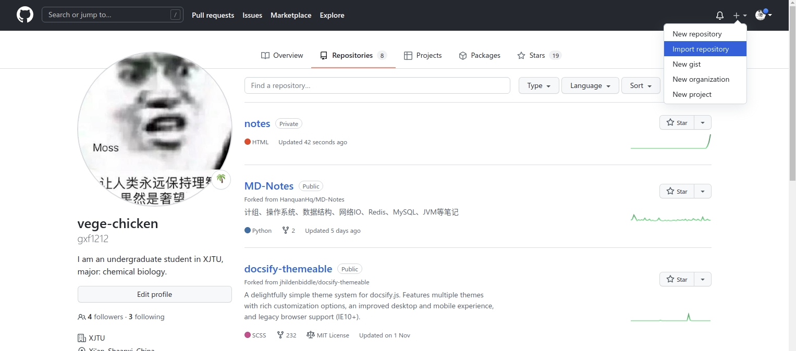

# Linux study

This is a record of my operations during 折腾ing the system, in order not to forget.

## basics

1. kde and gnome are two types of desktop interface. KDE looks like Windows desktop and gnome is the classic Linux desktop interface.

2. Linux是把要安装的软件分布在整个系统的各个文件夹里面， 比如所有软件的配置文件都安装在`/etc`下面， 软件需要的库文件都安装在`/lib`下面，日志文件都在`/var/log`下面，`/bin`下是常用的程序，等等。 比较复杂 哈哈。

3. rpm包主要应用在RedHat系列包括 Fedora等发行版的Linux系统上，deb包主要应用于Debian系列包括现在比较流行的Ubuntu等发行版上。
   
   transform .rpm to .deb: `sudo alien \*.rpm`
   
4. It's hard to change default install directory. And I have to make a boot CD (U disk) to change the storage distribution (like when I'm installing Ubuntu, how much for root, home, swap...).

5. 下面是一些典型的段错误的原因: 由内存管理硬件试图访问一个不存在的内存地址

6. 环境变量

   root和user的.bashrc是不一样的！

   export的含义 https://askubuntu.com/questions/720678/what-does-export-path-somethingpath-mean

7. 


## Operations

1. the .sh files on the desktop needs "bash"

### Fundamental settings and softwares

1. check the system

   ```shell
   uname -a # check system version
   cat /proc/version # check Linux, OS, gcc version
   ```

2. path:

   ```shell
   sudo gedit ~/.bashrc
   source ~/.bashrc
   ```
   
3. inspect cpu information

   https://lijian.ac.cn/posts/2018/09/linux-information/

   https://blog.51cto.com/feihan21/1174677

   ```shell
   cat /proc/cpuinfo
   ```

   mine: i7 9700k, 8 cores

4. my base board

   https://www.asus.com/hk/Motherboards-Components/Motherboards/PRIME/PRIME-Z390-P/ 华硕PRIME Z390-P

5. input method

   - fcitx

     - use software market or commmand line:

     	```shell
     	sudo apt install fcitx
     	sudo apt install fcitx-config-gtk # configure GUI
     	```

     - also set fcitx in "language support". reboot 
     - uninstall: https://jingyan.baidu.com/article/d5c4b52b95eb52da570dc511.html

   - 迅飞输入法

     - install https://www.yoki.moe/Intstu/24.html and https://www.52pojie.cn/thread-1243805-1-1.html
     - 先到官网下几个lib然后update就把依赖装好了
     
   - Ctrl+space 激活/反激活输入法

6. sun remote control

   auto-boot: https://www.cnblogs.com/citrus/p/13879021.html

   use realvnc

7. upgrade from 18.04 to 20.04. upgraded cuda and graphics driver at the same time!

8. google download?

   为什么用 Chrome 下载东西速度非常慢？ - 老郭的回答 - 知乎 https://www.zhihu.com/question/20082667/answer/1177212992

   may use firefox...but now I abandoned firefox

9. 删除分区用gparted

   也许 https://blog.csdn.net/xiexievv/article/details/50525783

   https://blog.csdn.net/renfeigui0/article/details/100765958 格式化

10. Linux中/var空间不足的解决办法 https://blog.csdn.net/hqzhon/article/details/49027351

11. no sound?

    ```shell
    sudo gedit /etc/default/grub
    # GRUB_CMDLINE_LINUX_DEFAULT="quiet splash snd_hda_intel.dmic_detect=0"
    sudo grub-mkconfig -o /boot/grub/grub.cfg
    sudo update-grub
    reboot
    ```

    https://blog.csdn.net/swordsm/article/details/108417931

    but, only when the headphone is charged can we play music........

    other:

    ```shell
    sudo apt install pavucontrol
    pavucontrol
    ```

12. 有道dictionary 

    > wrong: http://cidian.youdao.com/index-linux.html. 
    >
    > dependences: https://my.oschina.net/u/4400327/blog/3544515 
    >
    > https://www.ubuntuupdates.org/package/core/trusty/universe/updates/gstreamer0.10-plugins-ugly
    >
    > finally, for the xxx-plugin-ugly: https://my.oschina.net/u/3384982/blog/867063

    see https://blog.csdn.net/weixin_42912072/article/details/108572983, should be the newest version https://cidian.youdao.com/multi.html#linuxAll! just download all the dependencies, no need to fix xxx-plugin-ugly!

13. cannot play video?

    https://blog.csdn.net/weixin_45361800/article/details/116844378  solved!

    ```shell
    sudo apt install ffmpeg
    ```

    no longer support Adobe flash player

    > 可能导致有命令`flash-player-properties`的:https://jingyan.baidu.com/article/3c48dd34a2952ee10be35820.html
    >
    > install flash player for firefox (not successful，没删)
    >
    > download https://www.flash.cn/download  
    >
    > install https://blog.csdn.net/weixin_33759269/article/details/92001224 or https://www.jb51.net/article/193782.htm
    >
    > ```shell
    > sudo cp libflashplayer.so /home/gxf/.mozilla/firefox/
    > sudo cp -r usr/* /usr
    > ```
    >
    > 如何显示Firefox插件(Plugins)的完整路径 https://blog.csdn.net/xuewuzhijin2012/article/details/53140899

14. “软件”里有typora

    https://typora.io/windows/dev_release.html dev版本不要钱的

    主题路径：`/home/gxf/.config/Typora/themes`

15. install lightdm: https://blog.csdn.net/hgtjcxy/article/details/90645838

    display managers: https://ubuntuqa.com/article/6577.html

16. 字体缺失（WPS等）

    add into system font directory https://zhuanlan.zhihu.com/p/31848590

    ```
    sudo cp * /usr/share/fonts/wps-office
    ```

    Windows：`C:\Windows\fonts`

    查看当前支持的字体

    ```shell
    fc-list
    ```

    in `/usr/share/fonts/`. copy your font into and 

    ```shell
    sudo cp *.otf /usr/share/fonts/opentype
    sudo cp *.ttf /usr/share/fonts/truetype
    sudo apt install xfonts-utils
    mkfontscale
    mkfontdir
    sudo fc-cache -fv
    ```

17. Linux更改桌面（等）路径

    ```
    sudo gedit ~/.config/user-dirs.dirs
    ```

    改完重启即可

18. wall paper壁纸

    搜索：电脑桌面壁纸 化学; microscopy photos

    some good websites

    - https://wall.alphacoders.com/
    - https://wallpapercave.com/
    - https://www.wallpaperflare.com/search?wallpaper=chemistry
    - https://www.flickr.com/photos/zeissmicro/

    > https://cdn.shopify.com/s/files/1/1064/0118/files/periodic-table-of-tech-standalone_alt.png?v=1579813258

    Lively WallpaperLively *Wallpaper* for Windows

19. process figure

    如果只需要单纯的裁剪功能, 推荐gThumb工具, 界面美观好用, 媲美某Q的聊天截图crtl+A
    打开命令行,输入

    ```shell
    sudo apt install gthumb
    ```

    下载安装完, 就能用啦, 输入

    ```shell
    gthumb
    ```

    为了以后使用方便, 可以右键屏幕左侧状态栏的gthumb图标,选择”锁定到启动器”. 以后就不用打开命令行了, 直接点状态栏的gthumb图标就行了. gthumb的具体用法不用说, 软件就那几个键, 而且都是图标, 看看就明白了.

    裁剪、调整大小、调整色彩等

    - As for add border, use `cv2.copyMakeBorder()`

    https://blog.csdn.net/qq_36560894/article/details/105416273 

    https://www.geeksforgeeks.org/python-opencv-cv2-copymakeborder-method/

17. 


> ### package name
>
> yes we should remember some; and can check with `dpkg --info`
>
> google-chrome-stable


### Operation on files and directory

#### create and delete

1. create directory: 

   ```shell
   mkdir your-directory
   ```

2. rm命令
   ```shell
   rm -d 目录名              #删除一个空目录
   rm --dir目录名              #删除一个空目录
   rm -r 目录名              #删除一个非空目录
   rm 文件名                  #删除文件
   ```

   - -f：在删除过程中不给任何指示，直接删除。
   - -r：将参数中列出的全部目录和子目录都递归地删除。若删除目录则必须配合选项"-r"
   - -i：与-f选项相反，交互式删除，在删除每个文件时都给出提示。
   
3. delete all files under a directory: 

   ```shell
   rm ./*
   ```

4. check the size of a folder: https://zhidao.baidu.com/question/1178566665695139419.html

   ```shell
   du -sh /directory
   ```

5. 

#### other

1. move file in terminal: https://blog.csdn.net/qq_38451119/article/details/81121906

   ```shell
   sudo mv filename target-dir
   ```

2. create a soft link (short cut). Files stored in `gxf1` are actually occupying space in `gxf`. 

   ```shell
   sudo ln -s /gxf/ ./gxf1
   ```

   (However, I still have to specify the install directory.)

3. create a hard link:

   ```shell
   sudo ln ./source ./target
   ```

   my comprehension: 硬链接就是一个指针，软链接就是告诉你某处有个文件（指针）。区别就是删了源文件，硬链接还能访问，软的就不行。但是两种链接都可以改名字？

3. `su root`: enter root. pw: a

5. find:

   ```shell
   sudo find / -name "*your-query*" # all that contains your query
   ```

5. create file
   ```shell
   touch .xxx # create
   ls -a # check
   ```
   
6. change file name

   ```shell
   sudo mv test.txt new.txt
   sudo mv ./fca58054-9480-4790-a8ab-bc37f33823a4/ ./mechanical
   ```
   
7. 

   

#### disk

1. smart: https://www.cnblogs.com/xqzt/p/5512075.html


#### debian series features

1. 解决依赖问题：it seems after failing to install a .deb package (due to dependent packages), the dpkg always remember this error, and even automatically install the dependent packages if you open **software updater**. or

   ```shell
   sudo apt-get -f install
   ```

   如果让我删，就手动`apt-get install`几个再用软件更新器

2. 


### K desktop specific settings (not using)

1. fonts
2. settings manager 
   - lightdm desktop manager
     - taskbar fonts
   - appearance
     - desktop icon and font
3. add "show desktop": http://www.linuxdiyf.com/view_134588.html
4. sf

### GNOME

1. 在Ubuntu的系统中如何将应用程序添加到开始菜单中 https://blog.csdn.net/qk1992919/article/details/51034361/ https://ubuntuqa.com/article/1235.html

   ```
   Name=Pymol   #此软件在菜单中当语言为英语的时候的显示名称      
   Name[zh_CN]=Pymol  #此软件在菜单中当语言为中文的时候的显示名称
   Comment=pymol   #此软件在菜单中当语言为英语的时候的说明       
   Comment[zh_CN]=pymol   #此软件在菜单中当语言为中文的时候的说明
   Exec=/home/gxf/pymol/pymol     #要执行的程序的名称
   Terminal=false        #执行时是否启动终端
   X-MultipleArgs=false   #是否有多个参数
   Type=Application      #程序的类型
   Icon=/home/gxf/pymol/share/pymol/data/pymol/icons/icon2_128x128.png   #在开始菜>单中的显示图标
   ```

   还是用alacarte

2. 软件中心点开没反应？ 

   ```shell
   sudo apt-get update  
   sudo apt-get dist-upgrade
   sudo apt-get install --reinstall ubuntu-software
   ```

   也没用

3. 设置→隐私→**屏幕**锁定→设置时间

4. https://gitee.com/wszqkzqk/deepin-wine-for-ubuntu windows环境，装qq微信等

5. 分屏 https://blog.csdn.net/SiriusExplorer/article/details/103016747

### connection, vpn, remote control

1. get ip address

   ```shell
   ip addr show
   ```

2. VPN for Linux: https://github.com/hannuo/ssr-linux-client-electron

   configuration: https://github.com/qingshuisiyuan/electron-ssr-backup/blob/master/Ubuntu.md

3. 向日葵连接后即断开解决办法 https://blog.csdn.net/u012254599/article/details/107807751

   ```shell
   sudo dpkg-reconfigure lightdm # 切换lightdm图形页面
   ```

   切换完成后重启电脑，就可以使用向日葵远程了…
   
   which leads that the login displays in a strange de-centered looking...
   
4. Use “Wake on LAN” to boot remotely

   - https://necromuralist.github.io/posts/enabling-wake-on-lan/

   - https://service.oray.com/question/1331.html 判断主机是否支持远程开机？

     华硕主板要：高级 > 高级电源管理（APM）> 开启 **Resume By PCI or PCI-E Ddevice**（由pci/pcie设备唤醒）选项

   ```shell
   sudo apt-get install ethtool
   ifconfig -a # find your interfaces, as well as the MAC address!
   # ether xx:xx:....
   sudo ethtool enp4s0 # must add sudo! or error
   # should see:
   # Supports Wake-on: pumbg
   # Wake-on: g # if is d, just do 
   # sudo ethtool -s enp4s0 wol g
   
   
   ```

   

5. to enable the wol function, should all the Linux subsystem on Windows

   [install wsl](https://docs.microsoft.com/en-us/windows/wsl/install-manual#downloading-distributions)                          https://blog.csdn.net/daxues_/article/details/119639093
   
   change the .appx file into .zip file, unzip it in the desired directory
   
5. 


### customs

1. to denote path, separate the sentence by / like:

   "/path/to/libfftw3f"

2. 

> #### other
>
> Ubuntu20.04软件源更换 - 舟公的文章 - 知乎 https://zhuanlan.zhihu.com/p/142014944
>
> change software source
>
> ```
> sudo cp /etc/apt/sources.list /etc/apt/sources.list.bak # backup
> sudo vim /etc/apt/sources.list
> #添加阿里源
> deb http://mirrors.aliyun.com/ubuntu/ focal main restricted universe multiverse
> deb-src http://mirrors.aliyun.com/ubuntu/ focal main restricted universe multiverse
> deb http://mirrors.aliyun.com/ubuntu/ focal-security main restricted universe multiverse
> deb-src http://mirrors.aliyun.com/ubuntu/ focal-security main restricted universe multiverse
> deb http://mirrors.aliyun.com/ubuntu/ focal-updates main restricted universe multiverse
> deb-src http://mirrors.aliyun.com/ubuntu/ focal-updates main restricted universe multiverse
> deb http://mirrors.aliyun.com/ubuntu/ focal-proposed main restricted universe multiverse
> deb-src http://mirrors.aliyun.com/ubuntu/ focal-proposed main restricted universe multiverse
> deb http://mirrors.aliyun.com/ubuntu/ focal-backports main restricted universe multiverse
> deb-src http://mirrors.aliyun.com/ubuntu/ focal-backports main restricted universe multiverse
> #添加清华源
> deb https://mirrors.tuna.tsinghua.edu.cn/ubuntu/ focal main restricted universe multiverse
> # deb-src https://mirrors.tuna.tsinghua.edu.cn/ubuntu/ focal main restricted universe multiverse
> deb https://mirrors.tuna.tsinghua.edu.cn/ubuntu/ focal-updates main restricted universe multiverse
> # deb-src https://mirrors.tuna.tsinghua.edu.cn/ubuntu/ focal-updates main restricted universe multiverse
> deb https://mirrors.tuna.tsinghua.edu.cn/ubuntu/ focal-backports main restricted universe multiverse
> # deb-src https://mirrors.tuna.tsinghua.edu.cn/ubuntu/ focal-backports main restricted universe multiverse
> deb https://mirrors.tuna.tsinghua.edu.cn/ubuntu/ focal-security main restricted universe multiverse
> # deb-src https://mirrors.tuna.tsinghua.edu.cn/ubuntu/ focal-security main restricted universe multiverse multiverse
> ```
>
> ```shell
> # deepin
> deb http://mirrors.aliyun.com/deepin/ bionic main restricted universe multiverse
> deb-src http://mirrors.aliyun.com/deepin/ bionic main restricted universe multiverse
> 
> deb http://mirrors.aliyun.com/deepin/ bionic-security main restricted universe multiverse
> deb-src http://mirrors.aliyun.com/deepin/ bionic-security main restricted universe multiverse
> 
> deb http://mirrors.aliyun.com/deepin/ bionic-updates main restricted universe multiverse
> deb-src http://mirrors.aliyun.com/deepin/ bionic-updates main restricted universe multiverse
> 
> deb http://mirrors.aliyun.com/deepin/ bionic-proposed main restricted universe multiverse
> deb-src http://mirrors.aliyun.com/deepin/ bionic-proposed main restricted universe multiverse
> 
> deb http://mirrors.aliyun.com/deepin/ bionic-backports main restricted universe multiverse
> deb-src http://mirrors.aliyun.com/deepin/ bionic-backports main restricted universe multiverse
> ```
>
> E: 仓库 “http://mirrors.aliyun.com/deepin bionic Release” 没有 Release 文件。
> 
> N: 无法安全地用该源进行更新，所以默认禁用该源。
> 
> N: 参见 apt-secure(8) 手册以了解仓库创建和用户配置方面的细节。
>
> https://packages.ubuntu.com
> https://packages.debian.org


## Specific commands

### vim

- `:w` 保存但不退出

- `:wq` 保存并退出
  - `:q` 退出
- `:q!` 强制退出，不保存
  - `:e!` 放弃所有修改，从上次保存文件开始再编辑命令历史                                                                                                                 

- `:e!` 放弃所有修改，从上次保存文件开始再编辑命令历史                                                                                                                 
- :q<Enter>               退出                                    
   - :help<Enter>  或  <F1>  查看在线帮助                            
- :help version8<Enter>   查看版本信息
   - esc: stop editing
- insert: edit
### conda & python cmd

https://blog.csdn.net/zhayushui/article/details/80433768

- on environments

  - see

    ```shell
    conda env list
    ```

    or `conda info`: information

    - -e: environments

  - create 

    - normal

      ```shell
      conda create -n env_name
      ```

    - from yaml

      ```shell
      conda env create -f study.yaml
      ```

    - export

      ```
      conda activate your_env
      conda env export > environment.yaml # in your current directory
      ```

      注：.yaml文件移植过来的环境只是安装了你原来环境里用conda install等命令直接安装的包，你用pip之类装的东西没有移植过来，需要你重新安装。

    - remove

      ```shell
      conda env remove xxx --all # or rm the file manually
      ```

- on packages of an environment

  ```shell
conda list # list envs
  conda list -n env # list packages
python -V
  ```

- win32 or win_amd64 means version of python

  in win, run python in cmd to know version.

  my win: 3.7, 32bit 

  station: 3.8, 64bit

  https://blog.csdn.net/taquguodedifang/article/details/78039181 in linux
  
- some packages

  ```shell
  conda install -c anaconda scikit-learn -y
  conda install -c conda-forge opencv -y
  ```
  
- path to anaconda icon  [link](https://dannyda.com/2020/03/21/how-to-create-shortcut-icon-for-anaconda-anaconda3-navigator-launch-anaconda-navigator-in-linux-debian-ubuntu-kali-linux/?__cf_chl_managed_tk__=8b0602f628e3697df877a10ef8acbd1aaed57efe-1624180568-0-AQN5TbG3O_yGaDEn0fVCjKdPwJeitKXjQ5dGrRfek69NylD0fJ5-atmRV2JoCodX4-mn_CX-vH8Ay_KzM9Ew77recYhgLQF_b3AqC85p9Pt8IVjBso98tTdFN9TknxGj5tTJFM_8KyF_S4qbMmoTpsiUnMKl2kc3rlzmRlQZvO0AJaILgZakK-WjM6xFauMno73HWqkCE4IaHB35y0M0C0dnw8t2b5qReINgAcLiCZuHX897fWj-OLS6yNbAVjmkgOPbkazSG3X8a-o_AgziC8zfKXi584jpGmet4WwRwFnSaWJvOAp7BA7vSIkcSJ7UAOFWzpvkDilEtFoa-XMd6jpZQgKbtBVQn4vLT5LUl1_XLFU3M7B9G_vN7vcyUcFjLV2gl6xdDcx9WA-JypLtICF3nbFVjS3gvK_WCEqs30dnW38X3Ceuk9Bhq7FFyegkaQmnFy5a4V5KeJob3h_gXQRaWwaeAFAHoeuYY0RXfAtfD82sJgJP0UOOYC8IBBV43rGAmhSOsLhiC2u3hk2hwLIEy7mG10sSUlGq_3I_dPjha1qlIAP0APiBXaWOOdujGD2gFeot6PQGwrg71cglm4rQc1Zei_kF8QfHdYerOFjLLtbfWC0HTeoFZ_L7Qu9R9c8npxn9Z5Np2O_IqqsKo3yaDAxR_aV8JVS3rS-a4mxAunZXcWj734HTBAJaTTSdepNfW2PdqnUEbsnD5bAyjeDPVQQupDNG_1qz8fsEzThDBSPP04GMtGJGqpEBawQvu2Nk857rXxA-_V2AwE9s7Og)

- An unexpected error has occurred. Conda has prepared the above report.

  https://blog.csdn.net/Felaim/article/details/108368598

  ```shell
  conda clean -i
  ```

- Please update conda by running

  ```shell
  conda update -n base conda
  ```


### svn

get part of the files in one GitHub repository

- `svn checkout url`, trunk

  Then the files are downloaded to the current directory of terminal.

  https://blog.csdn.net/ai_faker/article/details/107823359?utm_medium=distribute.pc_relevant.none-task-blog-title-2&spm=1001.2101.3001.4242

- https://blog.csdn.net/q279838089/article/details/44751039

### npm

install nodejs first.

change source: https://www.cnblogs.com/feng-hao/p/11774543.html

### make

`make`命令是运行的所在目录下的`Makefile`文件, 如果*Make*file 里有*check*的话, 会执行测试,也就是检查下编译出来的东西能不能用


## Debugging experiences

### 21.2.17

what if you

```shell
rm -rf /*
```

? a disaster, right? see what I did then: https://blog.csdn.net/gxf1212/article/details/113827850

### 21.11.24 you are in emergency mode....

https://www.jianshu.com/p/9c9ad9a97452 vim

https://www.runoob.com/linux/linux-comm-mount.html mount

https://stackoverflow.com/questions/13361729/found-a-swap-file-by-the-name/51326724 vim的冲突，显示的信息

[命令行更改系统语言](https://blog.csdn.net/MaryChow/article/details/68494243?spm=1001.2101.3001.6650.1&utm_medium=distribute.pc_relevant.none-task-blog-2%7Edefault%7ECTRLIST%7Edefault-1.no_search_link&depth_1-utm_source=distribute.pc_relevant.none-task-blog-2%7Edefault%7ECTRLIST%7Edefault-1.no_search_link) now LANG and LANGUAGE is English

```shell
sudo vim /etc/default/locale
```

https://www.cnblogs.com/machangwei-8/p/10353614.html fsck命令

> - `errors=remount-ro`
>
> https://blog.51cto.com/u_11886307/2369145 修改fstab？
>
> ```shell
> mount -o remount,rw /dev/nvme0n1p4 /
> mount -o remount,rw / # or this is right?
> 
> umount /dev/nvme0n1p4
> fsck -y /dev/nvme0n1p4 # is clean
> ```
>
> https://support.huaweicloud.com/trouble-ecs/ecs_trouble_0310.html 进入紧急模式的solution steps

其实上面哪些没啥。根目录变成readonly只是为了保护，倒不用修复。GPU那个i2c的驱动问题也不用管。

mount为rw只是为了能编辑fstab。不要乱注释掉device（如/dev/sda），注释掉根目录更难启动。。

学会vim的recovery，学会fsck的修复

其实问题是


```shell
journalctl -xb | grep error 
# found that /dev/sda contains a file system with errors, check forced
umount /dev/sda
fsck -y /dev/sda
# and it's done
```

> other commands
>
> ```shell
> mount -a # mount all devices listed in fstab
> shutdown # poweroff, halt
> ```

# Applications for fun

## git in cmd

1. basic

   ```shell
   # in your repository path
   # usual usage
   git add ./ # add all changes
   git commit -m "update message"
   git push -u origin master
   git pull
   ```

   ```shell
   # other
   git config --global user.name gxf1212 # user.email xxx
   git clone url.git # clone a repo
   ```

2. in Gitee, we should manually update Pages?

   https://www.cnblogs.com/zlting/p/9620259.html

   ```shell
   git remote set-url origin https://gitee.com/gxf1212/notes.git # 设置远程仓库地址
   git remote -v
   ```

3. no more username+pwd

   https://blog.csdn.net/LosingCarryJie/article/details/73801554
   
   ```shell
   git config --global credential.helper store
   ```

4. git status

   ```shell
   git status
   ```

   > 位于分支 master
   > 您的分支和 'origin/master' 出现了偏离，
   > 并且分别有 1 和 1 处不同的提交。
   > （使用 "git pull" 来合并远程分支）
   >
   > 所有冲突已解决但您仍处于合并中。
   > （使用 "git commit" 结束合并）
   >
   > 要提交的变更：
   > 	新文件：   .gitignore
   > 	修改：     Linux/Prepare-for-the-computer.md
   
5. 对于本地的项目中修改不做保存操作（或代码改崩），可以用到Git pull的强制覆盖

   ```
   git reset --hard origin/master
   ```

5. GitHub克隆Gitee的仓库

   
   
7. Github 上怎么删除一个文件的版本控制信息，只保留最新文件？

   项目本身并不大，主要是由于有些大图片多次修改，所以GIT保留的这些图片的历史记录文件非常大，但是我这些图片又不需要历史记录信息，怎么删除？

   干脆利落...

   ```shell
   rm -rf .git
   git init
   git add -A
   git commit
   git push -f
   ```

8. 

## Build a note site with docsify

### References

read through official! https://docsify.js.org/#/quickstart  生成那种模块API的，或者学习笔记的一个框架

also learn settings and styles from https://github.com/jhildenbiddle/docsify-themeable/tree/master/docs

some translated doc

- https://www.cxyzjd.com/article/jackson0714/105331564
- https://segmentfault.com/a/1190000017576714  

a lot of fancy features: https://zxiaosi.cn/archives/cd1d42d1.html

### Basic usage

1. serve locally
   ```shell
   docsify serve ./ # http://localhost:3000
   ```
2. the first subtitle is not included into the sidebar


#### something html

```html
<p>text</p>
<strong>bold text</strong>
<u>underlined text</u>
<li>list item</li>
<!-- comment here -->
```


### What can docsify do

- visualize .md as html
- customize sidebar, navbar, cover page
  - write links by yourself
  - can show any .md as TOC
- plug-in, 留言、访问计数 etc 

easier than hexo, ...

#### Elements

##### Pages

```html
window.$docsify = {
	homepage: true, // default name: README.md
	coverpage: true, //default: _coverpage.md
	homepage: 'README.md', // specify file name
	coverpage: '/_coverpage.md',
	// sidebar, navbar are similar
}
```

https://docsify.js.org/#/cover  cover page customize, multiple cover

Actually we can assign a cover or home page for every subdirectory using the default file name (README, _coverpage). But it seems that it’s only necessary for **course notes**.

##### Sidebar

https://docsify.js.org/#/more-pages?id=nested-sidebars

- `_sidebar.md`的加载逻辑是从每层目录下获取文件，如果当前目录不存在该文件则回退到上一级目录。
- 配置`alias`字段后，所有页面都会显示项目根目录`_sidebar.md`文件的配置作为侧边栏，子目录的`_sidebar.md`文件会失效。

it seems that bars and cover must be put in root because the subdirectories have their own...

but after introducing the “sidebar collapse”, I don’t think the sidebar is messy any more. you can come back to other notes through it easily. The navbar is not used. 

Also, the sidebar should be further beautified (**colored**) to clarify the file structure. And the text size?


#### Beautify

##### Cover

```html
// multiple covers and custom file name
coverpage: {
    '/': 'cover.md',
    '/zh-cn/': 'cover.md',
  },

// logo
window.$docsify = {
  logo: '/_media/icon.svg',
};
```

background not solved

```markdown
in coverpage.md


```


##### Theme

4 official themes: https://docsify.js.org/#/themes?id=themes and dolphin

```html
<link rel="stylesheet" href="//cdn.jsdelivr.net/npm/docsify@4/lib/themes/vue.css">
<!-- should not miss // and @4! -->
```

some others https://docsify.js.org/#/awesome?id=themes

If you want to modify a theme, download from cdn website rather than GitHub!

> notes
>
> docsify-themeable is less compatible with 推免服务系统.html
>
> vue’ s sidebar needs improving

#### Show figures

- common md syntax is ok, Windows backslash and Linux slash are all ok. and zooming:

  ```html
  <!-- 指定像素值 -->
  
  
  <!-- 支持按百分比缩放 -->
  
  ```

  > Typora zooming script is not supported in docsify (but is ok in a normal html, but can center)
  >
  > already asked in CSDN. https://github.com/HanquanHq/MD-Notes

- no, it supports. But the root directory is not the current directory but the repository’s.....

  - in normal md grammar, relative path is ok

  - in html, zooming without relative path is ok

  - the problem is, in html, <u>it cannot recognize relative path as markdown does (no matter whether zooming)</u>. But it works if you use path relative to the root of repository...which makes figures invisible in local Typora

  - 本来还猜测只是重新定义了根目录的原因，加个../就认为是相对路径了。事实上是，不管加不加这些东西，都是从the root of repository开始算的。。所以你以为加了../就是父目录了，其实还是root

    but still no luck

  - 解决图片问题的思路：

    - 上传的时候render为正确的格式
    - 把图上传到另一个地方，链接一个网址（缩放？

     hexo就是可以渲染出图片，他docsify就是不行

    引用网址图片也不行

    **解决之道**：要用这个打头（算是git的api？）

    https://gitee.com/gxf1212/notes/raw/master/

    其实git他俩用来做图床就是如此

  - future tasks:

    - centralize figures
    - adjust size, so different from those in Typora!


  > relative path
  >
  > https://angry-swanson-b4e47b.netlify.app/zh-cn/configuration?id=relativepath no use
  >
  > <font color=red>世界上怎么会有这么傻逼的设计？！！专门跟Typora过不去吗？？不得不改变创作方式！</font>那这话也不合适
  >
  > **Test figure usage**
  >
  > use the website, a centered figure should look like this:
  >
  > <center></center>
  >
  > `align="center" ` does not work.....`<center></center>` or `<p style="text-align:center;"><p/>` works. 
  >
  > I'm not particular about centering. The site looks all right though.
  >
  > 根目录probably not work
  >
  > 
  >
  > 正常本地目录probably not work
  >
  > 
  >
  > this should ok, but `':size=50%'` does not work locally using provided syntax
  >
  > 
  >
  > 
  >
  > To use the website, should not contain a single backslash in Typora...
  >
  > 
  >
  > ```
  > https://gitee.com/gxf1212/notes/raw/master/
  > ```
  >
  > 没想到个别的（本地都）显示不了，即使那个图片确实存在

#### Customize functions

TODO list:

- [ ] figure centralize

- [ ] gitee automatically deploy?

- [ ] 打赏

- [ ] 访问量统计：busuanzi

- [ ] \ce的重新render

- [ ] 图片的重新render

  > https://docsify.js.org/#/zh-cn/markdown?id=markdown-%e9%85%8d%e7%bd%ae
  >
  > https://github.com/docsifyjs/docsify/issues/850

> if a there’s a new version of a plug-in, how to update?  @latest

1. add things after:

   ```html
   <!-- Docsify v4 -->
   ```

   like

   ```html
   <script src="//unpkg.com/docsify-copy-code"></script> <!-- copy to clipboard -->
   <script src="//unpkg.com/prismjs/components/prism-bash.js"></script> <!-- code highlight -->
   <script src="//unpkg.com/docsify/lib/plugins/search.js"></script> <!--  search engine -->
   <script src="//cdn.jsdelivr.net/npm/docsify/lib/plugins/emoji.min.js"></script> <!--  emoji -->
   <script src="//cdn.jsdelivr.net/npm/docsify-katex@latest/dist/docsify-katex.js"></script> <!--  equations -->
   ```

   to add plug-in

   > https://github.com/upupming/docsify-katex LaTeX equation support
   >
   > - [**supported functions**!](https://upupming.site/docsify-katex/docs/#/supported)
   > - https://github.com/upupming/docsify-katex/issues/11 italic fon
   >
   > https://github.com/iPeng6/docsify-sidebar-collapse sidebar collapse

2. blacklist:

   ```html
   <script src="//cdn.jsdelivr.net/npm/docsify@latest/lib/docsify.min.js"></script>
   ```

   navbar vanishes!..mouse can't scroll. code highlight is gone.

2. customize title with quoted text

   ```markdown
   [NAMD/VMD和FEP计算基本操作](/MD/FYP-notes.md "2333")
   ```

4. Gittalk

   https://segmentfault.com/a/1190000018072952

   https://www.cnblogs.com/fozero/p/10256858.html 

5. Fontawesome 

   https://www.npmjs.com/package/docsify-fontawesome

   > not solved! refer to https://jhildenbiddle.github.io/docsify-themeable/#/?

6. scroll to the top

   https://github.com/zhengxiangqi/docsify-scroll-to-top

7. syntax supporting problems like:

   - [x] support of textsubscript: must use `<sub></sub>` tag; 

     must add \ to \~ if there are more than two \~. same for ^

   - [x] support of \ce{NaCl}: may use $\text{Al(OH)}_3$...

   - [x] support of `\begin{align*}` ?? as well as gather, equation ...

8. https://coroo.github.io/docsify-share/#/?id=getting-started

   插件，share自己的社交媒体

9. 如何搞背景？

   https://segmentfault.com/a/1190000017576714  失败了

   为啥呢？原来用vue主题就可以了。theme-simple不支持。。。。

   侧边栏还可以搞个图片

10. https://zxiaosi.cn/archives/cd1d42d1.html

    美化。

    - 点击效果，桃心（我想知道其他选择，如富强民主文明和谐

11. https://github.com/827652549/docsify-count

    插件，文字统计

    阅读进度条[docsify-progress ](https://github.com/HerbertHe/docsify-progress) 这个插件与字数插件不兼容

12. https://blog.csdn.net/weixin_44897405/article/details/103214635

    这个东西叫做：live2d看板娘。https://github.com/stevenjoezhang/live2d-widget

    https://gitcode.net/mirrors/stevenjoezhang/live2d-widget/-/tree/master  GitHub镜像。

    - 人物有哪些选择？参考7. 提供的

      ```
      jsonPath: "https://unpkg.com/live2d-widget-model-shizuku@latest/assets/shizuku.model.json",
      ```

      代码两处都要改

      > https://github.com/evrstr/live2d-widget-models 给的似乎没用？
      >
      > http://blog.itchenliang.club/posts/22350780-f32d-11ea-bb4a-d3e1cbe3d592/#%E5%AE%89%E8%A3%85%E6%8F%92%E4%BB%B6 hexo的，方案一
      >
      > https://summerscar.me/live2dDemo/ 调试模型、参数的效果，好慢

    - 版本一：官网的js

      - L2Dwidget.init 设置大小、调位置咋样都没用。。要clone下来自己改
      - 看板娘L2Dwidget盯着鼠标移动（好像已经有了

    - L2Dwidget.min.js

      - 就可以设置大小、位置
      - 但不能说话。。也不能盯着鼠标，甚至还有点模糊

13. https://www.codenong.com/cs107071378/          https://notebook.js.org/#/

    - 显示pdf？

    - Docsify-alerts https://www.npmjs.com/package/docsify-plugin-flexible-alerts

      ```
      > [!NOTE]
      > 
      > [!TIP]
      > 
      > [!WARNING]
      > 
      > [!ATTENTION]
      > 
      ```

      可自定义

    - 看板娘

14. badge。 是用什么东西生成的吗。。

    
     

15. 

#### Important notes on publishing

- gitee pages 自动部署

  https://gitee.com/yanglbme/gitee-pages-action

  不想在GitHub上弄一个同样的仓库。。先不弄了

  https://bibichuan.gitee.io/posts/5cbf8e2a.html

- 部署到 gitee pages 的静态页面更新后部分样式未刷新问题
  原因是在重新提交文件并执行更新 gitee pages 操作后，协商缓存ETag和Last-Modified虽然会改变，但是强缓存Cache-Control仍然存在，且优先级更高，导致内容未发生改变。
  解决方案： ctrl+F5 强制刷新
  原文链接：https://blog.csdn.net/PorkCanteen/article/details/122068290

- 百度提供了一个提交链接的入口，地址如下：

  > https://ziyuan.baidu.com/linksubmit/url

  填写码云 Pages 的链接：https://itwanger.gitee.io/，并「提交」，见下图：

  这样做的好处是，网站可以主动向百度搜索推送数据，缩短爬虫发现网站链接的时间。当然了，百度收录需要一段时间

- 

#### other features, examples and Gitee

1. https://wiki.xhhdd.cc/#/

   她的站可学习一下。如warning框、等待信息，没找到源码。翻页见下

   Typecho是一个基于PHP的开源博客程序。

2. https://github.com/lufei/notes

   他的配置也是值得参考的。美化上，向他学习一波。

   - 比如vue如何换背景色
   - 如何插入文艺词句（但说实话没太多机会看到了）

- It is ridiculous that if I include a YouTube or Bilibili link in .md, I cannot deploy...No, solved

- markdown based wiki system http://dynalon.github.io/mdwiki/#!index.md

- 几（十）款制作帮助文档的工具汇总 https://blog.mimvp.com/article/38752.html

- sfd

  ```html
  // 分页导航插件
  pagination: {
  	previousText: '上一卷',
  	nextText: '下一卷',
  	crossChapter: true,
  	crossChapterText: true
  },
  <!-- 分页导航 -->
  <script src="//unpkg.com/docsify-pagination/dist/docsify-pagination.min.js"></script>
  ```

  其他：https://mubu.com/home 做大纲、思维导图的，挺漂亮

- SEO：search engine optimization

  hexo+github pages个人博客做百度、谷歌、bing等搜索引擎收录

  https://reiner.host/posts/2262a2b8.html

  hexo生成sitemap？

  https://cloud.tencent.com/developer/article/1736970

  提交你的域名

  https://search.google.com/search-console/welcome

  > 请求编入索引：已将网址添加到优先抓取队列中。 多次提交同一网页并不能改变该网页的队列顺序或优先级

  https://ziyuan.baidu.com/site/index#/

  百度资源

  https://github.com/docsifyjs/docsify/issues/656

  有些代码是否可用？

  https://github.com/lufei/notes

  

  https://code.google.com/archive/p/sitemap-generators/wikis/SitemapGenerators.wiki

  Google提供的生成器

  生成工具很多，感觉docsify本身不适合。。还是参考已有的

  >https://neilpatel.com/blog/xml-sitemap/

  

  ##### 其他

  内容分发网络 (Content delivery network) 是指一种透过互联网互相连接的电脑网络系统，利用最靠近每位用户的服务器，更快、更可靠地将音乐、图片、视频、应用程序及其他文件发送给用户，来提供高性能、可扩展性及低成本的网络内容传递给用户。

  unpkg is **a free content delivery network (CDN)** that automatically distributes public packages published to npm. unpkg partners with cloudfare and heroku to make this automatic distributing possible

  

  不适用于xmind的思维导图展示，写代码修改？

  https://juejin.cn/post/7000874049333100551

  https://zhuanlan.zhihu.com/p/352795634

  

  mermaid语法

  特殊符号，要加引号才显示

  https://github.com/mermaid-js/mermaid/issues/213


### Build Hexo Pages

https://www.cnblogs.com/liuxianan/p/build-blog-website-by-hexo-github.html#%E4%BD%BF%E7%94%A8hexo%E5%86%99%E5%8D%9A%E5%AE%A2

Git 全局设置:

```bash
git config --global user.name "XJTUChemBioer"
git config --global user.email "741844489@qq.com"

git config --global user.name "高旭帆"
git config --global user.email "gxf1212@stu.xjtu.edu.cn"
```

generate key

```bash
ssh-keygen -t rsa -C "741844489@qq.com" 
ssh-keygen -t rsa -C "gxf1212@stu.xjtu.edu.cn"
cat /c/Users/Lenovo/.ssh/id_rsa.pub
```

[link](https://yushuaigee.gitee.io/2021/01/02/%E4%BB%8E%E9%9B%B6%E5%BC%80%E5%A7%8B%E5%85%8D%E8%B4%B9%E6%90%AD%E5%BB%BA%E8%87%AA%E5%B7%B1%E7%9A%84%E5%8D%9A%E5%AE%A2(%E4%B8%89)%E2%80%94%E2%80%94%E5%9F%BA%E4%BA%8E%20Gitee%20pages%20%E5%BB%BA%E7%AB%99/#%E4%B8%89%E3%80%81Gitee-Pages-%E5%8F%91%E5%B8%83)

test successful

```
ssh -T git@gitee.com
```

为了装Hexo，先装Git和Node.js（win上可运行npm）并Add to PATH

```
npm install -g hexo
hexo init xjtu-chembioer
cd xjtu-chembioer
npm install hexo-deployer-git --save
```

```
C:\Users\Lenovo\AppData\Roaming\npm
```

常用 [link](https://yushuaigee.gitee.io/2021/01/02/%E4%BB%8E%E9%9B%B6%E5%BC%80%E5%A7%8B%E5%85%8D%E8%B4%B9%E6%90%AD%E5%BB%BA%E8%87%AA%E5%B7%B1%E7%9A%84%E5%8D%9A%E5%AE%A2(%E4%B8%89)%E2%80%94%E2%80%94%E5%9F%BA%E4%BA%8E%20Gitee%20pages%20%E5%BB%BA%E7%AB%99/#3-%E6%B5%8B%E8%AF%95-Gitee-Pages-%E9%A1%B5%E9%9D%A2)

```bash
hexo new "postName" #新建文章
hexo new page "pageName" #新建页面
hexo generate #生成静态页面至public目录
hexo server #开启预览访问端口（默认端口4000，'ctrl + c'关闭server）
hexo deploy #部署到GitHub
hexo help  # 查看帮助
hexo version  #查看Hexo的版本

hexo n
hexo s  # Ctrl+C退出
hexo clean   # 清除缓存
# 更新、提交并部署：（不用在Gitee上手动。。）
hexo g
hexo d
```

更改deploy设置：https://www.jianshu.com/p/b748100ddef1

换主题：clone到文件夹，更改`_config.yml`

```bash
git clone https://github.com/shenliyang/hexo-theme-snippet/ themes/asnippet
git clone https://github.com/https://littleee.github.io/ themes/asnippet
```


```bash
# 在hexo根目录下
npm install --save hexo-pdf


```


https://lkevin98.gitee.io/blog/file/%E5%A6%82%E4%BD%95%E5%9C%A8hexo%E5%8D%9A%E5%AE%A2%E7%BD%91%E9%A1%B5%E4%B8%AD%E5%AE%9E%E7%8E%B0pdf%E5%9C%A8%E7%BA%BF%E9%A2%84%E8%A7%88.pdf


https://bibichuan.github.io/posts/5affe24.html


##### 感受

使用hexo等工具，在git上只提交下面的一个`.deploy_git`文件夹。。clone根本没用


# Installation and softwares

note: some used stupid old strange paths. replace with yours (eg: your `/home`)

## memo

> 安排存储分配。关键的软件尽量装到root
>
> - [x] 翻墙
> - [x] 向日葵，vnc viewer
> - [x] 显卡驱动
> - [x] python环境(pycharm, miniconda)
> - [x] 分子模拟环境（gmx,openbabel,pymol,gaussian,ambertools,acpype)
> - [ ] 其他分子模拟（maybe VMD,DSV）
> - [x] flash，浏览器
> - [x] 配套工具（百度网盘、阅读器、qq等）
> - [ ] 写作？（texlive,VScode,mendeley,GitHub Desktop)
> - [ ] 修理：software
> - [ ] 自定义桌面等，如天气
>
> 小问题
>
> - [x] 输入法点不开  界面（算了）
> - [ ] discovery studio
> - [x] 有道词典
> - [ ] 

## common flow

### dpkg

install with .deb

just **double click it** 不能指定目录

命令行法：直接解压到当前目录，然后配置环境变量，即可启动运行程序；

```shell
dpkg -x same.deb
```

 当然，还有另外一个命令，安装到指定目录：

```shell
dpkg -i --instdir=/dest/dir/path some.deb # under root
```

 关于dpkg：https://blog.csdn.net/weixin_30394633/article/details/98926820

- 常用

  ```shell
  dpkg -i xx.deb
  dpkg --info xx.deb # 查看信息，包括软件包名，卸载时用！
  dpkg -P xx.deb # 卸载
  dpkg --unpack *.deb # 解压？
  ```

- 查看安装包状态：-l

  ```
  期望状态=未知(u)/安装(i)/删除(r)/清除(p)/保持(h)
  | 状态=未安装(n)/已安装(i)/仅存配置(c)/仅解压缩(U)/配置失败(F)/不完全安装(H)/触发器等待(W)/触发器未决(T)
  |/ 错误?=(无)/须重装(R) (状态，错误：大写=故障)
  ```

  https://zhuanlan.zhihu.com/p/57472336

  https://www.jianshu.com/p/3bbd0cf2debe 也许能删

  ```shell
  dpkg -l | grep R
  ```

  found: real-vnc-server

- 

- 

### apt-get

- install with apt-get or apt:

  ```shell
  sudo apt-get install xxx
  sudo apt-get remove xxx # 会删除软件包而保留软件的配置文件
  sudo apt-get purge xxx # 会同时清除软件包和软件的配置文件，彻底地刪除
  ```

  https://www.cnblogs.com/oddcat/articles/9706393.html

- 更新

  ```shell
  sudo apt update # 更新可用软件包；已安装的软件包是否有可用的更新？
  sudo apt upgrade # 更新已安装的软件包
  ```

- https://blog.csdn.net/chenyulancn/article/details/62216190 转成rpm

- https://ubuntuqa.com/article/503.html check apt log

- `sudo apt-get` is hard to assign prefix: 不能理解命令行选项与其他选项的搭配"--prefix=xxx"与其他选项的搭配

- 安装缺失的包

  ```shell
  sudo apt install -f
  sudo apt fix --broken # ?
  sudo apt --fix-broken install
  ```

- 更新软件源

  ```shell
  sudo gedit /etc/apt/sources.list
  ```

- https://blog.csdn.net/jenyzhang/article/details/72510631  

  [Ubuntu apt-get upgrade 时候忽略某些安装包](https://blog.csdn.net/u010544187/article/details/76512290?spm=1001.2101.3001.6661.1&utm_medium=distribute.pc_relevant_t0.none-task-blog-2%7Edefault%7ECTRLIST%7Edefault-1.no_search_link&depth_1-utm_source=distribute.pc_relevant_t0.none-task-blog-2%7Edefault%7ECTRLIST%7Edefault-1.no_search_link)
  
  ```shell
  sudo apt-mark hold package
  sudo apt-mark unhold package
  sudo dpkg --get-selections | grep hold
  ```
  
  > do not use `spt update` any more because typora cannot be connected
  >
  > ```shell
  > sudo apt-get upgrade
  > ```
  
- s

- 


### other

  1. run .sh files:

     ```shell
     sh file.sh
     chmod a+x file.sh
     ```

     We can put our commands (like open pycharm) in a text file and save as .sh file. Put them in the desktop.

  2. install with .tar.gz

     ```shell
     tar xvzf filename.tar.gz # /your/directory
     # enter the directory
     ./configure # --prefix=...
     make
     make install
     ```

     maybe

     ```shell
     tar xvzf filename.run.tar.gz # get a .run file
     ```

  3. install with .run

     just **double click it**...or

     ```shell
     chmod +x filename.run
     sudo ./filename.run # like .exe in win
     ```

  4. make -jn (install...)
     n代表同时编译的进程，可以加快编译速度，n由用户计算机的配置与性能决定，当前的典型值为10。所以`make -j10`

  5. check version: `软件名 -version`

  6. under root, no need to add `sudo`

  7. wget失败：拒绝连接 https://www.jianshu.com/p/cba95f62dc35  ??

  8. 

  ## fundamental softwares

  1. VScode

     > ```shell
     > dpkg -i --instdir=/media/kemove/fca58054-9480-4790-a8ab-bc37f33823a4/programfiles/root-like-programs code_1.52.1-1608136922_amd64.deb
     > ```

  2. realvnc

     ```shell
     systemctl start vncserver-x11-serviced.service
     systemctl enable vncserver-x11-serviced.service
     ```

  3. GitHub Desktop on Linuxhttps://codechina.csdn.net/mirrors/shiftkey/desktop?utm_source=csdn_github_accelerator

  4. xshell http://www.netsarang.com/download/free_license.html

  5. https://linux.wps.cn/

  6. weather  https://www.ywnz.com/linuxjc/4429.html

  7. insync, sync for google, onedrive, dropbox

     https://cn.go-travels.com/98643-how-to-use-google-drive-linux-4176144-1291281

  8. 

> browsers
>
> - google chrome
>
>   - https://www.chromedownloads.net/chrome64linux-stable/1171.html、
>   - 包名：google-chrome-stable
>
> - firefox
>
> - edge
>
> - opera
>
> - falcon (from snap)
>
> - 360
>
> - epiphany-browser (web)
>
>   ```shell
>   sudo apt-get install epiphany-browser -y
>   ```
>
> - netsurf
>
>   https://flatpak.org/setup/Ubuntu/ then download flatpak package
>
> - Chromium
>
>   - 软件商店

## DL environment

    1. `nvidia smi` shows cuda version 11.1, driver is 455.45.01. We should not use an open source driver. check additional driver from 'start'.
    2. nivida.cn also shows 455.45, so do I need to install the driver? Now no.

  dependence:

  ```mermaid
graph TB;
anaconda-->cuda
cuda-->driver
cuda-->cudnn
  ```

  1. pycharm student:

     https://blog.csdn.net/qq_39521554/article/details/80855357

     my email: stu, 741844489acb

     1. problem! can only run .sh file now!
     2. cooooonfiiigure a command for them

  2. Anaconda

     1. no need to copy a .sh file. You can assign a directory.

     2. under `su root`

     3. `conda: no command`: add path. https://blog.csdn.net/freezeplantt/article/details/80176215

     4. cannot activate at the first time: run `source activate`

        then run `conda activate` or `conda deactivate`

        see https://blog.csdn.net/qq_36338754/article/details/97009338

  3. cuda

     - https://blog.csdn.net/weixin_38369492/article/details/107957296

     - > Driver:   Not Selected
       > Toolkit:  Installed in /usr/local/cuda-11.1/
       > Samples:  Installed in /home/kemove/, but missing recommended libraries
       >
       > Please make sure that
       >
       >  -   PATH includes /usr/local/cuda-11.1/bin
       >  -   LD_LIBRARY_PATH includes /usr/local/cuda-11.1/lib64, or, add /usr/local/cuda-11.1/lib64 to /etc/ld.so.conf and run ldconfig as root
       >
       > To uninstall the CUDA Toolkit, run cuda-uninstaller in /usr/local/cuda-11.1/bin
       > ***WARNING: Incomplete installation! This installation did not install the CUDA Driver. A driver of version at least .00 is required for CUDA 11.1 functionality to work.
       > To install the driver using this installer, run the following command, replacing <CudaInstaller> with the name of this run file:
       >     sudo <CudaInstaller>.run --silent --driver
       >
       > Logfile is /var/log/cuda-installer.log

     - to verify success: https://blog.csdn.net/weixin_38208741/article/details/70848364

       ```
       cd /usr/local/cuda/samples/1_Utilities/deviceQuery #由自己电脑目录决定
       make
       sudo ./deviceQuery
       ```

       ```shell
       /usr/local/cuda/samples/1_Utilities/deviceQuery/deviceQuery
       # CUDA Driver = CUDART, CUDA Driver Version = 11.2, CUDA Runtime Version = 11.1, NumDevs = 1
       ```

       or

       ```
       nvcc -V 
       ```

     - problems

       - I ran ...run.1 rather than .run ???
       - don't know if this matters: https://blog.davidou.org/archives/1361

     - other

       - if "Failed to initialize NVML: Driver/library version mismatch"

         https://comzyh.com/blog/archives/967/

         if it's due to software update, just reboot. driver and cuda toolkit is simultaneously updated...

     - other ways to check gpu

       ```shell
       pip install gpustat
       gpustat
       ```
       
     - multiple version of cuda: https://bluesmilery.github.io/blogs/a687003b/

  4. cudnn

     follow offical guide

     https://docs.nvidia.com/deeplearning/cudnn/install-guide/index.html

     download:

     - [cuDNN Runtime Library for Ubuntu20.04 x86_64 (Deb)](https://developer.nvidia.cn/compute/machine-learning/cudnn/secure/8.2.1.32/11.3_06072021/Ubuntu20_04-x64/libcudnn8_8.2.1.32-1+cuda11.3_amd64.deb)
     - [cuDNN Developer Library for Ubuntu20.04 x86_64 (Deb)](https://developer.nvidia.cn/compute/machine-learning/cudnn/secure/8.2.1.32/11.3_06072021/Ubuntu20_04-x64/libcudnn8-dev_8.2.1.32-1+cuda11.3_amd64.deb)
     - [cuDNN Code Samples and User Guide for Ubuntu20.04 x86_64 (Deb)](https://developer.nvidia.cn/compute/machine-learning/cudnn/secure/8.2.1.32/11.3_06072021/Ubuntu20_04-x64/libcudnn8-samples_8.2.1.32-1+cuda11.3_amd64.deb)
     
     remove
     
     ```
     sudo rm -rf /usr/local/cuda/include/cudnn*.h /usr/local/cuda/lib64/libcudnn*
     ```
     
     test.c:1:10: fatal error: FreeImage.h: 没有那个文件或目录 https://blog.csdn.net/xhw205/article/details/116297555
     
     ```shell
     sudo apt-get install libfreeimage3 libfreeimage-dev
     ```
     
     You may also need this
     
     ```shell
     sudo dpkg -i libcudnn*
     ```
     
     check success (tar.gz): [??? but a complete guide!!](https://blog.csdn.net/weixin_28691441/article/details/112144795) 
     
     ```
     cat /usr/local/cuda/include/cudnn.h | grep CUDNN_MAJOR -A 2 
     ```
     
     might be old! let’s follow the official
     
     > ```shell
     > # Copy the cuDNN samples to a writable path.
     > HOME=./
     > cp -r /usr/src/cudnn_samples_v8/ $HOME
     > # Go to the writable path.
     > cd $HOME/cudnn_samples_v8/mnistCUDNN
     > # Compile the mnistCUDNN sample.
     > make clean && make
     > # Run the mnistCUDNN sample.
     > ./mnistCUDNN
     > ```
     >
     > If cuDNN is properly installed and running on your Linux system, you will see a message similar to the following:
     >
     > ```
     > Test passed!
     > ```

# rubbish

> 既然可以制定路径，那为啥不新建一个文件夹呢？以后还是直接在programfiles吧

## thinking

### todo

1. language!!
2. how to directly operate files in that mechanical hard disk...rather than in command line
3. anaconda
   2. cuda, cudnn
   3. gromacs, ...
4. connection
   1. Linux账户和密码，访问密码，SSH等
5. gnome desktop, and beautify kde
6. 


### extra things I did

- installed `build-essential`, which helps compile c and c++ (gcc?..) 

  https://blog.csdn.net/yzpbright/article/details/81515459

- installed `fcitx-libpinyin`

- failed to install `nextstrain`


### my objective

don't do too much on this machine, like writing LaTeX...

just be a helper calculator, and a platform to learn Linux. (zheteng is allowed)

(dad could use it too, but keep good organization)


## Other

### pycharm tips

- intepreter: create from existing sources. "study" can run both R and Python.