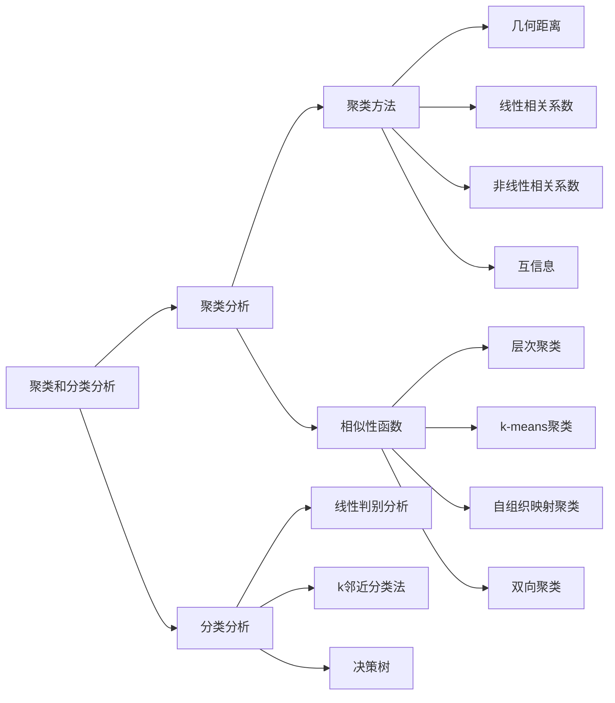

# 生物信息学总结

去年有几章（不写）：

- 绪论
- 序列比对
- BLAST
- 分子进化分析（可以写）
- 基因表达数据分析
- 新一代测序技术*2

要补几章：

- 聚类、分类分析
- 生物分子网络和通路

但是今年略讲或没讲的包括

- 生信与统计（还是有）
- 复杂疾病那个没了？

这个就还是用中文写吧，免疫已经翻译麻了，我太菜了。而且生信还要敲公式。

如果从我校课程角度来看，这些讲得都不算深，杨老师的目的就是让每个人都懂基本的算法，非常多实例来辅助，过程讲解很具体。所以考试其实就是要知道所有这些算法的基本过程就行了，不必搞太高深的东西。其实学这个就是体会一下思想嘛。

不过确实需要总结一下可能考计算的：

- 全局比对、局部比对
- 系统发生树：UPGMA、FM（MP？）
- RNA-seq标准化、t检验方差分析？
- BWT（压缩和）查找
- 算距离，层次聚类，Pearson和Spearman相关系数
- 决策树：节点纯度的指标？
- 灵敏度、特异性（小题吧）
- 网络的基本性质、四种中心性
- Bayes公式，最大似然？

资源分享：

- [哈佛生信课程，啥都有](https://www.youtube.com/playlist?list=PLeB-Dlq-v6taAXK6ZCGfqImrNWJzFt3p3)

# 聚类和分类分析

聚类分析是无监督学习，分类分析是监督学习。用的方法当然不同。

本节讨论的都是二维数据：一堆样本，每个样本是个向量，向量的每个位置是不同的变量。

a mind map

## 聚类分析

### 距离（相似性）尺度函数

#### 几何距离

对于向量$\boldsymbol{x}, \boldsymbol{y}$，其闵可夫斯基距离（Minkowski distance，明氏距离）定义为
$$
d(\boldsymbol{x}, \boldsymbol{y})=\left[\sum_i\left(x_i-y_i\right)^\lambda\right]^{\dfrac{1}{\lambda}}
$$
Specifically,
$$
d(\boldsymbol{x}, \boldsymbol{y})=
\begin{cases}
\sum\limits_i |x_i-y_i| & \lambda=1 & \text{ Manhattan distance 曼氏距离}\\
\sqrt{\sum\limits_i\left(x_i-y_i\right)^2} & \lambda=2 & \text{ Eucildian distance 欧式距离}\\
\max |x_i-y_i| & \lambda=\infty & \text{ Chebyshev distance 切氏距离}
\end{cases}
$$
几何距离的缺陷：两个基因的表达量可能尺度不同，但变化趋势可能相同，就无法反映。

#### 线性相关系数

也称Pearson相关系数，衡量表达模式的相似性
$$
r=\dfrac{1}{n}\sum_{i=1}^{n}\left(\dfrac{x-\overline{x}}{\sigma_x}\right)\left(\dfrac{y-\overline{y}}{\sigma_y}\right)
$$

例子：几个基因在不同癌症中的表达

#### 非线性相关系数

也称Spearman秩相关系数
$$
r=1-\dfrac{6\sum d^2}{n(n^2-1)}
$$
where

- $d$ is the difference of ranks
- $n$ is # of time points

> 一个应用场景：描述几个基因表达量随时间的变化，选取一些离散的时间点

$d$ 到底是啥？先将基因表达量转换成其在所有表达量中的排名。如果并列则取平均值。

两个基因同一位置rank的差值就是 $d$

> 要把这个向量的元素排序

#### 互信息

可以反映一些非单调的相关关系，如先正相关后负相关。具体略。

总结：不同距离函数的计算结果有差别，实际使用中根据情境

### 聚类方法

现在有一堆向量，我们如何分类呢？

#### 层次聚类

hierarchical clustering

##### 步骤

1. 计算所有样本两两间的距离（可表示为矩阵）

   

2. 合并距离最近的两个样本为一个节点

   

3. 更新距离矩阵

   > 合并的节点之间怎么算距离？比如：
   >
   > - 两组间节点所有的两两组合中的最小or最大or平均距离
   > - 先计算两组的“质心”（平均所有节点），求质心的距离

4. 合并距离最近的两个，重复直到只有一个节点

5. 根据需要的类别数 $k$，在 $k$ 个树枝处切断，就得到 $k$ 个类

##### 应用

可以同时对样本（汽车品牌）和变量（各种参数）进行分类，将二维的数据组织成如上的热图，可以分析汽车品牌和各种参数的关系。同样的例子：基因名（变量）和不同时间表达量（样本）

#### k-means聚类

##### 步骤

1. （随机）初始化 $k$ 个点的位置，作为聚类中心 $1,2,\dots,k$
2. 对每个样本，计算它到哪个中心点距离最近，就记为第 $i$ 类
3. 对于所有第 $i$ 类的样本点，计算其平均值，作为该类新的中心
4. 重复2,3步，直到所有样本点的类别不变，即收敛

##### 特点

1. 本质是个优化问题，目标是最小化类内部点间的距离和最大化类间的距离

2. 分类结果依赖于初始点，可以多次试验、随机选取，比较结果，得出比较可信的结论

   > 优化：尽量分散；选取样本点作为初始中心……

3. $k$ 必须事先指定，但可以通过比较不同 $k$ 之下算法的收敛速度、结果合理性来辅助选择合适的 $k$ 

#### 总结

| 算法           | 层次聚类 | k-means聚类  |
| -------------- | -------- | ------------ |
| 方式           | 自底向上 | 自顶向下     |
| 预先设定种类数 | 不用     | 需要         |
| 分类结构       | 可以嵌套 | 分成啥就是啥 |

## 分类分析

首先记住，这里的训练数据是有标签的。

### 线性判别分析

即Fisher线性判别

核心思想：将样本 $x$ 降维到二维，使得类与类可以被一条直线分开

目标：降维后的向量 $y=w^*x+b$ ，优化 $w^*$ 使得：1）类与类的均值差异最大；2）各类内的方差最小。

感兴趣的同学可以参考：https://zhuanlan.zhihu.com/p/61498028

### k邻近分类法

给定一个新样本$x$，找出与之距离最近的 $k$ 个样本，其中属于哪一类最多，就将 $x$ 归为哪一类。

感兴趣的同学可以参考：https://zhuanlan.zhihu.com/p/25994179

### 决策树

一堆样本，对应一个决策；有多个指标（变量），我们需要用已有数据训练出模型。训练目标就是找出，每一步使用什么变量来分类各样本，能达到最准确的分类效果。

#### 分割准则

对于上面这个问题，变量有：有无女票、是否想陪女票、有无学习任务、是否想吃鸡。

假设我们已经有了一堆样本，那么每个节点处都会有一堆样本，需要选一个变量，最好地分开它们。

对于每个变量，都可以做一个表格：

| 是否有女票 | 去上自习 | 不上自习 |
| ---------- | -------- | -------- |
| 是         | 2        | 5        |
| 否         | 6        | 3        |
| 总         | 8        | 8        |

| 有学习任务 | 去上自习 | 不上自习 |
| ---------- | -------- | -------- |
| 是         | 2        | 6        |
| 否         | 4        | 4        |
| 总         | 8        | 8        |

“是”、“否”是两个子节点，“总”是根节点

> 当然这里结果（是否上自习）只有两种，其他问题可能有多种

那么选择“是否有女票”还是“有学习任务”呢？以下介绍两个衡量**节点纯度**的**变化量**的指标

- Gini index
  $$
  Gini=1-\sum_{i=1}^{k}p_i^2
  $$

- information entropy
  $$
  H(n)=-\sum_{i=1}^{k}p_i\log_2 p_i
  $$

where $p_i$ is the probability that a sample falls into category $i$, and $k$ is the number of categories.

二者都是越小/越接近0（某个$p_i$越接近1）说明该节点越纯。

对应的变化量分别称为Gini指数变化 ($\Delta Gini$)，和信息增益 (informational gain)：
$$
\Delta Gini \text{ or } Gain = G(N) - \sum_j\dfrac{n_j}{n}G(N_j)
$$
where $G$ means Gini index or information entropy; $N$ represents the parent node and $N_j$ stands for children nodes (**usually two**).

another example:

> 另一个例子：西瓜的好坏
>
> 

停止标志：变量用完了（还没分出来就是方法或数据不行）、每个节点都足够纯了。

## 分类模型的分类效能评价

如何评价一个模型的好坏？可以从数据中抽取一部分作为训练集，另一部分作为测试集

### 重抽样方法

- n-fold cross-validation：将数据分为n等份，随机选取一份为测试集，剩下的为训练集。重复该过程n次

- 无放回随机抽样：（不用分等份，而是）每次随机抽取1/n的样本为测试集，其他相同

- 留一法（leave-one）交叉验证：每次随机抽一个

- Bagging：样本大小为m，每次有放回地抽取一个样本，重复m次。

  一个样本从来没被抽到过的概率为$(1-\dfrac{1}{m})^m$，极限是$\dfrac{1}{e}\approx37\%$

  用这些样本作为测试集

### 真假阳性-based

| metrics             | Chinese        | implication （反义)    | equation            |
| ------------------- | -------------- | ---------------------- | ------------------- |
| sensitivity/recall  | 灵敏度/召回值  | 漏掉病人的概率         | $\dfrac{TP}{TP+FN}$ |
| specificity         | 特异性         | 误认为病人的概率       | $\dfrac{TN}{TN+FP}$ |
| precision           | （阳性）准确率 | 预测出是病人，的可信度 | $\dfrac{TP}{TP+FP}$ |
| negative prediction | 阴性准确率     | 预测出是正常，的可信度 | $\dfrac{TN}{TN+FN}$ |

- sensitivity：“宁可错杀一千（FP），也不放过一个（FN低）”。能不能检测出真实的病人
  - 如：风险用户识别（可以人工再鉴别）
- precision：“宁可放过一千（FN），也不错杀一个（FP）”。
  - 如：识别垃圾邮件（防止正常的入垃圾）

> 二者是矛盾的！但这个曲线不是ROC（人家是TP和FP的曲线）

#### 综合准确率指标

balanced accuracy：综合了两方面的预测。避免了数据不平衡导致的全部预测为一个值的糟糕分类器得到高分。

| index                | implication（反义) | equation                                                     |
| -------------------- | ------------------ | ------------------------------------------------------------ |
| balanced accuracy    | 均衡准确率         | $\dfrac{1}{2}(\text{recall+specificity})$                    |
| accuracy/correctness | 总体准确率         | $\dfrac{TP+TN}{Total}$                                       |
| F-score              | β是权重            | $(1+\beta)\cdot\dfrac{\text{recall}\cdot\text{precision}}{\beta^2(\text{recall+precision})}$ |

> 均衡正确率：都取相反（如TP和FN），都是测出来是这一种中实际上就是这一种的

# 生物分子网络和通路

网络是复杂系统存在的普遍形式

符号表

| 符号 | 含义     |
| ---- | -------- |
| $n$  | 节点数   |
| $k$  | 度       |
| $d$  | 最短距离 |

## 相关概念（掌握）

### 网络的定义

- 定义： 网络是由节点和边构成， 表示诸多对象及其相互联系。

  可以用图 $G=(V, E)$ 表示网络。

- 网络可以分为有向网络与无向网络（方向性）

- 加权网络和等权网络

### 连通度

（度, degree）

- 节点 $v$ 的连通度是指网络中直接与 $v$ **相连的边的数目**

- 整个网络的连通性可以使用其平均值来表示。

  由$V$个节点和$E$条边组成的无向网络，平均连通度为
  $$
  K=2E/V
  $$

- 对于有向网络往往还要区分边的方向.

  由节点$v$发出的边的数目称为节点$v$的出度，指向节点 $v$ 的边数则称为节点 $v$ 的入度。

  我们用符号$k$来表示连通度，$k_{out}$表示出度，$k_{in}$表示入度。

### 路径与距离

- 路径是指从一个节点（起点） 到另外一个节点（终点） 的所有可能的途径。
- 在有向网络中， 起点与终点是不可逆的。
- 连接两个节点间最短路径的长度称为从起点到终点的**距离**。

### 度量网络特征的常用指标

#### 平均距离

平均距离是指网络中任意两个节点距离的平均值。

#### 聚集系数

聚集系数（Clustering coefficient） 是表示网络中一个节点聚集程度集的系数。 

邻居互相连接的比例 (fraction of pairs of neighbors that are connected to one another)
$$
CC_v=\dfrac{n_{connected}}{\mathrm{C}_k^2}
$$
例子：

网络的聚集系数：所有节点聚集系数的平均值。

可用于衡量：
1. 一个网络中信息传播的速度（大=快）
2. 如果一个节点损坏对整个网络的影响（大=小）

#### 度分布

度分布（Degree Distribution）：对于每个非负整数k，考察度数是k的节点的个数或者比例

## 小世界和无标度网络（了解）

### 小世界网络

small world network

六度分隔理论（Six Degrees of Separation）认为世界上任何互不相识的两人，只需要很少的中间人就能够建立起联系。若每个人认识150人……

小世界网络的特性：**平均距离短、聚集系数高**

大多数现实世界的网络具有小世界网络的特性。

### 随机网络

随机网络：Each of n nodes is independently connected with probability p

度分布为二项分布
$$
P(k)=\mathrm{C}_{n-1}^kp^k(1-p)^{n-1-k}
$$
现实世界的网络大部分都不是随机网络

### 无标度网络

Scale-free network

定义：节点的度数分布符合幂率分布。也就是说，<u>少数的节点往往拥有大量的连接，而大部分节点却很少</u>

> 幂律分布描述类似这样多数个体量级很小，少数个体量级很大的情况。

无标度网络具有自相似性。Fractal：分形，“一个粗糙或零碎的几何形状，可以分成数个部分，且每一部分都（至少近似地）是整体缩小后的形状”.

最常用的模型（假设）：preferential attachment，连接数越多的节点越容易获得更多连接(the rich get richer)

大多数现实世界中的网络属于无标度网络

> 稳健性（Robustness）
>
> - Vulnerable to targeted “hub”(枢纽节点) failure
> - Robust to random node failure

## 衡量节点重要程度的常用指标（掌握）

中心性（Centrality）！

> 以下2，3均针对无向图

### 总结

1. 度中心性（Degree centrality）：具有的连接的数量除以可能的连接数量。
   $$
   D_v=\dfrac{v}{n-1}
   $$
   衡量节点的直接连接数目

2. 紧密度中心性（Closeness centrality）：节点与图中所有其他节点之间的最短路径平均值的倒数，
$$
  C_v=\dfrac{n-1}{\sum_jd_{ij}}
$$
衡量节点接近网络“中心”的程度。

3. 介数/中介中心性（Betweenness centrality）：其他节点之间的最短路径中经过该节点的路径的数目占总的最短路径总数的比例。
$$
  B_v=\dfrac{\sum\limits_v\dfrac{s点到t点的最短路径经过v的数目}{s点到t点的最短路径数目}}{去除v之后总的
  pair数:(N-1)(N-2)/2}
$$
衡量节点在网络信息传递相关过程中的重要性。

4. 特征向量中心性（eigenvector centrality）：一个节点的重要性取决于其邻居节点重要性。与你连接的人越重要，你也就越重要

### 特征向量中心性

eg：访问网页

 

R0为初始状态，A称为转移矩阵(Transition Matrix)，一直乘。。。各节点的特征向量中心性等于
$$
\lim_{t\to\infty}A^tR_0
$$

## 生物分子网络的模块性

### 概念

- 网络间的节点存在着内部彼此高度连接的子节点集合。 模块内的节点之间密集连接， 但是在不同模块中的节点之间稀疏连接。 
- 与同样规模的随机网络相比， 虽然拥有相同的节点数与边数， 模块化网络的连接却更为密集

许多网络（如生物网络， 互联网， 食物网等） 具有这种模块化的特征。模块内部相对于网络总体， 可能具有完
全不同的属性（例如度， 聚类系数， 中心性等）。

### 模块的划分

社区发现(Community Detection)算法用于将网络中的节点划分为子模块结构。

评判模块划分的好坏？模块度
$$
Q=\sum_{c\in C}q_c\\
q_c=\dfrac{l_c}{m}-\left(\dfrac{D_c}{2m}\right)^2
$$

- c: 某个模块
- $m$: 图中的总边数
- $l_c$: 模块c中内部边的总数
- $O_c$: 模块c与其他模块连接的边数
- $D_c$: 模块c中所有顶点的度数之和。$D_c = 2l_c +O_c$

$Q$越大则表明社区划分效果越好。 数值在0.3~0.7之间时， 说明聚类的效果很好。

### 实例

WGCNA算法

将表达量相似的基因划分为一个模块。 这样就能将众多的基因归类为少量的模块， 模块内部包含的基因往往具有功能上的紧密联系。

# 基因表达数据分析

##  RNA-Seq数据分析

RPKM: Reads Per Kilobase Per Millon
FPKM: Fragments Per Kilobase Per Million
TPM: Transcripts Per Million

kilo：长度；million：深度（reads数）

RPKM、FPKM和TPM都是描述相对定量的单位

### 组内标准化方法

- RPKM：先除以长度，再除以原始中每个样本总reads数的和
- FPKM：[双端测序](https://www.jianshu.com/p/5c238ea7c52f)，每个fragment两条reads
- TPM：只不过除以标准化后总reads数的和

### 组间标准化方法

差异基因应该只占少数。原因实质上是因为基因G5的表达量异常升高，导致其它基因的相对表达量降低。

#### 内参法

给两个样品乘以不同的系数，使内参基因的表达（或大多数基因的表达）达到基本一致。假设基因G1是看家基因，给对照和处理分别除以8和24，得到下面的结果。这里的8和24称为标准化因子

不足

1、依赖于基因的功能注释
2、能用于作为内参的基因数目比较少，导致准确性不高

假设大多数基因在样品间的表达是没有差异的，然后运用统计学的方法找到组间的标准化因子。如TMM  

### 差异基因筛选方法

#### 倍数法

用于基因的大规模初筛
$$
f=\dfrac{基因在实验条件下表达量}{基因在对照条件下表达量}
$$
f = 1，表示该基因在两种不同条件下的表达没有差异
f < 1/2 或 f > 2 ，认为该基因在两种条件下的表达有差异

#### t 检验法

仅适用于两组数据之间的比较

H0：μ1=μ2，即假设某基因在两种不同条件下的平均表达水平相等；H1：μ1≠μ2  

不知道方差是否相等的那种统计量，不是？？？
$$
t=\dfrac{\overline{x_1}-\overline{x_2}}{\sqrt{s_1^2/n_1+s_2^2/n_2}}
$$
这是啥？？把样本方差直接当总体方差了？

记住样本方差算了

#### 方差分析

适用于两组或超过两组表达量之间的比较

H0：μ1=μ2=μ3…，即假设某基因在所有不同条件下的平均表达水平相等；H1：μ1、μ2、μ3…，不全相等

计算组内组外和总方差
$$
SS_{sum}=\sum_i\sum_j(x_{ij}-\overline{x})^2\\
SS_{intra}=\sum_in_i(\overline{x_i}-\overline{x})\\
SS_{inter}=\sum_i\sum_j(x_{ij}-\overline{x_i})^2
$$

- 第 $i$ 种条件，共 $k$ 种；第 $j$ 个样本，总共 $n_i$ 个
- $\overline{x}$：所有样本中的平均值

$$
MS_{intra}=\dfrac{SS_{intra}}{dof_{intra}}=\dfrac{SS_{intra}}{N-k}\\
MS_{inter}=\dfrac{SS_{inter}}{dof_{inter}}=\dfrac{SS_{inter}}{k-1}
$$

统计量
$$
F=\dfrac{SS_{inter}}{SS_{intra}}\sim F(N-k, k-1)
$$
若p < α，则拒绝零假设，认为某基因在不同条件下的表达差异具有统计学意义
若p > α，则接受零假设，认为某基因在不同条件下的无表达差异  

eg：通过p53表达分析这三种人患肺癌风险是否一致？  

# 其他

[单端测序与双末端测序问题](https://www.jianshu.com/p/5c238ea7c52f)

