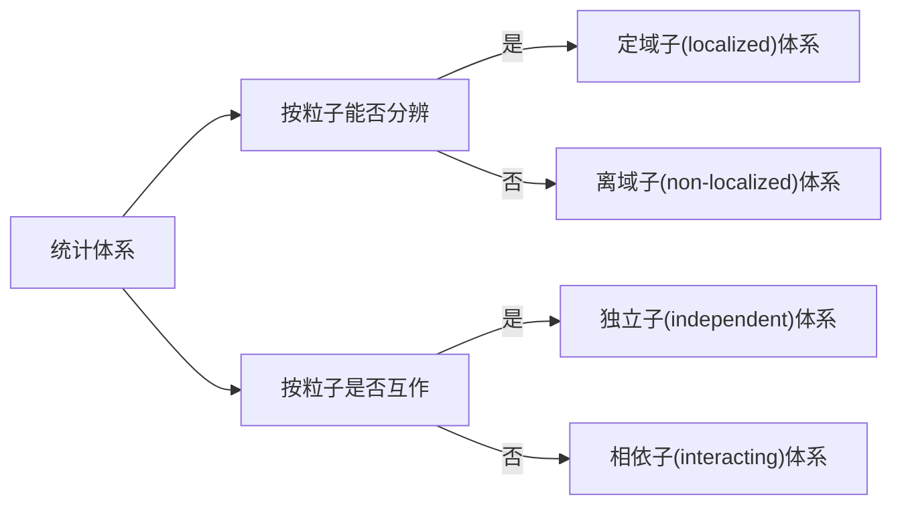

# 高等物理化学——统计热力学

这是浙江大学化学系开设的一门本研贯通课程，授课老师是[王琦](https://person.zju.edu.cn/0090096)老师。此处对课程内容稍作总结，主要来源为课件，如有侵权立即删除。

还没总结完……

# 第一节 经典统计

## 概述

统计力学与热力学的研究对象（**体系的宏观性质**）和任务基本上一致，因此统计力学又被称作统计热力学。  

- 基于唯象理论的经典热力学不从物质的微观结构出发来考虑问题，所以**热力学结论的正确性不受人们对微观结构认识的不断发展的影响**，既是优点又是局限。
- 统计热力学的任务就是从体系的**微观结构和微观运动**来说明体系的宏观性质。

实验可以测。理论计算如何从微观获得宏观性质？统计平均。

统计热力学的三个核心：

- 得到体系微观状态的概率**分布函数**；
- 建立分布函数与热力学宏观量的联系；
- 由分布函数导出各种热力学函数和热力学基本方程，从而形成完备的理论体系

Boltzmann 熵定理  

- 状态函数
- 相乘，相加

$$
S=k\ln\Omega
$$
分子分布与统计平均

$$
\langle\varepsilon\rangle=\frac{E}{N}=\frac{\sum_i \varepsilon_i e^{-\varepsilon_i / k T}}{\sum_i e^{-\varepsilon_i / k T}}
$$

- 定域子：如晶体；离域子：如气体、液体
- 独立子：$E=\sum n_i\varepsilon_i+U$ 中 $U=0$

定域子
$$
W=N ! \prod_i \frac{g_i^{n_i}}{n_{i} !}
$$

离域子体系由于粒子不可分辩，所以
$$
W=\prod_i \frac{g_i^{n_i}}{n_{i} !}
$$

### 最可几分布

在绝大部分时间内，系统在平衡分布的各种微观状态间运动，所以宏观上表现为平衡态性质。  

最可几分布：拥有微观状态数最多，或热力学几率最大的分布（宏观态）。

- 即为平衡分布
- 足以代表系统的一切分布

#### 用最可几分布的微态数代替总微态数的可行性

$$
\begin{aligned}
\ln \Omega & \approx \ln W^* \\
&=\ln \frac{N !}{\prod n_i^{*} !} \\
&= N \ln N-N-\sum\left(n_i^* \ln n_i^*-n_i^*\right) \\
&=N \ln N-\sum n_i^* \ln n_i^* \\
\delta \ln W^* & =-\sum \delta\left(n_i^* \ln n_i^*\right) \\
&=-\sum\left(\ln n_i^* \delta n_i^*+n_i^* \cdot \frac{1}{n_i^*} \delta n_i^*\right) \\
&=-\sum\left(\ln n_i^*+1\right) \delta n_i^* \\
&=-\sum \ln n_i^* \delta n_i^*
\end{aligned}
$$

对偏离最可几分布的任一分布, $\ln W$ 可向最可几分布的 $\ln W^*$ 展开 $\ln W=\ln W^*+\delta \ln W^*+\delta^2 \ln W^*+\cdots \cdots$
忽略三阶以上的无穷小量, 又依据极限条件 $\delta \ln W^*=0$ 
$$
\begin{aligned}
& \ln W=\ln W^*+\delta^2 \ln W^* \\
& \delta^2 \ln W^*=-\sum \delta\left(\ln n_i^* \delta n_i^*\right)=-\sum\left(\delta n_i^* \cdot \frac{1}{n_i^*} \delta n_i^*+\ln n_i^* \delta^2 n_i^*\right) \\
& =-\sum \frac{\left(\delta n_i^*\right)^2}{n_i^*} \\
& \ln W=\ln W^*-\sum \frac{\left(\delta n_i^*\right)^2}{n_i^*} \\
& \ln \frac{W}{W^*}=-\sum\left(\frac{\delta n_i^*}{n_i^*}\right)^2 n_i^*
\end{aligned}
$$

**摘取最大项原理**：可以用最可几分布微态数的对数来代替系统总微态数的对数。

$$
\ln \Omega=\ln W_{\max }
$$

> 尽管随着粒子数增大, 最可几分布的数学几率 $\left(W_{\max } / \Omega\right)$ 会变得非常之小, 但对于由大量粒 子 $\left(\sim 10^{24}\right)$ 构成的系统来说, 比值 $\ln W_{\max } / \ln \Omega$ 仍然非常非常接近于 1 。

## Boltzmann分布

> 下面将$W_{max}$简写为$W$

$$
\mathrm{d} \ln W=\left(\frac{\partial \ln W}{\partial n_1}\right) \mathrm{d} n_1+\left(\frac{\partial \ln W}{\partial n_2}\right) \mathrm{d} n_2+\cdots+\left(\frac{\partial \ln W}{\partial n_n}\right) \mathrm{d} n_n
$$

满足约束条件
$$
\mathrm{d}N=\sum_i \mathrm{d} n_i=0\\
\mathrm{d}E=\sum_i \varepsilon_i \mathrm{d} n_i=0
$$

利用 Lagrange 待定系数法，$(1) -[\alpha \cdot(2)+\beta \cdot(3)]$ 

$\mathrm{d}\ln W=\left(\frac{\partial \ln W}{\partial n_1}-\alpha-\beta \varepsilon_1\right)\mathrm{d} n_1+\cdots \cdots+\left(\frac{\partial \ln W}{\partial n_n}-\alpha-\beta \varepsilon_n\right)\mathrm{d} n_n$

要使 $\ln W$ 取到极大值 $\ln W^*$, 必须 $\mathrm{d}\ln W=0$

$$
\dfrac{\partial \ln W}{\partial n_i}-\alpha-\beta \varepsilon_i=0 \quad(i=1,2,\dots, N)
$$

如前，离域子体系在 $N 、 V 、 E$ 一定的条件下的微态数为：
$$
W=\prod_i \frac{g_i^{n_i}}{n_{i} !} \\
\ln n_{i} !=n_i \ln n_i-n_i \\
\ln W=\ln \prod_i \frac{g_i^{n_i}}{n_{i} !}=\sum_i\left(n_i \ln g_i-n_i \ln n+n_i\right) \\
\frac{\partial \ln W}{\partial n_i}=\ln g_i-\ln n_i-1+1=\ln \frac{g_i}{n_i} \\
$$

代入 (4) 式, 整理得: 
$$
\ln \frac{g_i}{n_i}-\alpha-\beta \varepsilon_i=0
$$

Boltzmann 分布

- 去对数后, 整理, 得出最可几分布: 
  $$
  n_i=\dfrac{g_i}{e^\alpha e^{\beta \varepsilon_i}} \Longrightarrow n_i=\dfrac{N e^{-\beta \varepsilon_i}}{\sum\limits_i e^{-\beta \varepsilon_i}}
  $$
  即为 Boltzmann 分布。

- 待定系数 $\alpha$ 和 $\beta$ 的确定：设想当分子体系与一个单原子理想气体达成热平衡时, 它们最可几分布中的 $\beta$ 系数一定会趋于一致，于是，

$$
\beta=\frac{1}{k T}
$$

# 第二节 统计力学实验

略

# 第三节 单个分子的行为

## 分子的运动

分子的运动包括：

- “转动、振动、电子、核运动” 属于分子内部运动。
- “平动” 属于分子自身的运动，所谓 “外部” 运动。  

$$
\varepsilon_t<\varepsilon_r<\varepsilon_v<\varepsilon_e<\varepsilon_n
$$

- 热运动：分子在各能级上的分配（分布）随温度而变化（平动、转动、振动）。
- 非热运动：一般的温度变化难以产生能级的跃迁或激发（电子运动、核运动）。

- 原则上，系统的微观状态实质上是一种量子态，应该用系统的波函数来描述。
- 对于独立子系统，系统的波函数可以用组成该系统的N个独立子(分子）的波函数之乘积来表示。每一个分子的量子态又可以近似地由平动(t)、转动(r)、振动(v)、电子(e)和核运动(n)的量子态来表示。
- 简并度：当有两个以上的量子态的能量相同时，具有相同能量的量子态数。

## 平动

$$
\varepsilon_{\mathrm{t}}=\frac{h^2}{8 m}\left(\frac{n_x^2}{a^2}+\frac{n_y^2}{b^2}+\frac{n_z^2}{c^2}\right) \quad\left(n_x, n_y, n_z=1,2,3, \ldots\right)
$$
$m$ 为分子质量, $a, b, c$ 为容器边长, $h$ 为 Planck 常数。基态为 $n_x=1, n_y=1, n_z=1$ 。

若为立方势箱, 即 $a=b=c$, 则能量表示式为:
$$
\varepsilon_{\mathrm{t}}=\frac{h^2}{8 m V^{2 / 3}}\left(n_x^2+n_y^2+n_z^2\right)
$$
相邻平动能级能量差非常小，约为 $10^{-40}$J，在通常温度下 $\Delta \varepsilon_{\mathrm{t}} \approx \mathbf{1 0}{ }^{-19} k T$，所谓能级完全开放。在此情况下，平动能级可以认为是连续的，即量子化效应很不显著，可用经典力学方法处理。

## 转动

分子的转动可近似地看作是刚性转子，由量子力学，其转动能为:
$$
\varepsilon_{\mathrm{r}}=\frac{J(J+1) h^2}{8 \pi^2 I} \quad(J=0,1,2,3, \ldots)
$$
其中，$J$ 为转动量子数，取值 $0,1,2,3,\ldots$ 等正整数; $I$ 为 转动惯量。
$$
I=\mu R_0^2
$$
$R_0$ 为分子平衡键长，$\mu$ 为分子折合质量。对于双原子分子, 若两个原子的质量分别为 $m_1, m_2$, 则 $\mu=\frac{m_1 m_2}{m_1+m_2}$。

当转动量子数为 $J$ 时，简并度 $g^{\mathrm{r}}=2 J+1$ 。

常温下，相邻转动能级的 $\Delta \varepsilon_{\mathrm{r}} \approx 10^{-2} k T$，一般也可视为完全开放。所以，转动能级也可以近似认为是连续的。

分子的转动光谱：远红外光谱。一般将 25~1000 mm 的红外波段划为远红外区。

刚性转子模型得到的纯转动谱就是一组等距离的谱线，谱线的间隔 $\Delta v(\sim) = 2B$， $B$：转动常数。

## 振动

分子振动有多种模式：对称伸缩振动、非对称伸缩振动和面内弯曲振动。  

由量子力学, 其振动能为:
$$
\varepsilon_{\nu}=\left(\nu+\frac{1}{2}\right) h v \quad(\nu=0,1,2,3, \ldots)
$$
$\nu$ 为振动量子数，取值 $0,1,2,3,\ldots$ 等正整数，$\nu$ 为简谐振子的振动基频。可从分子振动光谱得到。

- 对任何能级，振动都是非简并的
- $\Delta \varepsilon_{\nu} \approx 1 0 k T$

## 电子运动与核运动

粒子的这两种运动一般均处于基态。

## 分子光谱

### 红外光谱

### Raman光谱

### 微波波谱

### 紫外-可见光谱

### 荧光光谱

# 第四节 体系的宏观性质

两个问题：

1. 粒子的微观状态和微观物理量的描述
1. 正确求算微观物理量的统计平均值

## 广义运动方程

广义坐标、广义动量

Hamilton 运动方程

一维谐振子、平面刚性转子  

## 微观状态的描述

等几率假设（Postulate of equal a priori probability）  

对 N、V、E 确定的热力学体系，每一个微观状态出现的几率相等。

各态历经假说（Ergodic hypothesis）

体系在时间的进程中会以一定的几率出现在它的各个微观状态上。或者说，体系在一定的时间内将辗转经历它所有的各个微观状态。其实，这一假设可以由 “等几率假设” 推导出来，只是 “等几率假设” 的一个推论。  

推论：时间平均假设

被研究体系某性质的时间平均值等于这个性质的系综平均值。

几率与几率密度  

## 配分函数的拆分

规定：各独立运动形式的能量0点为各自的基态能级，即指定基态能级为能量0点。

### 平动配分函数

$$
\begin{aligned}
q^{\mathrm{t}} & =\sum_i g_i^{\mathrm{t}} \mathrm{e}^{-\varepsilon_i^{\mathrm{t}} / k T} \\
& =\sum_{n_x=1}^{\infty} \sum_{n_y=1}^{\infty} \sum_{n_z=1}^{\infty} \exp \left[-\frac{h^2}{8 m k T}\left(\frac{n_x^2}{a^2}+\frac{n_y^2}{b^2}+\frac{n_z^2}{c^2}\right)\right]
\end{aligned}
$$

### 转动配分函数

$$
\begin{gathered}
q^{\mathrm{r}}=\sum_i g_i^{\mathrm{r}} \exp \left(-\frac{\varepsilon_i^{\mathrm{r}}}{k T}\right)=\sum_{J=0}^{\infty}(2 J+1) \exp \left[-\frac{J(J+1) h^2}{8 \pi^2 I k T}\right] \\
q^{\mathrm{r}}=\sum_{J=0}^{\infty}(2 J+1) \exp \left(-\frac{J(J+1) \Theta_{\mathrm{r}}}{T}\right)
\end{gathered}
$$

其中 $\Theta_{\mathrm{r}}=\dfrac{h^2}{8 \pi^2 I k}$，称为转动特征温度。

## 统计熵与量热熵

残余熵：非完美晶体

# 第五节 统计系综

由大量的、处于同一宏观状态下，而各自处于不同微观状态的标本体系的集合，就被称为系综（Ensemble）。系综是系统所有微观状态的集合，即相空间中所有相点。

体系的宏观性质是其辗转经历各个微观状态时的时间平均，也就是其辗转经历系综中各个体系时的系综平均。

相（点）密度：可看作连续函数
$$
\rho(\mathbf{q}, \mathbf{p}, t)
=\lim _{\Delta \Gamma \rightarrow 0} \frac{\Delta N}{\Delta \Gamma}
=\lim _{\Delta \Gamma \rightarrow 0} \frac{\Delta N}{\Delta \boldsymbol{q}\Delta \boldsymbol{p}}
$$
系综分布函数（或相点几率密度）:
$$
\frac{\mathrm{d} N}{N}=\frac{\rho(\mathbf{q}, \mathbf{p}, t) \mathrm{d} \Gamma}{N}=f(\mathbf{q}, \mathbf{p}, t) \mathrm{d} \Gamma \\
f(\mathbf{q}, \mathbf{p}, t)=\frac{\rho(\mathbf{q}, \mathbf{p}, t)}{N}
$$
具有归一性:
$$
\int_{\Gamma} f \mathrm{d} \Gamma=\frac{1}{N} \int_{\Gamma} \rho \mathrm{d} \Gamma=1
$$
可以用此几率密度求某一量的统计平均。

1.  微正则系综（microcanonical ensemble)：粒子数量N，系统体积V，体系能量E恒定，孤立体系。NVE系综
2. 正则系综(canonical ensemble)：NVT系综，封闭体系。
3. 巨正则系综(gran\mathrm{d}canonical ensemble)：uVT系综，开放体系。
4. 等温等压系综(isothermal-isobaric ensemble)：NpT系综，常见体系。

刘维（Liouville）定理：对保守力学体系，在相空间中体系的相点沿任何相轨迹运动时，其相密度和相几率密度在运动中不随时间改变。或者说，相密度守恒。

$$
\frac{\mathrm{d}\rho}{\mathrm{d}t}=\frac{\mathrm{d}f}{\mathrm{d}t}=0
$$

## 微正则系综

NVE系综，相当于孤立体系

推导见第一节

$$
\begin{gathered}
f=\left\{\begin{array}{cc}
\mathrm{C} \quad \mathrm{E} \leqslant \mathrm{H} \leqslant \mathrm{E}+\delta \mathrm{E} \\
0 \quad & \mathrm{H}<\mathrm{E}, \mathrm{H}>\mathrm{E}+\delta \mathrm{E}
\end{array}\right. \\
\int_{\Gamma} f d \Gamma=1=\int_{\delta \mathrm{E}} \mathrm{C} d \Gamma=\mathrm{C} \int_{\delta \mathrm{E}} d \Gamma \quad \mathrm{C}=\frac{1}{\int_{\delta \mathrm{E}} d \Gamma}=\frac{1}{\Omega(N, V, E)} \\
\langle G\rangle=\int_{\Gamma} G \cdot f d \Gamma=\lim _{\delta \mathrm{E} \rightarrow 0} \mathrm{C} \int_{\delta \mathrm{E}} G d \Gamma=\lim _{\delta \mathrm{E} \rightarrow 0} \frac{\int_{\delta \mathrm{E}} G d \Gamma}{\int_{\delta \mathrm{E}} d \Gamma}
\end{gathered}
$$
归一化

## 正则系综  

$$
\begin{gathered}
\sum_i n_i=N \quad \text { (系综中标本体系总数) } \\
\sum_i n_i E_i=N\langle E\rangle \quad \text { (系综的总能量) } \\
W=\left(g_1^{n_1} \cdot C_{\mathrm{N}}^{n_1}\right)\left(g_2^{n_2} \cdot C_{\mathrm{N}-n_1}^{n_2}\right)\cdots \cdots=N ! \prod_{i} \frac{g_i^{n_i}}{n_{i} !}
\end{gathered}
$$

### Boltzmann 分布的推导

$$
\begin{aligned}
& \ln N !=N \ln N-N \quad \quad \ln n_{i} !=n_i \ln n_i-n_i \\
& \ln W=\ln N ! \prod_i \frac{g_i^{n_i}}{n_{i} !}=\ln N !+\sum_i\left(n_i \ln g_i-n_i \ln n_i+n_i\right) \\
& \frac{\partial \ln W}{\partial n_i}=\ln g_i-\ln n_i-1+1=\ln \frac{g_i}{n_i} 
\end{aligned}
$$
回忆第一节中的
$$
\frac{\partial \ln W}{\partial n_i}-\alpha-\beta E_i=0 \quad(i=1,2, \cdots \cdots, n)
$$
代入上式，整理得:
$$
\ln \frac{g_i}{n_i}-\alpha-\beta E_i=0
$$
同样能得出
$$
\dfrac{n_i}{N}=\dfrac{g_i e^{-E_i / k T}}{\sum_i g_i e^{-E_i / k T}}
$$

> 和微正则分布相同？

### 热力学量

内能
$$
\begin{aligned}
& Z=\sum_i g_i e^{-E_i / k T} \quad n_i=\frac{N}{Z} g_i \exp \left(-E_i / k T\right) \\
\left(\frac{\partial Z}{\partial T}\right)_{V, N}&=\sum_i g_i \exp \left(-E_i / k T\right)\left(-\frac{E_i}{k}\right)\left(-\frac{1}{T^2}\right) \\
U&=\frac{1}{N} \sum_i n_i E_i=\frac{1}{N} \frac{N}{Z} \sum_i g_i \exp \left(-E_i / k T\right) \cdot E_i \\
&=\frac{1}{Z} \cdot k T^2\left(\frac{\partial Z}{\partial T}\right)_{V, N}=k T^2\left(\frac{\partial \ln Z}{\partial T}\right)_{V, N}
\end{aligned}
$$
熵
$$
\begin{aligned}
\ln W^* & =\ln \left[N ! \prod_i \frac{g_i^{n_i}}{n_{i} !}\right] \\
& =\ln \left[\left(\frac{\mathrm{N}}{e}\right)^{\mathrm{N}} \prod_i\left(\frac{g_i e}{n_i}\right)^{n_i}\right] \\
& =\ln \left[\left(\frac{\mathrm{N}}{e}\right)^{\mathrm{N}} \prod_i\left(\frac{Z e}{N} \cdot e^{\beta E_i}\right)^{n_i}\right] \\
& =\ln \left(Z^{\mathrm{N}} e^{\mathrm{N \beta}\langle E\rangle}\right) \\
& =\mathrm{N}\left(\ln Z+\frac{\langle E\rangle}{k T}\right) \\
S & =\frac{1}{\mathrm{~N}} k \ln W^*=k \ln Z+\frac{U}{T}
\end{aligned}
$$
故
$$
A=U-TS=-kT\ln Z
$$
而
$$
p=-\left(\frac{\partial A}{\partial V}\right)_{T, N}=kT\left(\frac{\partial \ln Z}{\partial V}\right)_{T, N}
$$

## 巨正则系综

$$
\begin{gathered}
\frac{\partial \ln f}{\partial E}=-\beta \quad \beta=\frac{1}{k T} \quad \frac{\partial \ln f}{\partial N}=\gamma \quad \gamma=\frac{\mu}{k T} \\
d \ln f(E, N)=\frac{\partial \ln f}{\partial E} d E+\frac{\partial \ln f}{\partial N} d N=-\beta d E+\gamma d N \\
\ln f(E, N)=-\beta E+\gamma N+\mathrm{C}^{\prime} \quad f=\mathrm{C} e^{-\beta E+\gamma N} \\
\int_{\Gamma} f d \Gamma=1=\mathrm{C} \int_{\Gamma} e^{-E / k T+N_{\mathrm{A}} \mu_{\mathrm{A}} / k T} d \Gamma
\end{gathered}
$$

热力学量
$$
\begin{aligned}
\ln W^* & =\ln \left\{N ! \prod_i \prod_{N_{\mathrm{A}}} \frac{\left[g_i\left(N_{\mathrm{A}}\right)\right]^{n_i\left(N_{\mathrm{A}}\right)}}{n_i\left(N_{\mathrm{A}}\right) !}\right\} \\
& =\ln \left\{\left(\frac{N}{e}\right)^{N} \prod_i \prod_{N_{\mathrm{A}}}\left[\frac{g_i\left(N_{\mathrm{A}}\right) e}{n_i\left(N_{\mathrm{A}}\right)}\right]^{n_i\left(N_{\mathrm{A}}\right)}\right\} \\
& =\ln \left\{\left(\frac{N}{e}\right)^{N} \prod_i \prod_{N_{\mathrm{A}}}\left[\frac{\Xi e}{\mathrm{~N}} \cdot e^{\beta E_i\left(N_{\mathrm{A}}\right)} e^{-\gamma N_{\mathrm{A}}}\right]^{n_i\left(N_{\mathrm{A}}\right)}\right\} \\
& =\ln \left[\left(\frac{N}{e}\right)^{N}\left(\frac{\Xi e}{\mathrm{~N}}\right)^{N} e^{N \beta\langle E\rangle} e^{-N \gamma\left\langle N_{\mathrm{A}}\right\rangle}\right] \\
& =N\left[\ln \Xi+\beta\langle E\rangle-\gamma\left\langle N_{\mathrm{A}}\right\rangle\right] \\
& =N\left[\ln \Xi\left(\mu_{\mathrm{A}}, V, T\right)+\frac{\langle E\rangle}{k T}-\frac{\left\langle N_{\mathrm{A}}\right\rangle \mu_{\mathrm{A}}}{k T}\right]
\end{aligned}
$$

## 涨落

热力学量围绕平均值的瞬间偏离，称为涨落。

是统计的必然结果，是物质粒子性的一种效应。

经典热力学不能解释涨落现象

- 偏差 $\sigma_G=G-\langle G\rangle$
- 涨落 $\sigma_G^2=\left\langle(G-\langle G\rangle)^2\right\rangle$
- 相对涨落 $\dfrac{\sigma_G^2}{\langle G\rangle^2}=\dfrac{\left\langle G^2\right\rangle-\langle G\rangle^2}{\langle G\rangle^2}$

> $$
> \begin{aligned}
> & \langle G\rangle=\int G \cdot f \mathrm{~d} \Gamma \\
> & \sigma_G^2=\int(G-\langle G\rangle)^2 \cdot f \mathrm{~d} \Gamma=\int G^2 \cdot f \mathrm{~d} \Gamma-2\langle G\rangle \int G \cdot f \mathrm{~d} \Gamma+\langle G\rangle^2 \int f \mathrm{~d} \Gamma \\
> & =\left\langle G^2\right\rangle-2\langle G\rangle\langle G\rangle+\langle G\rangle^2=\left\langle G^2\right\rangle-\langle G\rangle^2 \\
> & \text {  } 
> \end{aligned}
> $$

# 第六节 流体的统计理论

不管是真实气体还是液体，都要考虑分子间相互作用。

## 气体状态方程

$$
\begin{aligned}
& \frac{1}{N ! h^{3 N}} \int \cdots \int \exp \left[-\frac{1}{2 m k T} \sum_{i=1}^N\left(p_{x i}^2+p_{y i}^2+p_{z i}^2\right)\right] d p \\
& =\frac{1}{N ! h^{3 N}} \prod_{i=1}^{3 N} \int_{-\infty}^{\infty} \exp \left(-\frac{p_i^2}{2 m k T}\right) d p_i \\
& =\frac{1}{N ! h^{3 N}} \prod_{i=1}^{3 N}(2 \pi m k T)^{1 / 2} \\
& =\frac{1}{N ! h^{3 N}}(2 \pi m k T)^{3 N / 2} \\
& =\frac{1}{N !}\left[\left(\frac{2 \pi m k T}{h^2}\right)^{3 / 2}\right]^N \equiv \frac{1}{N ! \Lambda^{3 N}} \\
&
\end{aligned}
$$
其中

$$
\Lambda=\left(\frac{h^2}{2 \pi m k T}\right)^{1 / 2}
$$

称为德布罗意热波长。如果 $U(q)=0$，则$\int \cdots \int \exp [-U(q) / k T] d q=V^N$。

### 构型积分

相依子体系下，如果将体系配分函数分解成外部配分函数（平动）和内部配分函数（转动、振动、电子、核）两部分，则只有外部配分函数与分子间相互作用势 $U$ 有关，而内部配分函数与 $U$ 无关。
$$
\begin{aligned}
Z_{\text {外 }}= & \frac{1}{N ! h^{3 N}} \int \cdots \int \exp \left[-\frac{1}{2 m k T} \sum_{i=1}^N\left(p_{x i}^2+p_{y i}^2+p_{z i}^2\right)-\frac{U(q)}{k T}\right]\mathrm{d} q\mathrm{d} p \\
= & \frac{1}{N ! h^{3 N}} \int \cdots \int \exp \left[-\frac{1}{2 m k T} \sum_{i=1}^N\left(p_{x i}^2+p_{y i}^2+p_{z i}^2\right)\right]\mathrm{d} p \\
& \times \int \cdots \int \exp [-U(q) / k T]\mathrm{d} q
\end{aligned}
$$
第二项称为构型积分，记为 $Z_C$。

### 推导状态方程

假设：分子间作用力只取决于分子间的距离，而不受其它分子的位置所影响。
$$
\begin{aligned}
& Z_{\mathrm{C}}=\int \cdots \int \exp [-U(q) / k T]\mathrm{d}q=\int \cdots \int \exp \left[-\sum_{i<j} u\left(r_{i j}\right) / k T\right]\mathrm{d}r_1 \cdots\mathrm{d}r_N \\
& =\int \cdots \int \exp \left[-\sum_{i, j \neq N} u\left(r_{i j}\right) / k T\right]\mathrm{d}r_1 \cdots\mathrm{d}r_{N-1} \cdot \int \exp \left[-\sum_{i \neq N}^{N-1} u\left(r_{i N}\right) / k T\right]\mathrm{d}r_N
\end{aligned}
$$
先考虑第 $N$ 个分子

定义 Mayer 函数
$$
f_{i j}=f_{i j}\left(r_{i j}\right)=\exp \left[-u\left(r_{i j}\right) / k T\right]-1
$$
理解成，在 $f_{ij}+1=1$ 处（即 $u=0$ 处，或无穷远？）进行Taylor展开，$f_{ij}$ 就是一个接近于0的数
$$
\begin{aligned}
\exp & \left[-\sum_{i \neq N}^{N-1} u\left(r_{i N}\right) / k T\right]=\prod_{i \neq N}^{N-1}\left(1+f_{i N}\right) \\
& =1+\sum_{i \neq N}^{N-1} f_{i N}+\sum_{i^{\prime}>i \neq N}^{N-1} f_{i N} f_{i^{\prime} N}+\sum_{i^{\prime}>i^{\prime}>i \neq N}^{N-1} f_{i N} f_{i^{\prime} N} f_{i^{\prime \prime} N}+\cdots \cdots \\
I_N & =\iiint\left(1+\sum_{i \neq N}^{N-1} f_{i N}\right)\mathrm{d}x_N\mathrm{d}y_N\mathrm{d}z_N\\
&=V+\iiint \sum_{i \neq N}^{N-1}\left[\mathrm{e}^{-u\left(r_{i N}\right) / k T}-1\right]\mathrm{d}x_N\mathrm{d}y_N\mathrm{d}z_N\\
& =V+(N-1) \iiint\left[\mathrm{e}^{-u\left(r_{i N}\right) / k T}-1\right] \mathrm{d} x_N \mathrm{d} y_N \mathrm{d} z_N \\
& =V+(N-1) \beta_1 \\
Z_{\mathrm{C}} & =\int \cdots \int \exp \left[-\sum_{i, j \neq N} u\left(r_{i j}\right) / k T\right] \mathrm{d}r_1 \cdots \mathrm{d}r_{N-1} \cdot I_N \\
& =I_N I_{N-1} I_{N-2} \cdots \cdots I_1 \\
& =\left[V+(N-1) \beta_1\right]\left[V+(N-2) \beta_1\right] \cdots \cdots V \\
& =V^N\left[1+\frac{(N-1) \beta_1}{V}\right]\left[1+\frac{(N-2) \beta_1}{V}\right] \cdots \cdots 1 \\
& =V^N\left[1+\frac{1}{2} \frac{N^2 \beta_1}{V}+\cdots \cdots\right]\\
\ln Z_{\mathrm{C}} & =N \ln V+\ln \left(1+\frac{1}{2} \cdot \frac{N^2 \beta_1}{V}\right)\\
 & =N \ln V+\frac{1}{2} \cdot \frac{N^2 \beta_1}{V} \\
p & =k T\left(\frac{\partial \ln Z}{\partial V}\right)_{T, N}=k T\left(\frac{\partial \ln Z_{\mathrm{C}}}{\partial V}\right)_{T, N} \\
& =\frac{N k T}{V}-\frac{1}{2} \beta_1 \frac{N^2 k T}{V^2}=\frac{N k T}{V}\left(1-\frac{N \beta_1}{2 V}\right)
\end{aligned}
$$

如果将气体分子看成是直径为$\sigma$，有吸引力的硬球。 

$$
u(r)= \begin{cases}\infty & r \leq \sigma \\
u(r) & r>\sigma\end{cases} \\
$$
则
$$
\mathrm{e}^{-u(r) / k T}-1 \approx-\frac{u(r)}{k T}\\
\begin{aligned}
\beta_1 & =\iiint\left[\mathrm{e}^{-u\left(r_{i N}\right) / k T}-1\right]\mathrm{d}x_N\mathrm{d}y_N\mathrm{d}z_N \\
& =\iiint\left[\mathrm{e}^{-u(r) / k T}-1\right] r^2 \sin \theta\mathrm{d}\theta\mathrm{d}\phi\mathrm{d}r \\
& =4 \pi \int_0^{\infty}\left[\mathrm{e}^{-u(r) / k T}-1\right] r^2\mathrm{d}r \\
& =4 \pi \int_0^\sigma\left[\mathrm{e}^{-u(r) / k T}-1\right] r^2\mathrm{d}r+4 \pi \int_\sigma^{\infty}\left[\mathrm{e}^{-u(r) / k T}-1\right] r^2\mathrm{d}r \\
& =-4 \pi \int_0^\sigma r^2\mathrm{d}r+4 \pi \int_\sigma^{\infty}\left[\mathrm{e}^{-u(r) / k T}-1\right] r^2\mathrm{d}r\\
& =-\frac{4}{3} \pi \sigma^3-\frac{4 \pi}{k T} \int_\sigma^{\infty} u(r) r^2\mathrm{d}r\\
p & =\frac{N k T}{V}\left(1-\frac{N \beta_1}{2 V}\right) \\
& =\frac{N k T}{V}\left[1+\frac{1}{V}\left(\frac{2}{3} N \pi \sigma^3+\frac{2 N \pi}{k T} \int_\sigma^{\infty} u(r) r^2 \mathrm{d}r\right)\right]
\end{aligned}
$$

令$\dfrac{2}{3} \pi \sigma^3=b^{\prime}, -2 \pi \int_\sigma^{\infty} u(r) r^2 \mathrm{d}r=a^{\prime}$
$$
\begin{aligned}
p & =\frac{N k T}{V}\left[1+\frac{1}{V}\left(N b^{\prime}-\frac{N a^{\prime}}{k T}\right)\right] \\
& =\frac{N k T}{V}\left(1+\frac{N b^{\prime}}{V}-\frac{N a^{\prime}}{k T V}\right) \\
& =\frac{N k T}{V}\left(1+\frac{N b^{\prime}}{V}\right)-\frac{N^2 a^{\prime}}{V^2} \\
&
\end{aligned}
$$
即

$$
\begin{aligned}
p+\frac{N^2 a^{\prime}}{V^2} & =\frac{N k T}{V} \cdot\left[1+\left(\frac{N b^{\prime}}{V}\right)\right] \\
& \approx \frac{N k T}{V} \cdot\left(1-\frac{N b^{\prime}}{V}\right)^{-1} \\
& =\frac{N k T}{V} \cdot\left(\frac{V}{V-N b^{\prime}}\right)=N k T \cdot\left(\frac{1}{V-N b^{\prime}}\right)
\end{aligned}
$$
即
$$
\left(p+\frac{N^2 a^{\prime}}{V^2}\right)\left(V-N b^{\prime}\right)=N k T
$$
就是我们熟悉的范德华方程
$$
\left(p+\frac{a}{V_{\mathrm{m}}^2}\right)\left(V_{\mathrm{m}}-b\right)=R T
$$

上面推导了气体状态方程，下面我们将了解**液体的**统计理论。

## 似晶格理论

似晶格理论(格子理论):假设溶液中存在类似晶格的结构，溶液分子位于晶格节点，围绕每个分子最邻近的其它分子有一平均数目，称为配位数。
·假设两种分子具有类似的大小和形状，每个分子占据一个晶格，且晶格是坚硬的，不因组成变化而变化，即混合过程体积具有加和性。
正规溶液理论:按照上面的假设，两种溶液分子具有类似的大小和形状，因此在混合时体积具有加和性，且与理想溶液在混合时的嫡变一样，即过量嫡等于0。说明这种溶液是“规则的”，因此叫做“正规溶液”。
无热溶液理论:还有一种溶液，两种溶液分子间具有相近的相互作用能，因此在混合时与理想溶液一样，烩变为0，过量烩也为0，即混合时没有热量变化，因此叫做“无热溶液”。如高分子溶液，Flory-Huggins理论。

## 胞腔理论（自由体积理论）

胞腔理论：液体的结构假定为一种类似晶体的结构，将液体体积按分子数分割成 N 个晶胞(即胞腔)，设每个胞腔只含一个分子，每个分子只在它自己的胞腔内活动而与邻近分子无关。

自由体积理论：假定液体中的分子都有一个较固定的位置，每一个分子都在由周围高度对称排列的分子所构成的 “笼子” 中作 “自由” 运动。

假定 
$$
U(q)=u_0+\sum_{i=1}^N u_i(x, y, z)
$$

- $u_0$ 为各分子均处于平衡点时的能量。
- $u_i(x, y, z)$ 为各分子偏离平衡点时的位能。

$$
\begin{aligned}
Z_{\mathrm{C}} & =\int \cdots \int \mathrm{e}^{-U(q) / k T}\mathrm{d}r_1 \cdots\mathrm{d}r_N \\
& =\mathrm{e}^{-u_0 / k T} \int \cdots \int \exp\left\{ {-\sum_{i=1}^N u_i(x, y, z) / k T}\right\}\mathrm{d}r_1 \cdots\mathrm{d}r_N\\
& =\mathrm{e}^{-u_0 / k T} \prod_{i=1}^N \int \mathrm{e}^{-u_i(x, y, z) / k T}\mathrm{d}r_i \\
& =\mathrm{e}^{-u_0 / k T}\left[\int \mathrm{e}^{-u(x, y, z) / k T}\mathrm{d}r\right]^N 
\end{aligned}
$$

令
$$
V_f=\int \mathrm{e}^{-u(x, y, z) / k T}\mathrm{d}r
$$

### 硬球模型

### 谐振子模型  

甚至也可以用L-J势函数。

## 分布函数理论

### 径向分布函数

在分子间力的作用下，液体中分子的分布不是完全随机的。近程有序！（晶体：远程也可以有序）

定义**径向分布函数**为：与一指定分子相距 $r$ 处，分子的局部数密度与平均数密度之比。
$$
g(r)=\dfrac{\rho(r)}{\rho_0}
$$

- 当 $r$ 较大时，$g(r)$ 趋于 1，表明分子是随机分布。
- 在 $r$ 较小的区域，有明显的峰-谷。表明液体近程有序（第 1、第 2 配位圈）。

径向分布函数的确定

- 实验：XRD、中子衍射、电子衍射

  

- 计算机模拟：MC、MD  
  $$
  g(r)=\frac{1}{\rho_0} \frac{n(r)}{V} \approx \frac{1}{\rho_0} \frac{n(r)}{4 \pi r^2 \delta r}
  $$

- 理论计算：积分方程理论。详见后

### 导出状态方程

#### 分布函数

考虑一个小于 $N$ 的有限数 $n$，通常选 $n=2$, 当 $N$ 个分子中 的分子 $1,2, \ldots, n$ 分别处在 $r_1, r_2, \ldots, r_n$ 处的微体积元 $\mathrm{d} r_1, \mathrm{~d} r_2, \ldots, \mathrm{d} r_n$ 内时，如不计动能变化，**只考虑位置不同所引起的位能变化**，这时几率为 (**将其余 $N-n$ 个 分子的统统积分积掉**）:
$$
\begin{aligned}
p^{(n)}\left(\vec{r}_1 \cdots \vec{r}_n\right)\mathrm{d}\vec{r}_1 \cdots\mathrm{d}\vec{r}_n & =\frac{\left[\int \cdots \int \exp [-U(q) / k T]\mathrm{d}\vec{r}_{n+1} \cdots\mathrm{d}\vec{r}_N\right]\mathrm{d}\vec{r}_1 \cdots\mathrm{d}\vec{r}_n}{Z_{\mathrm{C}}} \\
p^{(n)}\left(\vec{r}_1 \cdots \vec{r}_n\right) & =\frac{\int \cdots \int \exp [-U(q) / k T]\mathrm{d}\vec{r}_{n+1} \cdots\mathrm{d}\vec{r}_N}{Z_{\mathrm{C}}}
\end{aligned}
$$
称为 **$n$ 体定标分布函数**，即为<u>指定分子构型</u>时的分布函数。其中构型积分
$$
Z_{\mathrm{C}}=\int \cdots \int \exp [-U(q) / k T]\mathrm{d}r_1 \cdots\mathrm{d}r_N
$$
如果不计分子标号, 泛指在 $\mathrm{d} r_1, \mathrm{~d} r_2, \ldots, \mathrm{d} r_n$ 内各出现一个分子的几率为:
$$
\rho^{(n)}\left(\vec{r}_1 \cdots \vec{r}_n\right)\mathrm{d}\vec{r}_1 \cdots\mathrm{d}\vec{r}_n
$$
$\rho^{(n)}\left(\vec{r}_1 \cdots \vec{r}_n\right)$ 称为 **$n$ 体分布函数**，即为<u>非指定构型</u>分布函数。

二者之间有如下关系:
$$
\begin{aligned}
\rho^{(n)}\left(\vec{r}_1 \cdots \vec{r}_n\right) & = \mathrm{A}_N^k \cdot p^{(n)}\left(\vec{r}_1 \cdots \vec{r}_n\right) \\
& =\dfrac{N !}{(N-n)!} p^{(n)}\left(\vec{r}_1 \cdots \vec{r}_n\right)
\end{aligned}
$$
差别源于从 $N$ 个分子中任选 $n$ 个分子的方法数。

> 理解：
>
> - 由于 $p^{(n)}$ 满足归一化条件，所以 
>   $$
>   \int \cdots \int\rho^{(n)}\left(\vec{r}_1 \cdots \vec{r}_n\right)\mathrm{d}r_1 \cdots\mathrm{d}r_n=\dfrac{N !}{(N-n)!}
>   $$
>
> - $n=1$ 时，$\rho^{(1)}\left(\vec{r}_1\right)$ 是 $\vec{r}_1$ 的函数，但由于分子随机运动，所以各处密度应是相等的，即$\rho^{(1)}\left(\vec{r}_1\right)$ 与 $\vec{r}_1$ 无关。故
>   $$
>   \int\rho^{(1)}\mathrm{d}\vec{r}_1=\rho^{(1)}\int\mathrm{d}\vec{r}_1=\rho^{(1)}V=N
>   $$
>   故$\rho^{(1)}=\dfrac{N}{V}=\rho_0$，即径向分布函数中出现的，整个液体的平均分子数密度。
>
> - $n=2$ 时，$\rho^{(2)}\left(\vec{r}_1,\vec{r}_2\right)$ 是 $\vec{r}_1,\vec{r}_2$ 的函数，但由于分子随机运动，所以$\rho^{(2)}$ 是 $|\vec{r}_1-\vec{r}_2|$ 的函数。
>
>   若分子完全随机运动，$\rho^{(2)}$ 应为常数，或者说 $\rho^{(2)}$ 的平均值满足
>   $$
>   \iint\overline{\rho^{(2)}}\mathrm{d}\vec{r}_1\mathrm{d}\vec{r}_2=\overline{\rho^{(2)}}\iint\mathrm{d}\vec{r}_1\mathrm{d}\vec{r}_2=\overline{\rho^{(2)}}V^2=N(N-1)
>   $$

#### $n$ 体相关函数

定义：
$$
\begin{aligned}
g^{(n)}\left(\vec{r}_1 \cdots \vec{r}_n\right)&=\frac{\rho^{(n)}\left(\vec{r}_1 \cdots \vec{r}_n\right)}{\rho_0^n}\\
&=\frac{N !}{(N-n) !\cdot\rho_0^n}\cdot p^{(n)}\left(\vec{r}_1 \cdots \vec{r}_n\right)\\
\\
&\approx V^n\cdot p^{(n)}\left(\vec{r}_1 \cdots \vec{r}_n\right)
\end{aligned}
$$
该式表示分子间有相互作用时的分布与随机分布的比值。

> 也许用 $\rho^{(n)}$ 的平均值，就不需要约等于了。

当 $n=2$ 时，为二体相关函数, 即为径向分布函数:
$$
\begin{aligned}
& g(r)=g^{(2)}\left(\vec{r}_1, \vec{r}_2\right)=\frac{\rho^{(2)}\left(\vec{r}_1, \vec{r}_2\right)}{\rho^2}=V^2 p^{(2)}\left(\vec{r}_1, \vec{r}_2\right) \\
& g(r)=\frac{V^2}{Z_{\mathrm{C}}} \int \cdots \int \exp \left[-U\left(\vec{r}_1 \cdots \vec{r}_N\right) / k T\right]\mathrm{d}\vec{r}_3 \cdots\mathrm{d}\vec{r}_N
\end{aligned}
$$

也就是说，可以将径向分布函数与构型积分和分子间相互作用势联系起来。
$$
\frac{\int \cdots \int \exp [-U / k T]\mathrm{d}\vec{r}_3 \cdots\mathrm{d}\vec{r}_N}{Z_{\mathrm{C}}}=\frac{1}{V^2} g(r)
$$
这样, 就可**将高维积分和构型积分用径向分布函数来表达**。

$$
\begin{aligned}
E & =\frac{3}{2} N k T+\frac{1}{Z_{\mathrm{C}}} \int U(r) \mathrm{e}^{-U(r) / k T}\mathrm{d}\vec{r}_1 \cdots\mathrm{d}\vec{r}_N \\
& =\frac{3}{2} N k T+\frac{N(N-1)}{2} \frac{1}{Z_{\mathrm{C}}} \int u\left(r_{12}\right) \mathrm{e}^{-U(r) / k T}\mathrm{d}\vec{r}_1 \cdots\mathrm{d}\vec{r}_N \\
& =\frac{3}{2} N k T+\frac{N(N-1)}{2} \iint_V u\left(r_{12}\right)\left[\frac{1}{Z_{\mathrm{C}}} \int \mathrm{e}^{-U(r) / k T}\mathrm{d}\vec{r}_3 \cdots\mathrm{d}\vec{r}_N\right]\mathrm{d}\vec{r}_1\mathrm{d}\vec{r}_2 \\
& =\frac{3}{2} N k T+\frac{N(N-1)}{2 V} \int_0^{\infty} u\left(r_{12}\right)\left[\frac{V}{Z_{\mathrm{C}}} \int \mathrm{e}^{-U(r) / k T}\mathrm{d}\vec{r}_3 \cdots\mathrm{d}\vec{r}_N\right]\mathrm{d}\vec{r}_{12}\cdot V \cdot 4 \pi r^2\mathrm{d}r \\
& =\frac{3}{2} N k T+\frac{N(N-1)}{2 V} \int_0^{\infty} u(r) g(r) 4 \pi r^2\mathrm{d}r
\end{aligned}
$$

- $U(r)$ 的积分中，每两个粒子的 $u_{ij}(r)$ 的积分相等
- $\mathrm{d}\vec{r}_1\mathrm{d}\vec{r}_2$ 进行坐标变换，除了 $\mathrm{d}\vec{r}_{12}$ 还应该有个质心坐标，对全空间积分，于是有一个 $V$

称为能量方程

#### 导出状态方程

$$
p=k T\left(\frac{\partial \ln Z}{\partial V}\right)_{T, N}=k T\left(\frac{\partial \ln Z_{\mathrm{C}}}{\partial V}\right)_{T, N}=k T \frac{1}{Z_{\mathrm{C}}}\left(\frac{\partial Z_{\mathrm{C}}}{\partial V}\right)_{T, N}
$$
考虑一立方形容器，体积为 $V$，同时进行坐标变换:
$$
\begin{aligned}
& x_i=V^{1 / 3} x_i^{\prime} \quad y_i=V^{1 / 3} y_i^{\prime} \quad z_i=V^{1 / 3} z_i^{\prime} \\
Z_{\mathrm{C}}&=\int_0^{V^{1 / 3}} \cdots \int_0^{V^{1 / 3}} \mathrm{e}^{-U / k T}\mathrm{d}x_1\mathrm{d}y_1\mathrm{d}z_1 \cdots\mathrm{d}x_N\mathrm{d}y_N\mathrm{d}z_N \\
& =V^N \int_0^1 \cdots \int_0^1 \mathrm{e}^{-U / k T}\mathrm{d}x_1^{\prime}\mathrm{d}y_1^{\prime}\mathrm{d}z_1^{\prime} \cdots\mathrm{d}x_N^{\prime}\mathrm{d}y_N^{\prime}\mathrm{d}z_N^{\prime}=V^N Z_{\mathrm{C}}^{\prime} \\
\left(\frac{\partial Z_{\mathrm{C}}}{\partial V}\right)_{T, N}&=N V^{N-1} Z_{\mathrm{C}}^{\prime}+V^N\left(\frac{\partial Z_{\mathrm{C}}^{\prime}}{\partial V}\right)_{T, N}\\
& =N V^{N-1} \int_0^1 \cdots \int_0^1 \mathrm{e}^{-U / k T}\mathrm{d}x_1^{\prime} \cdots\mathrm{d}z_N^{\prime}-\frac{V^N}{k T} \int_0^1 \cdots \int_0^1 \frac{\partial U}{\partial V} \mathrm{e}^{-U / k T}\mathrm{d}x_1^{\prime} \cdots\mathrm{d}z_N^{\prime}
\end{aligned}
$$

> 我觉得坐标变换的意义在于，让大多数积分号上没有体积，不用再求导，只有被积函数才依赖于体积
>
> 立方体和普通长方体应该都可以

求$\dfrac{\partial U}{\partial V}$：

$$
\begin{aligned}
\frac{\partial U}{\partial V} & =\sum_{i<j} \frac{\mathrm{d}U}{\mathrm{d}r_{i j}} \cdot \frac{\partial r_{i j}}{\partial V}=\frac{N(N-1)}{2} \frac{\mathrm{d}u\left(r_{12}\right)}{\mathrm{d}r_{12}} \cdot \frac{\partial r_{12}}{\partial V}    \\
r_{i j} & =\left[\left(x_i-x_j\right)^2+\left(y_i-y_j\right)^2+\left(z_i-z_j\right)^2\right]^{1 / 2} \\
&=V^{1 / 3}\left[\left(x_i^{\prime}-x_j^{\prime}\right)^2+\left(y_i^{\prime}-y_j^{\prime}\right)^2+\left(z_i^{\prime}-z_j^{\prime}\right)^2\right]^{1 / 2} \\
\frac{\partial r_{i j}}{\partial V} & =\frac{1}{3} V^{-2 / 3}\left[\left(x_i^{\prime}-x_j^{\prime}\right)^2+\left(y_i^{\prime}-y_j^{\prime}\right)^2+\left(z_i^{\prime}-z_j^{\prime}\right)^2\right]^{1 / 2}=\frac{1}{3} \cdot \frac{r_{i j}}{V} \\
\frac{\partial U}{\partial V}&=\frac{N(N-1)}{2} \cdot \frac{\mathrm{d}u\left(r_{12}\right)}{\mathrm{d}r_{12}} \cdot \frac{r_{12}}{3 V} \\
&\approx \frac{N^2}{2} \cdot \frac{\mathrm{d}u\left(r_{12}\right)}{\mathrm{d}r_{12}} \cdot \frac{r_{12}}{3 V}
\end{aligned}
$$

求$\left(\dfrac{\partial \ln Z_{\mathrm{C}}}{\partial V}\right)_{T, N}$

$$
\begin{aligned}
\left(\frac{\partial \ln Z_{\mathrm{C}}}{\partial V}\right)_{T, N} & =\frac{1}{Z_{\mathrm{C}}}\left(\frac{\partial Z_{\mathrm{C}}}{\partial V}\right)_{T, N} \\
& =\frac{N V^{N-1}}{Z_{\mathrm{C}}} \int_0^1 \cdots \int_0^1 \mathrm{e}^{-U / k T}\mathrm{d}x_1^{\prime} \cdots\mathrm{d}z_N^{\prime}-\frac{V^N}{k T Z_{\mathrm{C}}} \int_0^1 \cdots \int_0^1 \frac{\partial U}{\partial V} \mathrm{e}^{-U / k T}\mathrm{d}x_1^{\prime} \cdots\mathrm{d}z_N^{\prime} \\
& =\frac{N}{V}-\frac{1}{k T} \cdot \frac{1}{Z_{\mathrm{C}}} \int_0^{V^{1 / 3}} \cdots \int_0^{V^{1 / 3}} \frac{\partial U}{\partial V} \mathrm{e}^{-U / k T}\mathrm{d}x_1 \cdots\mathrm{d}z_N \quad \text { 变量复原 } \\
& =\frac{N}{V}-\frac{N^2}{6 V k T} \cdot \frac{1}{V} \int_0^{\infty} r_{12} \frac{\mathrm{d}u\left(r_{12}\right)}{\mathrm{d}r_{12}}\left[\frac{V}{Z_{\mathrm{C}}} \int \mathrm{e}^{-U / k T}\mathrm{d}\vec{r}_3 \cdots\mathrm{d}\vec{r}_N\right]\mathrm{d}\vec{r}_{12}\cdot 4 \pi r^2\mathrm{d}r \\
& =\frac{N}{V}-\frac{N^2}{6 V^2 k T} \int_0^{\infty} r \frac{\mathrm{d}u(r)}{\mathrm{d}r} g(r)\cdot 4 \pi r^2\mathrm{d}r \\
& =\frac{N}{V}-\frac{2 \pi N^2}{3 V^2 k T} \int_0^{\infty} r^3 \frac{\mathrm{d}u(r)}{\mathrm{d}r} g(r)\mathrm{d}r
\end{aligned}
$$

所以
$$
p=\frac{N k T}{V}\left[1-\frac{2 \pi N}{3 V k T} \int_0^{\infty} r^3 \frac{\mathrm{d}u(r)}{\mathrm{d}r} g(r) \mathrm{d}r\right]
$$
径向分布函数 $g(r)$ 是解决非理想体系（如实际液体）热力学问题最重要的函数，可以用 $g(r)$ 和 $u(r)$ 求出各种性质。

### 积分方程理论

虽然实验能测径向分布函数，但还是要尝试**从相互作用势能求径向分布函数**。

#### Yvon-Born-Green 积分方程

recall
$$
\rho^{(n)}\left(\vec{r}_1 \cdots \vec{r}_n\right) =\dfrac{N !}{(N-n)!}\frac{\int \cdots \int \exp [-U(q) / k T]\mathrm{d}\vec{r}_{n+1} \cdots\mathrm{d}\vec{r}_N}{Z_{\mathrm{C}}}
$$
thus
$$
\begin{aligned}
\frac{\partial \rho^{(n)}}{\partial \vec{r}_i}=&\frac{N !}{(N-n)!} \cdot \frac{1}{Z_{\mathrm{C}}}\left(-\frac{1}{k T}\right) \int \cdots \int \sum_{j\neq i}^N \frac{\partial u\left(\vec{r}_i, \vec{r}_j\right)}{\partial \vec{r}_i} e^{-U(r)/kT}\mathrm{d}\vec{r}_{n+1} \cdots\mathrm{d}\vec{r}_N \\
k T \frac{\partial \rho^{(n)}}{\partial \vec{r}_i}=&\frac{N !}{(N-n) !} \cdot \frac{1}{Z_{\mathrm{C}}} \int \cdots \int \sum_{j\neq i}^n \frac{\partial u\left(\vec{r}_i, \vec{r}_j\right)}{\partial \vec{r}_i} e^{-U(r) / k T}\mathrm{d}\vec{r}_{n+1} \cdots\mathrm{d}\vec{r}_N\\
&+\frac{N !}{(N-n)!} \cdot \frac{1}{Z_{\mathrm{C}}}\int \cdots \int \sum_{j=n+1}^N \frac{\partial u\left(\vec{r}_i, \vec{r}_j\right)}{\partial \vec{r}_i} e^{-U(r) / k T}\mathrm{d}\vec{r}_{n+1} \cdots\mathrm{d}\vec{r}_N\\
=&\frac{N !}{(N-n)!} \cdot \frac{1}{Z_{\mathrm{C}}} \int \cdots \int \sum_{j\neq i}^n \frac{\partial u\left(\vec{r}_i, \vec{r}_j\right)}{\partial \vec{r}_i} e^{-U(r) / k T}\mathrm{d}\vec{r}_{n+1} \cdots\mathrm{d}\vec{r}_N\\
&+\frac{N !}{(N-n) !} \cdot \frac{1}{Z_{\mathrm{C}}}\cdot (N-n)\int \cdots \int  \frac{\partial u\left(\vec{r}_i, \vec{r}_{n+1}\right)}{\partial \vec{r}_i} e^{-U(r) / k T}\mathrm{d}\vec{r}_{n+1} \cdots\mathrm{d}\vec{r}_N\\
=&-\rho^{(n)} \sum_{j\neq i}^n \frac{\partial u\left(\vec{r}_i, \vec{r}_j\right)}{\partial \vec{r}_i}-\int \frac{\partial u\left(\vec{r}_i, \vec{r}_{n+1}\right)}{\partial \vec{r}_i} \rho^{(n+1)}\mathrm{d}\vec{r}_{n+1}
\end{aligned}
$$

> $\dfrac{\partial Z_{\mathrm{C}}}{\partial \vec{r}_i}=0$ ??

上式由 Yvon 首先导出，Born 和 Green 利用 Kirkwoo\mathrm{d}提出的联系 $\rho^{(3)}$ 与 $\rho^{(2)}$ 的迭加近似式:
$$
\rho^{(3)}\left(\vec{r}_1, \vec{r}_2, \vec{r}_3\right)=\rho^{(2)}\left(\vec{r}_1, \vec{r}_2\right) \rho^{(2)}\left(\vec{r}_1, \vec{r}_3\right) \rho^{(2)}\left(\vec{r}_2, \vec{r}_3\right) / \rho^3
$$
得出:
$$
k T \frac{\partial \ln \rho^{(2)}}{\partial \vec{r}_1}=-\frac{\partial u\left(\vec{r}_1, \vec{r}_2\right)}{\partial \vec{r}_1}-\frac{1}{\rho^3} \int \frac{\partial u\left(\vec{r}_1, \vec{r}_3\right)}{\partial \vec{r}_1} \rho^{(2)}\left(\vec{r}_1, \vec{r}_3\right) \rho^{(2)}\left(\vec{r}_2, \vec{r}_3\right)\mathrm{d}\vec{r}_3
$$
称为 Yvon-Born-Green 方程: $u(r) \longrightarrow \rho^{(2)} \longrightarrow g(r)$

#### Ornstein-Zernike (OZ) 方程

总相关函数：$h(r)=g(r)-1$  

**直接**相关函数：$C(r)$
$$
h\left(r_{12}\right)=C\left(r_{12}\right)+\rho \int C\left(r_{13}\right) h\left(r_{23}\right)\mathrm{d}\vec{r}_3
$$
右边第二项为分子 3 对分子 1 和 分子 2 的**间接**影响，以位置为权重求平均值。

利用径向分布函数的图论展开, 可以将 $\mathrm{OZ}$ 方程表示成:
$$
C(r)=h(r)-\ln [1+h(r)]-\beta u(r)+B(r)
$$
或
$$
h(r)=\exp [-\beta u(r)+h(r)-C(r)+B(r)]-1
$$
其中 $\beta=\dfrac{1}{kT}$；$B(r)$ ：桥函数, 非常复杂, 无法确知。需引入一定的近似。

> http://www.sklogwiki.org/SklogWiki/index.php/Ornstein-Zernike_relation
>
> https://www.youtube.com/watch?v=TuO4CieIsZ0

最终跟所有的都相关。。

#### Percus-Yevick (PY) 近似

$\boldsymbol{B}(\boldsymbol{r})=\mathbf{0}$
$$
\begin{aligned}
\quad \exp [h(r)-C(r)] & \approx 1+h(r)-C(r)+\cdots \cdots \\
h(r) & =\exp [-\beta u(r)] \cdot[1+h(r)-C(r)]-1 \\
g(r) & =C(r)[1-\exp (\beta u(r))]^{-1}
\end{aligned}
$$
Percus 和 Yevick 导得 $h(r)$ 或 $g(r)$ 与 $u(r)$ 的关系如下:
$$
g\left(r_{12}\right) e^{u\left(r_{12}\right) / k T}=1+\rho \int\left[1-e^{u\left(r_{13}\right) / k T}\right] g\left(r_{13}\right)\left[g\left(r_{23}\right)-1\right]\mathrm{d}\vec{r}_3
$$

#### 超网链近似

Hyper Netted Chain, 简称 HNC

$\boldsymbol{B}(\boldsymbol{r})=\mathbf{0}$
$$
\begin{aligned}
 h(r)&=\exp [-\beta u(r)+h(r)-C(r)]-1 \\
 g(r)&=\exp [-\beta u(r)+h(r)-C(r)] 
\end{aligned}
$$
可以导出
$$
\ln g\left(r_{12}\right)+\frac{u\left(r_{12}\right)}{k T} \rho \int\left[g\left(r_{13}\right)-1-\ln g\left(r_{13}\right)-\frac{u\left(r_{13}\right)}{k T}\right]\left[g\left(r_{23}\right)-1\right]\mathrm{d}\vec{r}_3
$$
对有吸引力的体系，在低温和中等密度下，HNC方程能给出较好的结果，但却存在收敛速度慢的问题。在一-些高密度或临界条件下，存在不收敛或假收敛的情况。

#### 平均球近似

平均球近似 (Mean Spherical Approximation, MSA)

将分子假设为不可穿透的硬核球体，硬核直径为σ。$\boldsymbol{B}(\boldsymbol{r})=\mathbf{0}$

$$
\begin{array}{lr}
C(r)=-\beta u(r) & r>\sigma \\
g(r)=0 & r<\sigma
\end{array}
$$

$$
h(r)=\exp [-\beta u(r)+h(r)-C(r)]-1 \approx 1-\beta u(r)+h(r)-C(r)-1
$$

## 微扰理论

### 基本思想

微扰理论基本思想：将实际流体（例如液体、溶液）考虑为某种参考流体（通常是硬球流体）的微扰体系。在数学处理上，是将位形能量、位形配分函数，或密度等，按其对参考流体的偏离，进行**泰勒级数展开**，从而根据参考流体的性质来计算实际流体的性质。

参考流体的热力学性质是已知的。硬球模型是最简单的描述相互作用的模型，其性质被研究得很完善，状态方程也有解析表达式。所以通常被用来作参考流体。

为了获得Lennard-Jones流体的状态方程，Zwanzig 以硬球流体作参考体系，将自由能展开为β= 1/kT的级数。对于 Lennard-Jones 流体（虽然是简单流体，但是接近于实际流体），在高密度下，其径向分布函数和具有相同半径的硬球模型（无吸引力）是非常相似的。

> 关于液体结构，一个基本的认知是，对于简单流体（比如Lennard-Jones 流体）或一般液体，其结构更大程度上是由分子间排斥力决定的，而吸引力对液体结构的贡献不大。

### 推导

$U(q)=U^{(0)}(q)+U^{(1)}(q)$，分别是实际流体和参考流体的内能。
$$
\begin{aligned}
Z_{\mathrm{C}}= & \int \cdots \int \exp \left[-\beta\left(U^{(0)}+U^{(1)}\right)\right]\mathrm{d}r_1 \cdots\mathrm{d}r_N \\
= & \int \cdots \int \exp \left[-\beta U^{(0)}\right]\mathrm{d}r_1 \cdots\mathrm{d}r_N \times \frac{\int \cdots \int \exp \left[-\beta U^{(1)}\right] \exp \left[-\beta U^{(0)}\right]\mathrm{d}r_1 \cdots\mathrm{d}r_N}{\int \cdots \int \exp \left[-\beta U^{(0)}\right]\mathrm{d}r_1 \cdots\mathrm{d}r_N} \\
= & \ Z_{\mathrm{C}}^{(0)} \times\left\langle\exp \left[-\beta U^{(1)}\right]\right\rangle_0 \\
A= & -k T \ln Z=-k T \ln \frac{Z_{\mathrm{C}}}{N ! \Lambda^{3 N}} \\
-\beta A= & \ \ln \frac{Z_{\mathrm{C}}^{(0)}}{N ! \Lambda^{3 N}}+\ln \left\langle\exp \left[-\beta U^{(1)}\right]\right\rangle_0=-\beta A^{(0)}-\beta A^{(1)}
\end{aligned}
$$
其中

$$
\Lambda=\left(\frac{h^2}{2 \pi m k T}\right)^{1 / 2}
$$

称为德布罗意热波长。对 $\exp \left[-\beta U^{(1)}\right]$，取 $\exp (x)=1+x+\dfrac{1}{2}x^2+\cdots$ 的近似：

$$
\begin{aligned}
-\beta A^{(1)} & = \left\langle\exp \left[-\beta U^{(1)}\right]\right\rangle_0=1-\beta\left\langle U^{(1)}\right\rangle_0+\frac{\beta^2}{2 !}\left\langle U^{(1) 2}\right\rangle_0-\cdots \cdots \\
& =\sum_{k=0}^{\infty} \frac{(-\beta)^k}{k !}\left\langle U^{(1) k}\right\rangle_0
\end{aligned}
$$
又可以将 $-\beta A^{(1)}$ 在 $-\beta=0$ 处展开：
$$
\begin{aligned}
-\beta A^{(1)}& =\sum_{n=1}^{\infty} \frac{\omega_n}{n !}(-\beta)^n \\
\exp \left[-\beta A^{(1)}\right]& =\exp \left[\sum_{n=1}^{\infty} \frac{\omega_n}{n !}(-\beta)^n\right] \\
& =\sum_{k=0}^{\infty} \frac{1}{k !}\left[\sum_{n=1}^{\infty} \frac{\omega_n}{n !}(-\beta)^n\right]^k \\
& =\cdots \cdots \\
& =\sum_{k=0}^{\infty}(-\beta)^k \sum_{n_j} \prod_{j=1}^{\infty} \frac{1}{n_{j} !}\left(\frac{\omega_j}{j !}\right)^{n_j}
\end{aligned}
$$
$\omega_i$ 可看做 $\beta$ 的函数。按照 $\beta$ 的次数对比两式得：
$$
\begin{aligned}
\left\langle U^{(1) k}\right\rangle_0&=k ! \sum_{n_j} \prod_{j=1}^{\infty} \frac{1}{n_{j} !}\left(\frac{\omega_j}{j !}\right)^{n_j} \\
\left\langle U^{(1)}\right\rangle_0&=\omega_1 \\
\left\langle U^{(1) 2}\right\rangle_0&=\omega_2+\omega_1^2 \\
\left\langle U^{(1) 3}\right\rangle_0&=\omega_3+3 \omega_2 \omega_1+\omega_1^3 \\
\left\langle U^{(1) 4}\right\rangle_0&=\omega_4+4 \omega_3 \omega_1+3 \omega_2^2+6 \omega_2 \omega_1+\omega_1^4
\end{aligned}
$$
可以反解出 $\omega_i$：
$$
\begin{aligned}
& \omega_1=\left\langle U^{(1)}\right\rangle_0 \\
& \omega_2=\left\langle U^{(1) 2}\right\rangle_0-\left\langle U^{(1)}\right\rangle_0^2 \\
& \omega_3=\left\langle U^{(1) 3}\right\rangle_0-3\left\langle U^{(1) 2}\right\rangle_0\left\langle U^{(1)}\right\rangle_0+2\left\langle U^{(1)}\right\rangle_0^3 \\
& \omega_4=\left\langle U^{(1) 4}\right\rangle_0-4\left\langle U^{(1) 3}\right\rangle_0\left\langle U^{(1)}\right\rangle_0-3\left\langle U^{(1) 2}\right\rangle_0^2 \\
&\ \ \ \ \ \ \ \ +12\left\langle U^{(1) 2}\right\rangle_0\left\langle U^{(1)}\right\rangle_0^2-6\left\langle U^{(1)}\right\rangle_0^4
\end{aligned}
$$
最终将自由能表示为
$$
A=A^{(0)}+A^{(1)}=A^{(0)}+\sum_{n=1}^{\infty} \frac{\omega_n}{n !}(-\beta)^{n-1}
$$
当温度不是太低时, 略去 $\beta^2$ 以后的各项。
$$
A=A^{(0)}+A^{(1)}=A^{(0)}+\omega_1-\frac{\omega_2}{2 k T}+O\left(\beta^2\right)
$$
而 $\omega_i$ 如何计算？
$$
\begin{aligned}
\omega_1&=\left\langle U^{(1)}\right\rangle_0=\frac{1}{2} \sum_{i \neq j}\left\langle u^{(1)}\left(r_{i j}\right)\right\rangle_0=\frac{N(N-1)}{2}\left\langle u^{(1)}\left(r_{12}\right)\right\rangle_0 \\
& =\frac{N(N-1)}{2} \frac{\int \cdots \int u^{(1)}\left(r_{12}\right) \exp \left[-\beta U^{(0)}\right]\mathrm{d}r_1 \cdots\mathrm{d}r_N}{\int \cdots \int \exp \left[-\beta U^{(0)}\right]\mathrm{d}r_1 \cdots\mathrm{d}r_N} \\
& =\frac{N(N-1)}{2} \iint_V u^{(1)}\left(r_{12}\right) \frac{\int \cdots \int \exp \left[-\beta U^{(0)}\right]\mathrm{d}r_3 \cdots\mathrm{d}r_N}{Z_{\mathrm{C}}^{(0)}}\mathrm{d}r_1\mathrm{d}r_2\\
& =\frac{N(N-1)}{2 V} \int_0^{\infty} u^{(1)}\left(r_{12}\right) \frac{V \int \cdots \int \exp \left[-\beta U^{(0)}\right]\mathrm{d}r_3 \cdots\mathrm{d}r_N}{Z_{\mathrm{C}}^{(0)}}\mathrm{d}r_{12} 4 \pi r^2\mathrm{d}r \\
& =\frac{1}{2} N \rho \int_0^{\infty} u^{(1)}(r) g^{(0)}(r) 4 \pi r^2\mathrm{d}r
\end{aligned}
$$
这样, 我们只要知道分子间势能和参考流体的径向分布函 数 $g^{(0)}(r)$, 便可以求出实际体系的一阶微扰项 $\omega_1$ 。

但是，由于二阶微扰项的严格表达式涉及参考流体的三体相关函 数 $g^{(3)(0)}\left(r_1, r_2, r_3\right)$, 计算有困难, 使得应用受到限制。

### Barker-Henderson (B-H) 微扰理论

$$
\begin{aligned}
& \beta\left(A-A^{(0)}\right)=\beta\left\langle U^{(1)}\right\rangle_0-\frac{\beta^2}{2}\left(\left\langle U^{(1) 2}\right\rangle_0-\left\langle U^{(1)}\right\rangle_0^2\right)+O\left(\beta^3\right) \\
& =\beta\left\langle\sum_i^n N_i u_i^{(1)}\right\rangle_0-\frac{\beta^2}{2}\left[\left\langle\left(\sum_i^n N_i u_i^{(1)}\right)\left(\sum_j^n N_j u_j^{(1)}\right)\right\rangle_0-\left\langle\sum_i^n N_i u_i^{(1)}\right\rangle_0\left\langle\sum_j^n N_j u_j^{(1)}\right\rangle_0-\right. \\
& =\beta \sum_i\left\langle N_i\right\rangle_0 u_i^{(1)}-\frac{\beta^2}{2}\left[\sum_i \sum_j\left(\left\langle N_i N_j\right\rangle_0-\left\langle N_i\right\rangle_0\left\langle N_j\right\rangle_0\right) u_i^{(1)} u_j^{(1)}\right]
\end{aligned}
$$
- 该式中第一项即前述一阶微扰项 $\omega_1$ :

$$
\begin{aligned}
& \left\langle U^{(1)}\right\rangle_0=\omega_1=\frac{1}{2} N \rho \int_0^{\infty} u^{(1)}(r) g^{(0)}(r) 4 \pi r^2 d r \\
& \left\langle N_i\right\rangle_0=\frac{1}{2} N \rho \int_{r_i}^{r_{+1}} g^{(0)}(r) 4 \pi r^2 d r
\end{aligned}
$$

### Weeks-Chandler-Andersen (WCA) 微扰理论

$$
u^{(0)}(r)=\left\{\begin{array}{ll}
u_{\mathrm{LJ}}(r)+\varepsilon & r<2^{1 / 6} \sigma \\
0 & r \geq 2^{1 / 6} \sigma
\end{array} \qquad\\
u^{(1)}(r)=\left\{\begin{array}{cc}
-\varepsilon & r<2^{1 / 6} \sigma \\
u_{\mathrm{LJ}}(r) & r \geq 2^{1 / 6} \sigma
\end{array}\right.\right.
$$

## 对应状态原理

当不同的物质具有相同的对比温度和对比压力（有时仅为对比温度）时，它们的某些性质之间具有简单的对应关系（对比性质相等，落于同一曲线上）

处于临界点的饱和蒸气与饱和液体是没有分别的。汽体 = 液体

## 常用数学公式

$$
\begin{aligned}
& N !=\left(\frac{N}{e}\right)^N(2 \pi N)^{1 / 2} \quad N>20 \\
& \ln N !=N \ln N-N+\frac{1}{2} \ln (2 \pi N) \approx N \ln N-N \quad N>100 \\
& \int_0^{\infty} e^{-\mathrm{C} x^2} \mathrm{~d} x=\frac{1}{2}\left(\frac{\pi}{\mathrm{C}}\right)^{1 / 2} \\
& e^x=1+x+\frac{x^2}{2 !}+\frac{x^3}{3 !}+\cdots \cdots+\frac{x^n}{n !}+O\left(x^n\right) \\
& \frac{1}{1-x}=1+x+x^2+x^3+\cdots \cdots+x^n+O\left(x^n\right) \\
& \ln (1+x)=x-\frac{x^2}{2}+\frac{x^3}{3}+\cdots \cdots+(-1)^{n-1} \frac{x^n}{n}+O\left(x^n\right)
\end{aligned}
$$

# 第七节 分子间相互作用

## 分子间作用力

分子间作用力（范德华力）的特点：

Ø 弱相互作用

Ø 短程力

分子间作用力包含：

Ø 取向力：“偶极-偶极” 相互作用，极性分子间，静电作用力

Ø 诱导力：“偶极-诱导偶极” 相互作用

Ø 色散力：“瞬时偶极-瞬时偶极” 相互作用，非极性分子间

氢键、电荷转移（弱化学相互作用）

分子间作用力也是电磁力，但要弱得多。存在于所有分子中。

其中色散力是最广泛存在的。

### 取向力

### 诱导力

### 色散力

### 氢键

## 势能函数

### Lennard-Jones 势能函数

### 其他常见势能函数

#### Kihara 势能函数

$$
U(r)=4 \varepsilon\left[\left(\frac{\sigma-2 a}{r-2 a}\right)^{12}-\left(\frac{\sigma-2 a}{\eta-2 a}\right)^6\right]
$$
即在 Lennard-Jones 势函数的基础上扣除分子硬核 $2 a$ 。

#### Stockmeyer 势能函数

极性分子间的势能函数：$U(r)=U(r)^{\mathrm{LJ}}+$ 静电作用项
$$
U(r)=4 \varepsilon\left[\left(\frac{\sigma}{r}\right)^{12}-\left(\frac{\sigma}{r}\right)^6\right]-\frac{\mu_1 \mu_2}{r^3}\left[2 \cos \theta_1 \cos \theta_2-\sin \theta_1 \sin \theta_2 \cos \left(\phi_1-\phi_2\right)\right]
$$
$U(r)$ 与分子的空间取向有关。如果将静电作用和诱导作用 按方位角分布求其统计平均值, 得到:
$$
\langle U(r)\rangle=4 \varepsilon\left[\left(\frac{\sigma}{r}\right)^{12}-\left(\frac{\sigma}{r}\right)^6\right]-\frac{1}{r^6}\left[\frac{2 \mu_1^2 \mu_2^2}{3 k T}+\left(\alpha_1 \mu_2^2+\alpha_2 \mu_1^2\right)\right]
$$
该势能函数能很好地拟合极性分子的物性。

#### 通用分子势能函数（TIPs）

$$
U\left(r_{i j}\right)=\sum_{i=1}^m \sum_{j=1}^n\left[\frac{q_i q_j e^2}{r_{i j}}+\frac{\mathrm{A}_i \mathrm{~A}_j}{r_{i j}^{12}}-\frac{\mathrm{C}_i \mathrm{C}_j}{r_{i j}^6}\right]
$$
半经验, 适合于较复杂分子的相互作用。如水分子的 TIP3P 模型, TIP4P 模型, TIP5P 模型。

#### 改进的 Buckingham 势能函数  

也称为 exp-6 势能函数  
$$
U(r)=\frac{u_0}{1-6 / \alpha}\left[\left(\frac{6}{\alpha}\right) e^{\alpha\left(1-\dfrac{r}{r_0}\right)}-\left(\frac{r_0}{r}\right)^6\right]
$$

#### Morse势能函数

$$
U(r)=D_{\mathrm{e}}\left[1-e^{-a\left(r-r_{\mathrm{e}}\right)}\right]^2
$$

Morse势是一种描述双原子分子间势能的模型。由于它隐含地包括了键断裂现象，所以它对分子振动的精细结构有良好的描述，有可能用来模拟化学反应。
Morse势包含了谐振子模型所缺乏的特性，如:非成键态。
相对于量子谐振子模型，Morse势更加真实，因为它能描述非谐效应、倍频及组合频率。

### 简化的势能函数

#### 硬球势能函数

将分子看成是没有吸引力的硬球，直径为 $\sigma$。
$$
u(r)= \begin{cases}\infty & r \leq \sigma \\ 0 & r>\sigma\end{cases}
$$

#### 方阱势能函数

但吸引力仅在 $\sigma$ 到 $R\sigma$ 之间起作用，且为恒定值（势阱）。
$$
u(r)=\left\{\begin{array}{cl}
\infty & r \leq \sigma \\
-\varepsilon & \sigma<r \leq R \sigma \\
0 & r>R \sigma
\end{array}\right.
$$

可将真实分子的势能曲线用多个方阱势的叠加来表示。

#### Sutherland势能函数

将分子看成有吸引力的硬球。
$$
u(r)= \begin{cases}\infty & r \leq \sigma \\ -\varepsilon\left(\dfrac{\sigma}{r}\right)^6 & r>\sigma\end{cases}
$$

#### Yukawa势能函数

$$
u(r)= \begin{cases}\infty & r \leq \sigma \\ -\varepsilon \dfrac{\exp \left[-\lambda\left(\dfrac{r}{\sigma}-1\right)\right]}{\left(\dfrac{r}{\sigma}\right)} & r>\sigma\end{cases}
$$

$\lambda=1.8$ 时，Y 势与 L-J 势相当

#### 总结

硬球型势能函数的第二维里系数 $B(T)$
$$
\begin{aligned}
u(r) & = \begin{cases}\infty & r \leqslant \sigma \\
u(r) & r>\sigma\end{cases} \\
B(T) & =-\frac{1}{2} N \beta_1=-2 \pi N \int_0^{\infty}\left[\mathrm{e}^{-u(r) / k T}-1\right] r^2 \mathrm{d}r \\
& =-2 \pi N \int_0^\sigma\left[\mathrm{e}^{-u(r) / k T}-1\right] r^2 \mathrm{d}r-2 \pi N \int_\sigma^{\infty}\left[\mathrm{e}^{-u(r) / k T}-1\right] r^2 \mathrm{d}r \\
& =2 \pi N \int_0^\sigma r^2 \mathrm{d}r-2 \pi N \int_\sigma^{\infty}\left[\mathrm{e}^{-u(r) / k T}-1\right] r^2 \mathrm{d}r \\
& =\frac{2}{3} \pi N \sigma^3-2 \pi N \int_\sigma^{\infty}\left[\mathrm{e}^{-u(r) / k T}-1\right] r^2 \mathrm{d}r
\end{aligned}
$$

## 分子力场

# 第八节 量子统计

和经典统计的根本区别：对微观状态的描述不同

若各粒子彼此间无相互作用，则体系的哈密顿算符可分离为各粒子哈密顿算符之和。

研究处于平衡态的体系（定态），就可以不用含时的薛定谔方程。

波函数可以是**对称（玻色子）或反对称（费米子）**的

由态叠加原理，可以用

对近独立子体系（两个粒子，如电子，运动独立），可以
$$
\phi(q_1,q_2)=\phi(q_1)\phi(q_2)
$$
多个电子（费米子）的体系，用分子轨道理论处理，都可以用Slater行列式，它能很好地满足反对称（Pauli不相容原理）的要求。
$$
\Psi_{\left(x_1, x_2, \cdots, x_n\right)}=\frac{1}{\sqrt{N !}}\left|\begin{array}{cccc}
\chi_{i\left(x_1\right)} & \chi_{j\left(x_1\right)} & \cdots & \chi_{k\left(x_1\right)} \\
\chi_{i\left(x_2\right)} & \chi_{j\left(x_2\right)} & \cdots & \chi_{k\left(x_2\right)} \\
\vdots & \vdots & \ddots & \vdots \\
\chi_{i\left(x_n\right)} & \chi_{j\left(x_n\right)} & \cdots & \chi_{k\left(x_n\right)}
\end{array}\right|
$$

- 一半是正的，一半是负的
- 交换两个粒子，即行列式两列交换，波函数变为相反数
- 两个粒子占据相同量子态，即两列相等，概率为零

如果是对称的波函数，就是允许多个粒子占据同一量子态？

### Bose-Einstein统计

对玻色子，每个量子态的粒子数不受限制，$g_i$个量子态容纳$n_i$个粒子。这相当于把$n_i$个球任意装入$g_i$个盒子中，或用$g_i-1$个板子把$n_i$个球隔开，但是每个球和板子都是等价的，所以：
$$
\begin{aligned}
W & = \prod_i \frac{\left(n_i+g_i-1\right) !}{n_{i} !\left(g_i-1\right) !}\\
f & =\ln W=\sum_i \ln \frac{\left(n_i+g_i-1\right) !}{n_{i} !\left(g_i-1\right) !} \\
& =\sum_i\left[\ln \left(n_i+g_i-1\right) !-\ln n_{i} !-\ln \left(g_i-1\right) !\right] \\
& =\sum_i\left[\begin{array}{l}
\left.\left(n_i+g_i-1\right) \ln \left(n_i+g_i-1\right)-\left(n_i+g_i-1\right)-n_i \ln n_i+n_i\right] \\
-\left(g_i-1\right) \ln \left(g_i-1\right)+\left(g_i-1\right)
\end{array}\right] \\
& =\sum_i\left[\left(n_i+g_i-1\right) \ln \left(n_i+g_i-1\right)-n_i \ln n_i-\left(g_i-1\right) \ln \left(g_i-1\right)\right]
\end{aligned}
$$
求极值:
$$
\frac{\partial f}{\partial n_i}=\frac{\partial \ln W}{\partial n_i}=\ln \left(n_i+g_i-1\right)+1-\ln n_i-1=\ln \left(\frac{n_i+g_i-1}{n_i}\right)_0
$$

### Fermi-Dirac统计

每个盒子最多放一个球，相当于从$g_i$个盒子中选$n_i$个

- 故 $n_i$ 个粒子向某个能级 $\varepsilon_i$ 的 $g_i$ 个量子态分布的方法数为:
$$
\frac{g_{i} !}{n_{i} !\left(g_i-n_i\right) !}
$$
- 对应于 $\left\{n_i\right\}$ 这一种分布的微观状态数为:
$$
\prod_i \frac{g_{i} !}{n_{i} !\left(g_i-n_i\right) !}
$$
- 运用摘取最大项原理和拉格朗日待定系数法, 得出最可几分布:

$$
n_i=\frac{g_i}{e^\alpha e^{\beta\varepsilon}+1}
$$

通式：

$$
n_i=\frac{g_i}{e^\alpha e^{\beta\varepsilon}+C}
$$

- $C=0$ 即Boltzmann分布
- $C=1$ 即Fermi-Dirac分布
- $C=-1$ 即Bose-Einstein分布

参考[第一节](#) Boltzmann分布的推导过程。其实推导方法和假设都没有变，都满足
$$
\dfrac{\partial \ln W}{\partial n_i}-\alpha-\beta \varepsilon_i=0 \quad(i=1,2,\dots, N)
$$
只是$W$的表达式不同。

- 当 $g_i\gg n_i$，大量量子态未被占据
- 当 $e^\alpha\gg1$，是否$+C$就没有作用了

- V/N越大，即气体越稀薄；
- T越大，即温度越高；
- m越大，即粒子越大

则$e^\alpha$越大，量子效应越不显著。对一般体系，$e^\alpha=10^3\sim 10^6$

即德布罗意热波长和分子间平均距离相比很小时，波动性不显著，量子统计还原为经典统计。

- 严格的分布只有F-D和B-E分布
- Boltzmann分布只是在满足非简并条件或上述三个条件时的近似分布。
- Boltzmann分布是量子统计分布的经典极限。

不满足的：

### 半导体中电子的分布

$$
\begin{aligned}
N & =4 \pi V\left(\frac{2 m}{h^2}\right)^{3 / 2} \int_0^{\infty} \frac{\varepsilon^{1 / 2}}{e^\alpha e^{\varepsilon / k T}+1}\mathrm{d}\varepsilon \\
\lim_{T \rightarrow 0} & \int_0^{\infty} \frac{\varepsilon^{1 / 2}}{e^\alpha e^{\varepsilon / k T}+1}\mathrm{d}\varepsilon=\lim _{T \rightarrow 0} \int_0^{\infty} \frac{\varepsilon^{1 / 2}}{e^{(\varepsilon-\mu) / k T}+1}\mathrm{d}\varepsilon \\
& =\lim _{T \rightarrow 0} \int_0^{\mu_0} \frac{\varepsilon^{1 / 2}}{e^{(\varepsilon-\mu) / k T}+1}\mathrm{d}\varepsilon+\lim _{T \rightarrow 0} \int_{\mu_0}^{\infty} \frac{\varepsilon^{1 / 2}}{e^{(\varepsilon-\mu) / k T}+1}\mathrm{d}\varepsilon \\
& \approx \int_0^{\mu_0} \varepsilon^{1 / 2}\mathrm{d}\varepsilon+0=\frac{2}{3} \mu_0^{3 / 2} \\
N & =4 \pi V\left(\frac{2 m}{h^2}\right)^{3 / 2} \cdot \frac{2}{3} \mu_0^{3 / 2} \\
\mu_0 & =\frac{h^2}{8 m}\left(\frac{3 N}{\pi V}\right)^{2 / 3}
\end{aligned}
$$

称为费米能级, 记为$E_{\mathrm{F}}$

### Bose-Einstein凝聚

低温下，流体的粘度几乎消失，变成超流动性流体。

- $\ce{^4He}$ 的 $\boldsymbol{e}^\alpha=0.67$, 量子效应显著。
- 质子数 $+$ 中子数 $=4$ 用 B-E 分布

在很低的温度，由于 $\beta>>1, \varepsilon_0<\varepsilon_1<\varepsilon_2<\cdots$，有$e^{\beta \varepsilon_0} \ll e^{\beta \varepsilon_1} \ll e^{\beta \varepsilon_2} \ll \cdots$
$$
N =\sum_{i=0}^{\infty} n_i=\frac{g_0}{e^{\alpha+\beta \varepsilon_0}-1}+\frac{g_1}{e^{\alpha+\beta \varepsilon_1}-1}+\cdots \approx \frac{g_0}{e^{\alpha+\beta \varepsilon_0}-1}=n_0
$$
该式表明，低温时，在基态 $\varepsilon_0$ 会有粒子堆积，基态密度快速增加。

由于玻色-爱因斯坦凝聚态可以提供大量相同量子态的粒子，有可能用来构建量子器件、量子开关，甚至实现量子计算。
