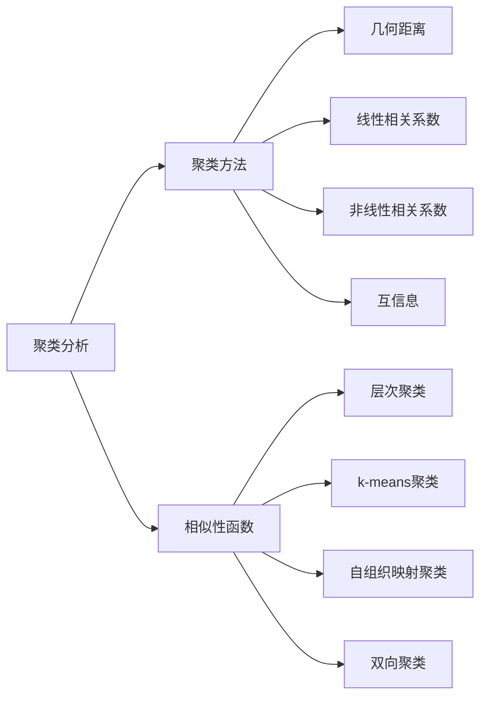
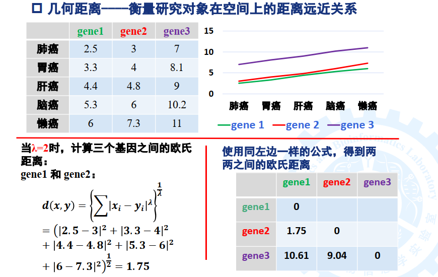

# 生物信息学

去年有几章（不写）：

- 绪论
- 序列比对
- BLAST
- 分子进化分析（可以写）
- 表达分析
- 遗传分析
- 新一代测序技术

要补几章：

- 聚类、分类分析
- 生物分子网络和通路

但是今年没讲的包括

- 生信与统计

这个就还是用中文写吧，已经翻译麻了，我太菜了。而且生信还要敲公式。

# 聚类和分类分析

## 聚类分析

### 距离（相似性）尺度函数

#### 几何距离

对于向量$\boldsymbol{x}, \boldsymbol{y}$，其闵可夫斯基距离（Minkowski distance）定义为
$$
d(\boldsymbol{x}, \boldsymbol{y})=\left[\sum_i\left(x_i-y_i\right)^\lambda\right]^{\dfrac{1}{\lambda}}
$$
Specifically,
$$
d(\boldsymbol{x}, \boldsymbol{y})=
\begin{cases}
\sum\limits_i |x_i-y_i| & \lambda=1 & \text{ Manhattan distance}\\
\sqrt{\sum\limits_i\left(x_i-y_i\right)^2} & \lambda=2 & \text{ Eucildian distance}\\
\max |x_i-y_i| & \lambda=\infty & \text{ Chebyshev distance}
\end{cases}
$$
例子

### 聚类方法

## 分类分析

# 生物分子网络和通路

