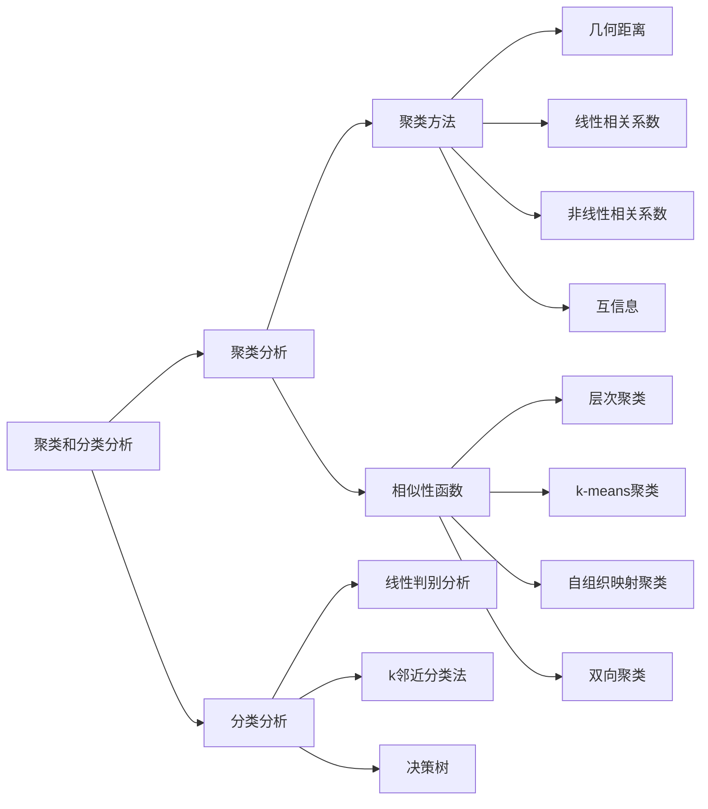
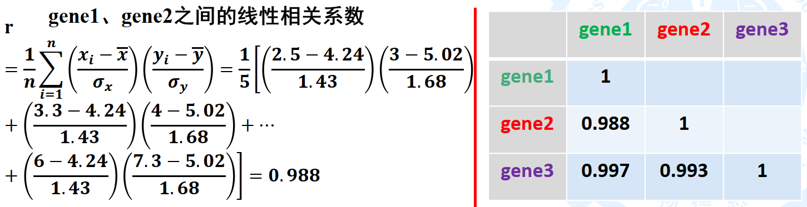
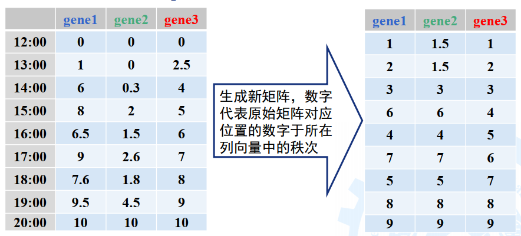
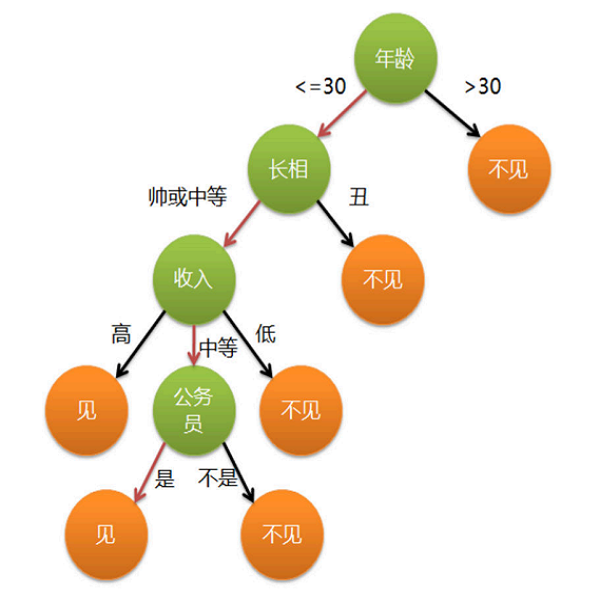

# 生物信息学

去年有几章（不写）：

- 绪论
- 序列比对
- BLAST
- 分子进化分析（可以写）
- 表达分析
- 遗传分析
- 新一代测序技术

要补几章：

- 聚类、分类分析
- 生物分子网络和通路

但是今年没讲的包括

- 生信与统计

这个就还是用中文写吧，免疫已经翻译麻了，我太菜了。而且生信还要敲公式。

如果从我校课程角度来看，这些讲得都不算深，杨老师的目的就是让每个人都懂基本的算法，非常多实例来辅助，过程讲解很具体。所以考试其实就是要知道所有这些算法的基本过程就行了，不必搞太高深的东西。其实学这个就是体会一下思想嘛。

资源分享：

- [哈佛生信课程，啥都有](https://www.youtube.com/playlist?list=PLeB-Dlq-v6taAXK6ZCGfqImrNWJzFt3p3)

# 聚类和分类分析

聚类分析是无监督学习，分类分析是监督学习。用的方法当然不同。

mind map

## 聚类分析

### 距离（相似性）尺度函数

#### 几何距离

对于向量$\boldsymbol{x}, \boldsymbol{y}$，其闵可夫斯基距离（Minkowski distance，明氏距离）定义为
$$
d(\boldsymbol{x}, \boldsymbol{y})=\left[\sum_i\left(x_i-y_i\right)^\lambda\right]^{\dfrac{1}{\lambda}}
$$
Specifically,
$$
d(\boldsymbol{x}, \boldsymbol{y})=
\begin{cases}
\sum\limits_i |x_i-y_i| & \lambda=1 & \text{ Manhattan distance 曼氏距离}\\
\sqrt{\sum\limits_i\left(x_i-y_i\right)^2} & \lambda=2 & \text{ Eucildian distance 欧式距离}\\
\max |x_i-y_i| & \lambda=\infty & \text{ Chebyshev distance 切氏距离}
\end{cases}
$$
几何距离的缺陷：两个基因的表达量可能尺度不同，但变化趋势可能相同，就无法反映。

#### 线性相关系数

也称Pearson相关系数，衡量表达模式的相似性
$$
r=\dfrac{1}{n}\sum_{i=1}^{n}\left(\dfrac{x-\overline{x}}{\sigma_x}\right)\left(\dfrac{y-\overline{y}}{\sigma_y}\right)
$$

例子：几个基因在不同癌症中的表达

#### 非线性相关系数

也称Spearman秩相关系数
$$
r=1-\dfrac{6\sum d^2}{n(n^2-1)}
$$
where

- $d$ is the difference of ranks
- $n$ is # of time points

> 一个应用场景：描述几个基因表达量随时间的变化，选取一些离散的时间点

$d$ 到底是啥？先将基因表达量转换成其在所有表达量中的排名。如果并列则取平均值。

两个基因同一位置rank的差值就是 $d$

#### 互信息

可以反映一些非单调的相关关系，如先正相关后负相关。具体略。

总结：不同距离函数的计算结果有差别，实际使用中根据情境

### 聚类方法

现在有一堆向量，我们如何分类呢？

#### 层次聚类

hierarchical clustering

##### 步骤

1. 计算所有样本两两间的距离（可表示为矩阵）

   

2. 合并距离最近的两个样本为一个节点

   

3. 更新距离矩阵

   > 合并的节点之间怎么算距离？比如：
   >
   > - 两组间节点所有的两两组合中的最小or最大or平均距离
   > - 先计算两组的“质心”（平均所有节点），求质心的距离

4. 合并距离最近的两个，重复直到只有一个节点

5. 根据需要的类别数 $k$，在 $k$ 个树枝处切断，就得到 $k$ 个类

##### 应用

可以同时对变量（汽车品牌，基因名）和样本（各种参数，不同时间表达量）进行分类，将二维的数据组织成如上的热图，可以分析变量和样本的关系。

#### k-means聚类

##### 步骤

1. （随机）初始化 $k$ 个点的位置，作为聚类中心 $1,2,\dots,k$
2. 对每个样本，计算它到哪个中心点距离最近，就记为第 $i$ 类
3. 对于所有第 $i$ 类的样本点，计算其平均值，作为该类新的中心
4. 重复2,3步，直到所有样本点的类别不变，即收敛

##### 特点

1. 本质是个优化问题，目标是最小化类内部点间的距离和

2. 分类结果依赖于初始点，可以多次试验、随机选取，比较结果，得出比较可信的结论

   > 优化：尽量分散；选取样本点作为初始中心……

3. $k$ 必须事先指定，但可以通过比较不同 $k$ 之下算法的收敛速度、结果合理性来辅助选择合适的 $k$ 

#### 总结

| 算法           | 层次聚类 | k-means聚类  |
| -------------- | -------- | ------------ |
| 方式           | 自底向上 | 自顶向下     |
| 预先设定种类数 | 不用     | 需要         |
| 分类结构       | 可以嵌套 | 分成啥就是啥 |

## 分类分析

首先记住，这里的训练数据是有标签的。

### 线性判别分析

即Fisher线性判别

核心思想：将样本降维到二维，使得类与类可以被一条直线分开

目标：降维后的向量 $y=w^*x+b$ ，优化 $w^*$ 使得：1）类与类的均值差异最大；2）各类内的方差最小。

感兴趣的同学可以参考：https://zhuanlan.zhihu.com/p/61498028

### k邻近分类法

给定一个新样本$x$，找出与之距离最近的 $k$ 个样本，其中属于哪一类最多，就将 $x$ 归为哪一类。

感兴趣的同学可以参考：https://zhuanlan.zhihu.com/p/25994179

### 决策树

#### 分割准则

## 分类模型的分类效能评价  

# 生物分子网络和通路

