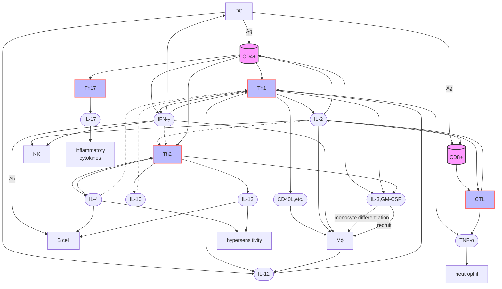
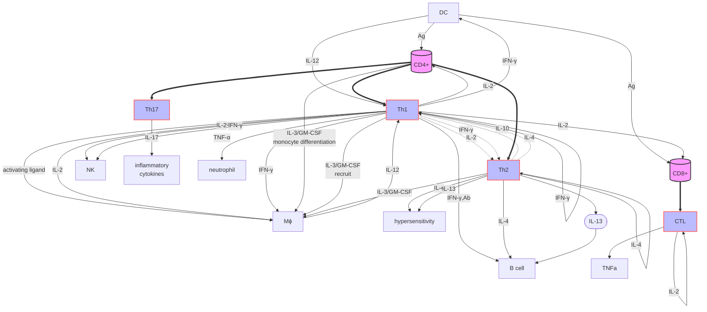
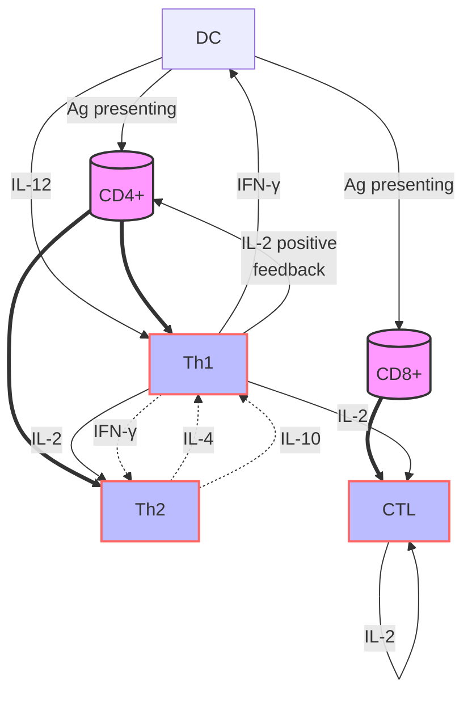
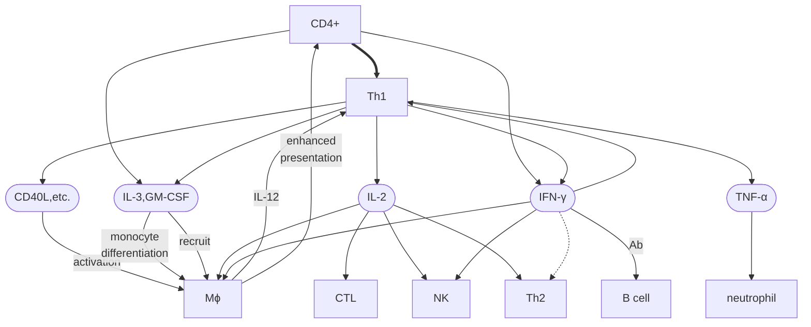
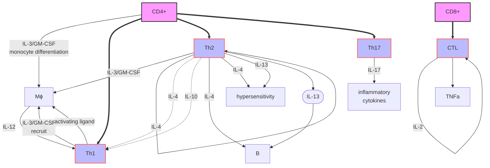

# draft

不要看这个图，看下一个

> 箭头指向谁，就是促进其增殖、活性，指向Th1这种就是原始细胞分化成它。虚线是抑制！！
>
> 太丑了，可以看源码。。真的就没法对细胞因子和细胞分个类，放容器里面嘛。。

> IL-2 ：刺激Tc、 Th分化，增强NK、 MФ活性、诱导LAK和TIL的抗瘤活性。
> IFN-γ：促进MHCⅡ/Ⅰ表达、活化MФ功能、 NK杀瘤和抗病毒。
> TNF-β：炎症作用、杀伤靶细胞、抗病毒（LT）、激活中性粒、 MФ。  
>
> GM-CSF、 MCF  

a simple version with only cells

> 粗线：分化为；细线：促进

#### Relationship between cells

- DC is the initial activator, IL-12 to induce Th1
- Th1 positive feedback, strengthen DC and itself
- Th1 and Th2, both from Th0, inhibiting each other?
- CTL is activated by IL-2 (self, Th1)

#### Th1 downstream

- activate each other with macrophage

