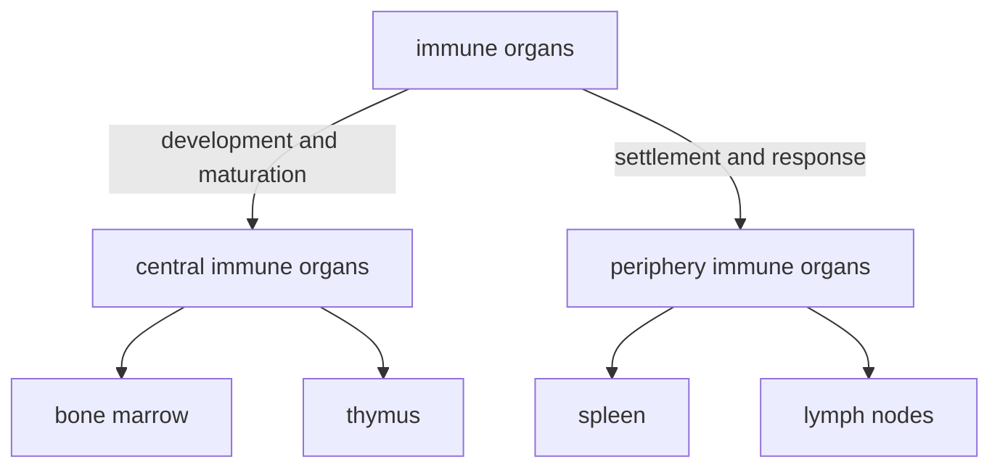

# Molecular Immunology notes

Due to the absence of appropriate English online courses that match our course's syllabus, I have to write a note on my own. All the content is based on the newest slides and Chinese textbook. I wound not try to write everything in English, because the nouns must be 太难顶了... (I'm reading Chinese materials!)

The quoted areas are less-important comments, or end-of-chapter questions.

# Chapter 1 Introduction 绪论

## History

- 天花病毒，种痘，保留毒株
- milestones...poco
  - Louis Pasteur made the first vaccines
  - discovery of blood types (lectins)
  - discovery of MHC
- modern immunology since 1970s
  - molecular level
  - immunological methods
  - safe/dangerous signals
  - therapies

## Basic functions

1. immune defense (**免疫防御**): get rid of foreign pathogens and tissues
2. immune surveillance (**免疫监视**): eliminate abnormal/non-self cells, like tumor cells
3. immune homostasis (**免疫自稳**): eliminate aging/dead cells, 维持内环境稳定

## Operation

分为两部分

- 固有免疫（innate immune）：与生俱来的，第一道防线，高等和低等生物都有

  - 组成：免疫屏障，固有免疫细胞，免疫分子
  - 特点：无特异性，无记忆性

- 特异性免疫（adaptive immune）：高等生物通过接触病原体建立起来的，针对病原体的免疫防御能力

  - 组成

    |          | 谁来介导 | 谁发挥效应            |
    | -------- | -------- | --------------------- |
    | 体液免疫 | B cell   | antibody              |
    | 细胞免疫 | T cell   | activated lymphocytes |

  - 特点：有特异性和记忆性，作用强大而持久

## good or bad?

- good 
  - defend pathogens, eliminate cancer cells, clear aging/dead cells
- bad
  - too weak: cannot do above, continuous infection
  - too strong
    - allergy
    - auto-immunity (自身免疫)
    - related tissue damage (组织损伤)
    - transplant rejection (移植排斥)

# Chapter 2 Basics and Trends 免疫学基础和发展趋势

## Basic problem: how we respond to danger

### Reserach

- Development, differentiation of immune cells and regulation
- recognition mechanism, processes of immune response
- interplay with other systems, relationship with various diseases

### Applications

- diagonsis, treatment, prevention of diseases
- biotechnology, etc

## Clone selection theory

- Every immune cell expresses a receptor for a single antigen. Our body creates a library of immune cells, i.e. receptors recognizing all antigens.
- When an antigen binds to its specific receptor, that cell is activated to proliferate itself. All daughter cells expressing the same receptor are called a clone.
- If the receptor binds to its antigen during development of cells, the clone is aborted, which makes immune tolerance.

## Components

### Central (primary) immune organs

- 骨髓：含造血干细胞，是所有血细胞的来源
  - 为发育提供了环境：生长因子、基质细胞等
  - 分为粒系/髓系（myeliod）和淋巴系（lymphatic）
- 胸腺：T细胞分化发育的场所。成年后退化

### Periphery (secondary) immune organs

- 外周免疫器官：脾脏、淋巴结
- 外周免疫组织：黏膜淋巴组织、阑尾、扁桃体
- 其他组织中的免疫细胞

#### spleen

- 最大的免疫器官

- 淋巴细胞定居、发挥功能的场所

  > 红髓：巨噬细胞；白髓：T细胞

  > 其他功能：调节血量、过滤血液

#### lymphatic system

##### structure and function

- 淋巴结由淋巴管相连，构成遍布全身的网络
- 沿血管分布，有深有浅，是免疫系统的“哨所”
  - 淋巴液和血浆成分相似，可能交换
- 淋巴细胞定居、发挥免疫应答的场所

具体结构

- 两套循环：淋巴循环和血液循环
- 两个区域
  - 浅层：B细胞
    - 浅皮质区：初级滤泡，无免疫应答
    - 深皮质区：次级滤泡，发生免疫应答时产生生发中心
  - 深层：T细胞

##### lymphocyte homing and recirculation

- 淋巴细胞归巢：某些亚群的淋巴细胞迁移或定居在某些特定区域

  淋巴细胞上的归巢受体和血管内皮细胞上的地址素结合，诱导淋巴细胞穿过血管壁

- 淋巴细胞再循环：在两套系统间往复循环的过程

  - 在淋巴管中汇集，经胸导管进入血液
  - 在淋巴结中穿入、穿出血管内皮

- 意义：有利于免疫细胞的更新（增殖），调整淋巴细胞在全身的分布，便于在病原体入侵时动员

> questions
>
> - 你知道白血病和淋巴瘤的区别吗？  
> - 胸腺退化是否会引起免疫功能低下？  
> - position of these organs?
>
> 思考与小结
> - 克隆选择学说的要点是什么？
> - 免疫系统的基本功能是什么？
> - 免疫系统是怎样工作的？
> - 免疫系统是怎样构成的？
> - 什么是淋巴细胞归巢与再循环？  

# Chapter 3 Antigen 抗原

## Characteristics

Antigen is substances that can 

- induce the generation of antibody, sensitized lymphocytes (致敏淋巴细胞).
- be recognized by the immune system and eliciting immune response.

### Concepts

- immunogenicity (免疫原性): the ability to induce immnue response
- antigenicity (抗原性): the ability to specifically combine with the final products of a immune response (i.e. antibodies or receptors on sensitized immune cells)

Thus, antigens are categorized into

- hapten: only antigenicity, no immunogenicity
- complete antigen: both

Another thing is so-called "carrier effect": when a hapten is attached to a larger molecule (e.g. a protein), it can induce secondary, stronger immune response, if the animal has been primed with the same hapten conjugated to another carrier protein.

### Immunogenicity: influencing factors

#### antigen

##### foreigness

i.e. the difference between antigen and "self"

What is "self"? If a substance is came into contact <u>during embyronic period or the development of lymphocytes</u>, it is recogized as "self".

> e.g. antigens carried from mother, HIV etc.

categories:

- heterogenetic antigen: come from other species

  > food, microbes and their products, heterogenetic serum

- allogeneic antigen: other individuals

  > blood group antigen, transplant antigen, etc.

- autogeneic antigen: from yourself

  >tissue-specific antigen, denatured protein, etc.

##### chemical properties

- molecular weight

  - \> 10kD is better

- chemical structure

  - the more complex, the stronger immunogenecity is

  1. protein \> polysaccharides \> nucleic acid \> lipids
  2. more aromatic residues
  3. more complex 2nd/3rd structure

- physical properties

  - graunle > soluable

    > stays longer, harder to decompose

- epitope accessibility

  - on the surface → stronger

#### host

age, gender, genetic factor, healthy state

#### route of entry

皮内 > 皮下 > 肌肉 > 静脉 > 口腔

> 口服抗原易导致免疫耐受

## Specificity

The nature of antigen specificity is, the specificity of immune response.

> e.g. 抗间氨基苯磺酸的抗体和邻位、对位、其他酸的反应弱或没有

- an antigen only activates lymphoytes specific to recognize it
  - MHC, BCR or TCR resricted
- products of a immune response only reacts with that specific antigen

cross reaction (交叉反应): an antibody to a specific antigen can react with other antigens

> e.g. 种牛痘
>
> nature: similar epitope

### Epitope

表位或抗原决定簇 (antigen determinant): groups/structures that determines that specificity of antigens. 

Also, they are the basic unit to specifically recognize TCR/BCR/antibody.

| epitope                      | linear epitope 线性表位 | conformational epitope 构象表位 |
| ---------------------------- | ----------------------- | ------------------------------- |
| sequence                     | sequential              | separated                       |
| 3D structure                 | close                   | close                           |
| after denaturation/digestion | remains                 | distroyed                       |
| recognized by                | TCR, BCR                | mainly BCR                      |

构象表位：由氨基酸序列不连续，但在空间上相互接近、形成特定构象的几个氨基酸构成的表位。

| epitope              | T cell epitope | B cell epitope           |
| -------------------- | -------------- | ------------------------ |
| receptor             | TCR            | BCR                      |
| MHC involved?        |                |                          |
| antigen presentation | needed         | no need                  |
| composed of          |                |                          |
| size                 |                |                          |
| type                 | linear         | linear or conformational |

## Categories

### Dependence on T cell

Thymus-independent/dependent antigen

- TI-Ag
- TD-Ag

| antigen          | TI-Ag | TD-Ag |
| ---------------- | ----- | ----- |
| comprised of     |       |       |
| T cell dependent |       |       |
| type of response |       |       |
| antibody type    |       |       |
| memory?          |       |       |

### Relationship (亲缘关系)

### Presenting

### Other non-antigenic stimulator

> 思考与小结
> 1. 抗原的免疫原性和反应原性（抗原性）及其关系
> 2. 决定免疫原性的因素
> 3. 载体效应，交叉反应
> 4. 表位及表位的分类，表位与抗原的关系
> 5. 常见的抗原的分类方法
> 6. 什么是超抗原  

# Chapter 4 Immunoglobin 免疫球蛋白

## Structure

## Diversity and Immunogenecity

## Interaction with Ag

## Effects after Ag binding

## Characteristics of several types of Ab

## Preparation
