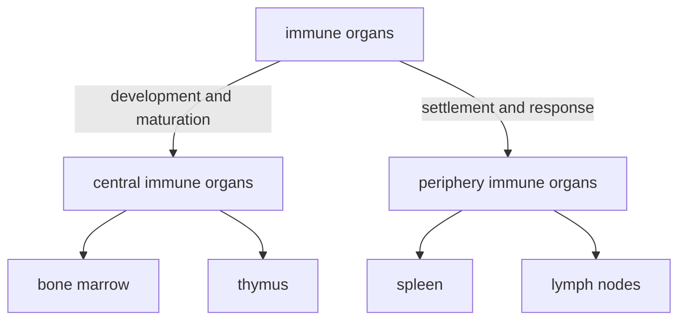
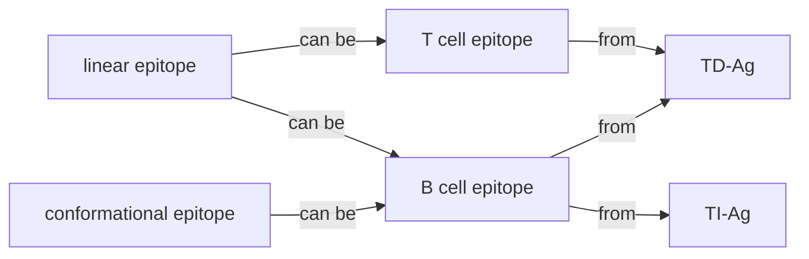

# Molecular Immunology notes

Due to the absence of appropriate English online courses that match our course's syllabus, I have to write a note on my own. All the content is based on the newest slides and Chinese textbook. I wound not try to write everything in English, because the nouns must be 太难顶了... (I'm reading Chinese materials!) For important terms in English, I have to remark them in Chinese.

The quoted areas are less-important comments, or end-of-chapter questions.

# Chapter 1 Introduction 绪论

## History

- 天花病毒，种痘，保留毒株
- milestones...poco
  - Louis Pasteur made the first vaccines
  - discovery of blood types (lectins)
  - discovery of MHC
- modern immunology since 1970s
  - molecular level
  - immunological methods
  - safe/dangerous signals
  - therapies

## Basic functions

1. immune defense (**免疫防御**): get rid of foreign pathogens and tissues
2. immune surveillance (**免疫监视**): eliminate abnormal/non-self cells, like tumor cells
3. immune homostasis (**免疫自稳**): eliminate aging/dead cells, 维持内环境稳定

## Operation

分为两部分

- 固有免疫（innate immune）：与生俱来的，第一道防线，高等和低等生物都有

  - 组成：免疫屏障，固有免疫细胞，免疫分子
  - 特点：无特异性，无记忆性

- 特异性免疫（adaptive immune）：高等生物通过接触病原体建立起来的，针对病原体的免疫防御能力

  - 组成

    |          | 谁来介导 | 谁发挥效应            |
    | -------- | -------- | --------------------- |
    | 体液免疫 | B cell   | antibody              |
    | 细胞免疫 | T cell   | activated lymphocytes |

  - 特点：有特异性和记忆性，作用强大而持久

## good or bad?

- good 
  - defend pathogens, eliminate cancer cells, clear aging/dead cells
- bad
  - too weak: cannot do above, continuous infection
  - too strong
    - allergy
    - auto-immunity (自身免疫)
    - related tissue damage (组织损伤)
    - transplant rejection (移植排斥)

# Chapter 2 Basics and Trends 免疫学基础和发展趋势

## Basic problem: how we respond to danger

### Reserach

- Development, differentiation of immune cells and regulation
- recognition mechanism, processes of immune response
- interplay with other systems, relationship with various diseases

### Applications

- diagonsis, treatment, prevention of diseases
- biotechnology, etc

## Clone selection theory

- Every immune cell expresses a receptor for a single antigen. Our body creates a library of immune cells, i.e. receptors recognizing all antigens.
- When an antigen binds to its specific receptor, that cell is activated to proliferate itself. All daughter cells expressing the same receptor are called a clone.
- If the receptor binds to its antigen during development of cells, the clone is aborted, which makes immune tolerance.

## Components

### Central (primary) immune organs

- 骨髓：含造血干细胞，是所有血细胞的来源
  - 为发育提供了环境：生长因子、基质细胞等
  - 分为粒系/髓系（myeliod）和淋巴系（lymphatic）
- 胸腺：T细胞分化发育的场所。成年后退化

### Periphery (secondary) immune organs

- 外周免疫器官：脾脏、淋巴结
- 外周免疫组织：黏膜淋巴组织、阑尾、扁桃体
- 其他组织中的免疫细胞

#### spleen

- 最大的免疫器官
- 淋巴细胞定居、发挥功能的场所

> 红髓：巨噬细胞；白髓：T细胞
>
> 其他功能：调节血量、过滤血液

#### lymphatic system

##### structure and function

- 淋巴结由淋巴管相连，构成遍布全身的网络
- 沿血管分布，有深有浅，是免疫系统的“哨所”
  - 淋巴液和血浆成分相似，可能交换
- 淋巴细胞定居、发挥免疫应答的场所

具体结构

- 两套循环：淋巴循环和血液循环
- 两个区域
  - 浅层：B细胞
    - 浅皮质区：初级滤泡，无免疫应答
    - 深皮质区：次级滤泡，发生免疫应答时产生生发中心
  - 深层：T细胞

##### lymphocyte homing and recirculation

- 淋巴细胞归巢：某些亚群的淋巴细胞迁移或定居在某些特定区域

  淋巴细胞上的归巢受体和血管内皮细胞上的地址素结合，诱导淋巴细胞穿过血管壁

- 淋巴细胞再循环：在两套系统间往复循环的过程

  - 在淋巴管中汇集，经胸导管进入血液
  - 在淋巴结中穿入、穿出血管内皮

- 意义：有利于免疫细胞的更新（增殖），调整淋巴细胞在全身的分布，便于在病原体入侵时动员

> questions
>
> - 你知道白血病和淋巴瘤的区别吗？  
> - 胸腺退化是否会引起免疫功能低下？  
> - position of these organs?
>
> 思考与小结
> - 克隆选择学说的要点是什么？
> - 免疫系统的基本功能是什么？
> - 免疫系统是怎样工作的？
> - 免疫系统是怎样构成的？
> - 什么是淋巴细胞归巢与再循环？  

# Chapter 3 Antigen 抗原

## Characteristics

Antigen is substances that can 

- induce the generation of antibody, sensitized lymphocytes (致敏淋巴细胞).
- be recognized by the immune system and eliciting immune response.

### Concepts

Corresponding to the above two points,

- antigenicity (抗原性): the ability to specifically combine with the final products of a immune response (i.e. antibodies or receptors on sensitized immune cells)
- immunogenicity (免疫原性): the ability to induce immnue response

Thus, antigens are categorized into

- hapten: only antigenicity, no immunogenicity
- complete antigen: both

Another thing is so-called "carrier effect": when a hapten is attached to a larger molecule (e.g. a protein), it can induce secondary, stronger immune response, if the animal has been primed with the same hapten conjugated to another carrier protein.

### Immunogenicity: influencing factors

#### antigen

##### foreigness (异物性)

i.e. the difference between antigen and "self"

What is "self"? If a substance is came into contact <u>during embyronic period or the development of lymphocytes</u>, it is recogized as "self".

> e.g. antigens carried from mother, HIV etc.

categories:

- heterogenetic (异种) antigen: come from other species

  > food, microbes and their products, heterogenetic serum

- allogeneic (同种异体) antigen: other individuals

  > blood group antigen, transplant antigen, etc.

- autogeneic (自体) antigen: from yourself

  >tissue-specific antigen, denatured protein, etc.

##### chemical properties

- molecular weight

  - \> 10kD is better

- chemical structure

  - the more complex, the stronger immunogenecity is

  1. protein \> polysaccharides \> nucleic acid \> lipids
  2. more aromatic residues
  3. more complex 2nd/3rd structure

- physical properties

  - graunle > soluable

    > stays longer, harder to decompose

- epitope accessibility

  - on the surface → stronger

#### host

age, gender, genetic factor, healthy state

#### route of entry

皮内 > 皮下 > 肌肉 > 静脉 > 口腔

> 口服抗原易导致免疫耐受

## Specificity

The nature of antigen specificity is, the specificity of immune response.

> e.g. 抗间氨基苯磺酸的抗体和邻位、对位、其他酸的反应弱或没有

- an antigen only activates lymphoytes specific to recognize it
  - MHC, BCR or TCR resricted
- products of a immune response only reacts with that specific antigen

cross reaction (交叉反应): an antibody to a specific antigen can react with other antigens

> e.g. 种牛痘
>
> nature: similar epitope

### Epitope

表位或抗原决定簇 (antigen determinant): groups/structures that determines that specificity of antigens. 

Also, they are the basic unit to specifically recognize TCR/BCR/antibody.

| epitope                      | linear epitope 线性表位 | conformational epitope 构象表位 |
| ---------------------------- | ----------------------- | ------------------------------- |
| sequence                     | sequential              | separated                       |
| 3D structure                 | close                   | close                           |
| after denaturation/digestion | remains                 | distroyed                       |
| recognized by                | TCR, BCR                | mainly BCR                      |

构象表位：由氨基酸序列不连续，但在空间上相互接近、形成特定构象的几个氨基酸构成的表位。

| epitope              | T cell epitope                                      | B cell epitope                                               |
| -------------------- | --------------------------------------------------- | ------------------------------------------------------------ |
| receptor             | TCR                                                 | BCR                                                          |
| MHC involved?        | yes                                                 | no                                                           |
| antigen presentation | needed                                              | no need                                                      |
| composed of          | linear short peptide                                | natural polypeptide (lipo)polysaccharide organic compounds |
| size                 | CD8^+^ T cell: 5~12 AA CD4^+^ T cell: 12~17 AA | 5~15 AA or 5~7  oligosaccharide or nt                   |
| type                 | linear                                              | linear or conformational                                     |
| position             | any                                                 | surface                                                      |

> natural: part of a macromolecule?

## Categories

### Dependence on Th cell

Thymus-independent/dependent antigen

- TI-Ag 胸腺非依赖性抗原
- TD-Ag 胸腺依赖性抗原, most antigen. 
  - Th cell activates B cell

| antigen          | TD-Ag                         | TI-Ag                  |
| ---------------- | ----------------------------- | ---------------------- |
| T cell dependent | yes                           | no                     |
| chemical nature  | most protein Ag               | most polysaccharide Ag |
| type of epitope  | B/TCR epitope                 | BCR epitope            |
| type of response | humoral/cell-mediated         | humoral immune         |
| type of antibody | various, mainly IgG, less IgM | IgM                    |
| memory?          | yes                           | no                     |

relationship

### Relationship (亲缘关系)

- heterophilic (异嗜性) antigen
  - common antigen between human and other species
  - when pathogen enters, the immune response causes autoimmunity
- xenogenic (异种) antigen
  - from other species, not common
- allogenic (同种异体) antigen
- autoantigen (自身抗原)

### Presenting

Whether it is synthesized inside APC

- yes: endogeneous (内源性) antigen.

  > viral/tumor Ag

- no: exogeneous (外源性) antigen.

  > bacteria, animal serum

### Other non-antigenic immune stimulator

> general understanding

#### super antigen 

超抗原, low conc of which can stimulate T cells

> - endogenous: viral protein
> - exogenous: bacterial exotoxin (secreted protein)

#### adjuvant

佐剂, non-specific substances which are added together with antigen in vaccines, to enhace or change the type of immune response.

> 卡介苗, $\ce{Al(OH)3}$, artificial, Freundadjuvant

#### mitogen

丝裂原, which binds to their receptor and stimulates cell growth

> ### epitope mapping
>
> 表位的确定。To determine the action targets, to make vaccines
>
> Build a overlapping library and screen with the antibody

> key points
>
> - T cell need degradation (presenting), TCR indirectly recognize
> - BCR directly recognize, both linear (no degradation) or conf (degradation) are ok
>
> 思考与小结
>
> 1. 抗原的免疫原性和反应原性（抗原性）及其关系
> 2. 决定免疫原性的因素
> 3. 载体效应，交叉反应
> 4. 表位及表位的分类，表位与抗原的关系
> 5. 常见的抗原的分类方法
> 6. 什么是超抗原  

# Chapter 4 Immunoglobin 免疫球蛋白

Molecules with antibody-like activity.

Immunoglobulin super family (IgSF, 免疫球蛋白超家族): proteins including Ig-like domains

-  MHC, BCR, TCR, CD4, CD8, ....

## Structure

### Chains

- A Y-shape molecule. N terminal at the top.

- Two identical heavy chains (connected by S-S bond) and light chains, between which is a S-S bond

- heavy chain: 50kD, five isotypes (同种型): IgA/G/E/M/D ~ α/γ/ε/μ/δ chain

  light chain: 25kD, two types, κ/λ

### Domains

#### structure

|                 | Heavy chain       | Light chain   |
| --------------- | ----------------- | ------------- |
| Constant region | sky blue, CH1/2/3 | orange, CL    |
| Variable region | blue, VH          | tangerine, VL |

hinge: flexible, between CH1 and CH2. not in IgM/E

#### function

- VH/VL: antigen binding
  - contains hypervariable region (高变区) or complement-determining region (互补决定区), other region is called framework region
- CH1 and CL: allogenic marker (同种异型标志)
- CH2: complement binding site for IgG
- CH3: membrane receptor binding; cross 胎盘 for IgG; complement binding site for IgM
- CH4 is exclusive in IgM/E, following CH3

### Enzymolysis

> papain: 木瓜蛋白酶; pepsin: 胃蛋白酶

### Other components

- joining chain (J片): peptide at C-ter, joining secretary IgA dimer or IgM pentamer
- secretary IgA also need a glycopeptide, secretary piece (分泌片)

> 
>
> 

## Diversity and Immunogenecity

### Diversity

- Constant region
  - according to hinge AA and S-S bond, the five isotypes are classified into different subclasses (亚类)
- Variable region
  - λ type is classified into 4 subtypes (亚型)

They are encoded by independent genes and just freely combine...which makes diversity.

### Immunogenecity

Ab can also be an antigen. Three types of epitope:

- isotype: all C region.
  - Individuals in the same species have similar C region. If you inject monkey's Ab into a human, the C region could be an antigen.
- allotype: some residue variation in C region
  - There are gene variations between individuals inside a species too, which generates epitope in C region. A marker of individuals.
- idiotype: in V region (HVR)
  - Antibodies from the same individual have diverse V regions which may give rise to an epitope.
  - Anti-idiotype antibody as an alternative of the antigen to induce immune system.

## Interaction with Ag

- VH and VL all have 3 CDRs. In charge of binding. affinity
- VL gene is from recombinant V, D, J genes, while VH gene depends on subclasses

## Effects after Ag binding

### Neutralizing toxins and infection

> 参考：https://www.bilibili.com/video/BV1Gg411P7jS
>
> - 中和抗体只占人体产生抗体中的一小部分
> - 它们都能特异性结合病原体，但中和抗体可能结合入侵相关蛋白（如冠状病毒的S蛋白），或结合衣壳蛋白导致病毒核酸无法释放，直接阻止对人体的感染；非中和抗体可能结合其他位点，但无法阻止感染！
> - 非中和抗体有增强免疫的作用，与病毒结合后可以介导免疫细胞（如巨噬细胞）吞噬、清除病毒，杀敌于“国门之内”，在早期阶段发挥抗病毒作用。
> - 在中后期可能会导致免疫损伤，因为该抗体不能阻止病毒的侵染，所以病毒可能在吞噬它的细胞内部增殖、裂解之。这种途径使病毒能不依赖细胞表面受体而侵入原本无法入侵的细胞，称为抗体依赖增强作用（Antibody-dependent enhancement，ADE）

### Effect of C region

- activate complement system (see chapter 6 for details)

- bind Fc receptor on the cell surface
  - opsonization (调理作用): phagocytosis (吞噬作用) by macrophages and neutrophils through Fc binding to Fc receptor

    
  
    
  
  - enhance ADCC (antibody-dependent cell-mediated cytotoxicity) effect of NK cell, also through Fc
  
  - mediate type I hypersensitivity (超敏反应): mastocytes, basophils, IgE (see chapter 10?)
  
- 穿过胎盘（IgG）与黏膜（分泌型 IgA）  

## Characteristics of several classes of Ab

### Five classes

| classes | state    | localization                                   | basic function                                               |
| ------- | -------- | ---------------------------------------------- | ------------------------------------------------------------ |
| IgM     | pentamer | mainly in serum monomer on B cell surface | primary immune response strongest complement activation |
| IgG     | monomer  | in serum and body fluid                        | secondary immune response can also in milk, pass 胎盘   |
| IgA     | dimer    | mainly mucosa (黏膜) monomer in serum     | secreted into milk (乳汁)                                    |
| IgE     | monomer  | in serum, very little                          | may cause type I hypersensitivity                            |
| IgD     | monomer  | on B cell surface                              | marker of B cell maturation not so clear                |

| more info | subclasses | formation               | more on structure | infection | features                           |
| --------- | ---------- | ----------------------- | ----------------- | --------- | ---------------------------------- |
| IgM       | μ          | advanced embryo         | no hinge, CH4     | early     | blood type marker of 宫内感染 |
| IgG       | IgG1/2/3/4 | half a year after birth |                   | late      | long half life                     |

### Class switching (类别转换)

[reference](https://www.youtube.com/watch?v=Gvq48XrzMTY)

## Preparation