# Molecular Immunology notes

Due to the absence of appropriate English online courses that match our course's syllabus, I have to write a note on my own. All the content is based on the newest slides and Chinese textbook. I wound not try to write everything in English, because the nouns must be 太难顶了... (I'm reading Chinese materials!) For important terms in English, I have to remark them in Chinese.

The quoted areas are less-important comments, or end-of-chapter questions.

# Chapter 1 Introduction 绪论

## History

- 天花病毒，种痘，保留毒株
- milestones...poco
  - Louis Pasteur made the first vaccines
  - discovery of blood types (lectins)
  - discovery of MHC
- modern immunology since 1970s
  - molecular level
  - immunological methods
  - safe/dangerous signals
  - therapies

## Basic functions

1. immune defense (**免疫防御**): get rid of foreign pathogens and tissues
2. immune surveillance (**免疫监视**): eliminate abnormal/non-self cells, like tumor cells
3. immune homostasis (**免疫自稳**): eliminate aging/dead cells, 维持内环境稳定

## Operation

分为两部分

- 固有免疫（innate immune）：与生俱来的，第一道防线，高等和低等生物都有

  - 组成：免疫屏障，固有免疫细胞，免疫分子
  - 特点：无特异性，无记忆性

- 特异性免疫（adaptive immune）：高等生物通过接触病原体建立起来的，针对病原体的免疫防御能力

  - 组成

    |          | 谁来介导 | 谁发挥效应            |
    | -------- | -------- | --------------------- |
    | 体液免疫 | B cell   | antibody              |
    | 细胞免疫 | T cell   | activated lymphocytes |

  - 特点：有特异性和记忆性，作用强大而持久

## good or bad?

- good 
  - defend pathogens, eliminate cancer cells, clear aging/dead cells
- bad
  - too weak: cannot do above, continuous infection
  - too strong
    - allergy
    - auto-immunity (自身免疫)
    - related tissue damage (组织损伤)
    - transplant rejection (移植排斥)

# Chapter 2 Basics and Trends 免疫学基础和发展趋势

## Basic problem: how we respond to danger

### Reserach

- Development, differentiation of immune cells and regulation
- recognition mechanism, processes of immune response
- interplay with other systems, relationship with various diseases

### Applications

- diagonsis, treatment, prevention of diseases
- biotechnology, etc

## Clone selection theory

- Every immune cell expresses a receptor for a single antigen. Our body creates a library of immune cells, i.e. receptors recognizing all antigens.
- When an antigen binds to its specific receptor, that cell is activated to proliferate itself. All daughter cells expressing the same receptor are called a clone.
- If the receptor binds to its antigen during development of cells, the clone is aborted, which makes immune tolerance.

## Components

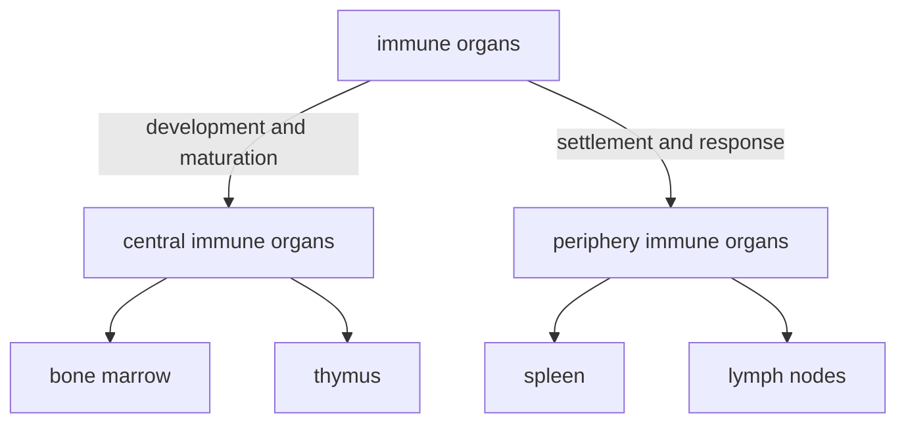

### Central (primary) immune organs

- 骨髓：含造血干细胞，是所有血细胞的来源
  - 为发育提供了环境：生长因子、基质细胞等
  - 分为粒系/髓系（myeliod）和淋巴系（lymphatic）
- 胸腺：T细胞分化发育的场所。成年后退化

### Periphery (secondary) immune organs

- 外周免疫器官：脾脏、淋巴结
- 外周免疫组织：黏膜淋巴组织、阑尾、扁桃体
- 其他组织中的免疫细胞

#### spleen

- 最大的免疫器官
- 淋巴细胞定居、发挥功能的场所

> 红髓：巨噬细胞；白髓：T细胞
>
> 其他功能：调节血量、过滤血液

#### lymphatic system

##### structure and function

- 淋巴结由淋巴管相连，构成遍布全身的网络
- 沿血管分布，有深有浅，是免疫系统的“哨所”
  - 淋巴液和血浆成分相似，可能交换
- 淋巴细胞定居、发挥免疫应答的场所

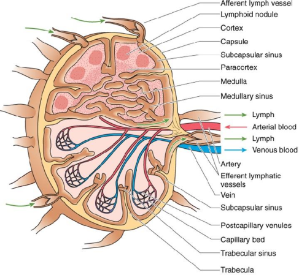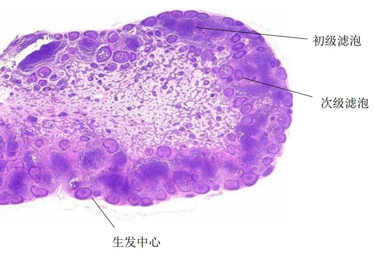

具体结构

- 两套循环：淋巴循环和血液循环
- 两个区域
  - 浅层：B细胞
    - 浅皮质区：初级滤泡，无免疫应答
    - 深皮质区：次级滤泡，发生免疫应答时产生生发中心
  - 深层：T细胞

##### lymphocyte homing and recirculation

- 淋巴细胞归巢：某些亚群的淋巴细胞迁移或定居在某些特定区域

  淋巴细胞上的归巢受体和血管内皮细胞上的地址素结合，诱导淋巴细胞穿过血管壁

- 淋巴细胞再循环：在两套系统间往复循环的过程

  - 在淋巴管中汇集，经胸导管进入血液
  - 在淋巴结中穿入、穿出血管内皮

- 意义：有利于免疫细胞的更新（增殖），调整淋巴细胞在全身的分布，便于在病原体入侵时动员

> questions
>
> - 你知道白血病和淋巴瘤的区别吗？  
> - 胸腺退化是否会引起免疫功能低下？  
> - position of these organs?
>
> 思考与小结
> - 克隆选择学说的要点是什么？
> - 免疫系统的基本功能是什么？
> - 免疫系统是怎样工作的？
> - 免疫系统是怎样构成的？
> - 什么是淋巴细胞归巢与再循环？  

# Chapter 3 Antigen 抗原

## Characteristics

Antigen is substances that can 

- induce the generation of antibody, sensitized lymphocytes (致敏淋巴细胞).
- be recognized by the immune system and eliciting immune response.

### Concepts

Corresponding to the above two points,

- antigenicity (抗原性): the ability to specifically combine with the final products of a immune response (i.e. antibodies or receptors on sensitized immune cells)
- immunogenicity (免疫原性): the ability to induce immnue response

Thus, antigens are categorized into

- hapten: only antigenicity, no immunogenicity
- complete antigen: both

Another thing is so-called "carrier effect": when a hapten is attached to a larger molecule (e.g. a protein), it can induce secondary, stronger immune response, if the animal has been primed with the same hapten conjugated to another carrier protein.

### Immunogenicity: influencing factors

#### antigen

##### foreigness (异物性)

i.e. the difference between antigen and "self"

What is "self"? If a substance is came into contact <u>during embyronic period or the development of lymphocytes</u>, it is recogized as "self".

> e.g. antigens carried from mother, HIV etc.

categories:

- heterogenetic (异种) antigen: come from other species

  > food, microbes and their products, heterogenetic serum

- allogeneic (同种异体) antigen: other individuals

  > blood group antigen, transplant antigen, etc.

- autogeneic (自体) antigen: from yourself

  >tissue-specific antigen, denatured protein, etc.

##### chemical properties

- molecular weight

  - \> 10kD is better

- chemical structure

  - the more complex, the stronger immunogenecity is

  1. protein \> polysaccharides \> nucleic acid \> lipids
  2. more aromatic residues
  3. more complex 2nd/3rd structure

- physical properties

  - graunle > soluable

    > stays longer, harder to decompose

- epitope accessibility

  - on the surface → stronger

#### host

age, gender, genetic factor, healthy state

#### route of entry

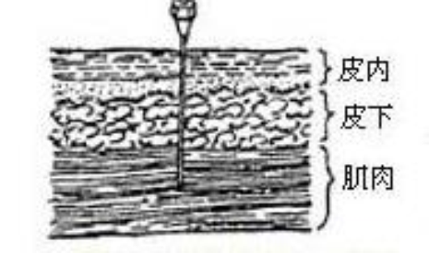

皮内 > 皮下 > 肌肉 > 静脉 > 口腔

> 口服抗原易导致免疫耐受

## Specificity

The nature of antigen specificity is, the specificity of immune response.

> e.g. 抗间氨基苯磺酸的抗体和邻位、对位、其他酸的反应弱或没有

- an antigen only activates lymphoytes specific to recognize it
  - MHC, BCR or TCR resricted
- products of a immune response only reacts with that specific antigen

cross reaction (交叉反应): an antibody to a specific antigen can react with other antigens

> e.g. 种牛痘
>
> nature: similar epitope

### Epitope

表位或抗原决定簇 (antigen determinant): groups/structures that determines that specificity of antigens. 

Also, they are the basic unit to specifically recognize TCR/BCR/antibody.

| epitope                      | linear epitope 线性表位 | conformational epitope 构象表位 |
| ---------------------------- | ----------------------- | ------------------------------- |
| sequence                     | sequential              | separated                       |
| 3D structure                 | close                   | close                           |
| after denaturation/digestion | remains                 | distroyed                       |
| recognized by                | TCR, BCR                | mainly BCR                      |

构象表位：由氨基酸序列不连续，但在空间上相互接近、形成特定构象的几个氨基酸构成的表位。

| epitope              | T cell epitope                                               | B cell epitope                                               |
| -------------------- | ------------------------------------------------------------ | ------------------------------------------------------------ |
| receptor             | TCR                                                          | BCR                                                          |
| MHC involved?        | yes                                                          | no                                                           |
| antigen presentation | needed                                                       | no need                                                      |
| composed of          | linear short peptide                                         | natural polypeptide (lipo)polysaccharide organic compounds |
| size                 | CD8+ T cell: 5\~12 AA CD4+ T cell: 12\~17 AA | 5\~15 AA or 5\~7  oligosaccharide or nt                   |
| type                 | linear                                                       | linear or conformational                                     |
| position             | any                                                          | surface                                                      |

> natural: part of a macromolecule?

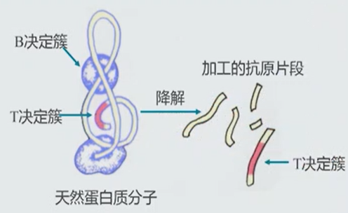

## Categories

### Dependence on Th cell

Thymus-independent/dependent antigen

- TI-Ag 胸腺非依赖性抗原
- TD-Ag 胸腺依赖性抗原, most antigen. 
  - Th cell activates B cell

| antigen          | TD-Ag                         | TI-Ag                  |
| ---------------- | ----------------------------- | ---------------------- |
| T cell dependent | yes                           | no                     |
| chemical nature  | most protein Ag               | most polysaccharide Ag |
| type of epitope  | B/TCR epitope                 | BCR epitope            |
| type of response | humoral/cell-mediated         | humoral immune         |
| type of antibody | various, mainly IgG, less IgM | IgM                    |
| memory?          | yes                           | no                     |

relationship

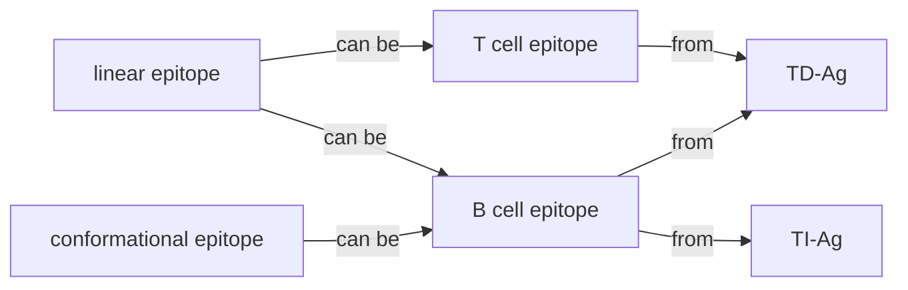

### Relationship (亲缘关系)

- heterophilic (异嗜性) antigen
  - common antigen between human and other species
  - when pathogen enters, the immune response causes autoimmunity
- xenogenic (异种) antigen
  - from other species, not common
- allogenic (同种异体) antigen
- autoantigen (自身抗原)

### Presenting

Whether it is synthesized inside APC

- yes: endogeneous (内源性) antigen.

  > viral/tumor Ag

- no: exogeneous (外源性) antigen.

  > bacteria, animal serum

### Other non-antigenic immune stimulator

> general understanding

#### super antigen 

超抗原, low conc of which can stimulate T cells

> - endogenous: viral protein
> - exogenous: bacterial exotoxin (secreted protein)

#### adjuvant

佐剂, non-specific substances which are added together with antigen in vaccines, to enhace or change the type of immune response.

> 卡介苗, $\text{Al(OH)}_3$, artificial, Freundadjuvant

#### mitogen

丝裂原, which binds to their receptor and stimulates cell growth

> ### epitope mapping
>
> 表位的确定。To determine the action targets, to make vaccines
>
> Build a overlapping library and screen with the antibody

> key points
>
> - T cell need degradation (presenting), TCR indirectly recognize
> - BCR directly recognize, both linear (no degradation) or conf (degradation) are ok
>
> 思考与小结
>
> 1. 抗原的免疫原性和反应原性（抗原性）及其关系
> 2. 决定免疫原性的因素
> 3. 载体效应，交叉反应
> 4. 表位及表位的分类，表位与抗原的关系
> 5. 常见的抗原的分类方法
> 6. 什么是超抗原  

# Chapter 4 Immunoglobin 免疫球蛋白

Molecules with antibody-like activity.

Immunoglobulin super family (IgSF, 免疫球蛋白超家族): proteins including Ig-like domains

-  MHC, BCR, TCR, CD4, CD8, ....

## Structure

### Chains

- A Y-shape molecule. N terminal at the top.

- Two identical heavy chains (connected by S-S bond) and light chains, between which is a S-S bond

- heavy chain: 50kD, five isotypes (同种型): IgA/G/E/M/D ~ α/γ/ε/μ/δ chain

  light chain: 25kD, two types, κ/λ

### Domains

#### structure

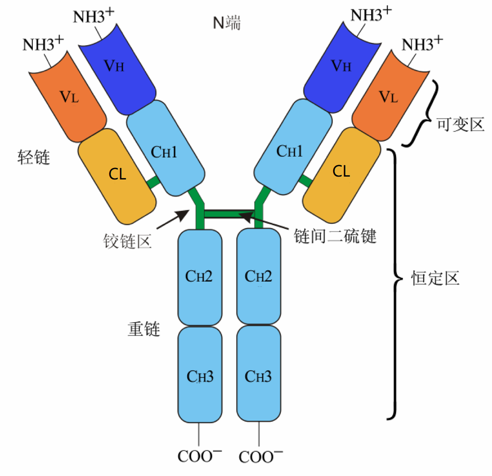

|                 | Heavy chain       | Light chain   |
| --------------- | ----------------- | ------------- |
| Constant region | sky blue, CH1/2/3 | orange, CL    |
| Variable region | blue, VH          | tangerine, VL |

hinge: flexible, between CH1 and CH2. not in IgM/E

#### function

- VH/VL: antigen binding
  - contains hypervariable region (高变区) or complement-determining region (互补决定区), other region is called framework region
- CH1 and CL: allogenic marker (同种异型标志)
- CH2: complement binding site for IgG
- CH3: membrane receptor binding; cross 胎盘 for IgG; complement binding site for IgM
- CH4 is exclusive in IgM/E, following CH3

### Enzymolysis

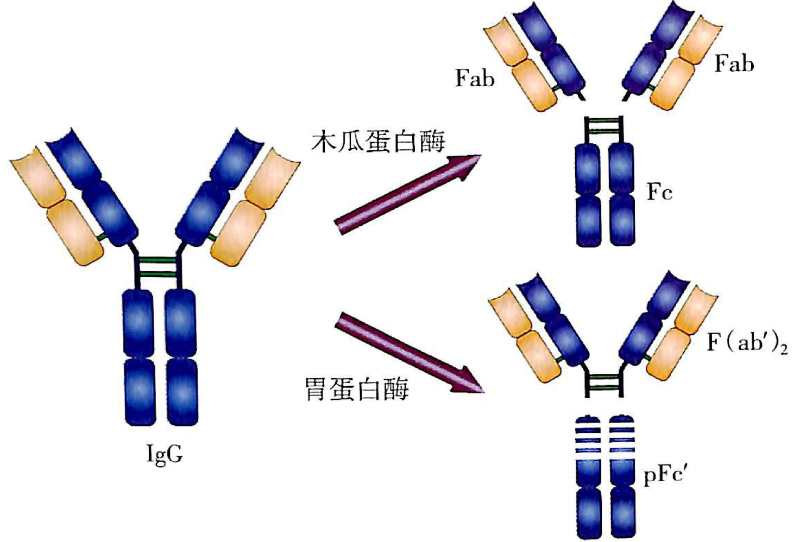

> papain: 木瓜蛋白酶; pepsin: 胃蛋白酶

### Other components

- joining chain (J片): peptide at C-ter, joining secretary IgA dimer or IgM pentamer
- secretary IgA also need a glycopeptide, secretary piece (分泌片)

> 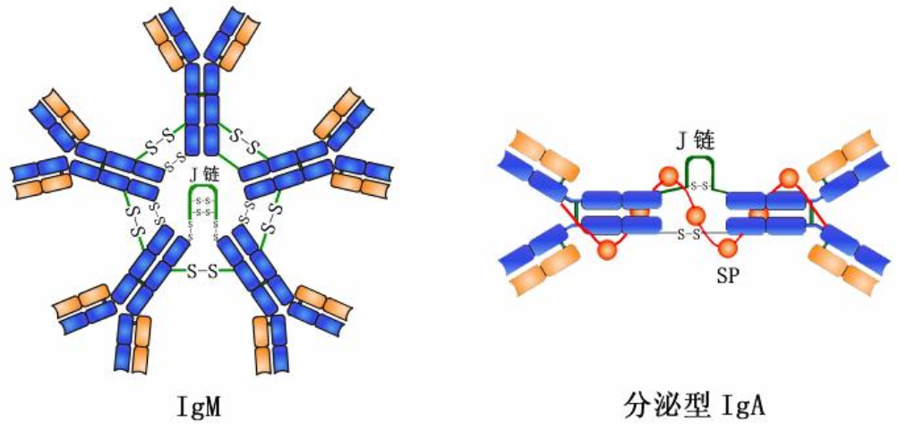
>
> 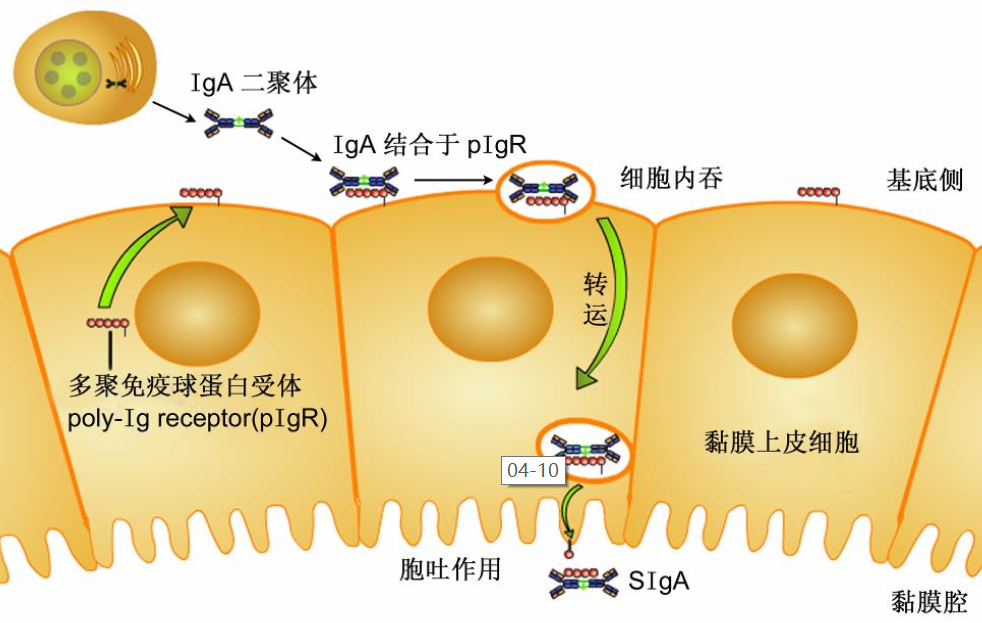

## Diversity and Immunogenecity

### Diversity

- Constant region
  - according to hinge AA and S-S bond, the five isotypes are classified into different subclasses (亚类)
- Variable region
  - λ type is classified into 4 subtypes (亚型)

They are encoded by independent genes and just freely combine...which makes diversity.

### Immunogenecity

Ab can also be an antigen. Three types of epitope:

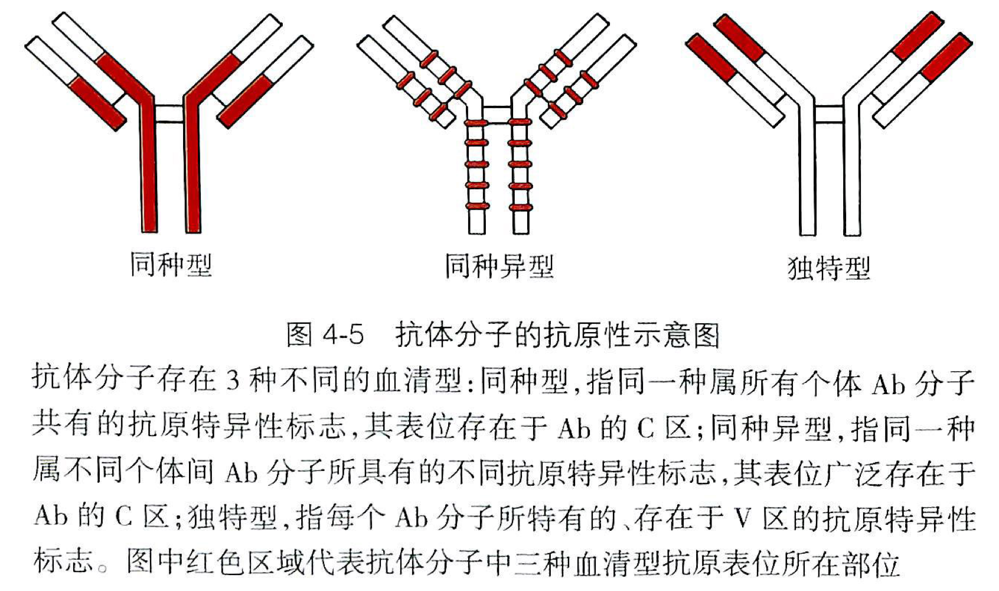

- isotype: all C region.
  - Individuals in the same species have similar C region. If you inject monkey's Ab into a human, the C region could be an antigen.
- allotype: some residue variation in C region
  - There are gene variations between individuals inside a species too, which generates epitope in C region. A marker of individuals.
- idiotype: in V region (HVR)
  - Antibodies from the same individual have diverse V regions which may give rise to an epitope.
  - Anti-idiotype antibody as an alternative of the antigen to induce immune system.

## Interaction with Ag

- VH and VL all have 3 CDRs. In charge of binding. affinity
- VL gene is from recombinant V, D, J genes, while VH gene depends on subclasses

## Effects after Ag binding

### Neutralizing toxins and infection

> 参考：https://www.bilibili.com/video/BV1Gg411P7jS
>
> - 中和抗体只占人体产生抗体中的一小部分
> - 它们都能特异性结合病原体，但中和抗体可能结合入侵相关蛋白（如冠状病毒的S蛋白），或结合衣壳蛋白导致病毒核酸无法释放，直接阻止对人体的感染；非中和抗体可能结合其他位点，但无法阻止感染！
> - 非中和抗体有增强免疫的作用，与病毒结合后可以介导免疫细胞（如巨噬细胞）吞噬、清除病毒，杀敌于“国门之内”，在早期阶段发挥抗病毒作用。
> - 在中后期可能会导致免疫损伤，因为该抗体不能阻止病毒的侵染，所以病毒可能在吞噬它的细胞内部增殖、裂解之。这种途径使病毒能不依赖细胞表面受体而侵入原本无法入侵的细胞，称为抗体依赖增强作用（Antibody-dependent enhancement，ADE）

### Effect of C region

- activate complement system (see chapter 6 for details)

- bind Fc receptor on the cell surface
  - opsonization (调理作用): phagocytosis (吞噬作用) by macrophages and neutrophils through Fc binding to Fc receptor

    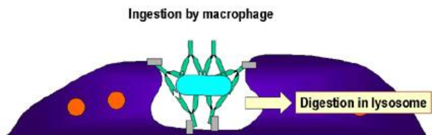
  
    
  
  - enhance ADCC (antibody-dependent cell-mediated cytotoxicity) effect of NK cell, also through Fc
  
  - mediate type I hypersensitivity (超敏反应): mastocytes, basophils (嗜碱性粒细胞), IgE 
  
    > see chapter 10
  
- 穿过胎盘（IgG）与黏膜（分泌型 IgA）  

## Characteristics of several classes of Ab

### Five classes

| classes | state    | localization                                   | major function                                               |
| ------- | -------- | ---------------------------------------------- | ------------------------------------------------------------ |
| IgM     | pentamer | mainly in serum monomer on B cell surface | primary immune response strongest complement activation |
| IgG     | monomer  | in serum and body fluid                        | secondary immune response can also in milk, pass 胎盘   |
| IgA     | dimer    | mainly mucosa (黏膜) monomer in serum     | defend in mucosa secreted into milk (乳汁)              |
| IgE     | monomer  | in serum, very little                          | may cause type I hypersensitivity                            |
| IgD     | monomer  | on B cell surface                              | marker of B cell maturation not so clear                |

| more info | subclasses | formation               | more on structure | infection | features                           |
| --------- | ---------- | ----------------------- | ----------------- | --------- | ---------------------------------- |
| IgM       | only one   | advanced embryo         | no hinge, CH4     | early     | blood type marker of 宫内感染 |
| IgG       | IgG1/2/3/4 | half a year after birth |                   | late      | long half life                     |

### Class switching (类别转换)

same V region, C region genes conversion along with stages of infection

at DNA level, irreversible, from IgM to G to ...

[reference](https://www.youtube.com/watch?v=Gvq48XrzMTY)

## Preparation

### Polyclonal Ab

- a mixture of antibodies targeting a variety of epitopes
  
  > clone: a cell cluster derived from lymphcytes targeting a single Ag
  
- production: immunize animals with antigen

- usage: urgent treatment

- drawback: low specificity, low production, may cause allergy

### Monoclonal Ab

- from a single clone, targeting one epitope

- flow of production

  - immunize mouse with Ag, isolate spleen cells
  - fuse them with myeloma cells (骨髓瘤细胞)
  - screen in HAT medium (for hybridoma cell 杂交瘤细胞)
  - identify the monoclonal Ab (for that desired Ab)
  - amplification

  > HAT medium:
  >
  > - 氨甲蝶呤：从头合成途径中二氢叶酸还原酶抑制剂
  > - 次黄嘌呤、胸腺嘧啶脱氧核苷：补救合成途径的原料
  >
  > 骨髓瘤细胞的HGPRT（补救合成的一个酶）缺陷，只有和淋巴细胞融合后才能生存
  >
  > B细胞只能在体外生存不超过一周

- features

  - high specificity, titer (效价), purity, mass production (大规模生产)
  - murine, hinders clinical applications

  > 效价是指某一物质引起生物反应、达到一定效果所需的剂量

- applications

  - protein detection/purification, cell isolation
  - hormone/tumor Ag/pathogen detection, therapy

### Genetically engineered Ab

- also known as recombinant Ab: antibodies whose genes are cut, spliced, modified, and transfected into and expressed in appropriate recipient cells.

  通过基因工程技术对抗体各链基因的剪切、拼接、修饰，并转入适当的受体细胞中从而生产出的抗体

  - modification: reserve Ag binding domain; simplify non-binding domain
  - goal: humanize, miniaturization (小型化), multi-functionalized. keep specificity and affinity!

- types
  - humanized Ab

    - chimeric Ab (嵌合抗体): murine V region+human C region
    - reshaped Ab (改型抗体): murine CDR+human rest part
    - transgenic mouse: replace with human Ig genes, completely humanized

  - small Ab fragment

    - Fab: L chain+VH+CH, a linker is added

    - Fv: only VH and VL. If linker, called scFv Ab. 

      If only VH, called single domain Ab (单域抗体)

  - multi-functional Ab

    - bispecific Ab: two Fab domains recognize different targets (e.g. tumor and T cell)

      maybe Fc also recruits macrophage

    - bifunctional Ab: conjugated with enzyme, drug, etc. targeted therapy

- antibody phage display: build a library of V region genes by cloning from polyclonal B cells from immunized human, import them into phages. Tandem expression with minor coat protein enables to display Fv antibodies on the surface of phages. Then we can screen Ab with desired affinity with our antigen.

  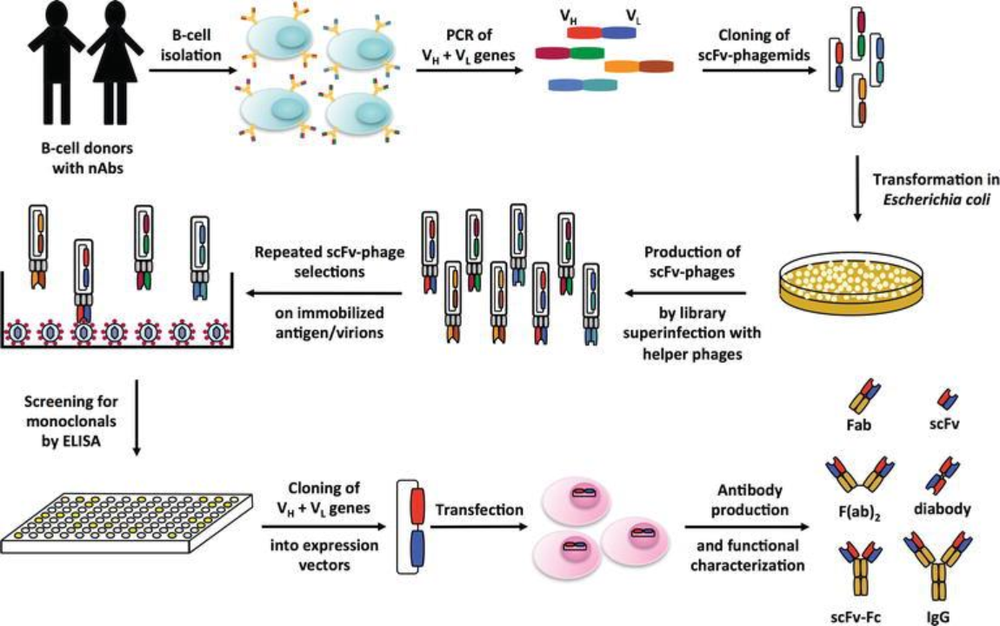

> 小结
> 1. 抗体的功能是什么？
> 2. 各型抗体的特点是什么？
> 3. 什么是单克隆抗体？什么是多克隆抗体？
> 4. 杂交瘤技术的基本原理是什么？
> 5. 抗体是如何被改造的？  

# Chapter 5 Complement System

reference videos

- [20 min to master the complement system, a great video](https://www.youtube.com/watch?v=Uc4nq4Lazo4&list=PLybg94GvOJ9Ha_e6t4NvnCjCyNmJyAvhO&index=10)
- [an animation on the overall processes](https://www.bilibili.com/video/BV1Dt411w7Ro)

## Introduction

### Discovery

> 1. 新鲜的霍乱弧菌抗血清与细菌混合后可以溶解细菌
> 2. 对抗血清加热后丧失溶菌能力
> 3. 加热后的抗血清补充新鲜血清后可以恢复溶菌能力
> 4. 不含抗体的新鲜血清不具有溶菌的能力。  

### Components

1. 固有成分：C1（C1q，C1r，C1s）~C9，MBL，丝氨酸蛋白酶，B因子，D因子，P因子。
2. 补体受体：CR1~CR4，C3aR，C4aR， C5aR
3. 调节蛋白 
   1. 可溶性分子
   2. 膜结合分子

### Nomenclature

- C stands for "complement", x represents the order of discovery
- Cx is cleaved into Cxa (smaller fragment) and Cxb (binding portion)
  - except C2, which is reversed
- should add a line over an activated enzyme: $\mathrm{C}\overline{\text{1s}}$, $\mathrm{C}\overline{\text{4b2a3b}}$. But I'm too lazy to do that then...
- combine them to form a complex. e.g. C5 convertase = $\mathrm{C}\overline{\text{4b2a3b}}$

## Activation

Note: these reactions occurs on the surface of the pathogen or an infected host cell. Will be refered to as "the surface" in the following context.

### Classic pathway (经典途径)

1. Upon binding to Ag, IgG/M changes its conformation and exposes the C1q binding site on CH2.

   > C1q may also recognize the pathogen surface or some specific proteins on it

2. C1q's binding to Ab results in the autocatalytic activation of C1r which is bound to C1q

   

3. C1r cleaves and activates C1s, which then cleaves circulating C4 and C2. C4b is then bound to the membrane or the Ab, forming a **C4b2a complex**.

   

4. The complex is called classical pathway **C3 convertase C4b2a**, which cleaves C3 into C3a and C3b. 

### Alternative pathway (旁路途径)

1. activators: LPS, glucan, 酵母多糖. 

   > But they only provide a protective environment for the reaction or an adhesive surface, and are not involved in the actual recognition. Without infection, regulator proteins like Factor H and I, inhibit C3bBb and C3b respectively, while pathogen components inhibit regulators.

2. C3 is slightly and spontaneously hydrolyzed into C3(H2O), which is usually in the liquid phase, and have C3b-like properties, enabling attachment to the surface.

   > in C3(H2O), C3a is incompletely released, which also exposes the thiol ester that is then attacked by −OH or -NH2 residues and helps C3b to be located on the surface.

3. C3(H2O)/C3b also recruits Factor B, which is cleaved by Factor D into Bb. A factor P is added to stablize the structure, which makes the primary C3 convertase C3(H2O)Bb.

4. C3bBb produces more C3b. **Positive feedback**! C3b goes the same process and induces large amount og the alternative pathway **C3 convertase C3bBbP**.

   > Another kind of C3 convertase, different from the above one!

### MBL pathway

> MBL means 甘露糖结合凝集素  mannose binding lectin
>
> lectin: a class of small proteins that bind pathogen-specific carbohydrates
>
> ficolins: another class of sugar-binding proteins

1. MBL binds to mannose residue on the cell wall, activating MASP (MBL-associated serine proteases)

   > MBL is also a hexamer like C1q

2. MASP2 cleaves other MASP2 molecules, and then cleaves C4 and C2.

   the same as C1s, goes into the classical pathway
   
3. MASP1 cleaves C3, but goes into the alternative pathway

### summary

overall pathways: all converge into C3 activation

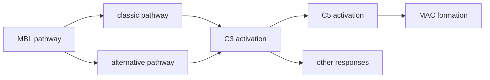

| pathway     | activator             | main players  | characteristics                       |
| ----------- | --------------------- | ------------- | ------------------------------------- |
| classical   | Ag-Ab complex         | C1q,r,s,C4,C2 | relies on antibody, late infection    |
| alternative | LPS, glucan, etc      | C3b, Bb       | evolutionarily older, early infection |
| MBL         | pathogen carbohydrate | MBL, MASP     | also early infection                  |

## Membrane attack complex

1. Whichever C3 convertase + C3b = **C5 convertase**, cleaves C5 into C5a and C5b.

   > which includes: C4b2a3b and C3bBb3b (C3bnBb)
   
2. The binding cascade is shown below:
   
   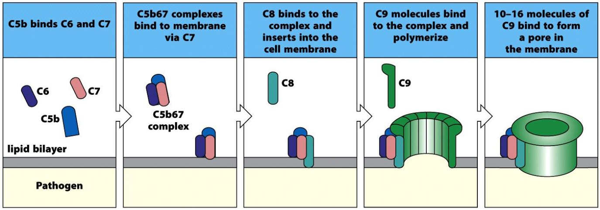
   
   binding induces a conformational change (C7/8/9) that exposes hydrophobic residues and allows inserting into the membrane
   
3. 10-16 (19?) C9 molecules polymerize and form a pore

   > see full structure: [6H04](https://www.rcsb.org/3d-view/6H04)

4. lysing the cell

   - loss of plasma membrane integrity
   - causes influx of water (a few ions) and burst (胀破) of the cell

## Biological function

### Bacteriolysis and cytolysis effect

溶菌和溶细胞效应

- based on MAC, defending pathogens like G- bacteria and enveloped viruses, or tumor cell

- it may causes human cell lysis. autoimmune disease or transplant rejection. 

  > the MAC complex might be released and insert into the membrane of a normal cell

### Complement-mediated Opsonization

补体介导的调理作用

Molecules like C3b (also smaller fragments), C4b, etc. are recognized by receptors on phagocytes, like CR1/3/4. This induces **receptor-mediated phagocytosis** and the secretion of proinflammatory molecules.

### Clearance of immune complex

清除免疫复合物。Also called immune adherence.

Activated by Ag-Ab complex, C3b is produced and recognized by erythrocytes (红细胞) and platelets (血小板) who transport the immune complex (IC) to the liver and spleen, where ICs are cleared by phagocytosis.

### Inflammatory response

介导炎症反应。mediated by the small fragments that are released into the blood stream.

- anaphylatoxin (过敏毒素): C3a, C5a

  recognized by mastocytes, basophils, induces degranulation (脱颗粒), and then histamine (组胺) release (see kinin function); 

  activates monocytes to produce cytokines like IL-1

- chemokine (趋化作用): C3a, C4a, C5a

  attract innflammatory cells, like neutrophils to infiltrate the infected tissue. 

  > chemotaxis (趋化)/metastasis, adhension molecule production, for cells to move and extravasate
  >
  > also facilitate producing ROS, prostaglandin (前列腺素), etc

- kinin-like function (激肽样作用): C2b

  causes vasodilation (血管舒张) of capillaries (毛细血管), increases permeability

### Other

> - may induce adaptive immune responses
> - maintain homeostasis
> - interact with other systems like coagulation (凝血)

## Regulation

> general understanding

### Self-degradation

C3/4/5b is rapidly degraded in the liquid phase.

### Regulators

#### activation

- classical

  > liquid phase: C1抑制物 (C1INH)，C4结合蛋白（C4bp)，I 因子
  >
  > 
  >
  > on cell surface: 膜辅助蛋白（MCP），衰变加速因子（DAF)，补体受体（CR1)
  >
  > 

- alternative

  > I 因子，H 因子，膜辅助蛋白（MCP），补体受体（CR1)
  >
  > 

#### MAC

  

### Related diseases

- 遗传性补体缺陷
- 补体功能失调

Types:

- too activated/weak regulation: autoimmune diseases, transplant rejection
- insufficiently activated/strong regulation: tumor evasion, infection

## Summary

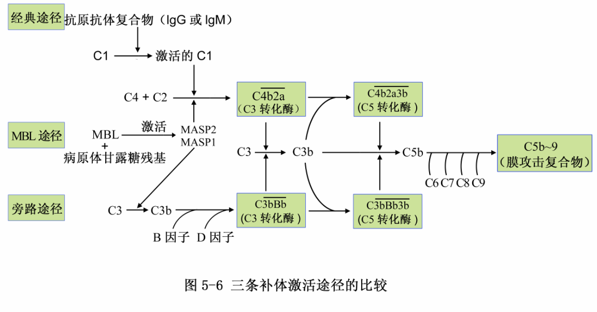

> 思考题
>
> 1. 补体激活有那三条途径？各自的生物学意义如何？
> 2. 补体有哪些生物学功能？

# Chapter 6 MHC 主要组织相容性复合体

> 背景：器官移植
>
> - 遗传学家发现，同基因型个体不排斥，排斥程度符合孟德尔遗传定律
> - 免疫学家发现，再次移植同一个供体的器官，排斥得更快；能检测到抗供体的受体

major histocompatibility complex:

- a cluster of genes that are determining the compatibility of a transplanted organ
  - translated into histocompatibility antigens
- closely related to immune respone; genetic linkage (连锁)
- specific in mammals; in human called Human Leukocyte Antigen

## HLA complex

located in Chromosome 6 short arm. 6p21.31

> β2m: chromosome 15

order: 2, 3, 1

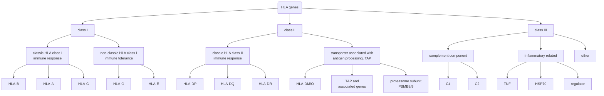

> - HLA-G: Maternal-fetal tolerance
> - HLA-E: NK cell tolerance

