# Molecular Immunology notes

Due to the absence of appropriate English online courses that match our course's syllabus, I have to write a note on my own. All the content is based on the newest slides in 2021 and the Chinese textbook. I wound not try to write everything in English because the nouns must be 太难顶了... (I'm reading Chinese materials!)  but from chapter 3 most content is in English. For important terms in English, I have to remark them in Chinese. So it's a bit challenging for general readers, while interesting for those who would love to dive into immunology research in the future. Due to the limited knowledge, there must be errors and omissions. Some of the terms are poorly translated or guessed due to the time limit. The author kindly asks the respected readers for granted criticisms and instructions.

The main reference materials include the slides (not available, but you can watch) our [Medicinal Immunology MOOC](https://www.icourse163.org/learn/XJTU-1206143814?tid=1464315463#/learn/content) in XJTU. I'm sure that the videos are great resources for students in medicine and life sciences. The first part (chapters 1 to 8) is about the components in the immune system, while the second part (the rest) tries to understand it as a whole and describes the processes. That's also what my notes follow. Hope you will like it. I recommend [a MOOC from Drew University](https://www.bilibili.com/video/BV1ui4y1Z75d/) with subtitles, which also covers a lot of details in immunology. You should go to that page because there are **several textbooks** shared in pdf version (see the top comment). BTW, welcome to subscribe [my Bilibili channel](https://space.bilibili.com/441196634) for educational videos from YouTube with Chinese subtitles!

The quoted areas are less-important comments or end-of-chapter questions.

TODOs:

- [ ] later, make mindmaps for each chapter if they can be inserted into this site
- [ ] also, a mindmap for relationships of chapters

# Chapter 1 Introduction

绪论

## History

- 天花病毒，种痘，保留毒株
- milestones...poco
  - Louis Pasteur made the first vaccines
  - discovery of blood types (lectins)
  - discovery of MHC
- modern immunology since 1970s
  - molecular level
  - immunological methods
  - safe/dangerous signals
  - therapies

## Basic functions

1. immune defense (**免疫防御**): get rid of foreign pathogens and tissues
2. immune surveillance (**免疫监视**): eliminate abnormal/non-self cells, like tumor cells
3. immune homeostasis (**免疫自稳**): eliminate aging/dead cells, 维持内环境稳定

## Operation (运转)

分为两部分

- 固有免疫（innate immune）：与生俱来的，第一道防线，高等和低等生物都有
  
  - 组成：免疫屏障，固有免疫细胞，免疫分子 (see [chapter 9](#Chapter-9-Antigen-Presenting))
  - 特点：无特异性，无记忆性

- 特异性免疫（adaptive immune）：高等生物通过接触病原体建立起来的，针对特定病原体的免疫防御能力
  
  - 组成
    
    |      | 谁来介导   | 谁发挥效应                 |
    | ---- | ------ | --------------------- |
    | 体液免疫 | B cell | antibody              |
    | 细胞免疫 | T cell | activated lymphocytes |
  
  - 特点：有特异性和记忆性，作用强大而持久

## good or bad?

- good 
  
  - defend pathogens, eliminate cancer cells, clear aging/dead cells
    
    > coresponding to the functions

- bad
  
  - too weak: cannot do above, continuous infection
  - too strong
    - allergy
    - auto-immunity (自身免疫)
    - related tissue damage (组织损伤)
    - transplant rejection (移植排斥)

# Chapter 2 Basics and Trends

免疫学基础和发展趋势

## Basic problem: how we respond to danger

### Research

- Development, differentiation of immune cells, and regulation
- recognition mechanism, processes of immune response
- interplay with other systems, relationship with various diseases

### Applications

- diagnosis, treatment, prevention of diseases
- biotechnology, etc

## Clone selection theory

- Every immune cell expresses a receptor for **a single antigen**. Our body creates a library of immune cells, i.e. receptors recognizing all antigens.
- When an antigen binds to its specific receptor, that cell is activated to proliferate itself. All daughter cells expressing the same receptor are called a clone.
- If the receptor binds to its antigen during the development of cells, the clone is aborted, which is called immune tolerance.

## Components

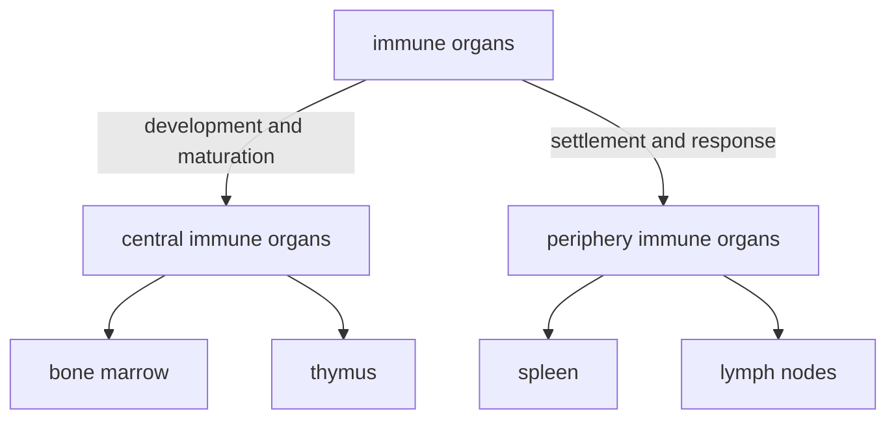

### Central (primary) immune (lymphoid) organs

中枢免疫器官

- 骨髓：含造血干细胞，是所有血细胞的来源
  - 为发育提供了环境：生长因子、基质细胞等
  - 分为粒系/髓系（myeloid）和淋巴系（lymphatic）
- 胸腺：T细胞分化发育的场所。成年后退化

### Periphery (secondary) immune organs

- 外周免疫器官：脾脏、淋巴结
- 外周免疫组织：黏膜淋巴组织、阑尾、扁桃体
- 其他组织中的免疫细胞

#### spleen

- 最大的免疫器官（黏膜：你礼貌吗？）
- 淋巴细胞定居、发挥功能的场所

> 红髓：巨噬细胞；白髓：T细胞
> 
> 其他功能：调节血量、过滤血液（拦下一些抗原，便于激活免疫）

#### lymphatic system

##### structure and function

- 淋巴结由淋巴管相连，构成遍布全身的网络
- 沿血管分布，有深有浅，是免疫系统的“哨所”
  - 淋巴液和血浆成分相似，可能交换
- 淋巴细胞定居、发挥免疫应答的场所
  - 脾脏漏掉的抗原被收集，便于激活免疫

具体结构

- 两套循环：淋巴循环和血液循环
- 两个区域
  - 浅层：B细胞
    - 浅皮质区：初级滤泡，无免疫应答
    - 深皮质区：次级滤泡，发生免疫应答时产生生发中心
  - 深层：T细胞

##### lymphocyte homing and recirculation

- 淋巴细胞归巢：某些亚群的淋巴细胞迁移或定居在某些特定区域
  
  淋巴细胞上的归巢受体和血管内皮细胞上的地址素结合，诱导淋巴细胞穿过血管壁

- 淋巴细胞再循环：在两套系统间往复循环的过程
  
  - 在淋巴管中汇集，经胸导管进入血液
  - 在淋巴结中穿入、穿出血管内皮

- 意义：有利于免疫细胞的更新（增殖），调整淋巴细胞在全身的分布，便于在病原体入侵时动员

> questions
> 
> - 你知道白血病和淋巴瘤的区别吗？
> - 胸腺退化是否会引起免疫功能低下？
> - position of these organs?
> 
> 思考与小结
> 
> - 克隆选择学说的要点是什么？
> - 免疫系统的基本功能是什么？
> - 免疫系统是怎样工作的？
> - 免疫系统是怎样构成的？
> - 什么是淋巴细胞归巢与再循环？

# Chapter 3 Antigen

抗原

## Characteristics

Antigens are substances that can 

- induce the generation of antibody, primed lymphocytes (致敏淋巴细胞).
- be recognized by the immune system and elicit an immune response.

### Concepts

Corresponding to the above two points,

- antigenicity (抗原性): the ability to specifically combine with the final products of an immune response (i.e. antibodies or receptors on sensitized immune cells)
- immunogenicity (免疫原性): the ability to induce immune responses

Thus, antigens are categorized into

- hapten: only antigenicity, no immunogenicity (too small)
- complete antigen: both

Another thing is the so-called "carrier effect": when a hapten is attached to a larger molecule (e.g. a protein), it can induce a secondary, stronger immune response, if the animal has been primed (致敏) with the same hapten conjugated to another carrier protein.

### Immunogenicity: influencing factors

#### antigen

##### foreignness (异物性)

i.e. the difference between antigen and "self"

What is "self"? If a substance comes into contact during the embryonic period or the development of lymphocytes, it is recognized as "self".

e.g. antigens carried from mother, HIV, etc.

categories:

- heterogenetic (**异种**) antigen: come from other species
  
  > food, microbes and their products, heterogenetic serum

- allogeneic (**同种异体**) antigen: other individuals
  
  > blood group antigen, transplant antigen, etc.

- autogeneic (自体) antigen: from yourself
  
  > tissue-specific antigen, denatured protein, etc.

##### chemical properties

- molecular weight
  
  - **bigger** (\> 10kD) is better

- chemical structure
  
  the more **complex**, the stronger immunogenicity is
  
  1. protein > polysaccharides > nucleic acid > lipids
  2. more aromatic residues
  3. complex 2nd/3rd structure

- physical properties
  
  - granule > soluble
    
    **stay**s longer, harder to decompose

- epitope accessibility
  
  - on the **surface** → stronger

#### host

age, gender, genetic factor, healthy state

#### route of entry

皮内 > 皮下 > 肌肉 > 静脉 > 口腔

口服抗原易导致免疫耐受

## Specificity

The nature of antigen specificity is, the specificity of an immune response.

e.g. 抗间氨基苯磺酸的抗体和邻位、对位、其他酸的反应弱或没有

- an antigen only activates lymphocytes specific to recognize it

- - MHC, BCR or TCR restricted

- products of an immune response only react with that specific antigen

cross-reaction (交叉反应): an antibody to a specific antigen can react with other antigens

e.g. 给人种牛痘

nature: similar epitope

### Epitope

表位或抗原决定簇 (antigen determinant): groups/structures that determine the specificity of antigens. 

Also, they are the basic unit to specifically recognize TCR/BCR/antibody.

| epitope type                 | linear epitope  线性表位 | conformational epitope  构象表位 |
| ---------------------------- |:------------------------- | --------------------------------- |
| sequence                     | sequential                | separated                         |
| 3D structure                 | close                     | close                             |
| after denaturation/digestion | remains                   | distroyed                         |
| recognized by                | TCR, BCR                  | mainly BCR                        |

构象表位：由氨基酸序列不连续，但在空间上相互接近、形成特定构象的几个氨基酸构成的表位。

| epitope              | T cell epitope                                                          | B cell epitope                                                       |
| -------------------- | ----------------------------------------------------------------------- | -------------------------------------------------------------------- |
| receptor             | TCR                                                                     | BCR                                                                  |
| MHC involved?        | yes                                                                     | no                                                                   |
| antigen presentation | needed                                                                  | no need                                                              |
| composed of          | linear short peptide                                                    | natural polypeptide (lipo)polysaccharide organic compounds |
| size                 | CD8+ T cell: 5\~12 AA CD4+ T cell: 12\~17 AA | 5\~15 AA or 5\~7  oligosaccharide or nt                         |
| type                 | linear                                                                  | linear or conformational                                             |
| position             | any                                                                     | surface                                                              |

> natural: part of a macromolecule?

## Categories

### Dependence on Th cell

Thymus-independent/dependent antigen

- TI-Ag 胸腺非依赖性抗原
- TD-Ag 胸腺依赖性抗原, most antigen. 
  - Th cell activates B cell

| antigen          | TD-Ag                         | TI-Ag                  |
| ---------------- | ----------------------------- | ---------------------- |
| T cell dependent | yes                           | no                     |
| chemical nature  | most protein Ag               | most polysaccharide Ag |
| type of epitope  | B/TCR epitope                 | BCR epitope            |
| type of response | humoral/cell-mediated         | humoral immune         |
| type of antibody | various, mainly IgG, less IgM | IgM                    |
| memory?          | yes                           | no                     |

relationship

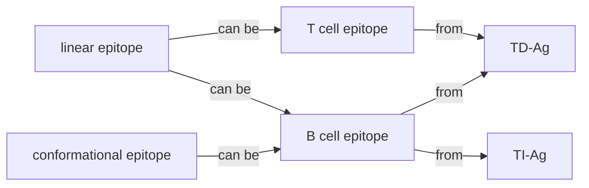

### Relationship (亲缘关系)

- heterophilic (异嗜性) antigen
  
  - common antigen between humans and other species
  - when a pathogen enters, the immune response causes autoimmunity

- xenogenic (异种) antigen
  
  - from other species, not common

- allogenic (同种异体) antigen

- autoantigen (自身抗原)

### Presenting

Whether it is synthesized inside APC

- yes: endogeneous (内源性) antigen.
- viral/tumor Ag
- no: exogeneous (外源性) antigen.
- bacteria, animal serum

### Other non-antigenic immune stimulators

general understanding

#### super antigen

超抗原, low conc of which can stimulate T cells

- endogenous: viral protein
- exogenous: bacterial exotoxin (secreted protein)

#### adjuvant

佐剂, non-specific substances which are added together with antigen in vaccines, to enhance or change the type of immune response.

卡介苗, $\text{Al(OH)}_3$, artificial, Freundadjuvant

#### mitogen

丝裂原, which binds to their receptor and stimulates cell growth

> ### epitope mapping
> 
> 表位的确定。To determine the action targets, to make vaccines
> 
> Build an overlapping library and screen with the antibody
> 
> key points
> 
> - T cell need degradation (presenting), TCR indirectly recognize
> - BCR directly recognize both linear (no degradation) or conf (degradation) are ok

> 思考与小结
> 
> 1. 抗原的免疫原性和反应原性（抗原性）及其关系
> 2. 决定免疫原性的因素
> 3. 载体效应，交叉反应
> 4. 表位及表位的分类，表位与抗原的关系
> 5. 常见的抗原的分类方法
> 6. 什么是超抗原

# Chapter 4 Immunoglobin

免疫球蛋白 Molecules with antibody-like activity.

Immunoglobulin super family (IgSF, 免疫球蛋白超家族): proteins including Ig-like domains

- MHC, BCR, TCR, CD4, CD8, ....

## Structure

### Chains

- A Y-shape molecule. N terminal at the top.

- Two identical heavy chains (connected by S-S bond) and light chains, between which is a S-S bond

- heavy chain: 50kD, five isotypes (同种型): IgA/G/E/M/D ~ α/γ/ε/μ/δ chain (first letter in α is A, and so on)
  
  light chain: 25kD, two types, κ/λ

### Domains

#### structure

|                 | Heavy chain       | Light chain   |
| --------------- | ----------------- | ------------- |
| Constant region | sky blue, CH1/2/3 | orange, CL    |
| Variable region | blue, VH          | tangerine, VL |

hinge: flexible, between CH1 and CH2. not in IgM/E

#### function

- VH/VL: antigen binding

- - contains a hypervariable region (高变区) or complement-determining region (互补决定区), other region is called framework region

- CH1 and CL: allogenic marker (同种异型标志)

- CH2: complement binding site for IgG

- CH3: membrane receptor binding; cross 胎盘 for IgG; complement binding site for IgM

- CH4 is exclusive in IgM/E, following CH3

### Enzymolysis (酶解)

> papain: 木瓜蛋白酶; pepsin: 胃蛋白酶

### Other components

- joining chain (J片): peptide at C-ter, joining secretary IgA dimer or IgM pentamer
- secretary IgA also need a glycopeptide, secretary piece (分泌片)

> 
> 
> 

## Diversity and Immunogenecity

### Diversity

- Constant region
  - according to hinge AA and S-S bond, the five isotypes are classified into different subclasses (亚类)
- Variable region
  - λ type is classified into 4 subtypes (亚型)

They are encoded by independent genes and just freely combine...which makes diversity.

### Immunogenecity

Ab can also be an antigen. Three types of epitope:

- isotype: all C region.
  - Individuals in the same species have similar C region. If you inject monkey's Ab into a human, the C region could be an antigen.
- allotype: some residue variation in C region
  - There are gene variations between individuals inside a species too, which generates epitope in C region. A marker of individuals.
- idiotype: in V region (HVR)
  - Antibodies from the same individual have diverse V regions which may give rise to an epitope.
  - Anti-idiotype antibody as an alternative of the antigen to induce immune system.

## Interaction with Ag

- VH and VL all have 3 CDRs. In charge of binding. affinity
- VL gene is from recombinant V, D, J genes, while VH gene depends on subclasses

## Effects after Ag binding

### Neutralizing toxins and infection

> [a video for reference](https://www.bilibili.com/video/BV1Gg411P7jS)
> 
> - 中和抗体只占人体产生抗体中的一小部分
> - 它们都能特异性结合病原体，但中和抗体可能结合入侵相关蛋白（如冠状病毒的S蛋白），或结合衣壳蛋白导致病毒核酸无法释放，直接阻止对人体的感染；非中和抗体可能结合其他位点，但无法阻止感染！
> - 非中和抗体有增强免疫的作用，与病毒结合后可以介导免疫细胞（如巨噬细胞）吞噬、清除病毒，杀敌于“国门之内”，在早期阶段发挥抗病毒作用。
> - 在中后期可能会导致免疫损伤，因为该抗体不能阻止病毒的侵染，所以病毒可能在吞噬它的细胞内部增殖、裂解之。这种途径使病毒能不依赖细胞表面受体而侵入原本无法入侵的细胞，称为抗体依赖增强作用（Antibody-dependent enhancement，ADE）

### Effect of C region

- activate complement system (see chapter 6 for details)

- bind Fc receptor on the cell surface
  
  - opsonization (调理作用): phagocytosis (吞噬作用) by macrophages and neutrophils through Fc binding to Fc receptor, then into [presenting pathway](#MHC synthesis,-their-transportation-and-assembly)
    
    

- enhance ADCC (antibody-dependent cell-mediated cytotoxicity) effect of NK cell, also through Fc

- mediate [type I hypersensitivity](#type-I-hypersensitivity) (超敏反应): mastocytes, basophils (嗜碱性粒细胞), IgE 
  
  > see chapter 10

- 穿过胎盘（IgG）与黏膜（分泌型 IgA）

## Characteristics of several classes of Ab

### Five classes

| classes | state    | localization                                   | major function                                               |
| ------- | -------- | ---------------------------------------------- | ------------------------------------------------------------ |
| IgM     | pentamer | mainly in serum monomer on B cell surface | primary immune response strongest complement activation |
| IgG     | monomer  | in serum and body fluid                        | secondary immune response can also in milk, pass 胎盘     |
| IgA     | dimer    | mainly mucosa (黏膜) monomer in serum       | defend in mucosa secreted into milk (乳汁)                |
| IgE     | monomer  | in serum, very little                          | may cause type I hypersensitivity                            |
| IgD     | monomer  | on B cell surface                              | marker of B cell maturation not so clear                |

| more info | subclasses | formation               | more on structure | infection | features                       |
| --------- | ---------- | ----------------------- | ----------------- | --------- | ------------------------------ |
| IgM       | only one   | advanced embryo         | no hinge, CH4     | early     | blood type marker of 宫内感染 |
| IgG       | IgG1/2/3/4 | half a year after birth |                   | late      | long half-life                 |

### Class switching (类别转换)

same V region, C region genes conversion along with stages of infection

at DNA level, irreversible, from IgM to G to ...

[reference](https://www.youtube.com/watch?v=Gvq48XrzMTY)

## Preparation

### Polyclonal Ab

- a mixture of antibodies targeting a variety of epitopes
  
  > clone: a cell cluster derived from lymphocytes targeting a single Ag

- production: immunize animals with antigen

- usage: urgent treatment

- drawback: low specificity, low production, may cause allergy

### Monoclonal Ab

- from a single clone, targeting one epitope

- the flow of production
  
  - immunize mouse with Ag, isolate spleen cells
  - fuse them with myeloma cells (骨髓瘤细胞)
  - screen in HAT medium (for hybridoma cell 杂交瘤细胞)
  - identify the monoclonal Ab (for that desired Ab)
  - amplification
  
  > HAT medium:
  > 
  > - 氨甲蝶呤：从头合成途径中二氢叶酸还原酶抑制剂
  > - 次黄嘌呤、胸腺嘧啶脱氧核苷：补救合成途径的原料
  > 
  > 骨髓瘤细胞的HGPRT（补救合成的一个酶）缺陷，只有和淋巴细胞融合后才能生存
  > 
  > B细胞只能在体外生存不超过一周

- features
  
  - high specificity, titer (效价), purity, mass production (大规模生产)
  - murine, hinders clinical applications
  
  > 效价是指某一物质引起生物反应、达到一定效果所需的剂量

- applications
  
  - protein detection/purification, cell isolation
  - hormone/tumor Ag/pathogen detection, therapy

### Genetically engineered Ab

- also known as recombinant Ab: antibodies whose genes are cut, spliced, modified, and transfected into and expressed in appropriate recipient cells.
  
  通过基因工程技术对抗体各链基因的剪切、拼接、修饰，并转入适当的受体细胞中从而生产出的抗体
  
  - modification: reserve Ag binding domain; simplify non-binding domain
  - goal: humanize, miniaturization (小型化), multi-functionalized. keep specificity and affinity!

- types
  
  - humanized Ab
    
    - chimeric Ab (嵌合抗体): murine V region+human C region
    - reshaped Ab (改型抗体): murine CDR+human rest part
    - transgenic mouse: replaced with human Ig genes, completely humanized
  
  - small Ab fragment
    
    - Fab: L chain+VH+CH, a linker is added
    
    - Fv: only VH and VL. If linker, called scFv Ab. 
      
      If only VH, called single domain Ab (单域抗体)
  
  - multi-functional Ab
    
    - bispecific Ab: two Fab domains recognize different targets (e.g. tumor and T cell)
      
      maybe Fc also recruits macrophage
    
    - bifunctional Ab: conjugated with enzyme, drug, etc. targeted therapy

- antibody phage display: build a library of V region genes by cloning from polyclonal B cells from immunized humans, importing them into phages. Tandem expression with minor coat protein enables to display Fv antibodies on the surface of phages. Then we can screen Ab with the desired affinity with our antigen.
  
  

> 小结
> 
> 1. 抗体的功能是什么？
> 2. 各型抗体的特点是什么？
> 3. 什么是单克隆抗体？什么是多克隆抗体？
> 4. 杂交瘤技术的基本原理是什么？
> 5. 抗体是如何被改造的？

# Chapter 5 Complement System

补体系统. reference videos

- [20 min to master the complement system, a great video](https://www.youtube.com/watch?v=Uc4nq4Lazo4&list=PLybg94GvOJ9Ha_e6t4NvnCjCyNmJyAvhO&index=10)
- [an animation on the overall processes](https://www.bilibili.com/video/BV1Dt411w7Ro)

## Introduction

### Discovery

> 1. 新鲜的霍乱弧菌抗血清与细菌混合后可以溶解细菌
> 2. 对抗血清加热后丧失溶菌能力
> 3. 加热后的抗血清补充新鲜血清后可以恢复溶菌能力
> 4. 不含抗体的新鲜血清不具有溶菌的能力。

### Components

1. 固有成分：C1（C1q，C1r，C1s）~C9，MBL，丝氨酸蛋白酶，B因子，D因子，P因子。
2. 补体受体：CR1~CR4，C3aR，C4aR， C5aR
3. 调节蛋白 
   1. 可溶性分子
   2. 膜结合分子

### Nomenclature

- C stands for "complement", x represents the order of discovery
- Cx is cleaved into Cxa (smaller fragment) and Cxb (binding portion)
  - except C2, which is reversed
- should add a line over an activated enzyme: $\mathrm{C}\overline{\text{1s}}$, $\mathrm{C}\overline{\text{4b2a3b}}$. But I'm too lazy to do that then...
- combine them to form a complex. e.g. C5 convertase = $\mathrm{C}\overline{\text{4b2a3b}}$

## Activation

Note: these reactions occur on the surface of the pathogen or an infected host cell. Will be referred to as "the surface" in the following context.

### Classic pathway (经典途径)

1. Upon binding to Ag, IgG/M changes its conformation and exposes the C1q binding site on CH2.
   
   > C1q may also recognize the pathogen surface or some specific proteins on it

2. C1q's binding to Ab results in the autocatalytic activation of C1r which is bound to C1q
   
   

3. C1r cleaves and activates C1s, which then cleaves circulating C4 and C2. C4b is then bound to the membrane or the Ab, forming a **C4b2a complex**.
   
   

4. The complex is called classical pathway **C3 convertase C4b2a**, which cleaves C3 into C3a and C3b. 

### Alternative pathway (旁路途径)

1. activators: LPS, glucan, 酵母多糖. 
   
   > But they only provide a protective environment for the reaction or an adhesive surface, and are not involved in the actual recognition. Without infection, regulator proteins like Factor H and I, inhibit C3bBb and C3b respectively, while pathogen components inhibit regulators.

2. C3 is slightly and spontaneously hydrolyzed into C3(H2O), which is usually in the liquid phase, and has C3b-like properties, enabling attachment to the surface.
   
   > in C3(H2O), C3a is incompletely released, which also exposes the thiol ester that is then attacked by −OH or -NH2 residues and helps C3b to be located on the surface.

3. C3(H2O)/C3b also recruits Factor B, which is cleaved by Factor D into Bb. A factor P is added to stabilize the structure, which makes the primary C3 convertase C3(H2O)Bb.

4. C3bBb produces more C3b. **Positive feedback**! C3b goes the same process and induces a large amount of the alternative pathway **C3 convertase C3bBbP**.
   
   > Another kind of C3 convertase, different from the above one!

### MBL pathway

> MBL means 甘露糖结合凝集素  mannose-binding lectin
> 
> lectin: a class of small proteins that bind pathogen-specific carbohydrates
> 
> ficolins: another class of sugar-binding proteins

1. MBL binds to mannose residue on the cell wall, activating MASP (MBL-associated serine proteases)
   
   > MBL is also a hexamer like C1q

2. MASP2 cleaves other MASP2 molecules, and then cleaves C4 and C2.
   
   the same as C1s, goes into the classical pathway

3. MASP1 cleaves C3, but goes into the alternative pathway

### summary

overall pathways: all converge into C3 activation

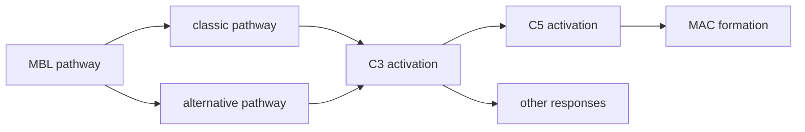

| pathway     | activator             | main players  | characteristics                       |
| ----------- | --------------------- | ------------- | ------------------------------------- |
| classical   | Ag-Ab complex         | C1q,r,s,C4,C2 | relies on antibody, late infection    |
| alternative | LPS, glucan, etc      | C3b, Bb       | evolutionarily older, early infection |
| MBL         | pathogen carbohydrate | MBL, MASP     | also early infection                  |

## Membrane attack complex

1. Whichever C3 convertase + C3b = **C5 convertase**, cleaves C5 into C5a and C5b.
   
   > which includes: C4b2a3b and C3bBb3b (C3bnBb)

2. The binding cascade is shown below:
   
   
   
   binding induces a conformational change (C7/8/9) that exposes hydrophobic residues and allows inserting into the membrane

3. 10-16 (19?) C9 molecules polymerize and form a pore
   
   > see full structure: [6H04](https://www.rcsb.org/3d-view/6H04)

4. lysing the cell
   
   - loss of plasma membrane integrity
   - causes an influx of water (a few ions) and burst (胀破) of the cell

## Biological function

### Bacteriolysis and cytolysis effect

溶菌和溶细胞效应

- based on MAC, defending pathogens like G- bacteria and enveloped viruses, or tumor cell

- it may cause human cell lysis. autoimmune disease or transplant rejection. 
  
  > the MAC complex might be released and inserted into the membrane of a normal cell

### Complement-mediated Opsonization

补体介导的调理作用

Molecules like C3b (also smaller fragments), C4b, etc. are recognized by receptors on phagocytes, like CR1/3/4. This induces **receptor-mediated phagocytosis** and the secretion of proinflammatory molecules.

### Clearance of immune complex

清除免疫复合物。Also called immune adherence.

Activated by Ag-Ab complex, C3b is produced and recognized by erythrocytes (红细胞) and platelets (血小板) who transport the immune complex (IC) to the liver and spleen, where ICs are cleared by phagocytosis.

### Inflammatory response

介导炎症反应。mediated by the small fragments that are released into the bloodstream.

- anaphylatoxin (过敏毒素): C3a, C5a
  
  recognized by mastocytes, basophils, induces degranulation (脱颗粒), and then histamine (组胺) release (see kinin function); 
  
  activates monocytes to produce cytokines like IL-1

- chemokine (趋化作用): C3a, C4a, C5a
  
  attract inflammatory cells, like neutrophils to infiltrate the infected tissue. 
  
  > chemotaxis (趋化)/metastasis, adhesion molecule production, for cells to move and extravasate
  > 
  > also facilitate producing ROS, prostaglandin (前列腺素), etc

- kinin-like function (激肽样作用): C2b
  
  causes vasodilation (血管舒张) of capillaries (毛细血管), increases the permeability

### Other

> - may induce adaptive immune responses
> - maintain homeostasis
> - interact with other systems like coagulation (凝血)

## Regulation

> general understanding

### Self-degradation

C3/4/5b is rapidly degraded in the liquid phase.

### Regulators

#### Activation

- classical
  
  > liquid phase: C1抑制物 (C1INH)，C4结合蛋白（C4bp)，I 因子
  > 
  > 
  > 
  > on the cell surface: 膜辅助蛋白（MCP），衰变加速因子（DAF)，补体受体（CR1)
  > 
  > 

- alternative
  
  > I 因子，H 因子，膜辅助蛋白（MCP），补体受体（CR1)
  > 
  > 

#### MAC

  

### Related diseases

- 遗传性补体缺陷
- 补体功能失调

Types:

- too activated/weak regulation: autoimmune diseases, transplant rejection
- insufficiently activated/strong regulation: tumor evasion, infection

## Summary

> 思考题
> 
> 1. 补体激活有那三条途径？各自的生物学意义如何？
> 2. 补体有哪些生物学功能？

# Chapter 6 MHC

> 背景：器官移植
> 
> - 遗传学家发现，同基因型个体不排斥，排斥程度符合孟德尔遗传定律
> - 免疫学家发现，再次移植同一个供体的器官，排斥得更快；能检测到抗供体的受体

主要组织相容性复合体 major histocompatibility complex:

- a cluster of genes determining the compatibility of a transplanted organ
  - translated into histocompatibility antigens
- closely related to immune response; genetic linkage (连锁)
- specific in mammals; in humans called Human Leukocyte Antigen (here MHC=HLA)

## HLA complex

### Genes

located in Chromosome 6 short arm. 6p21.3

> β2m: chromosome 15. not in HLA II!

order: 2, 3, 1

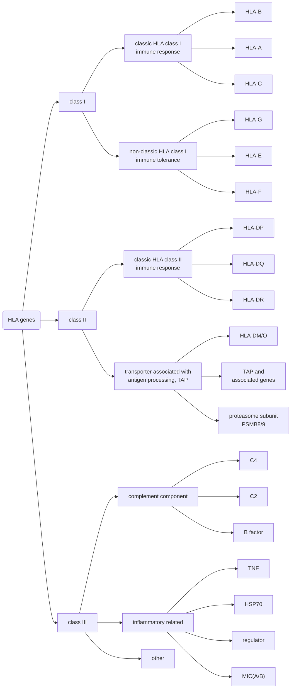

> - HLA-G: Maternal-fetal tolerance, receptor:NKG2
> - HLA-E: NK cell tolerance, receptor: KIR
> 
> MIC: MHC class I related gene

DP/DQ etc. has multiple genes in one locus (基因座). Each α and β have 2 types of chains.

> A locus is **the specific physical location of a gene or other DNA sequence on a chromosome**, like a genetic street address. A, B, C, G, F are all **loci**.

Each gene has exons encoding all needed chains.

> Different! In HLA II, A and B expresses α and β chain, respectively; while there's only an α chain in HLA

### Genetic characteristics

- various genes (**多种基因**)

- co-dominance (**共显性**): in an individual, both maternal and paternal alleles are expressed simultaneously (even though they might be heterozygous)
  
  > blood type Ag is also co-dominantly expressed

- polymorphism (**多态性**): in a population, there are a huge number of alleles in one gene locus.
  
  > HLA is the most polymorphic gene, not "one of". multiple alleles (复等位基因)

- haplotype heredity (**单倍型遗传**): all HLA genes are so closely linked that considered as a complete genetic unit (作为一个整体遗传).

- non-balance distribution and linkage disequilibrium
  
  - **非随机分布**: different alleles express at certain frequencies, which vary with geographical regions.
  - **连锁不平衡**: as above. (the frequency of two alleles presenting in the same chromosome is higher than predicted.)

> provide public access to the data through the websites http://www.ebi.ac.uk/ipd/imgt/hla/ and here at [http://hla.alleles.org](http://hla.alleles.org/nomenclature/index.html). submit the sequences directly to the [IPD-IMGT/HLA Database](http://www.ebi.ac.uk/ipd/imgt/hla/)
> 
> check the most updated data there!

> HLA-genotyping (基因分型): determine the genotype of <u>12 HLA molecules</u> in an individual
> 
> essential for matching (配型) in organ transplant, paternity test (亲子鉴定), etc.
> 
> HLA I seems more diverse.

[Naming Rules](http://hla.alleles.org/nomenclature/naming.html)

## HLA molecule

### MHC class I

- extracellular domain
  
  β2m and α3 linked by a disulfide bond

- transmembrane domain

- intracellular domain: signaling

MHC class I is presented on the surface of any karyocytes (有核细胞) (except 滋养层细胞).

​                                            

left: MHC I; right: MHC II

### MHC class II

- still the 3 domains
- α1 and β1 contact the TCR
- a symbol of the ability of antigen-presenting

Expressed on professional APCs, B cells, activated T cells, thymus epithelial cells, etc.

> why activated T cells??

### MHC function

#### That is: antigen presentation

| pathway | presenting cell     | antigen    | T cell type            | effect              |
| ------- | ------------------- | ---------- | ---------------------- | ------------------- |
| MHC I   | tumor/infected cell | endogenous | CD8+ T cell | cytotoxic effect    |
| MHC II  | APC (see above)     | exogenous  | CD4+ T cell | promotes CTL and Ab |

Some AAs are recognized by MHC and some TCR.

#### Related functions

- AP related
  - MHC restriction: TCRs have to recognize MHC (when recognizing the antigen peptide)
  - T cell development, selection (see later chapters)
  - determines disease sensitivity (Ag presenting; linkage with sensitive genes 易感基因)
  - involved in the heterogeneity of the genetic structure of the population (种群基因结构的异质性)
  - involved in transplant rejection
- Immune regulation
  - encode complement molecules
  - encode inflammatory factors
  - induce self-tolerance: MHC binds to KIR and NKG receptor

## MHC in medicine

1. HLA与器官移植的关系
   
   常用匹配位点： HLA-A， B， C， DRB1
   
   血清学分型：依据不同HLA蛋白分子的抗原性不同
   
   基因分型： 直接比较基因的序列
   
   > major histocompatibility complex: antigens that induce strong and rapid rejection
   > 
   > minor: weak and slow

2. HLA与输血反应的关系
   
   白细胞溶血由白细胞携带的HLA不同导致（宿主抗移植物效应）

3. **HLA与疾病的相关性**：见上易感基因。百余种疾病！

4. HLA与法医
   
   利用HLA的多态性（但不会变）进行亲子鉴定和身份确认

5. HLA与新型疫苗的开发

## Summary

> No reflection questions

# Chapter 7 Cytokines

细胞因子

Cytokines are small multi-bioactive polypeptides or glycoproteins secreted by various cells (especially immune cells).

## Common features

> just glimpse

### Basic characteristics

- soluble small protein (8~30kD)
- low concentration, highly effective
- induced, short half-life
- the below two

### Mode of action

> 自分泌、旁分泌、内分泌

- autocrine: itself
- paracrine: adjacent
- endocrine: far away

### Functional Features

- 多效性：一种细胞因子，多个靶细胞
- 重叠性：多种细胞因子，类似生物功能
- 协同性：一种加强另一种
- 拮抗性：一种抑制另一种
- 网络性：复杂的相互作用

## Categories and biological properties

### Summary

| categories                      | meaning                               | representative                          | source cell                                                          | function                                                     |
| ------------------------------- | ------------------------------------- | --------------------------------------- | -------------------------------------------------------------------- | ------------------------------------------------------------ |
| Interleukin                     | conversation among leukocytes         | IL-2                                    | activated T cells                                                    | proliferation of T/B/NK cell/LAK/monocyte                    |
| Interferon                      | interfere viral replication           | type I: IFN-α/β/ε/ω type II: IFN-γ | type I: infected cells, lymphocytes type II: activated/NK cells | type I: anti-tumor/virus type II: boost immune response |
| Colony-stimulating factor (CSF) | hematopoietic cells (see below)       | IL-3, GM-CSF, EPO, etc.                 | T cells, Mo/Mϕ, mesenchymal cells and some from other tissues        | proliferation, differentiation, and activation               |
| Chemokine                       | directional migration of immune cells | CXC, CC, C, CX3C family                 | T naive/act, Th cell, B cell, Mo/Mϕ/NK/DC                            | attract and activate immune cells, regulate angiogenesis     |
| Tumor necrosis factor (TNF)     | tumor necrosis (like interferon)      | types: TNF-α/β FasL, TRAIL         | activated monocytes or macrophages (α), T cells (β)                  | kill target cell, regulate immune response                   |
| Growth factor                   | promote growth and differentiation    | TGF-β, VGEF, EGF, FGF, NGF, PDGF        | tumor cells, fibroblasts, macrophages                                | promote growth and differentiation                           |

LAK：淋巴因子激活的杀伤细胞

### Comments

#### Colony stimulating factor

meaning: proliferation and differentiation of pluripotential hematopoietic stem cell and hematopoietic progenitor cell

mainly: Mo/Mϕ, endothelial cells, fibroblasts

> | CSF    | Chinese     | source                               | function                                                                            |
> | ------ | ----------- | ------------------------------------ | ----------------------------------------------------------------------------------- |
> | IL-3   | 白介素-3       | T cell                               | pulripotential hematopoietic stem cell (into myeloid progenitor)                    |
> | GM-CSF | 粒细胞/巨噬细胞CSF | T cell, "mainly"                     | myeloid and red stem cell, Mϕ activity neutrophil, eosinophil, erythrocyte, DC |
> | M-CSF  | 巨噬细胞CSF     | "mainly"                             | monocytes, Mϕ activity                                                              |
> | G-CSF  | 粒细胞CSF      | "mainly"                             | granuloid stem cell (e.g. neutrophil)                                               |
> | SCF    | 干细胞因子       | hepatic cells (肝细胞) fibroblasts | pulripotential stem cell, melanophore (黑色素细胞), mastocyte                            |
> | EPO    | 红细胞生成素      | renal cells (肾细胞)                    | 红系 stem cell                                                                        |
> | TPO    | 血小板生成素      | hepatic and renal cells              |                                                                                     |

#### Chemokine

nomenclature: 

- chemokine: family + L + num, e.g. CXCL8
- receptor: family + R + num, e.g. CCR5

## Cytokine receptor

Three regions, for signaling.

### Membrane CR: categories

| xx superfamily receptors | also known as/abbreviated         | their ligands                                            | domain structure                                                    | remark                                                           |
| ------------------------ | --------------------------------- | -------------------------------------------------------- | ------------------------------------------------------------------- | ---------------------------------------------------------------- |
| Immunoglobin             | IgSFR                             | IL-1/18, M-CSF, SCF                                      | α/β, each has one or more IgSF domain(s)                            | GM-CSF subfamily: IL-3/5, common β                               |
| Hematopoietic factor     | Type I cytokine RSF               | IL-2$\sim$7, 9, 11$\sim$13, 15,... GM-CSF, G-CSF... | α/β clamps ligand intracellular γ conserved Cys and WSXWS | IL-2 subfamily, common γ IL-6 subfamily, common gp130       |
| Interferon               | Type II cytokine RSF              | IFN-α/β/γ, IL-10, etc.                                   | similar, except WSXWS                                               | [Jak/STAT pathway](https://www.bilibili.com/video/BV1ub4y1b7B5/) |
| TNF                      | Type III cytokine RSF TNFRSF | TNF-α/β CD27/30/40L NGF, Fas                   | mostly homotrimer each chain has many Cys-rich domains         |                                                                  |
| Chemokine                |                                   | IL-8                                                     | all are GPCR                                                        | also Jak/STAT pathway                                            |

### Subunits

- Some subunits are for recognition; some for signaling. 

- Some are shared, which have similar functions. e.g. IL-2/4/7/9/15/21

- affinity
  
  

### Soluble cytokine receptor

Some are circulating and only have binding domains. Their work might be:

- inhibiting: competing with membrane receptors
- enhancing: transport and gather cytokines 

## Biological effects

- regulate immunity
- participate in inflammatory response
- stimulate proliferation and differentiation of hematopoietic cells
- induce apoptosis
- promote wound healing (愈伤)
- 神经-内分泌-免疫网络调节

> No reflection questions

# Chapter 8 Innate Immune System

Before everything begins, we should memorize:

*Mo*=Monocytes, and *Mϕ*=macrophages, monocytes differentiate into Mϕ or DC.

PMN=polymorphonuclear多形核白细胞 (neutrophil, basophil (*Ba*), ensinophil (*Eo*))，也称粒细胞

髓系细胞包括：红细胞、血小板、粒细胞、单核细胞，还有经典DC、肥大细胞等（DC有髓样的也有浆细胞样的）

淋巴细胞包括：(αβ)T细胞、B细胞、NK细胞，固有样淋巴细胞还有：NKT细胞、γδT细胞、B1细胞等

这些（除了红细胞、血小板）全都是白细胞。

狭义的免疫细胞等同于白细胞，广义的免疫细胞还包括其他组织的相关细胞，如呈递抗原的内皮细胞。

> should draw a Venn plot

## Components

### Barrier (屏障作用)

balances tolerance and response

#### skin and mucosa

> The mucosa is larger than the skin!

- 机械阻挡作用：致密结构，tight junction

- 分泌物：眼泪、唾液，anti-bacterial substances

- 免疫细胞
  
  - 皮肤：皮试，试是否过敏
  - 黏膜：丰富的IgA、淋巴细胞、滤泡

- 正常菌群
  
  - 寄生在黏膜表面的，大量微生物
  - 提供营养、免疫防御（如分泌毒素），帮助塑造了免疫系统

left: langhans cell in the skin; right: mucosa distribution

intestinal immune system

#### organs

##### blood-brain barrier

- prevents pathogen, lymphocytes and big molecules (like toxins)
  
  > it's newly discovered that there exist lymph-vessels (淋巴管) in the brain, published in Nature

- endothelial cells in the capilliaries are tighly joined, with astroyte (少突胶质细胞) forms 鞘壁 that covers the capilliaries

##### placenta barrier

滋养层细胞阻挡来自母体的细菌等

### Innate immune cells

#### Phagocytes

##### pattern recognition receptor

recognize **common structures** in pathogens directly

> on the surface of macrophages, DC, organ, and serum, etc.

- PRR inculdes
  
  - membrane: mannose receptor (MR), scavenger receptor (SR, 清道夫受体), Toll-like receptor (TLR)
  - secretory: MBL, C reaction protein (C反应蛋白), LPS binding protein (LBP)

- its ligand (模式分子)
  
  - pathogen-associated molecular pattern (**PAMP**)
    
    conserved, components on pathogen surface, like LPS, DNA, RNA, phospholipids
  
  - damage-associated molecular pattern (**DAMP**)
    
    HSP, uric acid crystal, ROS, degraded substance (like apoptosis)

> for reference
> 
> 

##### macrophage

###### basics

- types: Kuffer cell (枯否细胞, liver), microglial (小胶质细胞), osteoclast (破骨细胞, brain), free marophages (tissues). widely distributed.
- morphological characteristics: rich in cytosol and granules, shape-changing

###### ways of cytosis (吞噬)

- phagocytosis

- pinocytosis

- receptor-mediated endocytosis (like FcR, MR, complement ↓)
  
  

###### mode of destruction

- oxygen-dependent: coenzymes reduce O2 into various ROS; iNOS produces NO
- oxygen-independent: lactate accumulation; lysozyme etc., antibacterial peptide distruct the cell wall

###### functions

- clear pathogens
- kill infected/tumor cells, 胞内寄生菌
- mediate inflammatory response (produce cytokines)
- process and present Ag, secondary response
- immune regulation

##### neutrophil

- distributed in blood, 60 to 70 percent of white blood cells. rapid generation and short half-life
- morphological features: 分叶核, rich in granules
- similar function of cytosis
- mode of distruction: MPO (髓过氧化物酶), etc; oxygen dependent and independent
- functions: clear pathogens (mainly bacteria), induce inflammatory response

#### Dendritic cells

morphological features: look like dendrite (树突)

##### classical (cDC)

- found in tissues and peripheral immune organs
- function
  - immature: Ag uptake (by PRR, opsonic receptor)
  - mature: Ag presentation (by expressing MHC and co-stimulator)

see [chapter 9](#Chapter-9-Antigen-Presenting) for more details! 

##### plasmacytoid DC (pDC)

produces IFN-α/β 

#### Natural killer cells

Large granular lymphocytes. No sensitization required.

##### receptors

| receptors  | ligand                | receptor motif | receptor example                               |
| ---------- | --------------------- | -------------- | ---------------------------------------------- |
| inhibitory | MHC I                 | ITIM           | KIR2/3DL, NKG2A                                |
| activating | MHC I  and other | ITAM           | KIR2/3DS, NKG2C-DAP12 non-MHC: NKG2D, NCR |

> 免疫酪氨酸抑制性模体: ITIM
> 
> 杀伤细胞免疫球蛋白样受体: KIR, 2$\sim$3 Ig domains
> 
> 杀伤细胞凝集素样受体: KLR, CD94 and NKG2 family heterodimer
> 
> short aa chain--activation, long aa chain--inhibition
> 
> 自然细胞毒性受体: NCR
> 
> 
> 
> 

##### mode of action

- direct attack: perforin-granzyme
- induce apoptosis: FasL, TRAIL
- ADCC effect

against infected/tumor cell

> cytotoxic pathways: perforin-granzyme and Fas/FasL

#### Innate-like lymphocytes

固有样淋巴细胞 (ILL), is between adaptive and innate immune cells. 

Restricted diversity, directly recognize pathogens and become activated.

| cell type | feature                                | found in                   | antigen                                | response                                                       |
| --------- | -------------------------------------- | -------------------------- | -------------------------------------- | -------------------------------------------------------------- |
| NKT cell  | both TCR-CD3 and CD56 (a symbol of NK) | bone marrow, liver, thymus | phospholipids, glycolipids             | cytotoxic effect and cytokines                                 |
| γδT cell  | TCR: γ,δ chain                         | mucosa (early)             | MICA/B, viral protein, HSP, P/G lipids | the same                                                       |
| B1 cell   | self-renewing B cells                  | 胸膜腔，腹膜腔，小肠固有层              | TI-Ag, denatured self Ag               | rapid IgM, early resposne; no  class switching, no memory |

A lot of other cells are involved in innate immune response, like mastocytes.

### Innate immune molecules

- complement (see [chapter 5](#Chapter-5-Complement-System))

- cytokines (see [chapter 7](#Chapter-7-cytokines))

- other
  
  - antibacterial peptide. e.g. α-defensin (防御素) 
    
    > positive-charged, bind to LPS, 磷壁酸, etc.; hydrophobic part insert into the cell wall
  
  - lysozyme: lyse peptidoglycan on the cell wall of Gram-positive bacteria; 
    
    > requires complement and antibody to destruct Gram-negative bacteria
  
  - β-lysin (乙型溶素): heat-stable; only target G+

## Innate immune response

### Process

1. <u>immediate</u> innate immunity: $<4$ hours, local innate immune cells function, neutrophils enter.
2. early innate immunity
   - chemokines recruit macrophages, which release more cytokines
   - NK and NKT cells enter
   - B1 cell produces Ab
3. initiates <u>adaptive</u> immune response

### Characteristics

- non-specific
- no clonal amplification (克隆扩增)
- rapid and short, no memory
- regulates adaptive immune

### Relationship with adaptive ir

I: innate; A: adaptive

- I initiates A: Ag presenting, like DC
- I regulates strength and type of A: type of cytokines
- I assists effector T cells to enter the location of disease: chemokines
- I cooperates with effector T cell and antibody to function: complement, ADCC

## Summary

- 固有免疫的构成
  1. 屏障作用
     - 皮肤黏膜屏障：物理屏障，化学屏障，菌群的作用
     - 器官屏障：解剖基础，屏障的作用（阻挡病原体，大分子，活化的淋巴细胞）
  2. 免疫细胞：巨噬细胞，中性粒细胞， NK细胞， 树突状细胞，嗜酸性粒细胞，嗜碱性细胞，肥大细胞， NKT细胞， γδT细胞， B1细胞
     - 如何识别
     - 作用机制
  3. 固有免疫分子
- 固有免疫的特点
- 固有免疫应答的过程及其与适应性免疫应答的关系

# Chapter 9 Antigen Presenting

T cells cannot directly recognize antigens (even peptide); need the help of APCs.

[a video for reference](https://www.bilibili.com/video/BV1SZ4y1Q7Jq/)

## Antigen presenting cells

### Basics

APCs are cells which can process antigens and present them to T cells in the form of pMHC complex.

Two conditions must be satisfied to make it an APC:

- degrading proteins
- express MHC molecules
  - MHC I: tumor/infected cells
  - MHC II
    - professional: DC, Mϕ, B cell
    - inflammatory: endothelial/epithelial cells, fibroblasts

### Dendritic cells

#### Classical DC (cDC)

- from myeloid progenitor cells, everywhere in the body.
- high expression of MHC II, can activate naive T cells (初始T细胞)

classical DC also includes 

- follicular dendritic cells (FDC)
  - in follicles
  - low expression of MHC II, weak presenting
  - but keeps Ag-Ab for long to stimulate B cells and forms immune memory
- langerhans cell

##### Maturation

Immature DCs in peripheral tissues [phagocytosis (吞噬病原体、死细胞等), macropinocytosis (巨胞饮)],

and become mature DCs as they migrate into peripheral immune organs.

| terms                                        | immature DC              | mature DC          |
| -------------------------------------------- | ------------------------ | ------------------ |
| PRR (Fc/mannose receptor, ...) expression    | ++                       | +-                 |
| MHC II expression                            | +                        | ++                 |
| MHC II and lysozyme on the cell surface      |                          | largely $\uparrow$ |
| MHC II half-life                             | ~10 h                    | >100 h             |
| co-stimulatory/adhesion molecules expression | +-                       | ++                 |
| **main function**                            | Ag uptake and processing | Ag presentation    |

> what does +- mean? 有但较少
> 
> there are a few mature DCs in mucosa and thymus.

#### Other

- plasmacytoid DC (pDC): produces **type I IFN** 
- inflammatory DC: from monocytes, in inflammatory region
- a few DCs negatively regulate ..

#### Function

- uptake and present Ag, high co-stimulator expression
  - activate CD4+ and CD8+ T cell
  - the only one to activate **naive T cell** !
- immune regulation: produce cytokines
- induce and maintain immune tolerance
  - clonal deletion of T cells in thymus (see later chapters)
  - T cell tolerance when immature DCs in tissues interacts with them

Application: cancer vaccines. 

> Isolate monocytes from the patient and induce them to differentiate into immature DCs (or isolate these). Treat with tumor tissue lysate to maturate DCs. Inject them back.
> 
> 

### Monocytes/Macrophages

- Mo is derived from bone marrow and differentiate into Mϕ
- good at Ag uptake and processing
  - expressing various receptors
  - three ways (see [chapter 8](#ways-of-cytosis-(吞噬)))
- under the action of IFN-γ/TNF-α (from T cell, etc.) 
  - high MHC I/II and co-stimulator expression, present Ag to CD4/8+ T cell
  - enhanced all kinds of "cytosis"
- cannot activate naive T cells; so only in secondary response (**再次应答**)

### B cells

- mIg-mediated endocytosis, Ag enrichment and processing
- present MHC II-Ag to Th cells (with co-stimulator in inflammatory conditions)
- reversely be activated by (CD4+ and?) Th cells (TD-Ag) to produce Ab

**summary**

## Antigen presenting

basic processes

- Ag generation (endo/exogenous)
- MHC synthesis and assembly with peptide
- pMHC presented to T cell

### MHC II pathway

#### Ag uptake and processing

- mIg-mediated
- complement-receptor-mediated
- Fc-receptor-mediated
- phagocytosis and pinocytosis

sent into endosomes (胞内体) and then lyzosomes for degradation

#### MHC synthesis, their transportation and assembly

##### overall flow

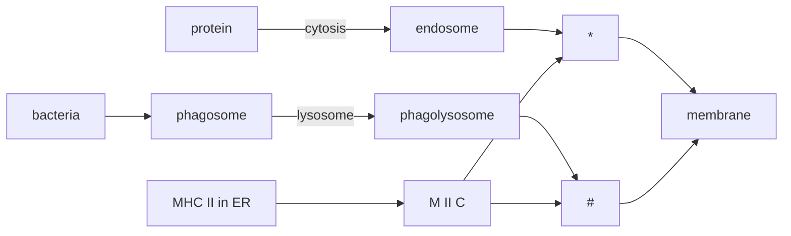

> phagosome: 吞噬体, phagolysosome: 吞噬溶酶体
> 
> 内体：利用酸性来降解
> 
> MHC二类小室 (M II C): MHC class II compartment, resembling lysosome
> 
> phagolysosome and M II C: acidic, rich in proteases, both involved in degradation! 
> 
> into 10$\sim$30 aa fragments

##### route of MHC II

Ia-associated invariant chain, Ii chain, MHC分子相关恒定链

- helps with MHC folding and dimerization (2 heavy chains)
- <u>prevent MHC from binding self-peptide!</u>
- help MHC leave ER, then in the vesicles, it's degraded and only CLIP is left

> Ia is actually a trimer. 
> 
> CLIP: MHC II类分子相关的恒定链多肽 CLass II-associated Invariant chain Polypeptide.
> 
> 

- the vesicle enters M II C, where CLIP is removed with the help of HLA-DM
  
  > HLA-DO takes away HLA-DM

- then Ag peptide is loaded and the complex is transported onto the cell surface

Still, a number of adhesion molecules bind to each other, surrounding the complex.

### MHC I pathway

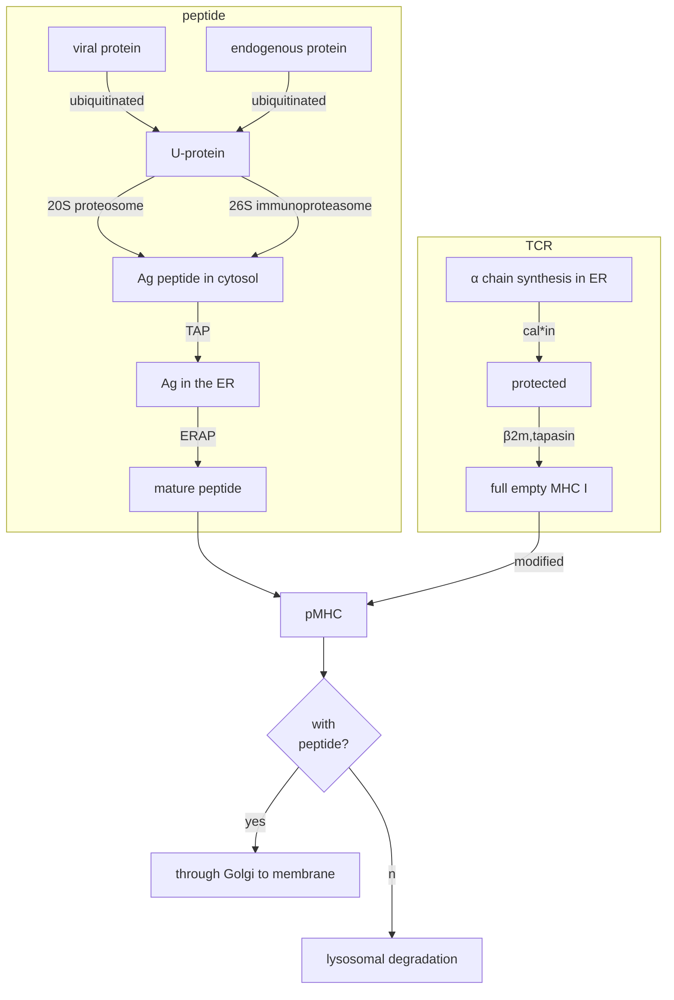

#### About peptide

- active β subunit of immunoproteasome is called LMP (巨大多功能蛋白酶体/低分子量多肽)
- TAP: TAP1/TAP2 heterodimer, forming an ATP-dependent pore that opens upon Ag peptide binding
  - TAP: ABC family. Requirement: 8$\sim$16-aa; basic//hydrophobic C terminal. 
- ERAP: ER resident aminopeptidase (ER驻留的氨基肽酶), cut the peptide into 8$\sim$12-aa length.

#### MHC structure

- MHC I is floppy, stabilized by β2m (and finally by peptide?).
- before β2m: also need 钙联蛋白; to bind TAP to get peptide: need 钙网蛋白, TAP相关蛋白

complex structure on CD4/8+ T cell

#### Comparison

### Lipid antigen

- no processing is needed

- goes the same way as MHC II (cytosis, endosome)
  
  > Sometimes they two bind to antigen on the cell surface before being recycled.

- its carrier is MHC I-like molecule CD1
  
  > CD1a$\sim$c : specific T cell; CD1d: NKT cell

### Cross-presentation

交叉呈递, MHC I and II exchange their Ag type. Just a minor pathway.

situations that can happen:

- MHC I-exo
  - exogenous Ag leaks out of its membrane and enters cytosol
  - exogenous Ag is released out of the cell and binds to an empty MHC I
  - MHC I is recyled into an endosome where it meets exogenous peptide
- MHC II-endo
  - cells/apoptotic bodies (凋亡小体) containing endogenous Ag are phagocytosed
  - endogenous Ag is released out of the cell and binds to an empty MHC II

> Application: MHC I tetramer, detecting Ag-specific CTL
> 
> 

# Chapter 10 T/B cell development

Not included in slides, but in the textbook. Helps to understand Chapter 10 and 11.

You may remember in that figure in [chapter 8](#Chapter-8-Innate-Immune-System), T and B cell have a common ancester, the differentiation of which depends on Notch1 presence.

## B cell

### BCR gene and VDJ recombination

#### Basics

Gene recombination: gene segments rearrange.

- heavy chain: Chrom 14. V (variable), D (diversity), J (joining), C (constant) regions
- light chain: Chrom 2/22, no D region

#### Recombination

> The real structure
> 
> 

- C genes are joined only after VDJ (VJ) genes have combined

- RAG1/2 cut the conservative sequences on both ends of gene segments and connect them
  
  > RAG: recombination activating gene
  > 
  > TdT also add dozens of nt to the break end (断端)

- The overall steps are shown below
  
  - heavy chain variable region first, light later
  - only one D/J is left
  
  

- a B cell clone only express one type of BCR
  
  - allelic exclusion (等位排斥): if one chromosome successfully undergo recombination, recombination on the other chromosome is inhibited
  - isotype exclusion (同型排斥): if κ chain ...., .... of the other κ chain as well as the λ chains is inhibited.

#### Ab diversity

- combinational diversity: the choice of V, (D,) J genes are independent
  
  > an estimate. (add κ and λ) multiply these numbers!
  > 
  > 

- junctional diversity: at the joining end, bases might be randomly added (by TdT) or deleted (not necessarily multiples of three)

- receptor editing: some mIg expressing B cells encounter self-Ag, but clonal deletion does not occur. RAG is re-activated and light chain VJ is recombined to renew the specificity. (If not successful, the B cell undergoes apoptosis)

- somatic hypermutation (see [chapter 13](#Somatic-hypermutation)). 
  
  The above three happen in the bone marrow, while this in periphery.

#### Appendix

> mIg and secr
> 
> 
> 
> 

### B cell development

#### In bone marrow: Ag-independent

#### B Positive selection

See [Chapter 12](#somatic-hypermutation). Periphery tolerance. Somatic hypermutation, affinity maturation, etc.

#### B Negative selection

Central tolerance (中枢耐受): in the bone marrow

If immature B cell (IgM) encounters self-Ag, it undergoes

- clonal deletion: apoptosis

- clonal anergy: not cleared but no response. 
  
  > in some cases re-activated, causing autoimmunity

- receptor editing: see above

#### Categories

| type                        | B1 cells                                      | B2 cells                     |
| --------------------------- | --------------------------------------------- | ---------------------------- |
| general                     | CLL/autoimmunity related                      | usually refered to as B cell |
| immunity                    | innate                                        | humoral                      |
| features                    | earily, spontaneous Ab                        | later                        |
| Ag                          | carbohydrate, LPS, etc.                       | various protein              |
| Ab                          | mainly IgM low affinity and polyreactive | plasma cell, IgM/G, specific |
| hypermutation & memory | no                                            | yes                          |

## T cell

### T cell development

#### Basic route and TCR gene recombination

- (祖) pre-T cell: first to express CD3
- (前) pro-T cell: become double positive
  - divided into αβ and δγ T cell (only 1$\sim$5%)
  - TCR recombination
- mature T cell: single positve

#### TCR recombination

- α: V-J like Ab light chain; β: V with D-J, like Ag heavy chain
- combinational/junctional diversity, higher probability of insertion than Ig

#### T Positive selection

in thymic cortex (胸腺皮质), T cells need to acquire:

- appropriate affinity with self MHC-peptide on the cortical thymic epithelial cell (TEC)
  
  > 3–4 days after the thymocyte first expresses a functional receptor, cTECs give it a survival signal
  > 
  > 95% cells whose affinity with pMHC is too low undergo apoptosis and are cleared by macrophages. 
  > 
  > too high? not mentioned in the English books...

- the class of MHC determines which one of CD4 and CD8 will be kept. 
  
  get MHC restriction; becomes immature CD4+ and CD8+ T cell
  
  > the other one never gets expressed then
  > 
  > MHC restriction: T-cell responses depend on specific peptide+MHC

#### T Negative selection

In the interface of thymic cortex and medulla (髓质),

those which bind too strongly to self pMHC complex on the DC (macrophage) is cleared in a similar way.

> to prevent autoreactive T cells from generating.
> 
> peptide include (just scan):
> 
> - from <u>ubiquitous protein</u>
> - a subset of cells in the thymic medulla express small amounts of <u>tissue-specific antigens</u>
>   - regulated by transcription factor "autoimmune regulator" (AIRE)
>   - in TEC, presented by TEC or DC (phagocytosing apoptotic TEC)

T cells that moderatly binds then become mature T cell and enter the periphery.

### T cell Categories

- According to developmental stage
- According to function (cytokine)

# Chapter 11 T cell-mediated Immune Response

T细胞介导的免疫应答

## Recognition of Ag and activation of T cell

### Ag processing and presenting

APCs like DCs, take up Ag in tissues, and enter lymph nodes to present Ag to T lymphocytes.

see [chapter 9](#chapter-9-antigen-presenting)!!

### Interaction between APC and T cell

A lot of molecules form pairs, making the so-called immunological synapse.

- coreceptor: CD4/8
- co-stimulatory molecules: CD28
- adhesion molecules

steps

- Adhesion molecules form transient and reversible pairs; if TCR doesn't recognize pMHC, they separate.

- If TCR binds pMHC, it induces a conformational change in LFA-1 which strengthen the binding and prevent cells from separating.
  
  

- Many TCR-pMHC complexes locate themselves in the center of cell interface
  
  - which is surrounded by adhesion molecule pairs, which makes a stable cell junction
  - These changes associate molecules to better transduce signals, i.e. activate pathways, remodel cytoskeleton, etc.

> 
> 
> Two models. left: B lymphoma cells; right: dendritic cells.
> 
> The immune synapse is also known as the supramolecular activation cluster or *SMAC*
> 
> LFA-1: Lymphocyte function-associated antigen 1, in lectin superfamily
> 
> Left model (as in text book):
> 
> - c: central, except CD28, CD2, etc.; also CD3, Lck, ZAP70, PKC-θ, etc.
> - p: peripheral. LFA-1-rich; d: distal. microclusters that resemble cSMAC
> 
> Right model: DC typically form “multifocal” synapses where TCR-containing clusters are segregated from CD28/PKC-θ containing clusters and no clear “ring” of LFA-1 is formed. (contradiction?)
> 
> *Roufaiel, Marian & Wells, James & Steptoe, Raymond. (2015). Impaired T-Cell Function in B-Cell Lymphoma: A Direct Consequence of Events at the Immunological Synapse?. Frontiers in Immunology. 6. 258. 10.3389/fimmu.2015.00258.*

### CD4+ T cell activation

> CD4+ T cell $=$ Th cell 辅助性T细胞; naive CD4+ T cell $=$ Th0 cell

Double signal model

#### 1. Ag recognition

TCR-pMHC, CD4-MHC, CD3, as above. Fundamental

CD3 mediates <u>initial activation</u> through Lck, NFAT, NFκB, etc. to promote growth and proliferation.

#### 2. Co-stimulation

Adhesion molecule like CD28

They mediates <u>complete activation</u> by additional proliferation signal, expression of cytokine and its receptor.

Without them, T cell anergy (avoid excessive activation)! 

Negative signal also inactivtes T cell

> - engineered CTLA-4 (Abatacept), inhibition, autoimmune disease.
> - CTLA-4 mAb, activation, cancer
> 
> CD28 -- IL-2 production, competes with CTLA-4 for CD80/86

#### 3. Cytokines

Induces further differentiation and proliferation.

IL-2: essential for T cell expansion. Th cell: <u>autocrine</u>

Antigen(cytokine)-specific differentiation, determines the types of response  

### CD8+ T cell activation

Roughly the same. All karyocytes express MHC I, but target cell may not express co-stimulatory molecules.

#### Th dependent

> endogenous Ag

Ag signal$+$cytokines from Th cell

> DCs express both MHC I and II. Th produces IL-2
> 
> 

#### Th indepedent

> exogenous Ag. Without IL-2, must highly express co-stimulators!!

- cross-priming: APCs also process exogenous Ag. see [chapter 9](#Cross-presentation), the figure for more.

- virus-infected APCs assemble MHC I and viral peptide in them.
  
  

## T cell effective stage

#### CD4+ T cell effect

flow charts. solid/dashed lines denote promotion/inhibition. thick solid line means "differentiate into".

##### Relationship between cells

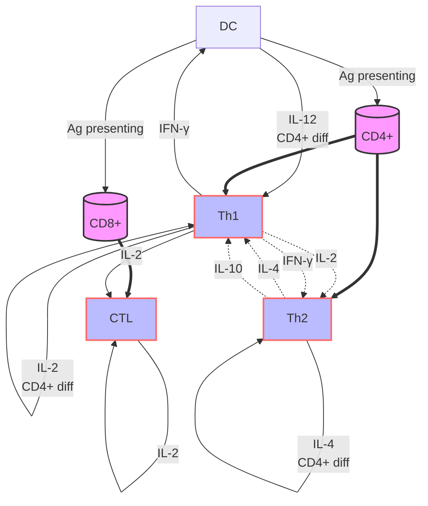

- DC is the initial activator, IL-12 to induce Th1

- Th1 positive feedback, strengthen DC and itself

- Th1 and Th2, both from Th0, inhibiting each other?
  
  > no clear result on IL-2's effect on Th2....

- CTL is activated by IL-2 (self, Th1)

##### Th1 downstream: cellular immunity

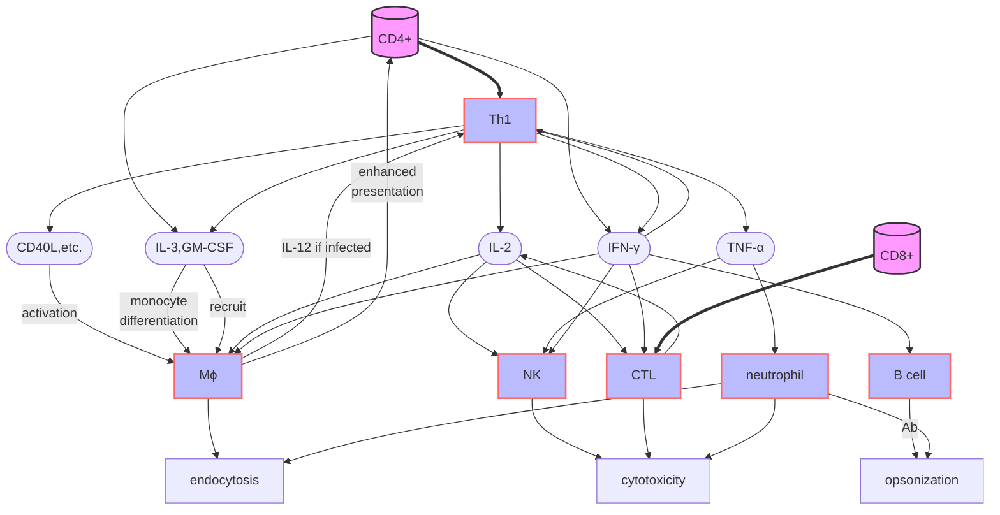

- Th1 and macrophage activate each other; monocyte diff and chemotaxis

- various cytokines activate NK, CTL, neotrophil, B cell, ....
  
  A lot is not shown...
  
  > IFN-γ activates almost all these related cells... TNF-α is also produced by NK, Mϕ, CTL, ...

##### Other Th cell and effects

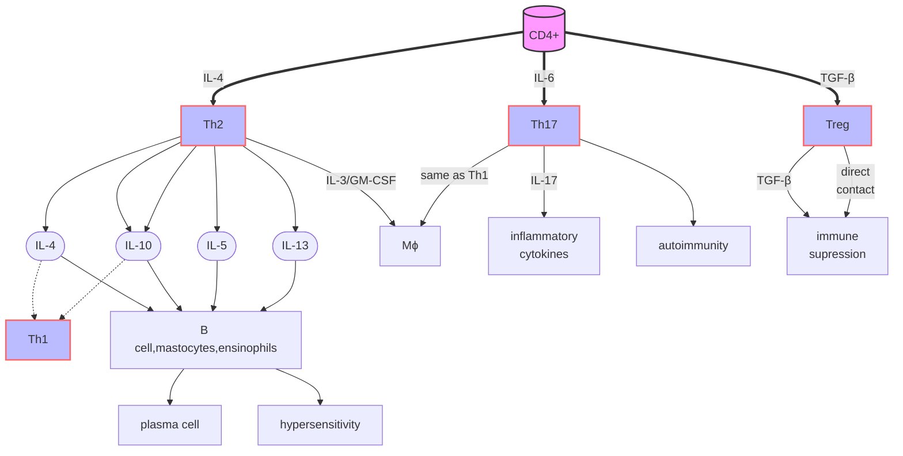

- Th2: humoral immunity
- Th17, Treg: see figure

Summary: a lot of functions are contradictory...

| response | cell type | immunity | pathogen      | hypersensitivity | other effect       |
| -------- | --------- | -------- | ------------- | ---------------- | ------------------ |
| type 1   | Th1       | cellular | intracellular | delayed          | APC, Tc            |
| type 2   | Th2       | humoral  | extracellular | allergy          | Ab class switching |

A brief recitation

| T cell subgroup | cytokines inducing their generation | major types of cytokines produced | type of response      | biological function of these cytokines                                                                |
| --------------- | ----------------------------------- | --------------------------------- | --------------------- | ----------------------------------------------------------------------------------------------------- |
| Th1             | IL-12, IFN-γ                        | IFN-γ, TNF-α, IL-2                | cell immunity         | Tc, Th differentiation Mϕ, NK activation proliferation,chemotaxis, inflammation and killing |
| Th2             | IL-4                                | IL-4, IL-10                       | humoral immunity      | B cell activation class switching hypersensitivity                                          |
| Th17            | IL-6, TGF-β                         | IL-17                             | innate (inflammation) | inflammation!! auto chemotaxis/activation                                                        |
| CTL             | IL-2                                | IFN-γ, TNF-α                      | cell immunity         | direct killing                                                                                        |

> Tfh cell: T follicular helper cell

#### CD8+ T cell effect

feature: Ag-specificity, MHC-restriction

1. 效-靶细胞结合
   
   CTLs migrate following chemokines, contact with the target cell, form immunological synapse

2. CTL polarization
   
   Upon recognizing pMHC, TCR and related molecules move towards the interface. Some organelles also re-organize so that the granules (containing perforin/granzyme) can be released.
   
   > polarization: cellular components aggregate on one specific side of the cell

3. 致死性攻击
   
   - perforin: forms a pore on the membrane like C9 does, letting in water that burst the cell
   - granzyme: get inside through the pore, cleaves Bid (and some others) to initiate apoptosis
   - FasL, TNF-α, etc: bind on the receptor and send an apoptosis signal. Fas: caspase-8 pathway
   
   > perforin: pore forming protein, also facilitates granzyme getting inside the cell. need Ca2+
   > 
   > 
   > 
   > > DTH: delayed-type hypersensitivity

## Effector T cell fate

1. apoptosis, to terminate immune response
   - activation-induced cell death (AICD): e.g. Fas expression
   - Treg induced death (see chapter 13)
2. to Tm (memory T cell)
   - CD45RA-/RO+ (exactly reverse the naive T cell)
   - rapid activation, more sensitive to Ag/cytokine
   - less requirement on co-stimulators, more cytokine production

> CD8记忆T细胞。研究结果提示
> 
> 1. CD8 Tm的产生无需T细胞分泌的细胞因子参与;
> 2. CD8 Tm的维持无需抗原持续刺激和B细胞参与，亦无需Th辅助，但有赖于与MHC I类分子的接触，可能需要T细胞CD28与CD80和CD86结合所产生的共刺激信号持续存在;
> 3. IFN-α及IL-15等细胞因子在维持CD8 Tm中可能发挥重要作用。

## T cell biological effects

- intracellular infection: 结核杆菌, fungi, virus, parasites
- anti-cancer: CTL, Mϕ, NK, cytokines
- immune damage: rejection, autoimmunity, etc.

# Chapter 12 B cell-mediated Immune Response

B细胞介导的免疫应答

## Response to TD Ag

### B cell activation: primary signal

BCR-CD79a/b-CD19/CD21/CD81 binds Ag

- BCR binds Ag. 
  
  1) causing the internalization of Ag-Ab complex for Ag presentation
  2) the activation pathway looks like TCR
  
  > - CD79a/b (also known as Igα/β): like CD3, transduction into intracellular region, with ITAM motif
  > - Fyn, Lyn: like Lck; Syk: like ZAP70?
  > - finally NFAT, NFκB, etc.

- Co-receptor: CD19/CD21/CD81
  
  > - CD21: recognizes C3d (C3b is cleaved) that is binding on the Ag
  > - CD81 stabilizes the coreceptor complex
  > - CD19 conformational change, Tyr residues are phosphorylated, recruit SH2 adaptors (Fyn, etc.)
  
  the signal might be amplified 1000 times

BCR is different from TCR in:

- recognize not only protein Ag, but also NA, lipid, polysaccharide, etc.
- recognize the natural/partially-degraded Ag, not always peptide, i.e. also conformational epitope
- no APC requirement, no MHC restriction

### Naive B cell activation

Other than the primary signal, it also needs

- secondary signal like CD40L from Th2/Tfh2 cell
  
  > without that, B cell anergy

- cytokines from Th cells, macrophages, etc.
  
  so that B cells differentiate and produce Ab.
  
  > Remember, B cells can act as APC that helps with differentiation, and express B7 for CD28 to activate Th cells. The activation is **mutual**.
  > 
  > With multiple adhesion molecule pairs, they form an immunological synapse.

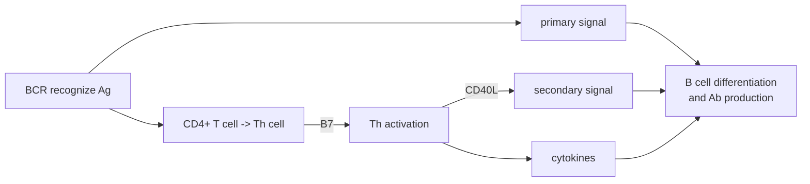

### B cell proliferation and events in germinal center

germinal center: 生发中心

#### Proliferation

| response           | region      | antibody          |
| ------------------ | ----------- | ----------------- |
| primary response   | bone marrow | produce IgM       |
| secondary response | follicles   | high affinity IgG |

Germinal center is formed (about 7 days after infection). 

> centroblast (生发中心母细胞): the core
> 
> centrocyte (中心细胞): differentiated from centroblast

| zone  | cell type            | activity                                          | gathering |
| ----- | -------------------- | ------------------------------------------------- | --------- |
| dark  | centroblast          | divide rapidly, no mIg expression, big volume     | closely   |
| light | centrocyte, fDC, Tfh | the opposite; further differentiation (see below) | loosely   |

> fDC: concentrate Ag on the surface using FcR and CR, for B cell to recognize. Maintain memory
> 
> mIg: 膜免疫球蛋白, BCR (the same gene as Ab.), heavy chain: IgM or IgD (symbol of maturation)

#### Events

A mature B cell still does not have specificity to an antigen. So what happens to it in the periphery?

All these are Ag and Th cell dependent!

##### Somatic hypermutation

体细胞高频突变

BCR genes gain mutations highly frequently: $10^{-3}$ in Fv!

> The second stage for B cell to get diversity. 

##### Ig affinity maturation

亲和力成熟：再次应答时，由于B细胞发生体细胞高频突变，产生的多种具有不同亲和力的BCR和抗体。只有最高亲和力的细胞能够继续增殖，并产生高亲和力的抗体。

Most that don't accomplish these processes will be cleared.

Cell death depends on Fas (CD95) from Tfh. Need a strong BCR signal (Ag) AND strong Tfh help in order to overcome this death signal.

##### Ab class switching

抗体类型转换：B细胞产生多种类型的抗体。其本质是在Th细胞的辅助下，V区与不同C区基因拼接，然后转录，翻译形成的。[参考视频](https://www.bilibili.com/video/BV1iL4y1b7gC/)

- No variable region changed, only C
- S region: switch region. Sμ will be followed by the S region, then C region of the chain you need.
- S regions respond to cytokine signaling and a certain type is selected. (If no cytokine, just IgM)
- Alternative splicing: obtain the mRNA where VDJC are connected

### B cell differentiation/fate

- plasma cell (Ab forming cell, AFC)
  - migrate to bone marrow and produce antibodies steadily
  - but no longer express BCR or MHC II, no response to Ag/Th
- memory B cell (Bm)
  - long live, relying on follicular DC
  - rapidly activated to produce Ig when encountering the Ag again.

## Response to TI Ag

- **No** Ag presentation, T cell required, secondary response, affinity maturation
- **No** class switching, memory (except a few of TI-2)
- shared polyvalent epitope

A comparison

| Ag             | TD-Ag                    | TI-1 Ag                                                                      | TI-2 Ag                                  |
| -------------- | ------------------------ | ---------------------------------------------------------------------------- | ---------------------------------------- |
| Ag type        | Soluble protein, etc | Bacterial cell-wall components (e.g., LPS)                               | 肺炎球菌荚膜多糖 沙门菌多聚鞭毛                    |
| receptor       | BCR                      | BCR, mitogen receptor                                                        | BCR                                      |
| target B cell  | B2                       | all B cell                                                                   | mainly B1                                |
| mature B cell? | mature                   | mature or immature                                                           | mature                                   |
| Ab type        | all types                | early, IgM                                                                   | IgM/G                                    |
| feature        | all processes above      | both the BCR and innate receptors                                            | repeated epitope cytokine-dependent |
| low dose       |                          | oligoclonal activation cross-links the receptors specific antibody | extensive BCR/CR2 crosslink              |
| high dose      |                          | polyclonal B cell activation                                                 | causes B cell anergy                     |

## General laws in humoral immunity

> - lag phase: from Ag entrance to detectable Ab
> - log phase: exponential growth
> - pleatu phase: a stable high level
> - decline phase

a comparison

| response                      | primary response 初次应答 | secondary response 再次应答        |
| ----------------------------- | -------------------------- | ----------------------------------- |
| lag phase                     | longer                     | shorter                             |
| log phase                     | 7-10 d                     | 3-5 d                               |
| Ab level at pleatu phase | Ag-dependent               | 2-3 orders of magnitude higher |
| pleatu phase                  | shorter                    | longer                              |
| Ag type                       | TD&TI                      | TD                                  |
| Ag conc needed                | higher                     | lower                               |
| B cell type                   | naive B cell               | memory B cell                       |
| Ab type                       | low affinity IgM           | high affinity IgG                   |

Secondary response can be effective months or years after the primary response.

## Ab: biological functions

1. neutralization
   
   > target toxins; prevent the pathogens from adhesion

2. complement activation

3. opsonization of phagocytes

4. ADCC effect of killer cells

5. hypersensitivity

6. cross the mucosa and placenta

# Chapter 13 Immune Tolerance

免疫耐受

> 发现：异卵双生小牛，共用胎盘，血型不同，但不发生排斥

## Basics

### Concepts

Immune Tolerance: a state of unresponsiveness of the immune system to **specific** substances or tissue.

- no immune molecules or activated lymphocytes
- these antigens are called tolerogen (耐受原)

Different from immunodeficiency! 

> That's abnormal development, proliferation, differentiation and metabolism of lymphocytes.

### Categories

- natural tolerance 天然耐受
  - came into contact **during embryonic period**
  - or after birth, 如口服耐受、妊娠耐受
- acquired tolerance 人工耐受

### Influencing factors

the opposite of [immunogenicity](#Immunogenicity:-influencing-factors)

> antigen (MW, chemistry, structure complexity, physical property, epitope, etc.), host, route of entry

- Ag dose: high-zone (too activated) or low-zone (insufficient activation) tolerance
- small protein or saccharide causes less uptake by APC, thus tolerated (oligomer is fine)
- long term existence of Ag, without APC stimulation, causes T cell tolerance
- tolerogenic epitope (耐受原表位): activate Treg cell
- it is thousands of times harder to form B cell tolerance than T cell; only high conc TI/TD Ag
  - T cell: just TD Ag. occurs rapidly and lasts months or years

other

- 口服 > 静脉＞腹腔＞肌肉＞皮内＞皮下
  
  > depends on other factors, so a substance can be both antigen and tolerogen
  > 
  > oral: Ag cleared by mucosa immunity?

- a state of immune cell generation (embryo, infants; immune clearance) is beneficial for tolerance

## Cytological mechanism

细胞学机制

### Central tolerance

is just the negative selection of T/B cells. You may refer to [T cell Negative selection](#T-Negative-selection) and [B cell Negative selection](#B-Negative-selection) for details.

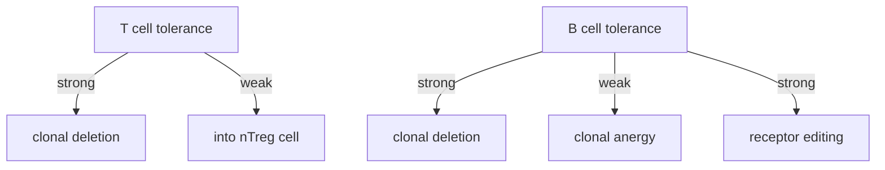

> strong/weak: TCR signal, or strength of Ag presentation

### Peripheral tolerance

Still, some autoreactive cells evade, as some of the tissue proteins are not present in thymus/bone marrow. 

Mechanisms are:

- **clonal ignorance** (克隆忽视): low expression/affinity Ag (<u>primary</u>) cannot stimulate lymphocytes

- **clonal deletion**: with Ag, without <u>2ndary</u> signal/cytokines. autoreactive lymphocytes undergo apoptosis
  
  > e.g. B cells exposed to soluble Ag monomers

- **clonal anergy**: the same, but some are always in existence. 
  
  > clonal ignorance/anergy might be reversed and cause autoimmunity

- **regulatory cells**: Treg, regulatory B cell/DC, etc.
  
  > - iTreg: like Th17, from naive T cell
  > - nTreg: natural, from autoreactive T cell in negative selection

- **immunological privileged site** (免疫豁免部位): lymphocytes cannot enter 中枢神经组织、胎盘，眼前房等
  
  > barrier; FasL, TGF-β; Th2 response, etc.

## Establishment and break

建立和打破

### Establishment/Induction

建立免疫耐受, for self Ag, [hypersensitivity](#Chapter-14-Hypersensitivity) or transplant. 

> only those mentioned in the slides are listed. check [influencing factors](#Influencing-factors) for more

- central: bone marrow/thymus transplant; inject Ag into the thymus

- peripheral
  
  - stronger tolerogen (1st signal): intravenous or oral introduction; soluble antigen, etc.
  - blocking co-stimulatory signals (2nd signal)
  - inducing immune deviation: Th2 response (e.g. by cytokines)
  - adoptive Treg cell (or other tolerated cells) transfer
  - peptide antagonists: analogs of self peptide; binds autoreactive TCR but will not send the activation signal
  
  > Ag presented by immature APC; lack of B/T cell cooperation

### Break

打破免疫耐受, for infection or tumor therapy

- first signal
  
  > strengthen DC function by: adding adjuvant; expressing co-stimulatory molecules for CD8+ T cell

- secondary signal
  
  > agnostic Ab of co-stimulatory molecules; antagonistic Ab of inhibitory molecules like PD-1, CTLA-4

- cytokines
  
  > proper usage of stimulatory cytokines and Ab of regulatory cytokines

- Treg cells
  
  > eliminate Treg cells by targeting specific receptors like CD25, TLR9

# Chapter 14 Hypersensitivity

Hypersensitivity is abnormal adaptive immune responses that cause physiological dysfunction and tissue/cell damage when we're encountering some of the antigens.

## Type I hypersensitivity

immediate hypersensitivity (速发型超敏反应) or allergy (过敏反应)

### Mechanism

#### Components

- allergen (变应原): antigens that induce IgE production and type I hypersensitivity.
  
  > through all pathways can me meet allergens
  > 
  > - 呼吸道：花粉，粉尘
  > - 消化道：蛋，奶，海鲜
  > - 皮肤：化妆品，染发剂
  > - 其他：药物，金属

- IgE: the lowest Ab in serum, concentrated in the tissues.
  
  
  
  'shrimp-like' structure
  
  - Cε2 of IgE is correspond to the hinge in IgG, Cε3 is like CH2
  - Fab of IgE is less flexible
  
- receptor: FcεR
  
  > - FcεR I: high affinity, high expression in mastocytes and basophils; 
  >   - slightly less expression in eosinophils
  >   - IgE won't disassociate from it, because of the hydrophobic interface
  > - FcεR II: low affinity, universally expressed. CD23
  >   - on B cell, IgE-Ag complex reduces IgE production
  >   - but liquid phase CD23 binds B cell CD21 to enhance IgE production...
  
  
  
  
left: basophil; right: mastocyte

  
- cells

  - mast cell
    - a mast cell expresses half a million copies of FcεR I, which can bind a vast diversity of IgE
    - long memory: may last a life time
    - mast cells are present in all vascularized tissues except the retina and the central nervous system  
  - basophils
  - eosinophils

#### Sensitization phase

致敏阶段

When the allergen enters our body **the first time**,

- IgE expression: Ag activates B cell to produce specific IgE
- sensitization: IgE binds the receptors on the three types of cells, and stays there

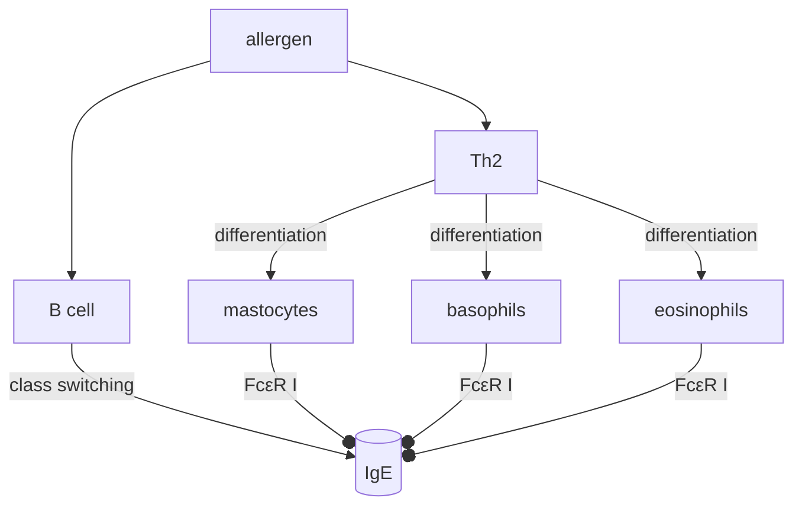

recall [chapter 11](#Other-Th-cell-and-effects) for Th2 response

#### Action phase

发敏阶段，但没找到翻译

When the allergen enters our body **again**,

- IgE cross-linking: upon IgE binding the allergen, multiple FcεR molecules form a complex and send the activation signal through its cytosolic ITAMs.
  
  > a single FcεR cannot transduce the signal
  > 
  > abnormal activation: anti-IgE Ab; anti FcεR Ab

- degranulation: the effect is, granules of inflammatory factors is released

#### Release of bioactive mediators

生物活性介质，没找到翻译。。

| reaction        | early phase reaction  | late phase reaction |
| --------------- | --------------------- | ------------------- |
| happens after   | seconds               | 2$\sim$4 hours      |
| lasts           | hours                 | days                |
| type of factors | pre-synthesized       |                     |
| main factors    | histamine,            |                     |
| main cells      | mast cells, basophils | ensinophils         |
|                 |                       |                     |

- pre-synthesized factors: granular contents, released at once
  
  > - histamine: 4 types
  > - kininogenase (激肽原酶)

- 

> - granular contents (including  and proteases) 
> - inflammatory cytokines
> - lipid inflammatory molecules (leukotrienes and prostaglandins).

a simple version of summary

> 以下，了解？

##### Factors leading to allergy

- genetic factors: easier to produce IgE, FcεR, to trigger Th2 response
- environment: hygiene hypothesis, early contact with pathogens helps to produce IgG and elicit Th1 responses preferentially

### Diseases

#### Clinical diseases

##### 全身过敏性休克

变应原：药物，抗血清，昆虫蛋白

症状：接触抗原几分钟之内出现面色苍白，四肢发凉，紫绀，血压剧降等症状。

Systemic allergic reactions can occur very rapidly and be life-threatening. They require immediate medical attention.

##### 局部过敏反应

###### 呼吸道过敏反应

支气管哮喘、变应性鼻炎

症状：血管收缩，产生粘液栓，堵塞气管

变应原：花粉等。

###### 消化道过敏反应

如对虾，鸡蛋等食物的过敏反应

症状：恶心，呕吐，腹痛等症状

###### 皮肤过敏反应

荨麻疹、特应性皮炎（湿疹）

#### Prevention and treatment

##### 诊断

1. 症状诊断
2. 过敏原检测：
   - 体内法：皮内试验，针刺试验，贴斑实验
   - 体外法：allergen-specific IgE test

##### 治疗原则

1. 查清过敏原，避免接触

2. 脱敏（desensitization）治疗
   
   - 异种血清脱敏：短间隔，小剂量，多次注射。
     
     > all granules are released, can no longer be sensitized; might be temporary
   
   - 特异性变应原脱敏：长间隔，小剂量，反复皮下注射
     
     > produce IgG, inhibit switch to IgE; block the allergen; induce Treg cell

##### 药物治疗

1）抑制生物活性介质的合成和释放：阿司匹林（PDG2），色苷酸二钠，地塞米松

2）生物活性介质作用的拮抗剂（受体）：苯海拉明，扑尔敏，异丙嗪

3）对症治疗，改善效应器官的反应性（别的途径？）：肾上腺素，葡萄糖酸钙，维生素C

##### 新兴疫苗治疗

开发能够诱导免疫耐受的疫苗；或改变应答类型 (cytokines, Th1 response)

## Type II hypersensitivity

> 名词解释？又称为细胞毒型或细胞溶解型超敏反应。当IgG或IgM与组织细胞表面的相应抗原或半抗原结合，通过激活补体，募集NK细胞，激活吞噬细胞，引起组织细胞损伤。

cytotoxic or cytolytic hypersensitivity.

### Mechanism

#### Sensitization

Antigen: a bit similar to [antigens in autoimmunity](#Antigens)

- allogenic antigen: blood type antigen, HLA, etc. (in a transplant or transfusion 输血)
- self Ag: alteration, hapten, sequestered antigen
- heterophile Ag (异嗜性抗原): common in pathogens and human

Ab: IgG/IgM

#### Cellular damage

just [effects of Ag-Ab complex](#Ab:-biological-functions)

- complement activation
- opsonization/phagocytosis (normal or [complement-mediated](#Complement-mediated-Opsonization))
- ADCC effect, cross-linking Fc receptor

irreversible cell damage, without individual difference (just Ag-Ab, not IgE preference, etc.)

### Diseases

#### Hemolysis

溶血

If you have blood type A Ag, you will also have IgM antibody for blood type B Ag. vice versa

If you are Rh-/-, you will have anti-Rh Ab.

- transfusion

  > with wrong ABO type

- hemolytic disease of the newborn (HDN, 新生儿溶血)

  -  ABO hemolysis
  - Rh hemolysis

#### Autoimmune disease

#### Ab of essential recptors

## Type III hypersensitivity

also called immune complex-mediated hypersensitivity  

hypersensitivity vasculitis

### Mechanisms

#### 

#### Type III Damage

### Diseases

## Type IV hypersensitivity

Summary of four types

|     | sensitization phase |     |     |     |
| --- | ------------------- | --- | --- | --- |
|     |                     |     |     |     |
|     |                     |     |     |     |
|     |                     |     |     |     |
|     |                     |     |     |     |

# Chapter 15 Transplant Immunity

## Immunology of transplant rejection

### History

types of transplantation

- autologous
- syngeneic (同系移植，相同遗传背景的，如同卵双胞胎)
- allogeneic
- xenogeneic

### Allogeneic antigens

- MHC
- mH (minor ...)
  - HY, on Y chromosome
  - mH, on autosome

### Innate immunity

- initiation
  - damage: 
- 

### Adaptive immunity

#### T cell recognition of transplant antigen

- direct recognition

| recognition          | APC        | host T cell  |     |               |
| -------------------- | ---------- | ------------ | --- | ------------- |
| direct recognition   | from graft | allogenic    |     | acute         |
| indirect recognition | from host  | alloreactive |     | acute/chronic |

## Types of transplant rejection

> why is transplant rejection much stronger than normal response?

### Host versus graft reaction (HVGR)

|                      | occurence time                            | mechanism                                                 | pathological features                                              | risk factors                                                     |
| -------------------- | ----------------------------------------- | --------------------------------------------------------- | ----------------------------------------------------------------------- | ---------------------------------------------------------------- |
| hyperacute rejection | within 24 hours even several minites | prestored anti-graft antibody$\longrightarrow$ complement | bleeding (attacks endothelial cells), formation of microthrombus (微小血栓) | multiple transplant (多次移植), transfusion (输血), 妊娠                 |
| acute rejection      | a few days, within a month                | T cell mediated response                                  | macrophage and lymphocyte infiltration                                  |                                                                  |
| chronic              |                                           |                                                           |                                                                         | non-immune:  immune: low-level response continuously exists |

> occurence time: after connecting vessels

一边损伤一边生长

管腔变小

最终宿命

肝肾肺心

### Graft versus host reaction

移植物抗宿主反应

requirements:

- mature immune cells in the graft
- immune suppression in the host

GVL: graft versus lymphoma. 

攻击白血病细胞. balance!

## Prevention and dilemma

### Matching (配型)

- blood type: ABO, Rh

- HLA

- cross matching
  
  - 

- pool reactive Ab
  
  anti-HLA Ab

> 混合淋巴细胞反应：host and graft
> 
> 如果增殖，说明能发生反应
> 
> 丝裂霉素处理，阻断一方的增殖，便于观察另一个

### Immunosuppressant

- non-specific
  - block proliferation: 6-MP, 硫唑嘌呤
  - anti-inflammatory drug: glycotoid (may cause 内分泌紊乱)
- lymphocyte-specific Ab
  - OKT3 (anti-CD3)
- blocking activating signal
  - like anti-IL-2R Ab, FK-506 (block PLCθ pathway)

### Problems on organ transplantation

- organ shortage
- 离体器官 storage
- 

# Chapter 16 Tumor Immunology

tumor cell usually gives endogenous Ag

### mutation

### virus

### abnormal expression

- temprol
- spatial

## Mechanism of evasion

### During recognition

- absent and of antigen
- low MHC class I expression
- absent of co-stimulatory molecules

### During effective stage

- immune supression
  - cytokines, like IL-10, TGF-β
  - induce Treg
  - inhibit DC
  - induce apoptosis (PD-L1, etc)
- anti-apoptosis
- fdsf: too fast growth (e.g. in children), too late to fight 

## Application

### Diagnosis

early!

- Soluble Ag and Ab
  
  take serum
  
  - AFP, etc
  - Ab

- cell surface Ag
  
  - isotope/fluorophore-labeled Ab, combined with iconography
    
    > need more/better label

### Treatment

> 放疗导致免疫抑制，损伤免疫细胞？

#### active

enhance anti-tumor activity

- non-specific
  
  - adjuvant like 卡介苗，短小棒状杆菌，多糖，OK432等
  - oncolytic virus

- specific: cancer vaccine
  
  > mostly therapeutic, not preventive, not those which blocks cancer-related virus
  
  - inactivated/attenuated vaccine
  - DC vaccine
  - polypeptide (with adjuvant) vaccine

#### passive

inject effectors

- antibody
  
  - block key pathways (VEGF, CD20)
  - a tool for targeting (multi-functional/bi-specific Ab)
  
  > drawbacks: cannot get through barriers; rejected by the host

- cytokine
  
  > great side effect

- lymphocytes
  
  - CIK: cytokine-induced killer (from the patient), inject back
  
  - TIL: tumor-infiltrating lymphocyte, activation--inject back
    
    > these two cannot overcome immunosuppression
  
  - CAR-T: chimeric antigen receptor.

##### CAR-T

- structure
  - extra: single domain Ab or ScFv
  - spacer: transmembrane
  - costimulatory domain, like CD28, 4-1BB
  - CD3ζ: signaling
- problems
  - CRS or cytokine storm: too many lymphocyte activated, even hurt the brain
  - not so good in solid tumor: still, immunosupression microenvironment

### Tumor Ag identification

- cDNA library of tumor cells, screen with tumor-specific T cells (tumor cell killed)
  
  > variant: wash out all peptide on the surface of tumor cells. sequence the protein and make a llibrary, still screening...

- NGS
  
  > find mutations, analyze epitopes *in silico*, verification

# Chapter 17 Immunodeficiency

> self-study, just scan...

Definition: sydromes caused by loss of immune system components and dysfunction

Features

- repeated, chronic, uncontrollable, occasional infection
  
  > 机会性病原体引发的感染。这些病原体寄生于免疫功能正常的健康宿主时不致病，但会在宿主出现免疫缺陷时入侵宿主。

- dysfunction, prone to cancer

- primary immunodeficiency: genetic predisposition

## Primary immunodeficiency

原发性免疫缺陷, PIDD

loss of function, usually in infants, causes early death

1. T, B细胞联合免疫缺陷
2. 抗体缺陷为主的免疫缺陷
3. 巨噬细胞缺陷
4. 补体缺陷
5. 其他免疫缺陷 

> SCID: severe combined immunodificiency disease
> 
> 多数为常染色体阴性遗传，如ADA（腺苷脱氨酶）缺陷，少数为X-连锁（IL-2RG）及其他基因缺陷，累及T细胞和B细胞。T-B+ or T-B-
> 
> T cell receptor excision circles (TRECs) test: TCR形成的过程中，可变区片段发生基因重组，其间DNA形成环形DNA被切除。用PCR方法扩增可得到相应的扩增产物。
> 
> 干细胞移植是治疗的主要手段，干细胞移植结合基因编辑是未来的发展方向

## Acquired immunodeficiency

获得性免疫缺陷病, AIDD

### Factors

> ...引起的免疫缺陷

1. 药物，辐射
   
   > 糖皮质激素，免疫抑制剂，化疗，放疗

2. 营养不良

3. 肿瘤，疾病

4. 感染

### AIDS

获得性免疫缺陷综合征

- 感染源：人类免疫缺陷病毒（human immunodeficiency virus, HIV）携带者及AIDS患者。
- 主要特征：CD4+T细胞显著减少，<200个/ml  

#### HIV structure

#### Phases and immunological features

临床分期与免疫学特征

1. **急性期**：免疫系统对HIV应答，产生HIV特异性抗体及CTL。

2. **潜伏期**：CD4+T细胞持续降低，免疫系统遭破坏

3. **症状期**：出现发热，淋巴结肿大等症状
   
   > 伤口难以愈合，持续加重的疲劳，无力，头痛，体温升高，皮肤感染，腹泻，体重下降，持续的发热，肺炎，持续的干咳，发热，皮肤和指甲真菌感染，疼痛，疱疹

4. 典型的AIDS**发病期**：机会感染，肿瘤，神经系统症状

#### Clinical manifestation

临床表现

① **机会性感染**： 是AIDS病人死亡的主要原因。常见的引起机会感染的病原体是卡氏肺囊虫和白色念珠菌，其他有巨细胞病毒、带状疱疹病毒、隐球菌和鼠弓型虫等；

② **恶性肿瘤**： AIDS患者易伴发Kaposio肉瘤和恶性淋巴瘤，也是AIDS病人常见的死亡原因；

③ **神经系统损害**： 约60%的AIDS病人出现AIDS痴呆症。  

#### Mechanism, diagnosis and treatment

> universally applied to viruses

损伤免疫系统的机制

1. 病毒的直接损伤
   a. 病毒释放，造成细胞膜损伤
   b. 病毒感染骨髓造血干细胞，免疫细胞生成障碍
   c. 对细胞自身蛋白和DNA合成的干扰
   d. 与未感染细胞融合造成健康细胞的感染  

2. 病毒的间接损伤作用

   1）免疫病理损伤

   2）诱导细胞死亡

3. 对其他免疫细胞的影响

   - B细胞：多克隆活化
   - 巨噬细胞、树突细胞： HIV的庇护所，传染源
   - NK细胞：功能受损  

免疫学诊断

1. HIV抗原检测
2. 抗体检测
3. CD4+T细胞计数
4. 病毒核酸检测

预防与治疗

- 预防：提高认识，切断感染源
- 主要传播途径：体液传播，性传播，母－胎垂直传播
- 治疗：抑制病毒的増殖，抗逆转录，抗蛋白酶
- 鸡尾酒疗法 ：一种蛋白酶抑制剂＋两种逆转录酶抑制剂  

迄今为止不能产生有效的疫苗的主要原因：HIV在体内复制过程中的高突变率，免疫系统干不掉它

# Additional chapter: autoimmunity

自身免疫

tolerance to self

very much resembles hypersensitivity in that we should inhibit it

## Factors and mechanisms

### Factors

#### Antigens

a bit similar to [Ag in type II hypersensitivity](#Sensitization)

- Antigens in immunologically privileged site.
  
  secluded/sequestered antigen (隐蔽/隔离抗原), proteins in those sites like crystallin, never get tolerated, causing a response (to eyes,交感性眼炎)

- Alteration of self antigen (自身抗原改变)
  
  e.g. mutation caused by physical/chemical factors, infection, or [hapten](#Concepts) binding. 类风湿

- Molecular mimicry (分子模拟)
  
  pathogens having similar epitopes as ours

- Epitope spreading (表位扩展)
  
  cells that target cryptic epitopes escape from negative selection. e.g. 系统性红斑狼疮
  
  > primary(原发)/dominant(显性) epitope: the first to induce a response
  > 
  > secondary(继发)/cryptic(隐形) epitope: buried or low content

#### Genetics

- MHC II (like HLA-DR3/4) fails the negative selection, thus autoreactive T cells survive.

- or they helps with molecular mimicry

- deficiency in genes of complement components, like C1q, C4
  
  > harder to sweep away Ag-Ab complex, continuous stimulation

#### Other

- sex hormone
- age
- environment

### Mechanisms of abnormal tolerance

- abnormal negative selection
  
  > e.g. deficiency in Fas, FasL, AIRE gene

- breaking [immunological ignorance](#Peripheral-tolerance) (low conc Ag)
  
  > e.g. infected DC, [Toll-Like Receptor](#pattern-recognition-receptor) activation (clearance of apoptotic debris)

- polyclonal Ag (on specific bacteria/virus) activation.

- [Activation-Induced Cell Death](#Effector-T-cell-fate) disorder 
  
  > e.g. Fas gene

- Treg cell abnormality
  
  > Foxp3 knock-out

- MHC II abnormal expression on target cell
  
  > IFN-γ induces pancreatic B cell...

## Mechanism of damage

### Self Ab-mediated

- directly killing cells
  
  > complement, neutrophils, opsonization, ADCC
  > 
  > e.g. 自身免疫性血细胞减少症, alteration on red blood cells

- cell dysfunction
  
  > activation: mimic ligands (弥漫性甲状腺肿, TSH) 
  > 
  > or inihibition: block receptors (重症肌无力, AchR)

- Ag-Ab complex, [type III hypersensitivity](#Type-III-Damage)
  
  > complement, inflammatory cell infiltration

### Autoreactive T cell-mediated

Th1 and CTL, [type IV hypersensitivity](#Type-IV)

> e.g. 胰岛素依赖性糖尿病 (CTL)
> 
> may cooperate with Ab

## Autoimmune disease

types: systematic (全身性) or organ-specific (器官特异性)

### Features

- High-valence self Ab or T cells are detected; accumulate in damaged tissues
- The disease outcome is related to the strength of responses; immunosupressant is alleviative
- The disease can be transfered by serum or lymphocytes

### Prevention and treatment

- prevent abnormal tolerance
  
  > avoid being infected; be careful with drugs (alteration)

- block responses to self Ag
  
  > treatment: immunosupressant; block related cytokines, Ab and receptors (by Ab, monovalent Ag,..)

- re-establish tolerance to self Ag
  
  > oral introduction; DC to mimic negative selection, clear those cells

## Homework

一、不定项选择题

1. 关于自身免疫，正确的说法是：
   
   A．自身免疫都是有害的
   
   B．自身免疫是生理状态存在的现象，对于维持内环境的稳定具有重要意义
   
   C．自身免疫如果对组织造成持续严重的损伤，则成为自身免疫性疾病
   
   D．自身免疫有利于清除衰老、坏死的组织。
   
   E．自身免疫不产生明显的炎症
   
   > BCD
   > 
   > anti-tumor?

2. 自身抗体的致病机制包括：
   
   A．针对细胞表面抗原的自身抗体引发补体活化，破坏细胞
   
   B．针对细胞表面受体的自身抗体阻断受体与配体的结合
   
   C．针对细胞表面受体的自身抗体模拟其配体的功能，对细胞产生持续的激活作用
   
   D．自身抗原与抗体结合后通过免疫调理作用和ADCC效应引起组织损伤
   
   E．循环免疫复合物沉积引起沉积部位的炎症反应
   
   > ABCDE

3. 正常组织蛋白成为被免疫攻击的自身抗原的原因包括：
   
   A．隐蔽抗原的释放
   
   B．自身蛋白因为理化、感染等因素发生改变
   
   C．病原微生物与宿主的组织细胞有相似的蛋白结构
   
   D．随着病程的进展，组织破坏的加剧，更多的表位暴露于免疫系统
   
   E．生活习惯的影响
   
   > ABCDE

4. 病原体感染诱发自身免疫性疾病可能与以下哪些因素有关：
   
   A．改变细胞表面抗原
   
   B．某些成分作为超抗原多克隆激活细胞
   
   C．基因突变导致的中枢耐受失败
   
   D．携带易感基因
   
   E．分子模拟
   
   > ABE

5. 交感性眼炎的发生与以下哪种因素有关？
   
   A．隐蔽抗原的释放
   
   B．自身蛋白因为理化、感染等因素发生改变
   
   C．分子模拟
   
   D．表位扩展
   
   E．调节性T细胞功能异常
   
   > A

# Chapter 18 Application

Only in appropriate concentration when

Protein assay

- traditional serology method: observation
  - agglutination reaction (凝集反应): on the surface of granules (virus, bacteria, etc.)
  - precipitation
  - 
- s
  - soluble:
  - surface Ag: immunohistochemical

- immunodiffusion
- immunonephelometry

Complement-dependent cytotoxic experiment

When surface Ag of a cell binds to its Ab, with complement added, cell membrane is broken and thus the pigment is in.

Cell immunofluorescence

Different fluorophore-labeled Ab, observe the distribution of multiple target proteins simultaneously.

co-localization:

Different fluorophore-labeled Ab incubate with cells, send into flow cytometry.

Incident a laser, analyze the intensity (type) of 出射光

Also, sort the cells.

Immunohistochemical techniques: where and how much are the proteins expressed?

Indirect methods

ELISA: soluble protein assay. indirect ELISA: enzyme on the secondary Ab (二抗)

- immobilize the Ag on a plate (solid medium)
- add serum from the patient, wash off other protein until only specific Ab is left
- add enzyme-linked 2nd Ab. The amount of enzyme left is correlated to the conc of patient Ab
- 

Advantages:

- Ab from human sample need modification (enzyme), impossible
- amplification

Disadvantages:

- all

Sandwich ELISA: more used for soluble protein

- immobilize its Ab on the plate. Add sample and wash
- 

Colloidal gold

IP: immunoprecipitation

- link Ab to a beads
- add sample and centrifuge
- elute off to get your Ab

CoIP

ChIP

RIP

magnetic beads:

- 磁铁吸，细胞被抗体拉走
- very fast, yet only one type of cell a time

# A homework

> 某AIDS患者罹患白血病，在接受了CCR5Δ32/Δ32基因型的同种异体造血干细胞移植后，HIV也被彻底清除。

1. 请根据所学免疫学知识，解释HIV消失的原因。

   接受移植后发生了移植物抗宿主反应（GVHR），患者原有的淋巴细胞被清除，而移植来的造血干细胞分化产生的淋巴细胞都是CCR5Δ32/Δ32基因型，不表达正常的CCR5蛋白，该病人体内也不含通过其他受体入侵的HIV变体，所以不能被HIV侵入。于是HIV将逐渐消失。

2. 非CCR5Δ32/Δ32的同种异体造血干细胞移植是否可以起到相同的作用？

   可能只能治好白血病，但不能使HIV消失。因为新的淋巴细胞仍表达正常的CCR5蛋白，能被HIV侵入。

完结撒花！感谢您的陪伴！
