# Structural Biology outline

> 植入广告：
>
> *   我搬运的[结构生物学课程](https://www.bilibili.com/video/BV1A34y1m7ie)，完整且有英文字幕
>*   我搬运的[分子生物物理学课程](https://www.bilibili.com/video/BV1gL411471e/)，讲得非常好，老师是分子动力学领域的大牛
> *   [加州理工学院 冷冻电镜入门](https://www.bilibili.com/video/BV143411k7KJ/)，也讲得非常棒
>*   [加州理工学院 冷冻电镜样品制备](https://www.bilibili.com/video/BV1r44y1i71P/)，都有英文字幕
> 
>还有很多，可以直接到[我的B站空间](https://space.bilibili.com/441196634)去看

讲这么快，肯定看个大概就行了。。总结的时候不要在意技术细节

了解这几种方法的区别，知道原理就行。现在具体的算法都有软件可以用，不需要掌握公式

> 考试要求
>
> 1. **考试题型包括单选15个，名词解释7个，简答2个，分析题1个**
> 2. 考试不涉及计算。关键公式需要掌握每项代表的物理意义，如密度公式中的相位、振幅、结构因子等
> 3. 数据库和软件不用记很多，知道PDB数据库的意思就行
> 4. 关注一些关键知识点其定义，和一些实用的信息。如根据氨基酸类型判断二级结构，晶体筛选与优化过程，晶体衍射数据收集注意事项，帕特森函数性质等。
> 4. 会给出一套数据的log统计表，判断数据质量和相关的参数
> 
> 对称性不用很深，知道原理就行。需要<u>了解系统消光，通过数据判断空间群</u>
> 消光怎样判断螺旋轴和滑移面呢
> 先按高对称性处理，观察对应hkl数据强度，判断是否存在螺旋轴
> 不会计算F中的复数怎么办呢
> 这个是需要考试的时候根据坐标自己计算F来判断消光规律吗
> 通过数据统计表判断就行
> 这个表考试时会提供吗
> 怎么根据hkl数据判断是否存在螺旋轴呢
> 这个讲过吗
> 怎样计算出晶胞参数
> 老师找个时间答疑吧，问题真的太多了
> 根据HKL是只能判断出面心，体心这些吗，还是可以判断出三斜，正交这些

## 1. 简介

- 研究内容
- 历史、发展
- 研究方法
- 重要性

结构生物学是以生命物质的精确空间结构及其运动为基础，来阐明生命活动规律和生命现象本质的学科，其核心内容是蛋白质及其复合物、组装体和由此形成的细胞各类组分的**三维结构、运动和相互作用**，以及它们**与正常的生物学功能和异常病理现象的关系**。

> 诞生：劳厄、布拉格、**沃森克里克**，1959，Kendrew和Perutz（肌红蛋白、血红蛋白）
>
> 1971，PDB建立；1972，提出结构生物学
>
> 1975，电镜，细菌视紫红质；1983，二维NMR
>
> ……
>
> 现在：结构基因组学，复杂过程，SBDD

我国科学家：人工合成结晶牛胰岛素

> 研究现状
>
> - 前沿和主流，渗入各个领域
> - 深入解释机理
> - 和健康、疾病密切相关
> - 结构测定加速发展

研究方法：XRD、NMR、Cryo-EM、各种谱学、MD。生化、生信……

```
比较：具体看后面
- X-射线晶体学
  优点:分辨率高，测定分子大; 缺点:需要制备单晶，有相位问题
- 核磁共振波谱学
  优点:溶液构象，无相位问题;缺点:限于较小 的蛋白质分子(目前MW<40kDa)
- 电子晶体学和电镜三维重构
  优点:不需大单晶，无相位问题;缺点:目前分 辨率尚不如前二者高
```

> **核酸序列**数据库
>
> - GenBank: http://www.ncbi.nlm.nih.gov/Genbank/
> - EMBL: http://www.ebi.ac.uk/embl/
>
> **蛋白质序列**数据库 (SWISS-PROT)
>
> - http://www.ebi.ac.uk/ EMBL-EBI
> - http://www.cbi.pku.edu.cn/ （不是数据库吧。。）
>
> 蛋白质结构数据库 (PDB) http://www.rcsb.org/pdb/
>
> 核酸结构数据库(NDB) http://ndbserver.rutgers.edu/
>
> 蛋白质二级结构数据库(DSSP) http://www.sander.ebi.ac.uk/dssp/
>
> 蛋白质结构分类数据库
>
> - SCOP: http://scop.mrc-lmb.cam.ac.uk/scop/
> - CATH: http://www.biochem.ucl.ac.uk/bcm/cath/  

## 2. 核酸和蛋白的结构原理

### 核酸

DNA一级结构

DNA双螺旋结构模型要点，三种结构

超螺旋

染色质结构，核小体等

多链DNA，C<sup>+</sup>GC氢键


RNA的结构？

### 蛋白

> 还是挺重要吧？

#### 概论

蛋白质分三类

#### 结构层次

##### 一级结构

哪些亲疏水

特殊的：GPC，对二级结构影响

- G：柔性；P：顺式肽键，turn

肽平面，二面角，拉氏图

##### 二级结构

骨架，氢键

- α螺旋：性质

  > 有利：AELM，不利：PGNYC

- β折叠：结构

  > 强烈：VIY，不利：E（PG？）

- β转角、β环：有功能

  > Turn: X-P-(G)-X

拉氏图；有利的AA！

二级结构可变性：pH、温度、溶剂等

超二级结构：αβα，HTH，EF hand，α loop等

复杂的：

> - Leu
> - zinc finger：α-β hairpin或两hairpin之间，Cys、His
> - 4 bundle：中间疏水
> - Rossman：平行β
> - Greek key等

折叠子（fold）：结构核心的折叠特征

结构域：……

#### 小心名词解释

> - 二级结构是**多肽链骨架（主链）**的**局部空间结构**，不涉及侧链的构象及整个肽链的空间排列。
>
> - 超二级结构：两个或**多个二级结构单元**被连接多肽连接起来，进一步组合成有特殊的几何排列的**局部**空间结构，称为超二级结构（supersecondary structure），又称为模体（motif）。
>
> - 折叠子：蛋白质分子中**主要二级结构单元**的空间排布和拓扑连接方式，称为折叠子。折叠子反映了蛋白质**核心结构**的拓扑结构模式。一个fold包含多个超家族
>
> - <font color=red>结构域</font>：折叠成**紧密的相对独立的结构实体**的肽链，有一定的三级结构，而且往往还具有**特定的、但还不完全**的生物活性。
>
>   - 一般：100~200个连续的残基。作为一个模式结构来参与蛋白质分子的装配
>   - 结构域之间的连接比较松散，具有一定的灵活性
>
> - 模块（module）是残基数较少的、结构独立性不明显的结构域
>
> - > 三级结构：指一条多肽链在二级结构或者超二级结构甚至结构域的基础上，进一步盘绕，折叠，依靠次级键的维系固定所形成的特定空间结构成为蛋白质的三级结构。
>
> - 四级结构：相同或不同的蛋白质亚单位（亚基）通过非共价键结合在一起时的组合方式

## 3. 蛋白结构与功能

蛋白质分子结构是有层次的

### 蛋白构象病

略

### 免疫分子的识别

讲得还不错，可以看《结构生物学》那本书

## 4. X射线晶体学

参考资料：

- [孙宏伟，结构化学，点群和空间群那块](https://www.bilibili.com/video/BV1P7411w7tm?p=80)，然后再看课件

- > https://www.antpedia.com/viewspace-32448 Laue、周转晶体法

- https://www.bilibili.com/video/BV1bq4y1k7TS/ 第三集，倒易空间，Ewald sphere

- https://www.youtube.com/watch?v=jvovCGHu9c8

  Ewald sphere 3D representation。旋转晶体相当于旋转球，最终能扫到的球（limiting sphere）的半径为$2\cdot\frac{1}{d}$，所以波长越小能收到更多衍射点

- Ewald球就是反射球

- https://wenku.baidu.com/view/f339b14933687e21af45a981.html 衍射定律课件

- https://max.book118.com/html/2018/0614/172432910.shtm 同步辐射晶体学衍射课件，收集和相位问题

- https://www.163.com/dy/article/FK0ATF1Q0516DOTJ.html 一个实验报告

### (0) 概述

> 伦琴发现X射线，Laue发现衍射现象，Bragg建立理论

特点

- 优点
  - 分辨率高
  - 成本较低，方法和手段成熟，向全自动化方向发展
  - 没有分子大小限制
- 缺点
  - 但**要求单晶**
  - **相位问题**
  - 非native state

> X-ray波长小，能达到原子级分辨率

流程

- 蛋白表达纯化
- 单晶培养
- 数据收集
- 相位确定
- 计算电子密度
- 推出模型并修正

其他方法：纤维衍射（双螺旋结构）、SAXS（低分辨）、中子衍射（需要大晶体、时间长）

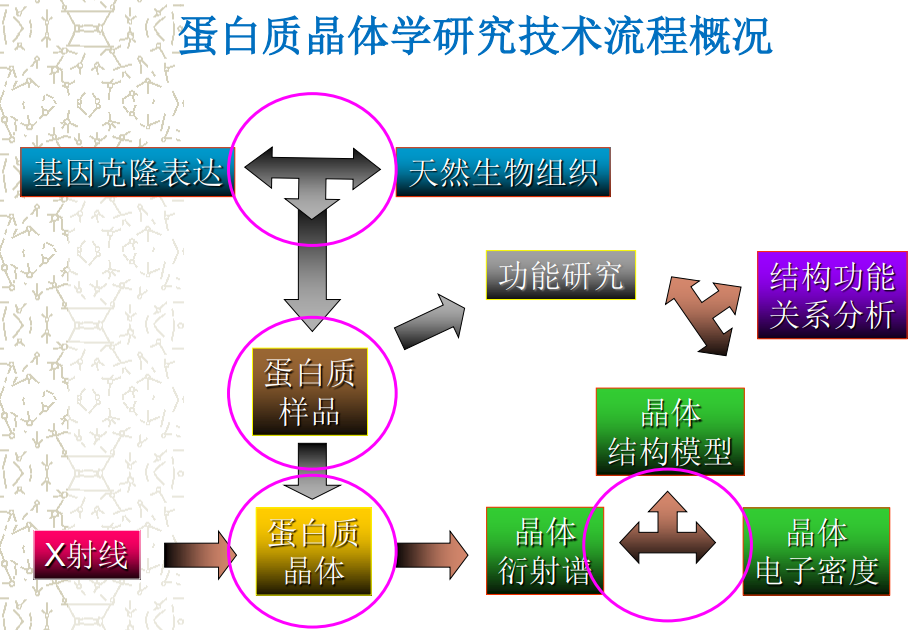

### (1) 晶体培养

依赖经验，不确定，是限速步骤

#### 结晶原理

晶体生长的过程：过饱和溶液，晶核形成、长大，成为晶体

晶核形成：均相、异相

培养的要求：晶核数少，生长速度慢（控制过饱和度）

原理：

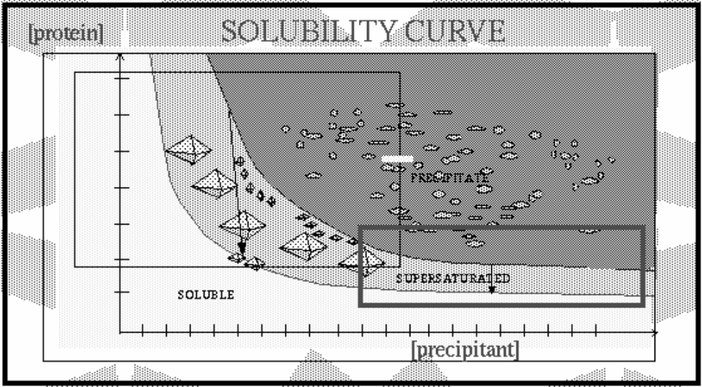

结晶是个熵减过程

#### 影响因素

- 样品纯度、均一性
- 样品浓度
- pH、温度
- 沉淀剂（无机or有机
- 金属离子
- 添加剂：乙醇、甘油等，增溶和保护
- 震动、气泡、容器的清洁度、重力等

#### 晶体培养方法

> 见手写笔记

##### 气相扩散法

母液和外液有浓度差，水从气相扩散，母液中蛋白浓度缓慢升高，条件合适时可能析出。

- 悬滴法
- 坐滴法

##### 液相扩散法

- 微量透析法

  > 界面扩散法等

用半透膜隔开母液和外液，随着扩散、离子浓度平衡，可能结晶

##### 其他

- 微量静置法：静置过饱和溶液

- > 溶剂蒸发、诱导结晶法等

> 发展趋势：微量化（nL）、自动化（机器人）

#### 摸索条件的思路

先大概，再优化

> 大概知道有啥就行，不仔细。

##### 鸟枪法

基础：许多蛋白晶体的生长条件可能是相似的。用于**摸索新蛋白**质的结晶条件，是首选。

一个试剂盒，含有50~100中曾经成功结晶过蛋白的溶液，已经配好沉淀剂、缓冲液浓度、pH。

缺点：

- **系统性**不够，有些条件比较孤立，进一步试可能浪费时间
- 如果有多个条件有微晶，也不知道哪个能继续优化

##### 网格法

选取最重要的几个因素（蛋白浓度、沉淀剂、pH），及其中几种最有效的条件（如沉淀剂取硫酸铵、PEG、MPD），尝试所有组合。

- 选定沉淀剂时，可以**系统地**探索其他条件
- 需要使用精细的网格，否则可能漏，所以初始筛选工作量（样品量）大
- 只能选特定的几种条件，没有鸟枪法**多样**

##### 随机法

**根据经验手动选择**一些组合，如0.1M沉淀剂A和pH=5\~7，0.2M沉淀剂B和pH=7\~9等，多套组合

总结：系统性和工作量总是矛盾，随机法介于中间

##### 其他生长方法

参考同类蛋白的结晶条件：可作为初始条件。突变体、复合物可能成功，同源蛋白成功率都不高。

理智设计初始配方：软硬沉淀剂共用

接种法：放一个微晶

**共晶法**：复合物晶体，蛋白和大分子配体一起结晶。对亲和力要求并不高

**浸泡法**：把大分子的晶体浸泡在小分子的溶液中，制备复合物晶体or重原子衍生物

高压气体中，制备掺入重原子的晶体

#### 蛋白样品制备

天然蛋白太少，基本使用分子生物学手段来生产，生化手段纯化

> 要求：
>
> - 化学组成均一
> - 分子构象均一

要考虑产物量的量级：微克、毫克……

重原子取代物的制备

#### 晶体的鉴别和储存

##### 鉴别

> 和小分子晶体的区别

- 衍射实验：解结构
- 晶体外形
- 晶体硬度和脱水情况：大分子较软易碎，脱水后损坏
- 偏光性能：大分子更弱
- 染料染色：考马斯亮蓝染色鉴定蛋白质
- 晶体密度：大分子悬于结晶液滴上

<u>适合X射线</u>的晶体，需考虑：外形，尺寸，抗X射线照射能力，是否为单晶，晶体缺陷，……

不同蛋白不同条件可能产生相同晶型，同一蛋白不同条件可能不同晶型，蛋白种类对结晶影响大……

##### 储存

- 母液：室温下用毛细管封装
- 液氮超速冷冻：效果好（保持结构、耐辐射），成本高

### (2) 晶体学基本知识

#### 晶体的点阵结构

> 晶体：三维周期重复排列
>
> 点阵点：重复部分抽象成一个点

根据点阵、按照对称元素划分晶胞。要求对称性最高、体积最小

晶体分为

- 单晶：整块晶体只有一个点阵
- 孪晶：两个或以上同种单晶，按一定对称性结合。仍可拿来测结构
- 多晶：许多，随机排布
- 微晶：颗粒是微米数量级，难测结构

#### 对称性、晶系、空间群

对称性：根据一定几何元素（对称元素），经过一定操作（对称操作），点阵恢复原状

##### 对称元素

- 宏观：旋转轴（$n$）、镜面（$m$）、对称中心（$i$）、旋转反轴（$\overline{n}$）
- 微观：平移、滑移面、螺旋轴

> 微观就是加了平移的几个
>
> 第一类对称元素（不带反映、反演的），不产生对映体；第二类对称元素，产生对映体  

##### 对称变换

- 反演

- 旋转：1,2,3,4,6次

  > 对称操作：转$\dfrac{m}{n}\ (n=1,2,3,4,6, m=\forall\mathbb{N^*} < n)$圈

- 旋转反演

- 螺旋旋转：n<sub>m</sub>轴：C<sub>n</sub>轴+沿轴上升m/n个周期（转一圈上升m个周期）

##### 晶系

根据宏观对称性划分为7个晶系：立方、六方、四方、三方、正交、单斜、三斜。有约束条件

点阵基本类型：P、C、I、F。共14种空间点阵类型

##### 点群

对称元素的组合

点群和空间群符号

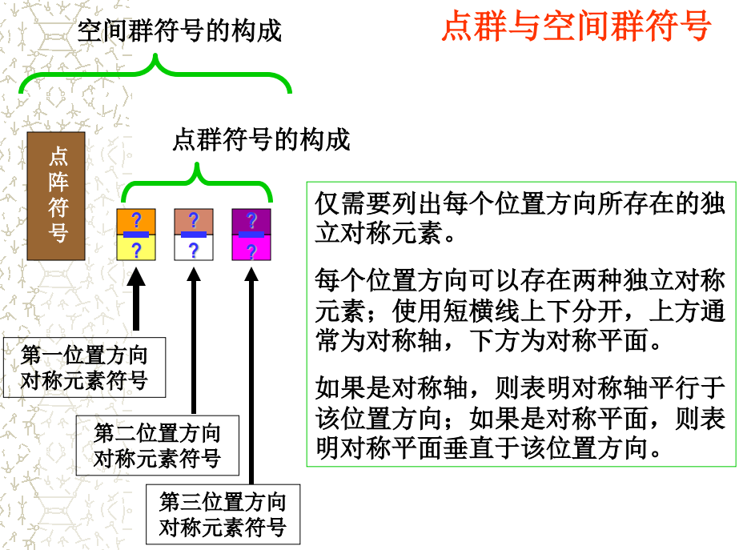

32种点群表

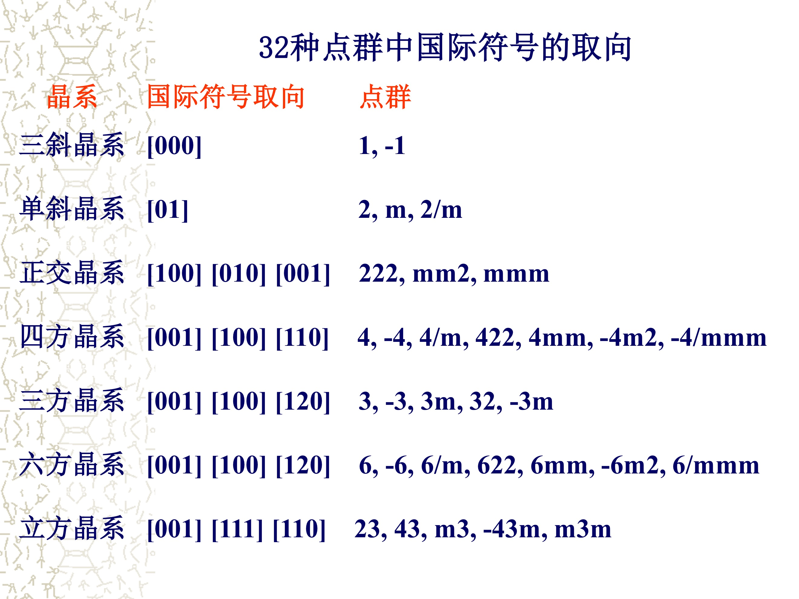

##### 空间群

微观对称元素的组合

等效点系：一个点经对称元素操作后和另一点完全一致

> 具体对照手写笔记
>
> 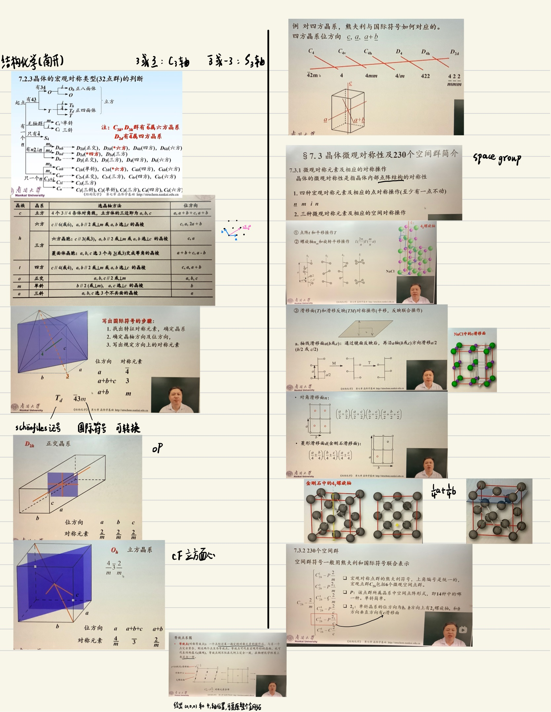
>
> 

P2<sub>1</sub>2<sub>1</sub>2这种：大概都是abc三个方向？

> 最小体积重复单元：不对称单位
>
> 原点的选取，优先次序：高对称点的对称中心---低对称点的对称中心---……
>
> 坐标轴的轮换与对换
>
> 坐标变换矩阵

#### 蛋白质晶体

蛋白本身有手性，不存在能引起手性的对称变换，所以蛋白晶体可能的空间群仅**65个**。

> 本来230个；
>
> 劳厄群：32个点群中的11种中心对称点群→衍射花样Friedel’s Law  


由于密堆积和互作的需要，螺旋轴出现概率高于普通旋转轴。


> 若两个晶体空间群相同，晶胞参数差别小 (1%)，则称二者是同晶的
>
> 不同条件可能不同晶体

#### 赝对称

近似满足某种变换

二聚体、四聚体，使对称性升高？

#### 单位晶胞的成分

Matthews常数$V_M=V_{cell}/(N_z\cdot M_r)$，$N_z$是单位晶胞的蛋白分子数。一般蛋白$V_M=1.7\sim3.5\mathrm{\text{Å}^3/Da}$.

可用于推测结构、估计晶体含溶剂的体积分数

> 假设某个蛋白质的空间群为C2，单位晶胞总体积为 319,000 Å3 ，该蛋白质的分子量为32,100Da，对于NZ = 2, 4, 或 8 来说，相应的VM = 5, 2.5, 或 1.25 Å<sup>3</sup>/Da。根据 Matthews常数的经验分布规律，该蛋白质晶体的单位晶 胞中包含4个分子的可能性是非常高的。因为C2空间群 的晶体晶胞具有4个不对称单位，所以每个不对称单位 包含一个蛋白质分子。

### (3) 衍射数据收集

#### 晶体的安装和处理

普通显微镜下观察：表面光滑，棱角尖锐，无裂纹、断层……然后

- 毛细管密封法
- 低温冷冻法（套环）

#### X射线概述

##### X射线源

强度越大，误差越小，要求的晶体大小越小。同步加速器是上百上千倍

- 旋转阳极：0.1~0.5mm
- 同步辐射：20~40μm

##### 发生方法

###### 封闭的X射线管

阴极的热电子撞击阳极的金属靶，小部分能量转化为X射线

###### 旋转阳极X射线管

解决了散热问题

> Cu靶：
>
> Kα1 1.54051 Å，Kα2 1.54433 Å，Kβ 1.39217 Å
>
> Kα1的强度约为Kα2的两倍， 故Kα平均波长取为1.54178 Å
>
> Mo靶导热性没那么好，若使用封闭管。0.71 Å

###### 同步辐射装置

带电粒子以接近光速的速度在环中运动，改变方向时，被朝着环心加速并射出电磁波

优点：

- 主要是强度高。弯铁挺高，wiggler更高
- 光束的低发散性。斑点更锐利
- 波长的可调性（挑出想要的）。如1Å的可以减少吸收和衰减
- 时间分辨率高。Laue法可以在短时间收集多套数据
- 偏振化。

单色器：除了Laue法都要用。X射线管用石墨、双面镜等，同步辐射有专用装置

##### X射线的探测（略

###### 像板探测器（IP）

X射线曝光激发像板材料，磷光能保存较久时间，其中蓝光和接收X射线的量成正比

优点：

- 灵敏度高，尤其对于同步光源；响应范围宽
- 可重复使用
- 但还是胶片，阅读需要一些时间

###### CCD（略

#### 数据处理

##### 倒易空间

一个点阵，选个原点，其余点到它的距离等于该点对应晶面族的面间距的倒数。

过原点画一个圆心在X射线入射方向上的、半径为$1/\lambda$的圆（球），在其上的倒易点阵点满足Bragg' law，叫Ewald sphere

Diffraction pattern 就是 a 2D projection of a 3D reciprocal lattice


##### Laue法（Laue's Method）

用白色X射线打静止不动的晶体

Laue星芒：晶体内部结构畸变时，会产生衍射斑点的伸长

##### 小角度回摆*

（周转晶体法，oscillation/Rotating-crystal method）

单色X射线，晶体围绕某个轴旋转，底片与轴垂直


#### 影响衍射强度的若干因素**

> 复习晶体学。结构因子为
>
> $$
> F_{hkl}=\sum_{j=1}^{N}f_i\exp\left[i\cdot 2\pi(hx_i+ky_i+lz_i)\right]\\
> \text{or}\quad F(\boldsymbol{H})=\sum_{j=1}^N\exp\left[i\cdot 2\pi\boldsymbol{H}\cdot\boldsymbol{r_j}\right]\\
> \text{where}\ \boldsymbol{H}=(h,k,l), \boldsymbol{r_j}=(x_j,y_j,z_j)\\
> $$
> $f_i$ 为散射因子。$\boldsymbol{H}$是倒易矢量

晶体安装方式：

- 室温：玻璃毛细管，残留母液
- 液氮低温冷冻

##### 镶嵌块

晶体会对X射线产生吸收（类似Lambert-Beer定律），和波长、晶体有关

真实晶体由许多晶块（“完美”晶体）镶嵌而成

镶嵌块是足够小的，初级消光可以忽略

强度等于各块之和，但不同块可能相互影响

##### 热运动

原子在振动，长时间可以平均。温度越高越振动，分辨率越高结构因子越下降

温度因子：给$F_{hkl}$乘一个因子，$\exp\{-B_j\sin^2\theta/\lambda^2\}$

- 各向同性温度因子，热运动效应
- 各向异性。。（高分辨）
- 假定所有原子B值相同

给$F$再乘一个$Q_j$（原子或分子局部构象的占有率），描述部分没有占据严格相同取向的一些分子的影响，和B相关

##### 辐射衰减效应

晶体对X射线的耐受，一段时间后难以校正。不同晶体不同，波长越短越损坏

#### 衍射数据收集若干问题

##### 分辨率

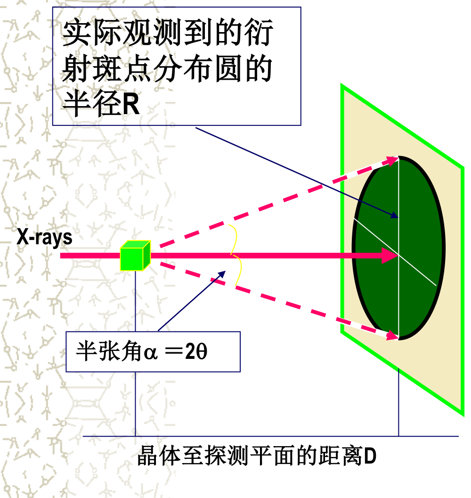
$$
\tan\alpha=R/D\\
\theta_{max}=\alpha/2\\
2(1/|H_{max}|)\sin\theta_{max}=\lambda
$$
$1/|H_{max}|$为晶面间距，$|H_{max}|$为估计的分辨率的数值。**角度越高**，分辨率越高（可是后面分辨率都用的是距离

可以根据随着分辨率增加，衍射斑点的平均强度的下降来了解晶体内部的有序度

> ##### 单晶性质的判断
>
> 斑点的形状，是否锐利
>
> 如果两个点非常接近，可能：不是单晶、D太小、晶胞某个方向太长

##### 晶体和探测器间距的选择

$\Delta R$代入上公式，$\theta$ 和 $H$ 取min。

**距离越短**，分辨率越高，但可能导致斑点重叠

> $\alpha$ 不变，$D$ 缩小，$\Delta R$ 缩小

##### 回摆角度、画面张数、曝光时间的设置*

- （单次）回摆角度

  - 回摆角度过小，导致每张画面上的衍射斑点过少；但噪声减少

    > 并会导致部分记录反射，一个衍射点可能分布在几张连续的画面上，需要在后续阶段将它们的强度合并。但是不准，有时不计。还是要增加回摆角度

  - 回摆角度过大，有可能导致画面上的衍射斑点重叠（不就是过多嘛）。

    - 通常取1~2°
    - 晶胞大时需要适当减小角度


  > 是不是，回摆那个范围的所有衍射点被记录在一张image上了

- 总旋转角=回摆角度×画面张数。对称性越低的晶体要求总旋转角越大

- 曝光时间越长，衍射强度高？但更易损坏晶体

##### 衍射盲区

实际工作中，在晶体耐辐射能力、保证完整收集数据的允许下，应尽可能增加总旋转角，即尽可能获得多个独立衍射区的强度数据，能（平均以）减小误差

##### 晶体的安装方式

- 室温：方便，误差大
- 液氮：成本高，耐辐射能力强，可延长曝光时间

##### X射线波长的选择

- 衍射强度$\propto \lambda^3$
- 长波可增大衍射强度，但吸收效应强
- 常规封闭管，用Cu的K<sub>α</sub>，传热好，对分辨率要求也不高
- 同步辐射，波长短，像板探测更灵敏，且使斑点锐利，防止重叠
- 晶体尺寸较小，强度太弱，使用同步辐射，获得高分辨率数据
  - 蛋白质晶胞体积大，本身强度就弱

##### X射线取向的选择

实际可随机，但若晶体对称性较高，合适的角度能收集到更多衍射点

> 以上四个提纲没提？

##### 反常散射的数据收集

> 反常散射：违反Friedel定律

获得尽可能多的**Friedel反射对**: $I(+h,+k,+l)$ 和 $I(-h, -k, -l)$

假设晶体属于单斜晶系，若入射X射线与2次旋转对称轴垂直， 则根据上述衍射几何可以保证反常散射对F(+)和F(-)同时出现。

多波长反常散射：每张画面依次收集三个波长的衍射数据，即λ1 → λ2 → λ3 → 转动晶体 → λ1 → λ2 → λ3 →……  

解决相位问题的一种方法

#### 衍射数据的收集与处理

> 评估之前的提纲没说

##### 指标化（indexing）

$$
\begin{aligned}
\boldsymbol{H}&=x\boldsymbol{a}+y\boldsymbol{b}+z\boldsymbol{c}\\
&=(\boldsymbol{a},\boldsymbol{b},\boldsymbol{c})(x,y,z)^T\\
&=(\boldsymbol{a^*},\boldsymbol{b^*},\boldsymbol{c^*})(h,k,l)^T
\end{aligned}
$$


目标：从(h,k,l)反推回(x,y,z)坐标

recall:

- H是正常坐标系的三维坐标(x,y,z)？？(h,k,l)是倒易空间的坐标

- $$
  \boldsymbol{B}(h,k,l)^T=(x,y,z)^T
  $$

- $(a^*,b^*,c^*)$是倒易空间的基矢，模长为1埃

> strange! 
>
> $(x\boldsymbol{a}+y\boldsymbol{b}+z\boldsymbol{c})\cdot(h\boldsymbol{a^*}+k\boldsymbol{b^*}+l\boldsymbol{c^*})=hx+ky+lz$

基本步骤：

- 挑选若干个强衍射斑点并测定其正常坐标
- 计算出若干个可能的单位晶胞
- 调整修正参数

##### 强度积分 (integration)、合并 (merging)、振幅的还原

指标化后，就把强度积分一下。。


##### 晶体学参数测定若干问题

用软件能辅助

一般指标化就可以判断点阵类型了

- 选取对称性最低、尽可能不产生系统消光的空间群，作为强度积分与合并的依据

- 积分、合并后，再根据算出来的系统消光、衍射强度关系，推出更多对称元素，修正点阵类型

  > 从简单开始，不要丢失赝对称！

因为手性，蛋白质可能有的空间群有65种

##### 衍射强度数据的质量评估

1. 衍射分辨率

   > 晶面间距越小，要求分辨率越高，要求θ越高，越难收集

2. 数据（衍射点）完整度

   > 一般要求：> 80 %
   >
   > 理论衍射点数与分辨率倒数的三次方成正比

3. 强度的信噪比（强度/偏差）：I/sigma

   > 越大越好，应>2。每个衍射点都有
   >
   > sigma: 强度的偏差error，指个别测定值与测定的平均值之差。sigma就是强度merge产生的误差
   >
   > 见《单晶结构》p64

4. 数据合并的偏离因子R<sub>merge</sub>（越大越不好）

   > 重复测量的衍射点，重复数据是否相差大。
   > $$
   > R_{merge}=\dfrac{\sum\limits_\boldsymbol{H}\sum\limits_jABS\left(<I_j(\boldsymbol{H})-I(\boldsymbol{H})>\right)}{\sum\limits_\boldsymbol{H}<I(\boldsymbol{H})>}
   > $$
   > 是对一部分（某壳层）衍射点求和的

5. 对称性相关衍射点重复测量的平均次数redundancy冗余度

   > 为观测衍射点数目与独立衍射点数目的比值， 应大于4

6. 同种晶体不同个体，衍射数据的分别收集，能合并的程度

7. Wilson统计。线性拟合

   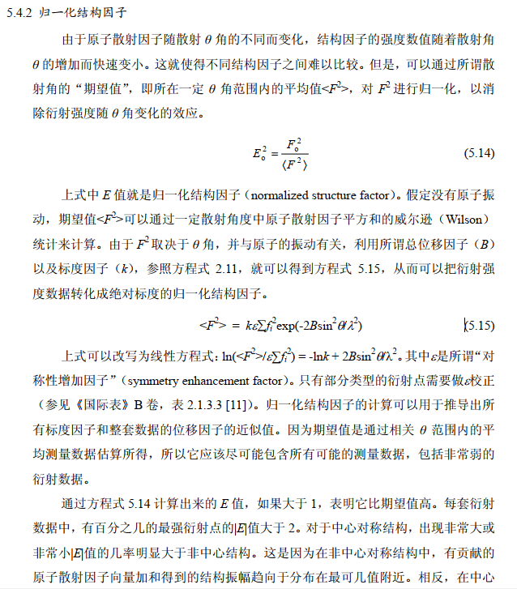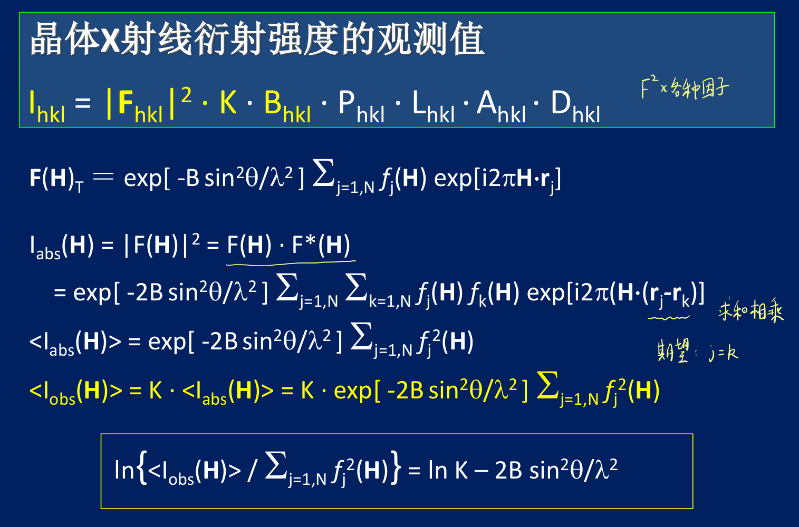

###### 补充：软件使用&数据处理

https://people.mbi.ucla.edu/sawaya/m230d/Reduce/reduce.html 关于indexing等具体讲解

https://www.youtube.com/watch?v=aPgS8_wluS4 软件操作+讲解

https://hkl-xray.com/sites/default/files/HKL2000manual-2020/12-OutputStatisticsGraphs.htm

软件：HKL2000

> - $\chi^2$
>
>   > if χ2 > 1 and you see a clear resolution dependence of the χ2 for scaling with merged Friedel pairs (i.e., the χ2 increases as the resolution decreases), there is a strong indication of the presence of an anomalous signal. The resolution dependence allows you to determine where to cut off your resolution to calculate an anomalous difference Patterson map with an optimal signal to noise.
>
> - Linear R-fac
>
>   - 就是R<sub>merge</sub>
>   - 应该<50%
>
> 都是描述是否有反常散射的
>
> ```
> R linear = SUM ( ABS(I - <I>)) / SUM (I)
> R square = SUM ( (I - <I>) ** 2) / SUM (I ** 2)
> Chi**2 = SUM ( (I - <I>) ** 2) / [(Error ** 2) * N / (N-1) ]
> ```
>
> 

- 导入数据，display衍射图

- peak sear（找到衍射峰）

- 指标化（点index，已经确定了空间群？）

- refine几次（注意$\chi^2$值）后确定晶胞类型

- peak情况（红色：rejected，黄色：多张图片上有intensity）；zoom放大查看

- integrate所有图片，然后

  > Integrated intensities are written to .x files, One .x file for each film

- scale---scale sets：normalize，combine，merge
  - 先用low symmetry space group 来 scale，再check space group
  - 选好选项，再scale sets，如果check后有更高对称性，调整好（reindex）后再scale sets，就可以在space group处选更高的，再scale sets
  - 要一直scale sets直到稳定，迭代

###### log file analysis

指标见上

- 统计性质

  - 要分（分辨率的）壳层（lower/upper limit)
  - 每个衍射点都有一个

  

- 下面那个是上面的加权平均


I/sigma的分布


各种指标


系统消光


> 所有带**平移操作**的对称元素(包括带心点阵、滑移面、螺旋轴）都会产生系统消光现象
>
> 系统消光规律是确定晶体空间群的重要依据
>
> 分析系统消光规律的次序：晶格、滑移面、螺旋轴

##### 发表数据（初步分析）应注意的问题

> 提纲也没说

- 实验
  - 样品来源、制备方法
  - 条件的摸索，最终配方，晶体外形
  - 基本晶体学参数：空间群、晶胞参数、不对称单位分子数、溶剂含量等
- 数据质量评估结果：如上多个，还有衍射图
- 初步分析
  - 对内部结构的推测
  - 同源蛋白晶体参数比较
  - 分子聚合状态分析

#### 数据解析

数据的质量和以下有关：晶体的质量、光源的强度、收集的方法

##### 一般要求

- 分辨率：λ/2sinθ，θ越大分辨率越高
- 理论衍射点数和1/d的三次方成正比
  - 完整度一般要求80%

##### 数据的处理

- 数据校正
  - KBPLAD
- 多套数据的合并

##### 解析的步骤（详见后）

- 确定相位
- 计算电子密度图
- 结构精修

### (4) 结构测定中的几个问题

#### 相位问题的总体考虑**

要知道电子密度函数，需知道

- 单位晶胞电子密度函数（结构因子）
- 空间点阵函数（倒易点阵）

电子密度方程（要算的），由结构因子**做逆傅里叶变换**得到
$$
\begin{aligned}
\rho(x,y,z)&=\dfrac{1}{V}\sum_h\sum_k\sum_lF_{hkl}\ e^{-i\cdot2\pi(hx+ky+lz)}\\
&=\dfrac{1}{V}\sum_h\sum_k\sum_l\left|F_{hkl}\right|e^{i\Phi_{hkl}}e^{-i\cdot2\pi(hx+ky+lz)}\\
F_{hkl}&=V\cdot\iiint\limits_V\rho(x,y,z)e^{i\cdot2\pi(hx+ky+lz)}\mathrm{d}V
\end{aligned}
$$
其中$x,y,z$是空间任一点的坐标。

衍射强度为
$$
I_{hkl}=K|F_{hkl}|^2
$$
衍射强度经过校正（$K$）后可以得到$|F|$，但无法从实验直接获得相角$\Phi$，是X射线晶体学的第二个瓶颈。

#### 相位确定的方法

按方法学分类，相角问题的解决涉及到下列若干种方法：

1. 同晶差值傅里叶法(Difference Fouier Analysis) 
2. Patterson函数与重原子法(Heavy Atomic Structural Analysis) 
3. 多对同晶置换法(Multiple Isomorphous Replacement，MIR)及其与反常散射(Anomalous Scattering)的联合使用(MIRAS) 
4. 单对同晶置换法(Single Isomorphous Replacement，SIR)及其与反常散射(Anomalous Scattering)的联合使用(SIRAS)
5. 多波长反常色散法(Multiple wavelength Anomalous Dispersion, MAD)
6. 单波长反常色散法(Single wavelength Anomalous Dispersion, SAD)
7. 分子置换法(Molecular Replacement，MR)
8. 直接法(Direct Method)

##### 同晶差值傅里叶法

Isomorphous difference Fourier method

用途：

- 已知晶体结构的大部分，测定未知的小部分（如突变体、加个配体），它们是同晶（空间群相同晶胞参数相差小），可以通过修正得出待测晶体的模型
- 通过电子密度的表现，检测模型的正确与否
- 同晶：晶胞参数<1%

##### Patterson函数与原子间矢量法

只使用衍射强度来推测结构

> 看书也比较好

###### 推导

改用坐标$\boldsymbol{U}=(u,v,w)$

定义
$$
\begin{aligned}
P(\boldsymbol{U})&=\dfrac{1}{V}\sum_\boldsymbol{H}|F_{hkl}|^2\cos\left(2\pi\boldsymbol{H}\cdot\boldsymbol{U}\right)\\
\rho(\boldsymbol{R})&=\dfrac{1}{V}\sum_\boldsymbol{H}|F_{hkl}|\exp\left[-i\cdot 2\pi\left(\boldsymbol{H}\cdot\boldsymbol{R}+\alpha_{hkl}\right)\right]
\end{aligned}
$$
where
$$
\boldsymbol{H}=(h,k,l)\\
\boldsymbol{R}=(x,y,z)
$$
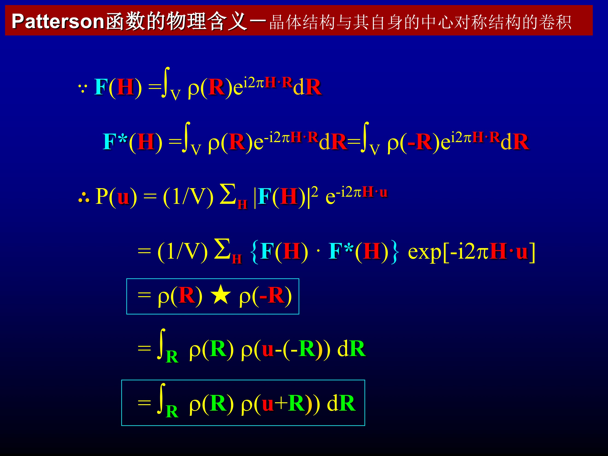

可以推导出其和电子密度的数学关系
$$
P(\boldsymbol{U})=\int_\boldsymbol{R}\rho(\boldsymbol{R})\rho(\boldsymbol{U}+\boldsymbol{R})\mathrm{d}\boldsymbol{R}
$$


只有当两个位置相差$\boldsymbol{U}$的点处，$\rho$ 都不为零，$P(\boldsymbol{U})$才不为零

###### 性质

- 峰的位置（三维），为原子间矢量

- N(N-1)个非原点峰

  - 总是中心对称

- N个原点峰，自己和自己

- 强度和两原子的电荷数之积成正比

- 是周期性的，与晶胞的周期性完全一致

- Patterson晶胞仅存在不包含平移的对称元素

  Patterson对称群，是蛋白晶体可能有的空间群中，去掉含滑移面、螺旋轴、不含对称中心，剩下的

###### Harker峰

Harker截面或Harker线，就是同一套等效点的原子组成的帕特森峰。


蛋白质分子都是CNO，差别不大，容易重叠。

其重原子衍生物中，重原子相关峰很强，数量少，可以用程序鉴别出来，得到重原子位置，再得到其他原子的位置

###### 蛋白晶体的Patterson函数

自身Patterson矢量：分子内原子间矢量相对短，在意Patterson晶胞原点为球心、某个长度$r$为半径的球面之内。

交叉Patterson矢量：分子间原子间矢量相对长

##### 分子置换法

> 同源：序列不一定相同（identical），但尺寸、疏水性等性质可能相同
>
> 序列同源，很可能三维结构折叠类型也同源

同源**但不同晶**的，用分子置换法（同晶的用同晶差值傅里叶法）。亚单位可能同源

需要先旋转、后平移，让二者的结构单元superimpose。然后算Patterson函数的相似性

###### 同源蛋白的选取

- 比对时，应<u>删除易变性较强、测量误差大</u>的residue
- 删除<u>非蛋白分子</u>
- （同源蛋白的）各向同性<u>温度因子</u>指定为相同的值
- <u>选取</u>合适的结构域、（寡聚体中的）单体
- 多试几个同源蛋白

等

###### 旋转问题

旋转A或B都可

旋转B后Patterson函数为$P_{B,R}(\boldsymbol{U}_R)$，计算二者的相似性（？），最大重叠时旋转函数最大

旋转函数定义为
$$
R(\alpha,\beta,\gamma)=\int_
VP_A(\boldsymbol{U})P_{B,R}(\boldsymbol{U}_R)\mathrm{d}\boldsymbol{U}
$$

积分域为半径为某个 $r$ 的球面

> 为啥转了以后Patterson函数会变？

###### 平移问题

平移后的结构因子振幅和统一蛋白的结构因子振幅，的R因子最小或（模平方的）相关系数最大

$$
R=\dfrac{\sum_\boldsymbol{H}|F_o(\boldsymbol{H})-F_c(\boldsymbol{H})|}{\sum_\boldsymbol{H}F_o(\boldsymbol{H})}
$$
where $F_o(\boldsymbol{H})$ 是待测晶体，$F_c(\boldsymbol{H})$ 是已知晶体

密堆积分析：寡聚体？

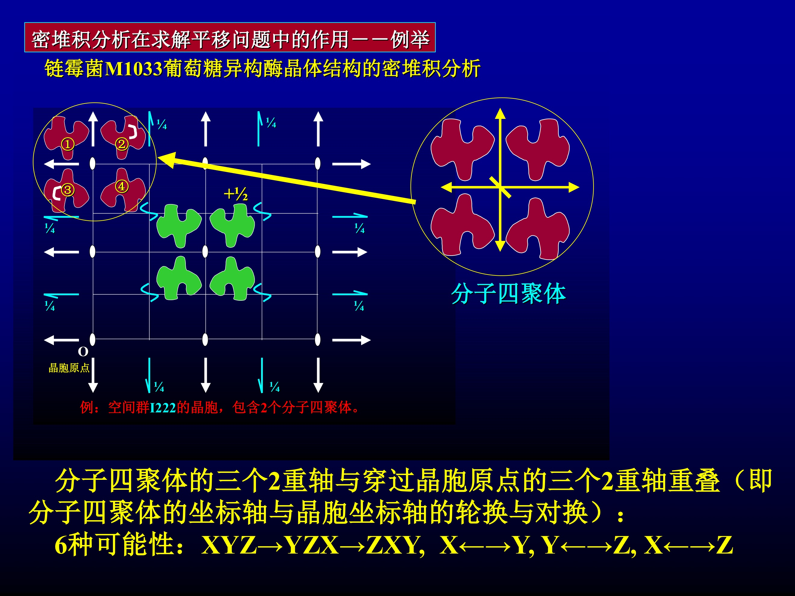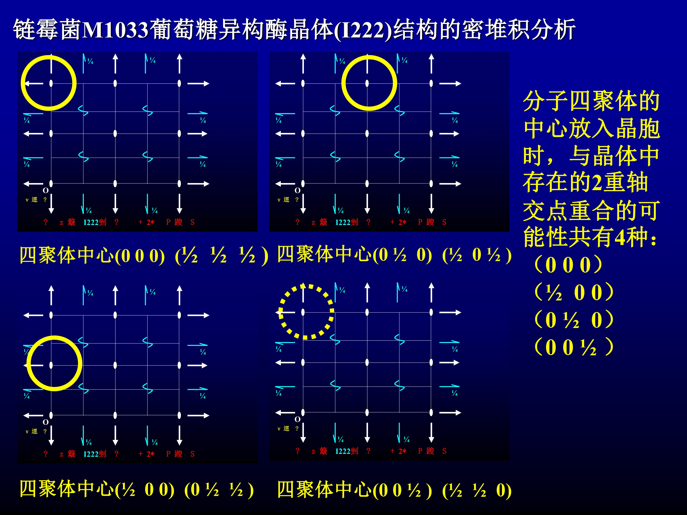

共有24种分子置换的方式，缩小了搜索范围


平移函数：类似

> 前面不是已经有目标函数了吗


##### 多波长反常色散法

（multi-wavelength anomalous dispersion）

浸泡法或用含重原子的培养基养菌，能得到重原子取代物。

1个Se/150 residues对MAD就够了


要的是F<sub>BA</sub>和G的夹角$\Delta\phi$

$F_h=F_{BA}+G$，把$G$代进来换成$F_A$。$F_A$的系数随着波长变化


可能有双解问题，解出电子密度再判断

#### 相位的确定总结

##### 同晶置换法（MIR）

通过比较正常蛋白和多个包含重原子的晶体的衍射模式，推断重原子的位置，进而推断相位

- 适用于全新蛋白的结构测定
- 操作复杂，计算复杂

##### 多波长反常散射法（MAD）

反常散射效应随波长而变化。采集多个波长的数据，可确定相位

- 适用于全新蛋白的结构测定
- 只要一个重原子衍生物，就有多个方程
- 要求波长可调的同步辐射源，对数据精度要求高

##### 分子置换法（MR）

用已知类似物的三维结构作为初始模型，经**旋转和平移**得到待测蛋白初始模型

- 需要同源蛋白，越相似越准确
- 只要一套数据，计算简单

##### 同晶差值傅里叶法

差异很小的、同晶的蛋白，用人家的结构来计算相位，计算更简单


### (5) 第五节

#### 电子密度图的计算和解释

##### 解释

显示：把电子密度相同的点连起来，形成等高线图

- 低分辨率（>4.5Å），能看出大小
- 中（2.5~3.5）：肽链走向、部分侧链
- 高：正确的分子模型

解释：至少中分辨率的+氨基酸序列

##### 结构精修

使模型计算的结构振幅得到最好的拟合。迭代。。

- 早期：使模型计算的电子密度和测得的拟合。迭代。。
- 现在：倒易空间的最小二乘法修正，改成结构振幅。R因子

##### 结构模型的表达

结构模型的表达：实体、计算机

数据文件：

- PDB
- mmCIF
- ASN.1

mmCIF：也叫PDBx，用键值对的方式存储，便于处理，没有每行第几个字符是啥的限制，据说数据库内部都在用？一部分软件也支持 https://mmcif.wwpdb.org/docs/faqs/pdbx-mmcif-faq-general.html

### 模型的构建和修正

首先trace多肽链的走向，关键！

追踪的关键是电子密度图的质量！分辨率不够高、质量差（误差）是主要的误差来源。

总结要点：

- 保证质量，使用软件
- 充分利用residue信息
- 先找易确定的（如侧链大的Phe，Trp等），再向两边扩展
- 先找质量高的，如helix，sheet
- 检查合理性、密度的连续性等，迭代。。

> 以下是提纲没有的
>
> - 同源结构：总体上问题不大，局部需重新判断
> - 新蛋白：只能从头判断
>
> 高分辨率能用类似小分子的程序，中分辩只能原子团，用蛋白的程序

#### 计算电子密度函数

使用FFT加速

算法不写了，有空看吧，不考。

- 衍射空间独立区的半球扩展
- Lipson分解和1D傅里叶变换

$$
F_{hkl}=V\cdot\iiint\limits_V\rho(x,y,z)e^{i\cdot2\pi(hx+ky+lz)}\mathrm{d}V
$$

先试一堆原子，有其电子密度的模型（函数），叠加起来得到整体的$\rho$。

用上式（傅里叶变换）转成结构因子，和实验数据比较

#### 结构模型的修正

总体流程

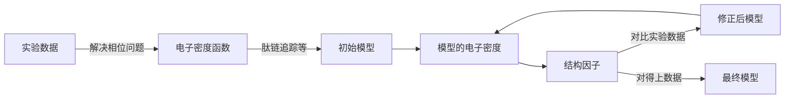

分为

- 倒易空间
  - R因子
  - R<sub>free</sub>因子
  - Luzatti作图等
- 实空间
  - 亲水和疏水基团的空间分布、原子间过近接触
  - Ramachandran作图
  - 模型和电子密度的拟合，观察
  - 实空间（电子密度的）相关系数、残基温度因子的分布、水分子结构和分布等
  - 立体化学参数和理想值的偏离

##### R因子

晶体学R因子
$$
R=\dfrac{\sum_\limits{hkl\subset W}\Big| |F(hkl)|_{obs}-k|F(hkl)|_{calc} \Big|}{\sum_\limits{hkl\subset W}\Big| |F(hkl)|_{obs} \Big|}
$$
自由R因子
$$
R=\dfrac{\sum_\limits{hkl\subset T}\Big| |F(hkl)|_{obs}-k|F(hkl)|_{calc} \Big|}{\sum_\limits{hkl\subset T}\Big| |F(hkl)|_{obs} \Big|}
$$
$k$为比例因子，$W$为“用于修正”的hkl，$T$为“用于监测”的hkl，后者范围小，仅占5~10%。

粗糙的模型的R因子可达50%，修正后需要到20%或更低。R<sub>free</sub>稍高

修正：通过最小二乘法调整F表达式中的参数（占有率、温度因子等），直到收敛

##### 立体化学参数和理想值的偏离


##### 别的想看的也看一下

算啦


## 5. 冷冻透射电镜三维重构

- 优点：样品制备简单；自然状态结构；对样品（是球蛋白、膜蛋白、复合体）没有限制
- 缺点：（曾经）分辨率低；成本较高

### 透射电镜TEM

电子波长降低，分辨率也变高

#### 仪器结构

- 电子透镜系统（镜筒）：照明系统（电子枪、聚光镜）、成像系统（物镜、中间镜、投影镜）、观察系统（荧光屏？CCD）
- 真空系统
- 电源系统

和普通光镜的光路相似


#### 模式

成像模式和衍射模式。前者看到的是像，后者是衍射点


#### SEM和TEM区别

- 透射电镜：电子和原子核互作，反映透过样品的电子束强度，样品必须很薄
- 扫描电镜：发射二次电子，分辨率低，视野大，损伤小

### 理论基础

从二维投影重构三维结构

中央截面定理：物体的二维投影像的傅里叶变换等于物体的通过原点且与投影方向垂直的一个截面（中央截面）的三维傅里叶变换。累积二维的FT得到三维的FT，逆变换成三维结构。


> 许多截面，所以能看到里面！

> 去年的，不管了。。
>
> 三种方法
>
> | 方法       | 样品             | 特点     | 分辨率（现在？ |
> | ---------- | ---------------- | -------- | -------------- |
> | 电子晶体学 | 二维晶体         | 周期排列 | >0.19nm        |
> | 单颗粒技术 | 病毒、大complex  | 全同粒子 | >0.33nm        |
> | 断层成像   | 细胞器、组织切片 | 单一结构 | 4nm            |
>
> 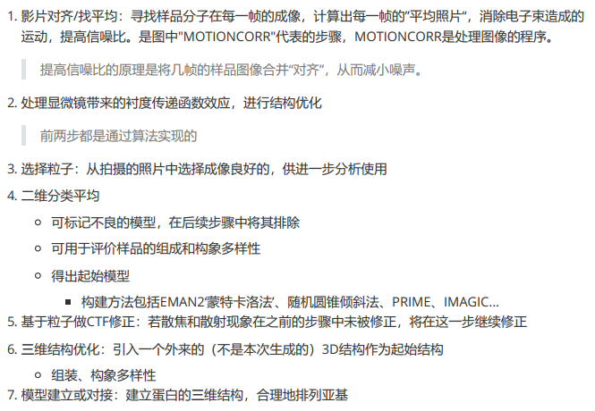
>
> 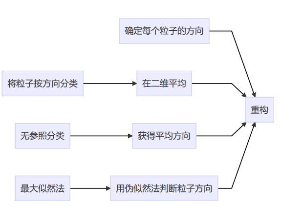
>
> 模型偏好 (model bias)：优化结果偏向于初猜的模型，可能导致对结构的错误解释。对异质性的样品进行分类分析，可以通过分区的比对和整体比对进行分类
>
> ……

### 冷冻电镜技术

#### 概述

特点：

- 分辨率：3~30Å（现在好多了）
- 适用范围：晶态和非晶态俱可，复合物也可
  - 样本可以是：小晶体、薄膜、单颗粒、螺旋纤维等
- 虽然也是衍射？没有晶体学的相位问题，且还可以成像

流程：制样→冷冻→拍摄→采集数据→处理、三维重构→结构分析、评价

方法分类

- tomography
- 单颗粒重构
- 2D电子晶体学
- 微电子衍射

> #### 蛋白二维晶体的生长
>
> 这节提纲也没说
>
> 膜蛋白二维晶体的特征：连续的脂双层或单层，规则地排列着蛋白质，多种形态，靠疏水相互作用维持
>
> 膜蛋白二维晶体的生长
>
> - 膜中重排，天然或诱导形成晶体
> - 负提纯、透析
>
> 水溶性：在脂单层表面结晶？？

#### 样品制备

器材：铜网，碳膜支持

- 负染色（过去的方法）
  - 高电子密度的染色剂沉积在蛋白分子周围
  - 增强衬度，常用醋酸铀（重金属）
  - 只能外部形貌，分辨率低，脱水后影响结构
- 糖包埋技术
  - 用葡萄糖、海藻糖等包埋，替代水
  - 可以保持生物大分子的结构、结晶水，分辨率较高（2Å）
- 冰包埋技术
  - 用液氮极速冷冻到-160℃以下，蛋白处于非晶态的冰中
  - 保持天然结构，防止损伤，分辨率高，现在最好的办法


如何包埋？金属网格吸一层液体，滤纸吸一下，只剩薄液膜，塞进液态乙烷

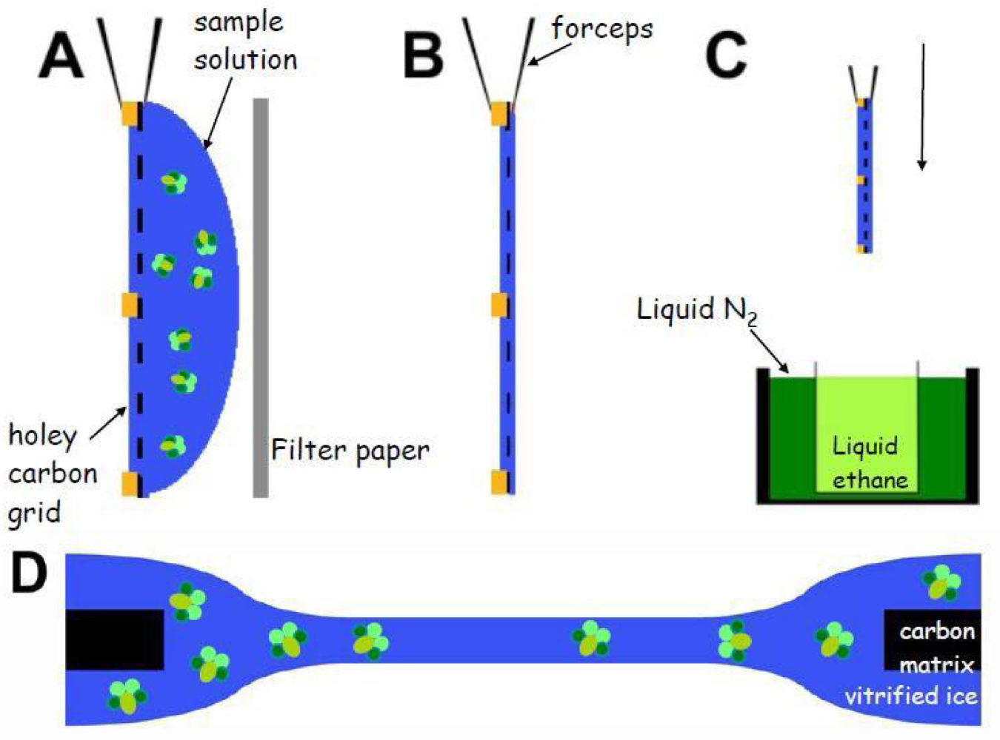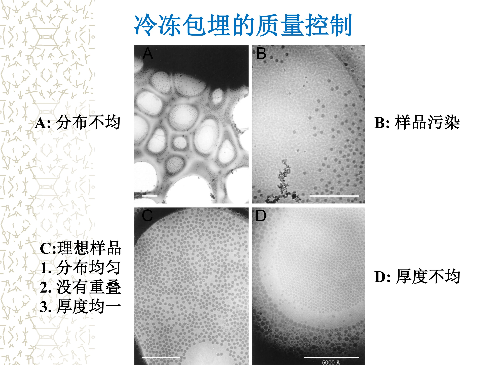

#### 电镜观测和记录

样品在辐射下易产生损伤，要低剂量（low dose），<20e/Å。越高越模糊


低剂量技术：

- 寻找：低倍下进行 (1-3k)
- 聚焦：照相区域的相邻区域 (100-300k)
- 记录：照相区域仅在记录时受到辐射 (30-60k)

#### 数据的收集和处理

- 显微像的和电子衍射信息的获取
  - 多角度照相
  - 低温电镜技术
  - 低剂量技术
- 数据处理
  - 图像数字化
  - 三维重构

> 其他：single particle analysis，仪器参数
>
> ### 应用
>
> - 大的蛋白复合体结构
> - 动态过程
> - 三种蛋白都可
> - 异质性样品
> - 不需要结晶
> - 增长迅速
>   - 一堆大文章
>   - 算法进步，分辨率高

## 6. 核磁共振解析结构

### 概述


> 获得原子间的距离信息，结合约束获得模型。已知一级结构

#### 限制

分子量受限：易重叠；弛豫时间减少，峰变矮宽。

一维<80AA，**常规HCN标记可达200AA**。（特殊氘标记可达700AA）

- 优点：自然状态，对分子无损；误差极小
- 缺点：
  - 分子量受限（15-25kD）
  - 要求样品纯度高
  - 只能测水溶液中的，对膜蛋白或病毒等的组装体、复合体就无法测定  

#### 样品

- mM/L级别
- 均一溶液
- 没有聚合
- 10%D<sub>2</sub>O
- pH<7.5的Tris或磷酸、醋酸盐缓冲体系
- 加NaN<sub>3</sub>、蛋白酶抑制剂，室温能放一周

#### 一维实验

先做一维谱，看有没有结构

> 二维：HN-HSQC
>
> 多维：自己选哪些核


#### NOE和J-coupling

> Overhauser发现，当核外电子自旋或相邻磁性核的核自旋发生共振并达到饱和时，偶极偶极相互作用引起核自旋态分布变化，使得待观察的核的信号强度增加。这一效应称为核Overhauser效应(nuclear Overhauser enhancement, NOE). 

NOE**与空间作用距离的6次方成反比**，其空间作用距离<5~6A.

> 有了距离就可代入公式，计算效应的大小

> Magnetization transfer through space > NOE
> Magnetization transfer through bonds > J-coupling
>
> J-耦合：是自旋核与自旋核间的相互作用，在谱图可引起谱线裂分，这种偶合作用是通过成键电子传递，发生在化学键相连的磁性等价核之间。
> NOE效应：任意两原子核由于偶极-偶极相互作用所产生的相互影响。该效应与化学键无关，只与距离相关  

#### 多维实验的命名


按传递顺序命名。还要传回来。括号是只传递不共振的

### 实验

#### 样品制备

- 基因克隆
- 表达纯化
  - BL21，色谱，SDS-PAGE检测
- 同位素标记
  - M9培养基：葡萄糖，无机盐，<sup>15</sup>NH<sub>4</sub>Cl
- 准备样品：如前所述

采集数据

#### 数据处理和解析结构

流程看小标题！

##### 数据处理

- 线性预测等：补全缺失值？

- **傅里叶变换**（多维：每一维都考虑）

  - FID曲线经过FT变成一个峰

    

- 相位、基线校正

##### 化学位移校准

- 重要
- DSS，(CH3)3SiCH2CH2CH2SO3Na，校准质子
- 以DSS的 0 ppm处的频率乘以换算因子得到异核的 0 ppm的频率  

##### 初步鉴定

<sup>1</sup>H-<sup>15</sup>N HSQC  

- 除了Pro，每个resiude至少有一个峰
- 峰分散程度越高，折叠程度越高；都是一坨说明无序

##### 三维实验、化学位移指认

> 参考概述
>
> 背一下方法。都是说：有这个信号，俩基团就在一起

化学位移：原子的身份证。可用来确定是哪个residue。（HSQC就可，3D也同时用）

###### 主链指认

指认：序列的链接、氨基酸类型

主链指认：HNCACB-CBCA(CO)NH联用

> 我没理解错的话，前者找同一residue的Cα和NH，后者找Cα下一个residue的NH


###### 侧链指认

(3D) HCCH-COSY与HCCH-TOCSY连用  

> 我没理解错的话，前者找同一个C上的H，后者找下一个


> COSY：H和H的同核二维；TOCSY：加了spin lock

芳环：(HB)CB(CGCD)HD，(HB)CB(CGCDCE)HE

###### NOE可以指认both主链和侧链

> 因为只要靠近的就可以。详见下面的NOE信号表
>
> 前两个是J-coupling

###### 总结


##### 结构计算

实验得到的是约束信息：距离（distance geometry, 氢键等）、二面角（主链、侧链，肽键）等

- 不完备、不精确
- 根据距离几何或约束的分子动力学模拟计算约束下的构象

约束生成，from NOE

- 指认
- 转化为距离
  - 通常可检测<5Å
  - 距离不太精确
  - 得到大量距离，可推出结构

二面角约束可来自Ramachandran图

> 判断二级结构，可用特定NOE信号
>
> 
>
> 耦合常数也是
>
> 

##### 结构评价

能量、二级结构、拉氏图、RMSD（收敛）


## 7. 分子模拟和结构预测

分子模拟不用看了

预测大概也不用。。。

但是搞模拟的人真的都开始用AlphaFold来建模了，还是应该关注一下

## 8. 结构基因组学

……

## 9. 其他生物物理方法

> 这个提纲也没提，怕不考。。

### 简介

#### 紫外-可见

蛋白的FYP有苯环，随环境而变

应用：

- 推断生色团位置，是否暴露
- 热变性动力学，结合和解离

#### 荧光

蛋白的FYP吸收荧光

应用：基本相同，还有二硫键、氨基、聚合等？

#### 圆二色谱

整体二级结构

#### 激光拉曼

特征振动

二级结构、相互作用

#### 红外光谱

### 小角衍射

NMR受限多，晶体学样品难

SAXS（small angle X-ray scattering）：50μL溶液，0.1-10mg/mL，无分子量限制、晶体结构改变，时间短、实验简单、原位、动态

1. 得不到详细信息，能看出**分子的大致形状**

   > 用球谐函数拟合外形

2. 能看到柔性的loop区域

3. 分析复合物中各亚基位置

4. 晶体学的packing force可能推出错误结论

   - eg：转录因子的linear-bent

5. 能分析溶液中是几聚体

理论和技术仍有待发展

### 自由电子激光

FEL（free electron laser）

用相干性很好、强度很高的X光来照射分子，即使晶体不那么好（分子排列不够有序），仍能相干产生信号

用同步辐射的电子同时发光，产生激光，但能量是X光量级的

问题：

- 使分子离解。但能收够数据
- 相位问题：过采样即可
- 探测，单分子

能量太高，如何固定样品，什么装置？

- spraying techniques
- 固定在冰中

……


## 终极总结 

一个纯列表、极简单的大纲

1. 结构生物学
2. 大分子结构原理
3. 蛋白结构功能
4. X射线晶体学
   - 概述
   - 单晶培养
   - 对称性
   - 实验
     - 安装
     - X射线
     - 数据处理
   - 结构解析
   - 相位的确定
     - 适用于新蛋白
       - 同晶置换
       - 多波长反常散射
       - Patterson函数与重原子法
       - 直接法
     - 适用于有同源结构的蛋白
       - 同晶差值傅里叶
       - 分子置换法
5. 电镜三维重构
6. NMR技术
