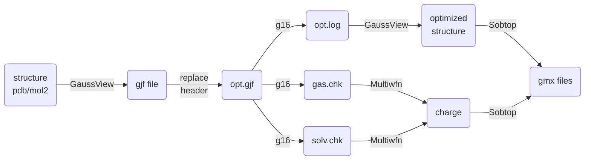
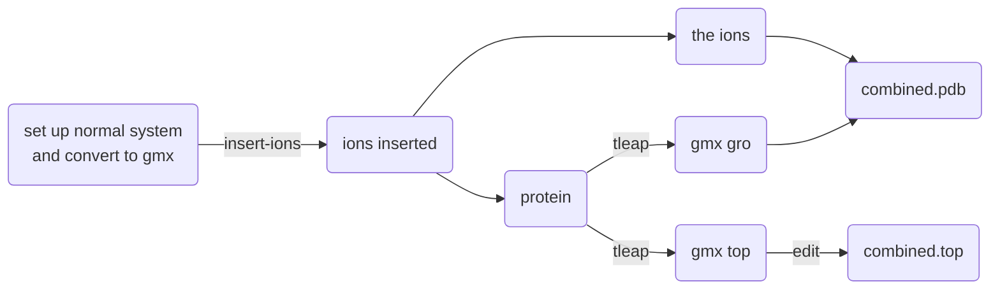

# Metal ion

From the PSKR1-Al<sup>3+</sup> project. Modeling (inclulding advanced FF parametrization) and simulation (maybe advanced techniques) involving metal ions. Maybe related literature and binding site prediction.

- setup with tleap and convert to gmx with parmed
- Amber special setup (e.g. MCPB.py), or Gaussian+Sobtop
- special MD (US, etc.), see Enhanced sampling

## First things to know

see also: [academic notes](academic-notes.md#metal-and-metalloproteins)

- Alkaline earth metal ions are expected to bind to dsDNA through electrostatic and van der Waals interactions due to their closed-shell electronic structure; therefore, classical force fields can accurately model DNA–ion interactions of alkaline earth metal ions.

- parameter fitting targets: IOD, HFE, CN, diffusion coefficient, water exchange...

  water residence time or exchange rate, coefficient of diffusion

- we should consider charge transfer or covalent bonds, which may be important for accurately modeling transition metal ion interactions with dsDNA. old force field may fail to do this

- 

- 


## Aluminum

Despite its natural abundance, however, it has been excluded from biochemical evolution, and thus has never been assigned any biological function in living organisms. The reasons for this apparent paradox are not clear.

why does Al<sup>3+</sup> inhibit kinase activity by replacing Mg<sup>2+</sup>? Al<sup>3+</sup> is a stronger Lewis acid, which should have promote the catalytic process. Is it true that Al<sup>3+</sup>-PPi won't leave the active site after the reaction?

铝离子应该不会MLCT啥的


# Binding site prediction

- structure-based

  - template-based
    - **MIB2** (https://doi.org/10.1093/bioinformatics/btac534): no Al3+
    
      [MIB2 Home (cmu.edu.tw)](http://bioinfo.cmu.edu.tw/MIB2/), turn on the global proxy
    
    - **IonCom**: https://zhanggroup.org/IonCom/ no Al3+, 2016
    
      - they only predict the binding residues?
    
    - https://gitlab.com/Jukic/made_software
    
      pymol plugin, aligning all kinds of homology structures and cluster
    
      supports PDB and AlphaFold template? no found...
    
      custom files: manually specify template....
    
    - [PROTEINS: Structure, Function, and Bioinformatics | Protein Science Journal | Wiley Online Journal](https://onlinelibrary.wiley.com/doi/10.1002/prot.26085)
    
      no resources? only five types of ions
      
    - 
    
  - template-free
    - **BioMetAll**: Identifying Metal-Binding Sites in Proteins from Backbone Preorganization

      [Welcome to BioMetAll’s documentation! — biometall documentation](https://biometall.readthedocs.io/en/latest/)
    
  - learning

    - **MetalSiteHunter**: Zn, Fe, Mg, Mn, Ca, and Na

      [Mohamad-lab metalsitehunter](https://mohamad-lab.ai/metalsitehunter/)  cannot set box size, only the center?? at least usable

      [An ensemble 3D deep-learning model to predict protein metal-binding site - ScienceDirect](https://www.sciencedirect.com/science/article/pii/S266638642200340X)
    
    - **Metal3D**. online usage: [ColabMetal.ipynb - Colaboratory](https://colab.research.google.com/github/lcbc-epfl/metal-site-prediction/blob/main/Metal3D/ColabMetal.ipynb). no metal type, like BioMetAll. but hard to install...
    
      [Metal3D: a general deep learning framework for accurate metal ion location prediction in proteins | Nature Communications](https://www.nature.com/articles/s41467-023-37870-6)
    
    - [DELIA (sjtu.edu.cn)](http://www.csbio.sjtu.edu.cn/bioinf/delia/)  single chain
    
      ATP, HEME, Mn2+, Ca2+, Mg2+
    
      http://www.csbio.sjtu.edu.cn/TargetS/   older version??
    
    - 

- sequence-based

  - mebipred: [Mebipred v 2.0 (bromberglab.org)](https://services.bromberglab.org/mebipred/home) 

    (Fe, Ca, Na, K, Mg, Mn, Cu, K, Co, Ni) all ions are No?? 

    [mebipred: identifying metal-binding potential in protein sequence | Bioinformatics | Oxford Academic (oup.com)](https://academic.oup.com/bioinformatics/article/38/14/3532/6594112)

  - LMetalSite or [Biomedical AI Platform (nscc-gz.cn)](https://bio-web1.nscc-gz.cn/app/lmetalsite): no Al3+. An alignment-free sequence-based predictor for binding sites of the four most frequently seen metal ions (Zn2+, Ca2+, Mg2+ and Mn2+).

    [Alignment-free metal ion-binding site prediction from protein sequence through pretrained language model and multi-task learning - PubMed (nih.gov)](https://pubmed.ncbi.nlm.nih.gov/36274238/)

  - [OSML: A Query-Driven Dynamic Machine Learning Model for Predicting Protein-Ligand Binding Sites (sjtu.edu.cn)](http://www.csbio.sjtu.edu.cn/OSML/)

     ATP, ADP, AMP, GTP, GDP
     Ca2+, Mg2+, Mn2+, Fe3+, Zn2+

  - [M-Ionic.ipynb - Colaboratory (google.com)](https://colab.research.google.com/drive/1gJo8JOOZSK_ab0UabCSEo5RPV0zOo-PN)

    ESM model, very fast, all zero...

  - [clemEssien/IonPred (github.com)](https://github.com/clemEssien/IonPred)

    9 metal ions (Zn2+, Cu2+, Fe2+, Fe3+, Ca2+, Mg2+, Mn2+, Na+, and K+) and 4 acid radical ion ligands (CO32−, SO32−, PO43−, NO2−)

  - 

- other

  - MetalNet: Co-evolution-based prediction, Predicting metal-binding residue pairs
  
    [Metal binding prediction using coevolution](https://github.com/wangchulab/MetalNet) new, unusable
  
    ESM-MSA
  - [A Novel Prediction Method for Metal-Ion Binding Sites in Protein Sequence Based on Ensemble Learning | Proceedings of the 2022 5th International Conference on Algorithms, Computing and Artificial Intelligence (acm.org)](https://dl.acm.org/doi/10.1145/3579654.3579694) new, unusable
  - [MIonSite: an accurate metal ion binding site predictor (github.com)](https://github.com/LiangQiaoGu/MIonSite): no Al3+, not updated since 2018
  - AlphaFill https://www.nature.com/articles/s41592-022-01685-y  an algorithm that uses sequence and structure similarity to 'transplant' such 'missing' small molecules and ions from experimentally determined structures to predicted protein models.
  - [Genes | Free Full-Text | SXGBsite: Prediction of Protein–Ligand Binding Sites Using Sequence Information and Extreme Gradient Boosting (mdpi.com)](https://www.mdpi.com/2073-4425/10/12/965)   no code
  - [Identifying metal binding amino acids based on backbone geometries as a tool for metalloprotein engineering - Nguyen - 2021 - Protein Science - Wiley Online Library](https://onlinelibrary.wiley.com/doi/10.1002/pro.4074)  no code
  - [QuJing785464/TMP_MIBS: Data and code used to train the TMP_MIBS model. (github.com)](https://github.com/QuJing785464/TMP_MIBS)   就没打算给人用


# Fundamental usage


## Randomly add ions

### tleap

```python
tleap
source leaprc.protein.ff14SB
pro = loadpdb ambpdb.pdb
check pro
source leaprc.water.tip3p
solvatebox pro TIP3PBOX 10.0 iso
# loadAmberParams frcmod.ions234lm_iod_tip3p
addIonsRand pro AL 10
charge pro
# avoid alternating ions
addIonsRand pro Cl- 62 
addIonsRand pro K+ 40
charge pro
check pro
saveamberparm pro pro.prmtop pro.inpcrd
quit
```

However, by default tleap renumbers all residues! To make it easier finding residues of interest in literatures, we renumber it back. This may not work for systems with multiple chains since I haven't found chain identifiers (told me if I'm wrong). We may make another pdb file with identifiers when analyzing trajectories.


```python
# both .gro and .top
# python convert_amber2gmx_via_parmed.py pro 688

import parmed as pmd 
import sys
prefix = sys.argv[1]
offset = int(sys.argv[2])
amber = pmd.load_file(prefix+'.prmtop', prefix+'.inpcrd')
# test
# prefix = '/path/to/pro'
# offset = 688

print('Read Amber files. Renumbering residues...')
for residue in amber.residues:
    _ = residue.idx
    residue._idx += offset
    residue.number += offset
# 'all': maintain order. combine is from the following two functions, under parmed.gromacs.gromacstop/gro.py
# pmd.gromacs.GromacsGroFile.write(amber, prefix+'.gro', combine='all')
# pmd.gromacs.GromacsTopologyFile.from_structure(amber).write(prefix+'.top', combine='all')
amber.save(prefix+'.top', overwrite=True, combine='all')
amber.save(prefix+'.gro', overwrite=True, combine='all')
print('Gromacs files saved.')
```

If you run with Amber, you cannot renumber like this. Do this in vmd when viewing trajectories:

```tcl
set all [atomselect top "protein or resname AL or resid 1 to 1500"]
foreach idx [$all get index] {
    set atom [atomselect top "index $idx"]
    $atom set resid [expr [$atom get resid] + 688]
}
```


### vmd

must be with the help of packmol (for uncommon ions)

```shell
packmol < packmol.inp
grep -v ' AL ' pro_al.pdb > protein.pdb
grep ' AL ' pro_al.pdb > al.pdb
vmd -dispdev text -e merge-sol-ion.tcl
python /home/gxf1212/data/work/PSKR1-Al/try/with-Al/convert_charmm2gmx_via_parmed.py pro 688
```

where

```shell
# packmol.inp

```

and

```tcl
# vmd
```

Note: `solvate` is not able to rotate the molecule very well as tleap (or N ter always unfolds? I haven't try) to add solvent molecules. I've set the distance to edge to 1.1 nm (really big!) and distances to image is still within vdW cutoff (1 nm). And options like `iso` is not availible (but yes for tleap and `gmx editconf`). We might manually set the length of three edges.


## 12-6-4 model

> The new potential with designed parameters could reproduce the experimental HFE, IOD and CN values at the same time without significant compromise. Especially for the highly charged metal ions, the 12-6-4 LJ-type nonbonded model performs much better than the 12-6 one overall.

NOT for CN!!


https://ambermd.org/tutorials/advanced/tutorial20/12_6_4.php

```shell
# parmed -i 1264_parmed.in -p pro-tleap.prmtop
loadRestrt pro-tleap.inpcrd
setOverwrite True
add12_6_4 @%Al3+ watermodel TIP3P
outparm pro-1264.prmtop pro-1264.inpcrd
```


Users can use the "printDetails" command in ParmEd to check the detailed information about the ions. Moreover, users can use the "printLJMatrix" command in ParmEd to check the C12, C6 and C4 parameters related to the ions (C4 parameters are only checkable by using ParmEd in Amber16 or higher version).

```shell
parmed -i check_1264_parmed.in -p pro-1264.prmtop
```

where

```shell
# check_1264_parmed.in
printDetails :AL 
printLJMatrix :AL
```

The A, B, and C coefficients are C12, C6, and C4 terms respectively.

also, check the structure:

```shell
ambpdb -p pro-1264.prmtop -c pro-1264.inpcrd > pro-1264.pdb
pymol pro-1264.pdb
rm pro-1264.pdb
```


# QM-refitted parameters

Here, to fit the real charge for hydrated Al<sup>3+</sup>

> Amber是有Al<sup>3+</sup>没OH<sup>-</sup>，CHARMM是有OH<sup>-</sup>没Al<sup>3+</sup>，笑死

## Sobtop

[Sobtop](http://sobereva.com/soft/Sobtop/), and list of examples

[使用Sobtop超级方便地创建二茂铁的GROMACS的拓扑文件](http://sobereva.com/635)

Sobtop is absolutely simpler than MCPB.py. Choose this for simple systems like hydrated Al<sup>3+</sup>.

We generate parameters for them (.itp file), and insert into Gromacs .top file.

RESP charge reference: see [Protein-ligand-simulation sob articles](Protein-ligand-simulation.md#QM-Reference)

> sobtop中的键的数量有上限？？离谱

### Model a hydrated ion

This applies for all small molecules...



Workflow:

```bash
# setup the molecule and create g16 input file
# optimize in vacuo, check freq, gas/solv single point
qsub g16.pbs  
bash charge.sh aloh
# get mol2 file from g16 optimization 
gv opt.log
bash gentop.sh aloh
# go to sobtop directory (cannot call from elsewhere...) to generate gmx files
cdsob
# paste the content outputed and get .gro .itp and copy them back
```

`g16.pbs` is

```shell
....

g16 < "opt.gjf" > "opt.log"
formchk "opt.chk" "opt.fchk"
g16 < "gas.gjf" > "gas.log"
formchk "gas.chk" "gas.fchk"
g16 < "solv.gjf" > "solv.log"
formchk "solv.chk" "solv.fchk"

...
```

`opt.gjf` header:

```gas
%chk=opt.chk
%Mem=16GB
%NProcShared=28
# B3LYP/def2TZVP em=GD3BJ Geom=PrintInputOrient Integral=(Grid=Fine) Opt Freq geom=connectivity

LIG

3 1
 Al ....
```

`gas.gjf`

```gas
%oldchk=opt.chk
%chk=gas.chk
%Mem=16GB
%NProcShared=28
# B3LYP/def2TZVP em=GD3BJ Integral=(Grid=Fine) Pop(MK,ReadRadii) IOp(6/33=2,6/42=6) geom=allcheck
```

`solv.gjf`

```gas
%oldchk=opt.chk
%chk=solv.chk
%Mem=16GB
%NProcShared=28
# B3LYP/def2TZVP em=GD3BJ Integral=(Grid=Fine) Pop(MK,ReadRadii) IOp(6/33=2,6/42=6) geom=allcheck scrf=solvent=water
```

see [MD-fundamentals](MD-fundamentals.md#RESP) for more on RESP

`charge.sh`

```shell
#!/bin/bash
# bash charge.sh prefix

# Modified from A script to calculate RESP2 charges by invoking Gaussian and Multiwfn
# Written by Tian Lu (sobereva@sina.com)
# Last update: 2021-Dec-16
# Examples:
# RESP2(0.5) for singlet neutral molecule with water solvent: ./RESP2.sh maki.pdb
# RESP2(0.5) for triplet neutral molecule with water solvent: ./RESP2.sh nozomi.xyz 0 3
# RESP2(0.5) for singlet anion with ethanol solvent: ./RESP2.sh nico.mol -1 1 ethanol

delta=0.5

export inname=$1
filename=${inname%.*}
suffix=${inname##*.}

echo Running Multiwfn...
Multiwfn gas.fchk -ispecial 1 > /dev/null << EOF
7
18
8
1
gas.log
y
0
0
q
EOF

echo RESP charge in gas phase has been outputted to gas.chg

echo Running Multiwfn...
Multiwfn solv.fchk -ispecial 1 > /dev/null << EOF
7
18
8
1
solv.log
y
0
0
q
EOF

echo RESP charge in solvent phase has been outputted to solv.chg

#### Calculate RESP2
paste gas.chg solv.chg |awk '{printf ("%-3s %12.6f %12.6f %12.6f %15.10f\n",$1,$2,$3,$4,(1-d)*$5+d*$10)}' d=$delta > $1.chg

echo
echo Finished! The optimized atomic coordinates with RESP2 charges \(the last column\) have been exported to $chgname in current folder
# echo Please properly cite Multiwfn in your publication according to \"How to cite Multiwfn.pdf\" in Multiwfn package

```

`gentop.sh`

```shell
#!/bin/bash
# bash gentop.sh prefix
# copy the output content to sobtop directory

path=`pwd`
name=$1

echo """
./sobtop > /dev/null << EOF
${path}/${name}.mol2
7
10
${path}/${name}.chg
0
2
${name}.gro
1
2
2
${path}/opt.fchk
${name}.top
${name}.itp
0
EOF

mv ${name}.* ${path}
"""

# after gro, -1 4: DRIH. -1 3: m2S. now, default: mS metho
```

>default: All bonded parameters are determined by mSeminario method
>
>几何（平衡键长等）就直接从优化的构象而来
>
>for AlOH: 水分子键角的k太小。。DRIH和m2S更小。。DRIH还有负的。。

### Insert into water from tleap for gmx

> this workflow is a little tedious. It makes life easier to create a residue type AlOH (`.prepin`). See bcc+tleap at Polymer-membrane page.

Workflow:




the final system:

```mathematica
[ system ]
; Name
Generic title

[ molecules ]
; Compound       #mols
system               1
alh2o               10
```

"alh2o" is the complex ion.

This is the setup script for random run with complex ions.

```shell
#!/bin/bash
# bash ../../setup.sh
# conda activate AmberTools22

# protein with other ions in box
cat > tleap_protein_box.in << EOF
source leaprc.protein.ff14SB 
source leaprc.water.tip3p
pro = loadpdb ambpdb.pdb 
solvatebox pro TIP3PBOX 10.0 iso
charge pro
addIonsRand pro Cl- 60
addIonsRand pro K+ 38
saveamberparm pro pro_solv.prmtop pro_solv.inpcrd 
quit
EOF
tleap -f tleap_protein_box.in
python /data/gxf1212/work/PSKR1-Al/try/with-Al/convert_amber2gmx_via_parmed.py pro_solv 688

# insert Al ion
gmx insert-molecules -f pro_solv.gro -ci alh2o.pdb -nmol 10 -o pro_alh2o.gro -replace SOL
gmx editconf -f pro_alh2o.gro -o pro_alh2o.pdb
grep -E "WAT|K\+|Cl-" pro_alh2o.pdb > pro_water.pdb
grep "ATOM" pro_alh2o.pdb | grep -v "MOL" | grep -E -v "WAT|K\+|Cl-" > pro_pdb.pdb

# model the rest part
cat > tleap_protein_cavity.in << EOF
source leaprc.protein.ff14SB 
source leaprc.water.tip3p
pro = loadpdb pro_pdb.pdb 
wat = loadpdb pro_water.pdb
sys = combine {pro wat}
saveamberparm sys pro_inserted.prmtop pro_inserted.inpcrd 
quit
EOF
tleap -f tleap_protein_cavity.in
python /data/gxf1212/work/PSKR1-Al/try/with-Al/convert_amber2gmx_via_parmed.py pro_inserted 688
gmx editconf -f pro_inserted.gro -o pro_inserted.pdb

# recombine .gro file
(grep -v "ENDMOL" pro_inserted.pdb; grep "MOL" pro_alh2o.pdb) > pro_recombined.pdb
rm pro_recombined.pdb.pdb 
# optional: get segments. 
python /home/gxf1212/data/work/make_hybrid_top/FEbuilder/tools/get_segments_pdb.py pro_recombined.pdb
box=`tail -n 1 pro_alh2o.gro | awk '{printf "%-10s %-10s %-10s", $1, $2, $3}'`
gmx editconf -f pro_recombined.pdb.pdb -o pro.gro -box $box

cp pro_inserted.top pro.top
## edit .top file yourself
read -p "Paused. Edit pro.top file. Press Enter when finished."

# finish modeling
rm \#* 
cp pro.gro ../pro.gro
cp pro.top ../pro.top
cd ..
echo 4 | gmx genrestr -f pro.gro -o posres_bb.itp

# equil. optional
MDRUN="gmx mdrun -ntmpi 1 -ntomp 15 -nb gpu -pme gpu -bonded gpu -update gpu -gpu_id 0"
if [ ! -f em.tpr ]; then
    gmx grompp -f ../../mdps/em.mdp -c pro.gro -r pro.gro -p pro.top -o em.tpr
fi
if [ -f em.tpr ] && [ ! -f em.gro ]; then
    gmx mdrun -s em.tpr -deffnm em -ntmpi 1 -ntomp 15 -nb gpu -gpu_id 0 -v
fi
if [ ! -f nvt.tpr ]; then
    gmx grompp -f ../../mdps/nvt.mdp -c em.gro -r em.gro -p pro.top -o nvt.tpr
fi
if [ -f nvt.tpr ] && [ ! -f nvt.gro ]; then
    $MDRUN -s nvt.tpr -deffnm nvt
fi
if [ ! -f npt.tpr ]; then
    gmx grompp -f ../../mdps/npt.mdp -c nvt.gro -r nvt.gro -t nvt.cpt -p pro.top -o npt.tpr
fi
if [ -f npt.tpr ] && [ ! -f npt.gro ]; then
    $MDRUN -s npt.tpr -deffnm npt
fi
if [ ! -f md.tpr ]; then
    gmx grompp -f ../../mdps/md.mdp -c npt.gro -r npt.gro -p pro.top -o md.tpr
fi

if [ ! -f md.tpr ]; then
    echo "Setup is successful! You can run md.tpr now."
else
    echo "Setup is not successful! Check the command line output."
fi
```

How to edit the `.top` file:

- paste novel atomtypes to the `[ atomtypes ]` section


## MCPB.py

This tool is compatible with Amber FF modeling without any pain...

### Protein-Metal


### Hydrated Al<sup>3+</sup>

Oh, they will just keep the six waters. Don't include more...


## Other

`OptC4.py` optimizes the C4 terms in the metal-site-complex of a protein system. 

haven't been updated since 8 years ago...


# Run MD


## Amber+12-6-4

Here is an example to run a simple MD with Amber. Recall [here](#12-6-4-model) for the setup.

```
├── infile
│   ├── all.sh
│   ├── catcrd.in
│   ├── heat.in
│   ├── md_conti.in
│   ├── md_conti.sh
│   ├── md.in
│   ├── md.mdin
│   ├── md.sh
│   ├── min1.in
│   ├── min2.in
│   ├── min3.in
│   ├── npt.in
│   └── nvt.in
└── system
    ├── 1264_parmed.in
    ├── check_1264_parmed.in
    ├── leap.log
    ├── pro-1264.inpcrd
    ├── pro-1264.pdb
    ├── pro-1264.prmtop
    ├── pro-tleap.inpcrd
    └── pro-tleap.prmtop

```

`min1.min`:

```
Minimize
 &cntrl
  imin=1, maxcyc=10000, ncyc=5000, ! minimization
  iwrap=1, ntx=1, 
  cut=8, ntb=1, ! pbc
  ntr=1, restraint_wt=10, restraintmask= '!:WAT,K+,Cl-', ! restraint
 /

```


`npt.in`

```
NPT
 &cntrl
  imin=0, ! md
  iwrap=1, irest=1, ntx=5,
  cut=12, ! ntb=2, 
  ntr=1, restraint_wt=2, restraintmask= '@CA,N,C', ! restraint
  ntc=2, ntf=2, ! SHAKE
  temp0=310.0, ! final temperature
  ntt=3, gamma_ln=5.0, ig=-1, ! thermostat
  ntp=1, pres0=1.0, taup=2, barostat=2,  ! 
  nstlim=2500000, dt=0.002, ! 5ns
  ntpr=25000, ntwx=25000, ntwr=25000, ! output
/

```

barostat= 1 (default) for Berendsen, 2 for MC barostat (recommended)


Run in your cwd:

```shell
#!/bin/bash
# nohup bash ./infile/md.sh 2&>error.log &

topfile=./system/pro-1264.prmtop
inicrd=./system/pro-1264.inpcrd
pmemd.cuda -O -i ./infile/md.in -p ${topfile} -c npt.rst7 -r md.rst7 -o md.out -inf md.info -x md.nc;
```

or

```shell
#!/bin/bash
# bash ./infile/all.sh 2&>error.log &
topfile=./system/pro-1264.prmtop
inicrd=./system/pro-1264.inpcrd
pmemd.cuda -O -i ./infile/min1.in -p ${topfile} -c ${inicrd} -ref ${inicrd} -o min1.out -r min1.rst7;
pmemd.cuda -O -i ./infile/min2.in -p ${topfile} -c min1.rst7 -ref min1.rst7 -o min2.out -r min2.rst7;
pmemd.cuda -O -i ./infile/min3.in -p ${topfile} -c min2.rst7 -o min3.out -r min3.rst7;
pmemd.cuda -O -i ./infile/heat.in -p ${topfile} -c min3.rst7 -ref min3.rst7 -o heat.out -r heat.rst7;
pmemd.cuda -O -i ./infile/nvt.in -p ${topfile} -c heat.rst7 -ref heat.rst7 -o nvt.out -r nvt.rst7 -x nvt.nc;
pmemd.cuda -O -i ./infile/npt.in -p ${topfile} -c nvt.rst7 -ref nvt.rst7 -o npt.out -r npt.rst7 -x npt.nc;
pmemd.cuda -O -i ./infile/md.in -p ${topfile} -c npt.rst7 -r md.rst7 -o md.out -inf md.info -x md.nc;
```

- -ref refc input (optional) reference coords for position restraints


restarting: http://archive.ambermd.org/201706/0128.html

```
MD
 &cntrl
  imin=0, ! md
  iwrap=1, irest=1, ntx=5,
  cut=12, ! ntb=2, 
  ntc=2, ntf=2, ! SHAKE
  temp0=310.0, ! final temperature
  ntt=3, gamma_ln=5.0, ig=-1, ! thermostat
  ntp=1, pres0=1.0, taup=2, barostat=2 ! barostat
  nstlim=500000000, dt=0.002, ! 1000ns
  ntpr=50000, ntwx=250000, ntwr=250000, ! output
/

```

and

```shell
#!/bin/bash
# nohup bash ./infile/md_conti.sh 2&>error.log &

topfile=./system/pro-1264.prmtop
inicrd=./system/pro-1264.inpcrd
pmemd.cuda -O -i ./infile/md.in -p ${topfile} -c md.rst7 -r md.rst7 -o md2.out -inf md.info -x md2.nc;

```


# Visualization


## Pymol settings 

(transfer to Pymol section?)

general 

```python
hide spheres, all
hide nb_spheres, all
center resn AL
show spheres, resn AL
hide lines, all
bg_color white
set cartoon_transparency, 0.6
set sphere_scale, 0.3
set label_size, 30
show sticks, (byres) all within 6 of resn AL
alter (all), resi=str(int(resi)+688)
label sele, "%s%s" % (resn, resi)
hide everything, resn WAT
```

## PBC processing

```shell
gmx23
echo 0 | gmx trjconv -s md.tpr -f md.part0001.xtc -o md_pbcmol.xtc -pbc mol -ur compact
vmd -dispdev text -e /path/to/vmd_traj.tcl
gmx22 # for MDAnalysis, which does not support newer gmx...
gmx grompp -f ../mdps/em.mdp -c pro.gro -r pro.gro -p pro.top -o mda.tpr
gmx23
# verify periodic distance, which is not a problem for tleap "iso"
echo 4 | gmx mindist -f md_pbcmol_wrap.xtc -s md.tpr -od minimal-periodic-distance.xvg -pi
xmgrace minimal-periodic-distance.xvg
```

where

```tcl
# vmd -dispdev text -e vmd_traj.tcl

mol new npt.gro type gro first 0 last -1 step 1 filebonds 1 autobonds 1 waitfor all
animate delete beg 0 end 0
mol addfile md_pbcmol.xtc type xtc first 0 last -1 step 1 filebonds 1 autobonds 1 waitfor all
package require pbctools
pbc wrap -centersel "protein" -compound residue -center com -all
animate write trr md_pbcmol_wrap.trr
echo 0 | gmx trjconv -f md_pbcmol_wrap.trr -s md.tpr -o md_pbcmol_wrap.xtc
rm md_pbcmol_wrap.trr
exit
```

Here we have only one protein but multiple ions in the solution. We first fix the protein structure with `-pbc mol`. Then we should make the protein in the center of the box in every frame <u>so that protein-ion contact events are correctly recorded</u>, otherwise, some part of the protein are in the vaccum. This does not seem achievable in `gmx trjconv`. But VMD cannot produce a smaller `.xtc` file...

For the later kinase-substrate system (with ATP and Al ion?), `-pbc nojump` easily makes the two chains together


# Analysis


## RDF

The spatial distribution of ions surrounding DNA was analyzed using radial distribution functions (RDFs) and occupancy of DNA binding sites.

https://docs.mdanalysis.org/stable/documentation_pages/analysis/rdf.html

https://amberhub.chpc.utah.edu/radial-rdf/


# Other

## Thoughts

现在的MD习惯性地bidentate，可能是因为两个氧是等价的，而用QM/MM或可极化力场就能正确描述

 Amber series FF 8-羟基喹啉铝都稳定不住怎么解释呢

