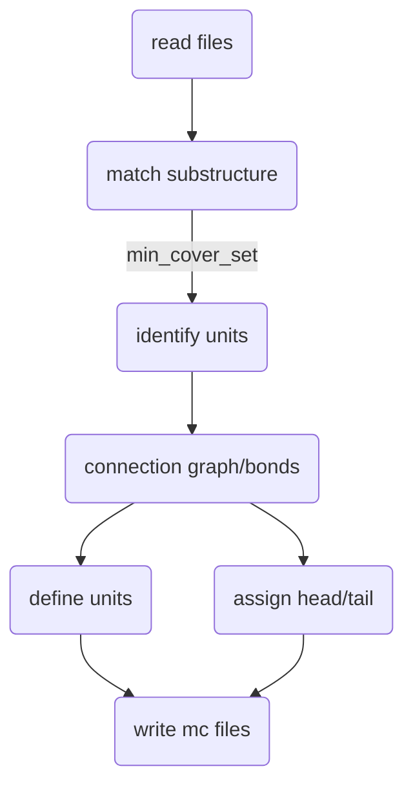

# Polymer & Membrane

Since I got a project on polymer/ligand-membrane interaction, I put these two topics together...


[Running membrane simulations in GROMACS - GROMACS documentation](https://manual.gromacs.org/current/how-to/special.html#running-membrane-simulations)


# Membrane setup

membrane setup tutorials (Amber). See also: [Analysis](#analysis)

- [Building Systems - Membrane Systems (ambermd.org)](https://ambermd.org/tutorials/MembraneSystems.php)
- [The Lipid21 Force Field is recommended in Amber](https://ambermd.org/AmberModels_lipids.php)
- [only the bilayer and associated properties (springer.com)](https://link.springer.com/content/pdf/10.1007/978-1-62703-017-5_15.pdf)
- [Versuch13_Molecular_Dynamics.pdf (biophysik.org) self-assembly of lipid bilayer](https://biophysik.org/~koefinger/BiophysikPraktikum/Versuch13_Molecular_Dynamics.pdf)

## CHARMM-GUI

### Membrane


#### Result

##### top

restraint of POPC during equilibration

```
```


[Restraints - Dihedral restraints](https://manual.gromacs.org/documentation/current/reference-manual/functions/restraints.html#dihedral-restraints)

[Bonded interactions - Improper dihedrals](https://manual.gromacs.org/documentation/current/reference-manual/functions/bonded-interactions.html#improper-dihedrals)

##### mdp


### Membrane protein

[A Beginner's Guide to Perform Molecular Dynamics Simulation of a Membrane Protein using GROMACS ](https://tutorials.gromacs.org/docs/membrane-protein.html)

[Molecular Dynamics simulations of lipid bilayers and membrane proteins](https://mptg-cbp.github.io/teaching/tutorials/membranes/index.html)


## Packmol+tleap (Amber)

- general: [Building Systems - Membrane Systems](https://ambermd.org/tutorials/MembraneSystems.php)

- Basic, lipid14, from CHARMM-GUI: [An Amber Lipid Force Field Tutorial](https://ambermd.org/tutorials/advanced/tutorial16/) with Amber restraints but not for gmx!

  [CHARMM-GUI, Which lipids are compatible with the Amber force fields? ](https://charmm-gui.org/?doc=faq#amber_ff)

  at step5, Force Field Options

  One can select the Amber force fields under available force fields in the input generation step (generally the last step of any building module).

- [The Amber Force Fields](https://ambermd.org/AmberModels_lipids.php)   

  LIPID21 is the latest and recommended lipid force field. [SLipids](http://www.fos.su.se/~sasha/SLipids/Downloads.html), the 2nd option of GUI Amber lipids

- [Membrane System Setup with PACKMOL-Memgen](https://ambermd.org/tutorials/advanced/tutorial38/index.php)

  There are a number of ways to construct such systems for AMBER, including but not limited to: AMBAT, charmm-gui, DABBLE. In this case, we use the recently released PACKMOL-Memgen: https://pubs.acs.org/doi/10.1021/acs.jcim.9b00269
  
- [生成混合组分的磷脂双层膜结构文件的工具genmixmem - 思想家公社的门口：量子化学·分子模拟·二次元](http://sobereva.com/245)

  emm，需要自己准备Align好的lipid的pdb文件，还要自己搭力场。当然，好处是比GUI容易自定义


## VMD

[mem-tutorial.pdf](http://www.ks.uiuc.edu/Training/Tutorials/science/membrane/mem-tutorial.pdf) (still in CHARMM-GUI)

[memprot2-tutorial.pdf](https://www.ks.uiuc.edu/Training/Tutorials/science/membrane2/memprot2-tutorial.pdf)  (vmd)

[Molecular Dynamics Simulations of Lipid Bilayers: Simple Recipe of How to Do It](https://link.springer.com/content/pdf/10.1007/978-1-62703-017-5_15.pdf)    gmx and vmd

[Versuch13_Molecular_Dynamics.pdf (biophysik.org)](https://biophysik.org/~koefinger/BiophysikPraktikum/Versuch13_Molecular_Dynamics.pdf)   martini membrane


## run MD

```
; group(s) for center of mass motion removal
comm_grps                = MEMB SOLV
```

so the membrane COM won't go up and down


# Ligand-membrane setup

- database/server of ligand-membrane interaction
  - https://molmedb.upol.cz/detail/intro  no data, only indices of papers. many too small ligands like CO<sub>2</sub>
  - https://permm.phar.umich.edu/  calculate passive permeability of molecules across the lipid bilayer

## Amber FF


### GUI+gmx


```shell

```


## CHARMM FF


### GUI+gmx

Also, build membrane with CHARMM-GUI membrane builder


```shell

```


# Polymer setup

## Parametrization (CgenFF)

- [CHARMM-GUI Polymer Builder](https://www.charmm-gui.org/?doc=input/polymer)

  [Polymer Builder 2: Build a Polymer Structure (youtube.com)](https://www.youtube.com/watch?v=WuhV2hUprD8)

  不能自定义啊，尤其是侧链，只能做已有的。不过结构是挺灵活的

  existing structures

  - `toppar_all36_synthetic_polymer.str`

- [makoto-yoneya/gmx-polymer-tools: Perl scripts for polymer modeling using GROMACS (github.com)](https://github.com/makoto-yoneya/gmx-polymer-tools)


> [Polymer in water - (gromacstutorials.github.io)](https://gromacstutorials.github.io/doc-sphinx/build/html/tutorials/stretchingpolymer.html)

## Parametrization (GAFF)


Workflow:




Pulling out of membrane: see [Pulling](Advanced-techniques.md#pulling)


# Analysis

[LiPyphilic: A love of lipids and python! — lipyphilic documentation](https://lipyphilic.readthedocs.io/en/latest/index.html)

## Basic membrane properties

[KALP-15 in DPPC -- Analysis](http://www.mdtutorials.com/gmx/membrane_protein/09_analysis.html)

[GROMACS如何做之膜模拟|Jerkwin](http://jerkwin.github.io/2016/09/19/GROMACS如何做之膜模拟/)  read outer links, e.g. [membrane_simulations.pdf by Erik Lindahl](https://extras.csc.fi/chem/courses/gmx2007/Erik_Talks/membrane_simulations.pdf)

[An Amber Lipid Force Field Tutorial](https://ambermd.org/tutorials/advanced/tutorial16/)  analysis with cpptraj, what to analyze


- Deuterium Order Parameters
- Density of the Membrane
- Area per Lipid Headgroup
- Bilayer Thickness
- Lateral Diffusion of Lipids


