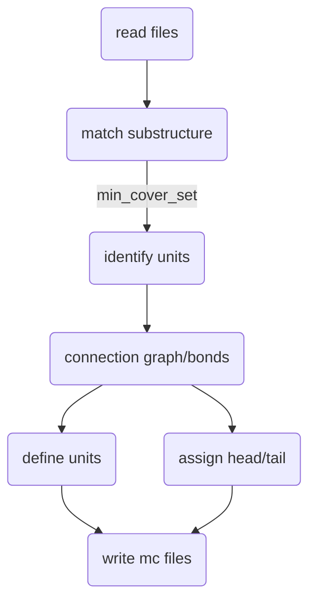

# Polymer & Membrane

Since I got a project on polymer/ligand-membrane interaction, I put these two topics together...


[Running membrane simulations in GROMACS - GROMACS documentation](https://manual.gromacs.org/current/how-to/special.html#running-membrane-simulations)


# Membrane setup

membrane setup tutorials

- [Building Systems - Membrane Systems (ambermd.org)](https://ambermd.org/tutorials/MembraneSystems.php)
- [The Lipid21 Force Field is recommended in Amber](https://ambermd.org/AmberModels_lipids.php)

## CHARMM-GUI

### Membrane


#### Result

##### top

restraint of POPC during equilibration

```
```


[Restraints - Dihedral restraints](https://manual.gromacs.org/documentation/current/reference-manual/functions/restraints.html#dihedral-restraints)

[Bonded interactions - Improper dihedrals](https://manual.gromacs.org/documentation/current/reference-manual/functions/bonded-interactions.html#improper-dihedrals)

##### mdp


### Membrane protein


## Packmol+tleap

- Basic, lipid14, from CHARMM-GUI: [An Amber Lipid Force Field Tutorial](https://ambermd.org/tutorials/advanced/tutorial16/) with Amber restraints but not for gmx!
- [Membrane System Setup with PACKMOL-Memgen](https://ambermd.org/tutorials/advanced/tutorial38/index.php)


## VMD

[mem-tutorial.pdf](http://www.ks.uiuc.edu/Training/Tutorials/science/membrane/mem-tutorial.pdf) (still in CHARMM-GUI)

[memprot2-tutorial.pdf](https://www.ks.uiuc.edu/Training/Tutorials/science/membrane2/memprot2-tutorial.pdf)  (vmd)


# Ligand-membrane setup

- database/server of ligand-membrane interaction
  - https://molmedb.upol.cz/detail/intro  no data, only indices of papers. many too small ligands like CO<sub>2</sub>
  - https://permm.phar.umich.edu/  calculate passive permeability of molecules across the lipid bilayer

## Amber FF


### GUI+gmx


```shell

```


## CHARMM FF


### GUI+gmx

Also, build membrane with CHARMM-GUI membrane builder


```shell

```


# Polymer setup

## Parametrization (CgenFF)

- [CHARMM-GUI Polymer Builder](https://www.charmm-gui.org/?doc=input/polymer)

  [Polymer Builder 2: Build a Polymer Structure (youtube.com)](https://www.youtube.com/watch?v=WuhV2hUprD8)

  不能自定义啊，尤其是侧链，只能做已有的。不过结构是挺灵活的

  existing structures

  - `toppar_all36_synthetic_polymer.str`

- [makoto-yoneya/gmx-polymer-tools: Perl scripts for polymer modeling using GROMACS (github.com)](https://github.com/makoto-yoneya/gmx-polymer-tools)


> [Polymer in water - (gromacstutorials.github.io)](https://gromacstutorials.github.io/doc-sphinx/build/html/tutorials/stretchingpolymer.html)

## Parametrization (GAFF)


Workflow:




Pulling out of membrane: see [Pulling](Advanced-techniques.md#pulling)


# Analysis

## Basic membrane properties

[KALP-15 in DPPC -- Analysis](http://www.mdtutorials.com/gmx/membrane_protein/09_analysis.html)

[GROMACS如何做之膜模拟|Jerkwin](http://jerkwin.github.io/2016/09/19/GROMACS如何做之膜模拟/)  read outer links, e.g. [membrane_simulations.pdf by Erik Lindahl](https://extras.csc.fi/chem/courses/gmx2007/Erik_Talks/membrane_simulations.pdf)

[An Amber Lipid Force Field Tutorial](https://ambermd.org/tutorials/advanced/tutorial16/)  analysis with cpptraj, what to analyze


- Deuterium Order Parameters
- Density of the Membrane
- Area per Lipid Headgroup
- Bilayer Thickness
- Lateral Diffusion of Lipids


