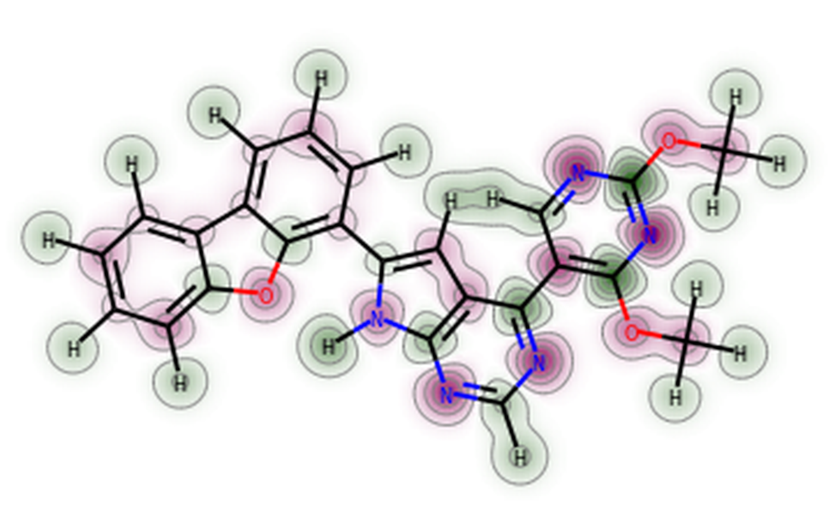

# Programming

See [here](/techniques/Prepare-for-the-computer.md) for installation

This page doesn't include usage of pymol, vmd, gmx, etc. It's not just about basic programming. Specific tools are included.

# Bash (shell)

跟系统相关的，请阅读《Linux基础》

## Basics

1. syntax error: unexpected end of file

   https://unix.stackexchange.com/questions/591208/fix-syntax-error-unexpected-end-of-file-in-a-for-loop

   可能是Windows下编辑的问题，MS-DOS CRLF line delimiters?

   解决：去unix编辑

2. 反斜杠后面紧跟回车，表示下一行是当前行的续行。

3. multiple paths:

   ```shell
   PATH='/path/one;path/two;...'
   ```

4. 在`=`运算符两边不能有空格。

5. 这将在bash脚本中执行一行Python代码，输出"Hello, World!"

   ```bash
   #!/bin/bash
   python -c "print('Hello, World!')"
   ```

6. 你可以使用 sort 和 uniq 命令来删除重复的行。这是一个示例：

   ```bash
   grep -a repeat6 failed/slurm-* | cut -d : -f 1 | sort | uniq
   ```

   


## Text processing

### string spliting

- delimiter

  ```shell
  f=unbound.fepout.csv
  ${f#*.}  # fepout.csv
  ${f##*.}  # csv
  ${f%.*}  # unbound.fepout
  ${f%%.*}  # unbound
  ```

  to recite

  - #: keep right, * at left; %: keep left, * at right
  - one # or %: cut the first one; two: keep the last one

- exact length: `${parameter:offset:length}`

  ```shell
  f=unbound.fepout.csv
  ${f:1:3}  # nbo
  ${f:1:-3} # nbound.fepout.
  ${f: -1}  # the last char
  ${f: -2:-1}  # the second last
  ```

  To get the last character of a string in a shell script, you can use the following command: `echo "${str: -1}"`. The space after the colon (:) is REQUIRED. the second arg with a space before it, meaning starting from -1

  > 倒着数就要加空格

- cut: split with any char

  ```shell
  cat /etc/passwd | head -n 5 | cut -d : -f 1
  ```

  > d: delimiter

- 

- 

### awk

> [!NOTE]
>
> **awk必须单引号**

#### Text

- take all lines with "#Free energy", print the no. 8,9,12 word (separated by space) to the output file

  ```shell
  awk '/^#Free energy/ {printf "%.5f,%.5f,%.9f\n",$8,$9,$12}' ${fn}.fepout > ${fn}.csv
  ```

- I have a commas-separated file, please use awk to get the second element in each line and also filter those lines containing keyword 'spiro'Sent message. I have a commas-separated file, please use awk to get the second element in each line and also filter those lines containing keyword 'spiro'

  To use awk to get the second element in each line and also filter those lines containing keyword ‘spiro’, you can use a command like this:

  ```shell
  awk -F ',' '$0~/spiro/ {print $2}' file.csv
  ```

  This command will:

  - Use a comma (,) as the field separator (-F) for each line
  - Match lines that contain ‘spiro’ in any field ($0~/spiro/)
  - Print the second field ($2) of those lines
  - Read from file.csv

- get the number of non-empty lines

  ```shell
  count=$(awk 'END {print NR}' "50.0000.dat")
  ```
  
- This command will print each line of your_file.itp to ligtypes.itp until it encounters a line containing [ moleculetype ]. At that point, awk will exit and stop printing lines.

  ```bash
  awk '/\[ moleculetype \]/{exit} {print}' your_file.itp > ligtypes.itp
  ```

  


#### Calculation

- 在awk命令中使用-v选项来将bash变量传递给awk。例如：

  ```shell
    awk -v t=$temp '{esum_elec += (exp($2 * 0.239 / -0.001987 / t)); \
      esum_vdw += (exp($3 * 0.239 / -0.001987 / t)); \
      esum_total += (exp($1 * 0.239 / -0.001987 / t)); \
      sum_elec += $2 * 0.239; sum2_elec += $2*$2 * 0.057; \
      sum_vdw += $3 * 0.239; sum2_vdw += $3*$3 * 0.057; \
      sum_couple += $2*$3 * 0.057; n++;} END \
      {printf "%3d ....
        }' < output/data$ii >> output/decomp
  ```

  在上述代码中，我们使用`-v t=$temp`选项来将bash变量`$temp`的值传递给awk变量`t`。然后，在awk代码中，我们使用`t`变量来替换原来的数字298。

- calculate sum, average

  ```bash
  sum=$(awk '{sum += $1} END {print sum}' "50.0000.dat")
  # Calculate the average
  average=$(awk -v sum="$sum" -v count="$count" 'BEGIN {print sum / count}')
  ```

- 


examples

- paste

  ```shell
  paste bound.dat free.dat | awk '{printf "%10s%10s%10s%10s\n", $1, $2, $4, $2 - $4}' > convergence.dat
  # Add headers to the output file
  sed -i '1i time(ps) bound free ddg' convergence.dat
  ```
  
- go to xmgrace

  ```shell
  awk '{print $1, $4}' convergence.dat | xmgrace -block -
  ```

  

### sed

#### file search

- [bash - Sed: get lines beginning with some prefix - Stack Overflow](https://stackoverflow.com/questions/13202715/sed-get-lines-beginning-with-some-prefix/13202791#13202791)

  Try doing this:

  ```bash
  awk '/^RIM-COD/' file.txt
  ```

  Or

  ```bash
  grep "^RIM-COD" file.txt
  ```

  Or

  ```bash
  sed -n '/^RIM-COD/p' file.txt
  ```

- to support a varible, **double quote**! single does not work

#### match and replace

- another most application: replacing text

  ```shell
  sed -i 's/to be replaced/to fill in/g'
  ```

  regex is supported. For example:

  ```shell
  sed -i "s/init-lambda-state.*/init-lambda-state = $jj/g" ../mdps/md_$jj.mdp
  ```

- `sed -i "s/#SBATCH -p quick/#SBATCH -p ${queue}/g" fe*.slurm.sh`
  
  - `"`: replace with varible value
  - `'`: keep ${string}
  
- range of action

  ```shell
  sed -i '1,/^\#include "amber99sb-star-ildn-mut.ff\/forcefield.itp"/d' topol_Protein_chain_H_hybrid.itp
  # remove everything before (including) something
  sed -i '/#ifdef POSRES/,$d' topol_Protein_chain_H_hybrid.itp
  # remove everything after  (including) something
  sed '0,/#ifdef POSRES/{s/#ifdef POSRES/#ifdef POSRES_abiss/}' top.top > newtop.top
  ```

  - `0,/#ifdef POSRES/`: This specifies a range of lines to search for the pattern. The range is defined from the beginning of the file (line 0) to the first line containing `#ifdef POSRES`.
  - `{s/#ifdef POSRES/#ifdef POSRES_abiss/}`: This is the substitution command within the specified range. It replaces the first occurrence of `#ifdef POSRES` with `#ifdef POSRES_abiss`.

- Append "This is a new line." before a line containing "Pattern":

  ```shell
  sed -i '/Pattern/i This is a new line.' input_file > output_file
  ```

  Append "This is a new line." after a line containing "Pattern":

  ```shell
  sed '/Pattern/a This is a new line.' input_file > output_file
  ```

  Append "This line goes after line 3." after the third line (at line 4):

  ```shell
  sed '3a This line goes after line 3.' input_file > output_file
  ```

  Insert "This line goes at line 3." at the third line (the original line 3 goes to line 4):

  ```shell
  sed '3i This line goes at line 3.' input_file > output_file
  ```

  Append "This is the last line." after the last line of the file:

  ```shell
  sed '$a This is the last line.' input_file > output_file
  ```

	This command will extract the lines from [ moleculetype ] to the end of the file and save it to a temporary file temp.itp. Then it replaces the original file with this temporary file

  ```bash
  sed -n '/\[ moleculetype \]/,$p' your_file.itp > temp.itp && mv temp.itp your_file.itp
  ```

- After running one of these commands, the modified content will be written to `output_file`. **If you want to edit the file in-place, you can use the `-i` option with `sed`**

- To support regex, add `\`

  e.g. 你可以在sed命令中使用\s\+来匹配一个或多个空格。例如：

  ```shell
  sed 's/\s\+/ /g'
  ```

  你还可以直接在sed命令中使用空格字符来匹配空格。例如：

  ```shell
  sed 's/ */ /g'
  ```

  这些命令会将一个或多个连续的空格替换为一个空格。
  
- 要使用sed命令删除前两行，可以使用以下命令：

  ```bash
  sed '1,2d' filename
  ```
  
  

### Alternatives of editing

If you don't want to or can't edit a file with varying filenames every time, you just create one. Variable values will be replaced.

```shell
cat > tleap.in << EOF
source leaprc.protein.ff14SB 
source leaprc.lipid21
source leaprc.water.tip3p
source leaprc.gaff
loadAmberPrep ${f}.prepi
loadamberparams ${f}.prepi.frcmod
sys = loadpdb system.pdb
charge sys
addIonsRand sys Cl- 13
addIonsRand sys Na+ 13
saveamberparm sys system.prmtop system.inpcrd 
quit
EOF
tleap -f tleap.in > tleap.log
```

### output

#### printf

`printf "format" $variable`

- fixed length (fill with 0)

  ```shell
  $(printf "%02d" $jj)
  ```

#### cat

- `tac` 命令是 Linux 系统中的一个命令行工具，它的作用是反向输出文件内容。`tac` 是 `cat` 命令的反向操作，`cat` 命令用于将文件内容输出到标准输出，而 `tac` 命令则是将文件内容反向输出。

## File processing

### grep

1. [grep多个关键字“与”和“或”](https://blog.csdn.net/mmbbz/article/details/51035401)

   ```shell
   grep -E '123|abc' filename
   ```

2. 

### ls

1. check file size

   ```shell
   man ls
   ls -l # kb
   ls -lh # proper magnitude
   ls -l --blocksize=g  # gb
   ```

2. 

### count

1. shell 统计出现行数

   ```shell
   cat complex_ATPP.pdb | grep "SOD" | wc -l
   ```

   - cat显示内容
   - grep查找字符
   - wc计算字数

   ```shell
   ls | grep query # return all direcotries and files containing the query string
   ls -l | grep query | wc -l # count the number of files whose names contain
   grep -o query filename | wc -l # count the number of query appearances in a text file
   grep -n query filename # return lines with line numbers
   ```

2. count string

   https://www.runoob.com/linux/linux-comm-grep.html

   ```shell
   grep -o '$$$$' atp.sdf | wc -l
   ```

3. 

### filename

1. unify the format of file names

   https://blog.csdn.net/vipchenvip/article/details/103280418

   ```shell
   # length=12
   rename ZINC ZINC0 ZINC????????.pdbqt # 8
   rename ZINC ZINC0 ZINC?????????.pdbqt # 9
   # 10
   # 11
   # in order!!
   rename ZINC0 ZINC ZINC??????????????.pdbqt # 14
   rename ZINC0 ZINC ZINC?????????????.pdbqt # 13
   ```

2. 

## Control

### for loop

1. download: an example of for loop

   ```shell
   for i in {1..19}; do
   wget https://ronlevygroup.cst.temple.edu/courses/2020_fall/chem5302/lectures/chem5302_lecture${i}.pdf --no-check-certificate
   done
   ```

   or

   ```shell
   for i in aa bb cc; do
   echo $i
   done
   ```

   advanced: https://linuxhandbook.com/seq-command/

   ```shell
   user@localhost:~$ seq 3 6
   3
   4
   5
   6
   ```

2. 

### while loop

1. process files line by line

   https://www.cnblogs.com/iloveyoucc/archive/2012/07/10/2585529.html

   ```shell
   while read line
   do
       echo $line
   done < file
   ```

2. 

### if statement

string comparison: `[[ ... ]]`

1. shell-if表达式关于文件存在判断，变量比较判断用法

   https://blog.csdn.net/khx0910/article/details/106383294/

2. if 判断文件或目录是否存在

   https://blog.csdn.net/m0_38039437/article/details/100160042

### function

[Bash函数 - Bash Shell教程 (yiibai.com)](https://www.yiibai.com/bash/bash-functions.html)

- In a Bash script, the symbol "$?" represents the exit status of the last executed command.

### arguments

1. `.sh` file has arguments: https://www.runoob.com/linux/linux-shell-passing-arguments.html

2. 默认参数(变量默认值) 比较low的方式

   ```shell
   if [ ! $1 ]; then
       $1='default'
   fi
   ```

3. 

## stdin stdout

### xargs

The `xargs` command is used to build and execute command lines from standard input. So, `xargs -n 1` means that `xargs` will use at most one argument per command line. For example:

```shell
rpm -qa | grep -i devel | xargs -n 1 dnf remove -y
```

### pipeline


## math

1. perform any math: (()) or between ``

   `$( )` to store any outputed number in a variable

   `$((...))`: arithmetic expression. It **only supports integer** arithmetic.

   ```shell
   # e.g. 
   left_water=$(( $all_water - $removed_water ))
   i=`expr ${f:0-1} + 1`
   ```

   keep the calculated result

2. [shell script for multiplication of two numbers](https://www.log2base2.com/shell-script-examples/operator/shell-script-for-multiplication-of-two-numbers.html)

   [shell script for division of two numbers](https://www.log2base2.com/shell-script-examples/operator/shell-script-for-division-of-two-numbers.html)

   ```bash
   num1=10
   num2=20
   num3=2
   
   ans=$((num1 * num2))
   ans=`expr $num1 \* $num2`
   result=$(echo "$num1 * $num2 / $num3" | bc)
   ```

   

## advanced

1. 

4. 


## examples

1. 如果你想要更简单的方法来生成一个包含两位数字符串的数组，可以使用以下命令：

   ```shell
   numbers=($(seq -f "%02g" 1 20))
   ```

   这将创建一个名为`numbers`的数组变量，其中包含20个元素，每个元素都是一个两位数的字符串。
   你可以使用`${numbers[@]}`来访问数组中的所有元素。例如，要打印数组中的所有元素，可以使用以下命令：

   ```shell
   echo ${numbers[@]}
   ```

2. batch submit jobs

   https://www.cnblogs.com/wutou/p/16398524.html

   https://blog.csdn.net/weixin_42303136/article/details/107204483

   > 在shell 中字符串的截取格式是这样的: ${string:start:length} 意思为将 string 从 start 开始截取 length 个字符,然后返回,length 如果省略则截取到字符串末尾。

   ```shell
   #!/bin/bash
   # bash batch_submit.sh RdRp
   
   jobn=$1
   pert=`pwd | awk -F '/' '{print $(NF-1)}'` # name of system
   line=`cat -n fep.pbs.sh | grep "path=" | awk '{print $1}' | head -n 1`
   
   for f in `ls -F | grep /`; do 
   file=${f:0:-1}  # remove /
   abbv=${file:0:1}${file: -1}  # first and last char
   sed -i "${line}d" fep.pbs.sh
   sed -i "${line}i\path=${file}" fep.pbs.sh
   qsub fep.pbs.sh -N ${jobn}-FEP-${pert}-${abbv}
   echo submitted ${jobn}-FEP-${pert}-${abbv}
   done
   ```

3. The error message "value too great for base" occurs because the leading zero in the number 09 is interpreted as an octal (base 8) number in Bash, and octal numbers cannot have a digit 9.
   To overcome this issue and generate the desired two-digit numbers with leading zeros, you can use the printf function with a format specifier. Here's an example:

   ```bash
   #!/bin/bash
   for ii in 09 10 11
   do
       jj=$(printf "%02d" $((10#$ii+1)))
       echo "ii: $ii, jj: $jj"
   done
   ```

   In this example, `10#$ii` is used to explicitly specify that the variable $ii should be interpreted as a base-10 number. The printf statement then formats the number with %02d, which ensures it is printed with two digits and leading zeros if necessary.

4. https://cloud.tencent.com/developer/ask/sof/806010

   如何在Bash函数中添加默认参数？`${1:-.}`

5. 

# VMD scripting

## Tcl Basics

### String

Tcl本身将所有的变量值视为字符串，并将他们作为字符串来保存

- format strings: https://wiki.tcl-lang.org/page/format

- append something to a string: https://wiki.tcl-lang.org/page/append

- [Tcl的字符串操作：获取字符_tcl字符串截取-CSDN博客](https://blog.csdn.net/bleauchat/article/details/89061420)

  ```tcl
  set str "Hello world"
  string range $str 3 end-2
  ```

  **在使用end时，表达式中不能有空格**

- you can execute bash commands directly in a Tcl script using the **exec** command.

  ```tcl
  exec grep 'ATOM' ${i}.pdb >> ${outputFile}
  ```

  should only use ""....???
  
- 在Tcl中，你可以通过ASCII码将数字转换为对应的字母。
```tcl
  set letter [format %c [expr {$number + 64}]]
  ```
  


### List

everything about lists https://zetcode.com/lang/tcl/lists/

- `llength $list`: Count the number of elements in a list

- [Adding & Deleting members of a list (tcl.tk)](https://tcl.tk/man/tcl8.5/tutorial/Tcl15.html)

  ```tcl
  lappend listName ?arg1 arg2 ... argn?
  ```

- [从 Tcl 中的列表中删除重复元素 - IT工具网 (coder.work)](https://www.coder.work/article/6876472)

  ```tcl
  set uniqueList [lsort -unique $myList]
  ```

- 


### Vector Matrix

Everything is here: [Vectors](https://www.ks.uiuc.edu/Research/vmd/current/ug/node193.html)  [Matrix routines](https://www.ks.uiuc.edu/Research/vmd/current/ug/node194.html)

- `vecnorm v` - Returns the vector of length 1 directed along v


```
transabout v amount [deg|rad|pi] - Generates the transformation matrix needed to rotate by the given amount counter-clockwise around axis which goes through the origin and along the given vector. As with transvec, the units of the amount of rotation can be degrees, radians, or multiples of pi.
```


debug

[*vector subtraction doesn't work* (uiuc.edu)](https://www.ks.uiuc.edu/Research/vmd/mailing_list/vmd-l/2584.html)

```
The reason is that coord1, coord2, and coord3 are all nested lists, i.e.
they look like this:
 {{a b c}}
instead of this:
  {a b c}
The solution is to do this:
  set coord1 [lindex [$atm get {x y z}] 0]
```

#### e.g. aligning the principal axis to x axis

```tcl
# vmd -dispdev text -e align.tcl -args xx.pdb

set pdb [lindex $argv 0]
puts $pdb
mol load pdb $pdb
set sel [atomselect top all]
set I [measure inertia $sel]
set A [lindex $I 1]
set B [lindex $A 0]
# Align the principal axes to the x axis
set M [transvecinv $B]
$sel move $M
# move the center of mass to the origin
set C [lindex $I 0]
$sel move [vecinvert $C]

$sel writepdb $pdb.pdb
exit 
```

this helps to determine a good solvation box


### Control

- if...else

  ```tcl
  if {boolean_expression} {
    # statement(s) will execute if the boolean expression is true 
  } else {
    # statement(s) will execute if the boolean expression is false
  }
  ```

- for loop

  ```tcl
  for {set i 1} {$i <= 8} {incr i} { 
  	puts $i 
  } 
  ```

- foreach: https://www.tcl.tk/man/tcl/TclCmd/foreach.html

  [TCL foreach的用法-CSDN博客](https://blog.csdn.net/ciscomonkey/article/details/118881550)

  ```tcl
  set list {1 2 3 4 5}
  foreach item $list {
      puts $item
  }
  ```

  multiple lists:

  ```tcl
  set x {}
  foreach i {a b c} j {d e f g} {
      lappend x $i $j
  }
  ```

- 


### Files

- [Output results to the text file](https://sunxiaoquan.wordpress.com/2015/02/20/vmd-tcltk-output-results-to-the-text-file/)
- https://wiki.tcl-lang.org/page/file+delete


### Function

[Tcl Tutorial 笔记9 · proc 参数传递与return](https://blog.csdn.net/qq_39597489/article/details/111411707)

```tcl
proc example {first {second ""} args} {
    if {$second eq ""} {
        puts "There is only one argument and it is: $first"
        return 1
    } else {
        if {$args eq ""} {
            puts "There are two arguments - $first and $second"
            return 2
        } else {
            puts "There are many arguments:\n$first and $second and $args"
            return "many"
        }
    }
}

set count1 [example ONE]
set count2 [example ONE TWO]
set count3 [example ONE TWO THREE]
set count4 [example ONE TWO THREE FOUR]

puts "The example was called with a varying number of arguments:"
puts "    $count1, $count2, $count3, and $count4"
```


## VMD Specific

### Basics

1. run in terminal

   ```shell
   vmd -dispdev text -e combine.tcl
   ```

   vmd scripting, [pass parameters](http://timchen314.com/vmd%E7%AC%94%E8%AE%B0/)

   ```
   set file [lindex $argv 0]
   vmd .... -args arg arg2
   ```

2. How to run TCL script on VMD?

   This is very easy to do. Just use any text editor to write your script file, and in a VMD session, use the command 

   ```shell
   source filename
   ```

   to execute the file. (either VMD command line or Tk Console)

3. question mark prompt and return to the normal `vmd> prompt?` that mean the tcl interpreter is waiting for you to **close a brace**, so try `}` or `]` or `)` followed by enter. you may need to enter it a couple of times.

### about Tkconsole

1. resize font in TkConsole https://www.ks.uiuc.edu/Research/vmd/mailing_list/vmd-l/29151.html

   type in TkConsole: tkcon font <type> <size>

   ```
   tkcon font Courier 16
   ```

   size of the window is automatically changed. But font type not affected?

2. As for the global font: the higher resolution your screen is, the smaller your font is

   Maybe because the source code specifies pixels??

3. TkConsole auto-loads history file?

   https://www.ks.uiuc.edu/Research/vmd/mailing_list/vmd-l/8543.html

   Yeah, just about last 10 commands you typed, with the starting number 48. 强迫症犯了。。

   >    history command
   >
   >    https://www.tcl.tk/man/tcl8.4/TclCmd/history.html
   >
   >    ```tcl
   >    history clear
   >    ```
   >
   >    or Ctrl+r, but no use
   >
   >    ```tcl
   >    clear
   >    ```
   >
   >    just clears the screen

### Clustering

see [Protein-ligand-simulation.md](Protein-ligand-simulation.md)

https://github.com/luisico/clustering

## VMD applications

### measure

#### contacts

Here is an example of how you can use the measure contacts command to find the interacting residues between two proteins:

```tcl
set protein1 [atomselect top "protein and chain A"]
set protein2 [atomselect top "protein and chain B"]
set cutoff 4.0
set contacts [measure contacts $cutoff $protein1 $protein2]
set seltext ""
foreach pair $contacts {
    set res1 [atomselect top "index [lindex $pair 0]"]
    set res2 [atomselect top "index [lindex $pair 1]"]
    set seltext "$seltext or (resid [[lindex [$res1 get {resid}] 0]] and chain A) or (resid [[lindex [$res2 get {resid}] 0]] and chain B)"
}
set interacting_residues [atomselect top [string range $seltext 4 end]]
```

In this example, we first create two selections, one for each protein, using the atomselect command. We then specify a cutoff distance of 4.0 angstroms and use the measure contacts command to find all pairs of atoms from the two proteins that are within this distance. Finally, we loop over the list of atom pairs and create a new selection that includes only the interacting residues.

To move a molecule along a certain direction in VMD, you can use the moveby command, which translates all atoms in a selection by a specified vector. Here is an example of how you can use this command to move a molecule along the x-axis:

```tcl
set sel [atomselect top "all"]
$sel moveby {5 0 0}
```

In this example, we first create a selection that includes all atoms in the molecule using the atomselect command. We then use the moveby command to translate all atoms in the selection by a vector of {5 0 0}, which moves the molecule 5 units along the x-axis.

measure contacts cutoff selection1 [selection2]: Find all atoms in selection1 that are within cutoff of any atom in selection2 and not bonded to it. If selection2 is omitted, it is taken to be the same as selection1. selection2 and selection1 can either be from the same of from different molecules. Returns two lists of atom indices, the first containing the first index of each pair (taken from selection1) and the second containing the second index (taken from selection2). Note that the index is the global index of the atom with respect to its parent molecule, as opposed to the index within the given atom selection that contains it.

#### fit

For example, to align residues 10-20 of protein A with residues 30-40 of protein B, you can use the following command: 

```tcl
set sel [atomselect top "resid 10 to 20"]
set ref [atomselect top "resid 30 to 40"]
measure fit $sel $ref
```


#### cluster

```tcl
# http://github.com/anjibabuIITK/CLUSTER-ANALYSIS-USING-VMD-TCL
# please align the receptor/pocket residues first
set number 9	;# number of clusters, others are tagged 'other'
set rcutoff 1.5  ;# RMSD cutoff. unit: angstrom
set step_size 1
set nframes [molinfo top get numframes]
set inf 0
set nf $nframes
set totframes [expr $nf - 1 ]
set selA [atomselect top "fragment 1 and resid 149 to 156 and backbone"]    ;# select the ligand
set lists [measure cluster $selA num $number cutoff $rcutoff first $inf last $totframes step $step_size distfunc rmsd weight mass]

set file [open "clus_result.dat" w]
for {set i 1} {$i <= [llength $lists]} {incr i} {
    set lst [lindex $lists [expr $i-1]]
    puts $file [format "cluster %d: %d" $i [llength $lst]]
    puts $file $lst
    puts $file ""
}
close $file

# save the coordinates of centroid structures
set c01 [lindex [lindex $lists 0] 0]
set sel [atomselect top all frame $c01]
set real_frame [expr $c01+1]
$sel writegro c01_${real_frame}.gro
puts [format "write the centroid of 1st cluster: frame %d" $real_frame]

set c02 [lindex [lindex $lists 1] 0]
set sel [atomselect top all frame $c02]
set real_frame [expr $c02+1]
$sel writegro c02_${real_frame}.gro
puts [format "write the centroid of 2nd cluster: frame %d" $real_frame]
```


### VMD solvating a system

first, do [aligning-the-principal-axis-to-x-axis](#eg-aligning-the-principal-axis-to-x-axis), then:

```tcl
#!/bin/bash
# vmd -dispdev text -e ../vmd_solvate_box.tcl -args xx.pdb 8

set file [lindex $argv 0]
set basepad [lindex $argv 1]    ;# in Angstrom

# Define the function to find the maximum
proc maxVec { vec } {
    set max [lindex $vec 0]
    foreach val $vec {
        if {$val > $max} {
            set max $val
        }
    }
    return $max
}

package require psfgen
psfcontext reset
mol load pdb $file

# measure and assign values
set everyone [atomselect top all]
set minmax [measure minmax $everyone]
# set center [measure center $everyone]
foreach {min max} $minmax { break }
foreach {xmin ymin zmin} $min { break }
foreach {xmax ymax zmax} $max { break }

# Calculate the box lengths (x, y, z)
set lengths [vecsub $max $min]
# Find the minimum length
set maxlen [maxVec $lengths]
# Subtract the minimum from each length, divide by 2, and add $basepad
set adjusted_lengths [vecscale [vecsub [list $maxlen $maxlen $maxlen] $lengths] 0.5]
set padded_lengths [vecadd $adjusted_lengths [list $basepad $basepad $basepad]]
# Unpack the vector to individual components
foreach {xp yp zp} $padded_lengths { break }
# Print the vector in the specified format
puts ""
puts "-x $xp -y $yp -z $zp +x $xp +y $yp +z $zp"

exit
```

Or more simply, solvate twice, where the first round rotates the system to align, and the second solvation add more padding to make it cubic. This is what we do now in FEbuilder.

```tcl
....
# solvation and ionization
package require solvate
package require autoionize
mol load psf complex-merged.psf pdb complex-merged.pdb
solvate complex-merged.psf complex-merged.pdb -t 8.0 -o complex-solvated -rotate

# Define the function to find the maximum
proc maxVec { vec } {
    set max [lindex $vec 0]
    foreach val $vec {
        if {$val > $max} {
            set max $val
        }
    }
    return $max
}
set minmax [measure minmax [atomselect top "not water"]]
foreach {min max} $minmax { break }
foreach {xmin ymin zmin} $min { break }
foreach {xmax ymax zmax} $max { break }
# Calculate the box lengths (x, y, z)
set lengths [vecsub $max $min]
set maxlen [maxVec $lengths]
# Subtract each length from the max, divide by 2
set adjusted_lengths [vecscale [vecsub [list $maxlen $maxlen $maxlen] $lengths] 0.5]
# Unpack the vector to individual components
foreach {xp yp zp} $adjusted_lengths { break }
# Solvate, another segname prefix
solvate complex-solvated.psf complex-solvated.pdb -x $xp -y $yp -z $zp +x $xp +y $yp +z $zp -o complex-solvated2 -s WA
autoionize -psf complex-solvated2.psf -pdb complex-solvated2.pdb -sc 0 -cation SOD -anion CLA -o complex
set everyone [atomselect top all]
set minmax [measure minmax $everyone]
...
```


# Fundamental Python

## Basics

- [python嵌套列表赋值，想更改其中一个元素但是一整列的元素都被更改,是什么原因呢，应该怎么修改？ - 知乎](https://www.zhihu.com/question/355374988/answer/891028270)

  always use for loop rather than multiplication...

- 

- [Python3字典合并的几种方法](https://blog.csdn.net/asialee_bird/article/details/79809248)

- [Python去除字符串左右两侧的数字](https://blog.csdn.net/Jason_WangYing/article/details/114080708)：`str1.rstrip(string.digits)`

  [python去除字符串中开头|结尾|所有字母、数字](https://cloud.tencent.com/developer/article/1610931)

- [Python 中下划线的 5 种含义 | 菜鸟教程 (runoob.com)](https://www.runoob.com/w3cnote/python-5-underline.html)

  

  pmx倒是有个规范：类内方法都是下划线开头

- [Convert Letters to Numbers and vice versa in Python | bobbyhadz](https://bobbyhadz.com/blog/python-convert-letters-to-numbers): `chr()`, `ord()`

- 

- `assert`: [Assert in Python](https://www.tutorialsteacher.com/python/python-assert)
  应该assert还是try except呢？后处理内容比较多、不一定退出程序时，只能用except
  
- 

- 在Python中，没有直接的问号语句，类似于其他编程语言中的三元条件运算符（ternary conditional operator）（例如C语言中的condition ? expression1 : expression2）
  ```python
  x = 5
  result = "Yes" if x > 0 else "No"
  ```

  however, not doing the condition first but do expression1 (which may cause errors, e.g. `len(sys.argv)`

- [python格式化输出之format用法 - 知乎](https://zhuanlan.zhihu.com/p/151442933)

### File and import

- If there is a `__init__.py` file in a folder, which means this folder is a python module. `__init__.py` will be run when i import this model.

- for a directory

  ```
  - utils.py
  - folder
    - my.py
  ```

  In `my.py`, you can import utils.py using the following code. If you don't want to convert your directory structure into a package, you can modify the import statement to use an absolute import:

  ```python
  import sys
  import os
  sys.path.append(os.path.dirname(os.path.dirname(os.path.abspath(__file__))))
  import utils
  ```

- 获取脚本所在目录：`exepath = os.path.dirname(__file__)`


## Operating files and cmd

### about bash commands

- [调用外部进程的几种方法](https://juejin.cn/post/6912824179511263240)

  Python的os等包也并不是内置了shell的功能，而是调用。最好不要调用bash的东西，否则Windows下可能用不了。最好用Python内置的命令，比如os，也有更高级的

- `r = os.popen(cmd).read`: get bash output

- 


shutil是个增强版的：

- 
- 也没有grep

有时候`os.system`可能执行不完就开始进行下一个命令，但是文件还没有生成完，所以就会报错了。所以要用：

### subprocess

read more: https://docs.python.org/3/library/subprocess.html#frequently-used-arguments

- 调用后一直阻塞到执行结束：

  ```shell
  subprocess.call()
  ```

  `call()` cannot process output; `run()` cannot stuck until finished

  `subprocess.Popen()`有个`wait()`表示等待子进程结束，但不行？

- [subprocess.Popen重定向输出](https://blog.csdn.net/linxinfa/article/details/93595913) or [this](https://blog.csdn.net/weixin_39622628/article/details/111438771)

  ```python
  cp = subprocess.Popen(["grep", str(var)+".pdb"], stdout=subprocess.PIPE, stderr=subprocess.PIPE)
  out, err = cp.communicate()
  ```

- PIPE本身可容纳的量比较小，所以程序会卡死，所以一大堆内容输出过来的时候，会导致PIPE不足够处理这些内容，因此需要将输出内容定位到其他地方，例如临时文件等

- `shell=True`: call shell; provide a single string as cmd is ok


### about path

- When we execute a Python script in cmd in another folder, `os.curdir` is still your cwd. i.e. cmd parameters is fine.

  But within a script, if you want to execute another file (in the same folder, like .tcl), it can still find it. All the output will be in your cwd.

  We usually don't need `exepath = os.path.dirname(sys.argv[0])`, nor any path when using `os.system()`.

- `os.walk()` : walk through all sub-folders. see https://www.runoob.com/python/os-walk.html

- `os.getenv(PATH)`：获取环境变量（Windows/Linux通用），而不是`popen("which xxx")`

  也可以使用 `os` 模块中的 `os.environ` 和 `os.pathsep` 来获取 `PATH` 环境变量并将其转换为目录列表。下面是一个示例代码：

  ```python
  import os
  
  path = os.environ['PATH']
  dirs = path.split(os.pathsep)
  
  print(dirs)
  ```

  这段代码首先从 `os.environ` 字典中获取 `PATH` 环境变量的值，然后使用 `os.pathsep`（路径分隔符）将其分割为目录列表。最后，打印出目录列表。

- 参数的开头包含了斜杠'/'，这会被`os.path.join()`函数解释为绝对路径。因此，`os.path.join(path, subdir, '/result/lambda*xvg')`会从斜杠'/'开始拼接路径，忽略之前的参数，导致输出结果为`'/result/lambda*xvg'`。

- [glob — Unix style pathname pattern expansion](https://docs.python.org/3/library/glob.html#module-glob).


### read and write

- If you want to write bytes then you should open the file in binary mode. `f = open('/tmp/output', 'wb')`

## numpy, scipy

### Fitting

- normal distribution

  ```python
  import numpy as np
  from scipy.stats import norm
  import matplotlib.pyplot as plt
  
  # Your data
  data = np.array([1, 2, 3, 4, 5, 6, 7, 8, 9])
  
  # Fit a normal distribution to the data
  mu, std = norm.fit(data)
  ```

- 


### histogram

```python
# Calculate the histogram
hist, bin_edges = np.histogram(data, bins=50, density=True)

# Calculate bin centers
bin_centers = (bin_edges[:-1] + bin_edges[1:]) / 2.
plt.hist(distances, bins=bins, density=True, color=colors[i], histtype='step')

hist, xedges, yedges = np.histogram2d(data[:,0], data[:,1], bins=30)

# Plot the histogram as a heat map
plt.imshow(hist, interpolation='nearest', origin='low',
           extent=[xedges[0], xedges[-1], yedges[0], yedges[-1]])

plt.colorbar(label='Probability Density')
```


## matplotlib 


### axis and spines

- 设置坐标轴刻度的粗细

  ```python
  for axis in ['top','bottom','left','right']:
      ax.spines[axis].set_linewidth(30)  #设置坐标轴的粗细
      ax.spines[axis].set_color("gold")
      ax.spines[axis].set_zorder(0)
  ```

  If you want to set this for *all* the ticks in your axes,

  ```python
  ax = plt.gca()
  ax.tick_params(width=5,...)
  ```

- 设置坐标轴刻度之间的间隔

  ```python
  from matplotlib.ticker import MultipleLocator, MaxNLocator
  plt.gca().xaxis.set_major_locator(MultipleLocator(1))
  ```

  


### Other about plot

[python翻转和旋转图片 - 知乎 (zhihu.com)](https://zhuanlan.zhihu.com/p/53492846)


### fonts

- how to add fonts?

  - just copy .ttf files to font dir  [Linux下的python修改画图的字体](https://blog.csdn.net/qq_32442683/article/details/108298763)

    ```python
    import os
    import matplotlib
    font_directory = os.path.join(matplotlib.get_data_path(), 'fonts', 'ttf')  # ~/miniconda3/envs/work/lib/python3.7/site-packages/matplotlib/mpl-data/fonts/ttf
    os.system("copy *.ttf *.TTF "+font_directory)  # cp for Unix
    cache_dir = matplotlib.get_cachedir()
    os.system("rm -r "+cache_dir)  # ~/.cache/matplotlib
    # re-import matplotlib
    ```
  
  - if still `findfont: Font family 'Arial' not found.`, You can delete the font cache file located in `~/.cache/matplotlib/fontList.json` and let matplotlib rebuild it.
  
  - [use .ttf file temporarily](https://www.cnblogs.com/arkenstone/p/6411055.html)
  
    ```python
    from matplotlib.font_manager import FontProperties
    chinese_font = FontProperties(fname='/usr/share/fonts/MyFonts/YaHei.Consolas.1.11b.ttf')
    ...
    plt.text(x, y, display, fontsize=12, fontproperties=chinese_font)
    ```
  
  - find from somewhere else
  
    ```python
    font_dirs = ['/home/gxf1212/data/local-programs/Fonts']
    font_files = font_manager.findSystemFonts(fontpaths=font_dirs)
    for font_file in font_files:
        font_manager.fontManager.addfont(font_file)
    ```
  
  - [check usable Chinese font family in matplotlib](https://www.cnblogs.com/arkenstone/p/6411055.html)
  
    ```python
    from matplotlib.font_manager import FontManager
    import subprocess
    
    fm = FontManager()
    mat_fonts = set(f.name for f in fm.ttflist)
    
    output = subprocess.check_output(
        'fc-list :lang=zh -f "%{family}\n"', shell=True)
    output = output.decode('utf-8')
    # print '*' * 10, '系统可用的中文字体', '*' * 10
    # print output
    zh_fonts = set(f.split(',', 1)[0] for f in output.split('\n'))
    available = mat_fonts & zh_fonts
    
    print('*' * 10, '可用的字体', '*' * 10)
    for f in available:
        print(f)
    ```
  
    copy the results into `font_la = {'family': 'dengxian'}`. capitalization does not matter.
  
  - after installing font for the system (see [here](/techniques/Linux-fundamental#system-settings))
  
    ```python
    import matplotlib
    matplotlib.get_cachedir()
    ```
  
    `rm -rf` it! then just use the `available` fonts above. No need to configure as other blogs did.

    [after removing cache....](https://blog.csdn.net/u014712482/article/details/85802563)here's how we can check name for 
  
    ```python
    import matplotlib as plt
    import matplotlib.font_manager as font_manager
    fontpath = '/usr/share/fonts/truetype/msttcorefonts/simkai.ttf'
    prop = font_manager.FontProperties(fname=fontpath)
    print(prop.get_name())
    ```
  
  - choose a font
  
    ```python
    # global setting
    plt.rcParams['font.family'] = 'Machine Gunk'
    plt.rcParams['font.size'] = '14'
    
    # one-b
    font_la = {'family': 'Arial', 'weight': 'demibold', 'size': 16}
    plt.xlabel('time (ns)', fontdict = font_la)
    
    # or
    labels = ax.get_xticklabels() + ax.get_yticklabels()
    [label.set_fontname('Arial') for label in labels]
    [label.set_fontsize(12) for label in labels]
    [label.set_fontweight('roman') for label in labels]
    ```
  
- 


- use font dictionary for labels, etc.

  ```python
  
  ```

- 渲染LaTeX公式是matplotlib自己的功能，Python本身不具有

  simply `$\your \equation$` in a string

- 

### coloring

- [List of named colors — Matplotlib documentation](https://matplotlib.org/stable/gallery/color/named_colors.html)

- color bars according to value gradient:

  ```python
  cmap = plt.cm.get_cmap('gist_rainbow')  # viridis, Set3, tab20b, Paired, winter
  norm = plt.Normalize(min(y), max(y))
  plt.bar(x, y, color=cmap(norm(y)), alpha=0.5)
  ```

- 

### complex plots

[用python的Matplotlib库画多序列条形图和堆叠条形图](https://blog.csdn.net/weixin_43799652/article/details/101320976)

[matplotlib之pyplot模块之柱状图（bar()：多组数据并列柱状图通用简便创建方法）_使用matplotlib在同一个图里面绘制多行柱状图-CSDN博客](https://blog.csdn.net/mighty13/article/details/113873617)

[python 绘制箱型图_python_Vergil_Zsh-华为开发者空间](https://huaweicloud.csdn.net/63803085dacf622b8df86930.html)

but I prefer seaborn


### seaborn

- [Python 绘制列表数据的小提琴图Violin Plot](https://zhuanlan.zhihu.com/p/596479904)  better than `plt.violinplot`

  [Python数据可视化的例子——小提琴图（violin）](https://blog.csdn.net/weixin_48615832/article/details/108452781)
  
  例如，可以使用参数"cut"来控制小提琴图的形状，将其截断在0以上的范围内。您可以尝试设置cut参数的值，以适应您的数据分布。

### debug

- [Error importing plotnine with Python 3.6.1 · Issue #79 · has2k1/plotnine](https://github.com/has2k1/plotnine/issues/79)
- 

## pandas

### I/O

- read csv

  ```python
  df = pd.read_csv ("my_data.txt", delim_whitespace=True)
  ```

- `pd.ExcelFile(file).parse()`方法默认将第一行作为表头。如果您不想将第一行作为表头，可以通过传递`header=None`参数来实现。

### manipulate

- 通过指定行及列索引号进行索引, 返回DataFrame对象

  ```shell
  df.iloc[[0, 1], [1, 2]]
  # select column with index position 3
  df.iloc[:, 3]
  ```

- filter specific column

  ```python
  df[df['A'].isin([3, 6])]
  ```

- 我们使用reindex()方法来重新索引DataFrame的列。通过指定新的列顺序，我们可以交换'A'列和'B'列的位置

  ```python
  import pandas as pd
  
  # 创建一个DataFrame
  df = pd.DataFrame({'A': [1, 2, 3], 'B': [4, 5, 6], 'C': [7, 8, 9]})
  
  # 交换'A'列和'B'列的位置
  df = df.reindex(columns=['B', 'A', 'C'])
  
  # 打印DataFrame
  print(df)
  ```

- 

## building softwares

### argparse

references

https://zhuanlan.zhihu.com/p/56922793

https://blog.csdn.net/xiaotianlan/article/details/119216435

https://docs.python.org/3/library/argparse.html

https://docs.python.org/3/howto/argparse.html

https://juejin.cn/post/6844903919978545160


- nargs是用来说明传入的参数个数， 

  - nargs='*' 表示参数可设置零个或多个 
  - nargs='+' 表示参数可设置一个或多个 
  - nargs='?' 表示参数可设置零个或一个

- this argument = True if defined, False if not in cmd

  ```python
  parser.add_argument('--feature', action=argparse.BooleanOptionalAction)
  ```

  but only works when python version >= 3.9. [history syntax](https://nono.ma/attributeerror-module-argparse-has-no-attribute-booleanoptionalaction)

- [dict 和 Namespace 之间的转换](https://goodgoodstudy.blog.csdn.net/article/details/106243837)

- `parser.print_help()`

  Why can't I `-h` on Windows??

- 互斥参数组：https://michael728.github.io/2018/12/09/python-argparse-note/ 

  

- `parser.print_help()`

  `parser.parse_args(['-h'])`: just exits here and print help

- 

### logging

In Python’s `logging` module, there are several methods you can use to log messages of different levels of severity. Here are some examples:

```python
import logging

logging.debug('This is a debug message.')
logging.info('This is an informational message.')
logging.warning('This is a warning message.')
logging.error('This is an error message.')
logging.critical('This is a critical message.')
```

The logging levels in Python’s logging module are used to indicate the severity of log messages. The available levels, in increasing order of severity, are: DEBUG, INFO, WARNING, ERROR, and CRITICAL. When you log a message using one of the logging methods (debug, info, warning, error, or critical), the message is only recorded if its level is greater than or equal to the logging level of the logger and all its handlers.

### pyinstall

```bash
pyinstaller -F cgenff_charmm2gmx_py3_nx2.py
```

useful? only thing in dist is this exe of >300MB

it requires a few minutes to pack up...

### warning

```python
with warnings.catch_warnings():
    warnings.simplefilter("ignore")
    your code without warning
```

but failed. if you call a method from other packages, warnings cannot be filtered.

even `python xx.py -W` didn't work

### other

- https://docs.python.org/3/faq/programming.html#how-do-i-share-global-variables-across-modules
- When a project reaches major version v1 it is considered stable.

### Debug

- [AttributeError: partially initialized module ''has no attribute''(most likely due to a circular import](https://blog.csdn.net/c_lanxiaofang/article/details/103997425)

  Don't name your .py file the same as any package you're going to import.

- 


# Small molecule

## RDkit

- [The RDKit Documentation](https://www.rdkit.org/docs/index.html)
- The RDKit blog is now hosted here: https://greglandrum.github.io/rdkit-blog/

### Fundamental

- RDkit is stronger in ipynb


### Read/Write/Convert

- [Thread: [Rdkit-discuss\] Load mol2 file with partial charges | RDKit](https://sourceforge.net/p/rdkit/mailman/rdkit-discuss/thread/564E5B26.3020403@uci.edu/)


### Working with Molecules


### Draw molecule

#### Draw.MolToImage

Simply the structure

- `Draw.MolsToGridImage` is equivalent to typing the Mol variable in ipynb

- show structure quickly (not in jupyter notebook): 

  ```python
  from rdkit import Chem
  def see_mol(mol):
      newmol = Chem.MolFromSmiles(Chem.MolToSmiles(mol))  # make it 2D
      Chem.Draw.MolToImage(newmol, size=(600, 600)).show()
  ```

  直接画三维的反倒看不清

  RDKit isn't actually adding Hs here, it just recognizes that the P atoms have implicit Hs on them and then when drawing the molecule shows those implicit Hs.

- with highlighting:

  ```python
  def see_highlight(mol, option):
      newmol = Chem.MolFromSmiles(Chem.MolToSmiles(mol))
      if option == 'chiral':
      	highlightatms = [atm.GetIdx() for atm in newmol.GetAtoms() if str(atm.GetChiralTag()).startswith('CHI_TETRAHEDRAL') and atm.GetAtomicNum() == 6]
      elif option == 'aromatic':
          aromatic = [atm.GetIdx() for atm in newmol.GetAtoms() if atm.GetIsAromatic()]
      Chem.Draw.MolToImage(newmol, size=(600, 600), highlightAtoms=highlightatms).show()
  ```

- different colors?

  ```python
  highlight = a list of indices of the mol to be highlighted
  highlight_map = {}
  for h in highlight:
      highlight_map[h] = (1, 1, 0.6)   # color
  ```

- [RDKit: New drawing options in the 2020.03 release](http://rdkit.blogspot.com/2020/04/new-drawing-options-in-202003-release.html)


#### Other

- rdkit确实改不了字体

- [MartonVass_MCSAlignedDepiction.ipynb (github.com)](https://gist.github.com/greglandrum/82d9a86acb3b00d3bb1df502779a5810)

  https://www.jianshu.com/p/b0148c74e85d 

- 

  - 


#### MolDraw2D

```python
# python /home/gxf1212/data/work/analysis/draw_charge.py xx.mol2 <xx.str/rtf/mol2>
# visualize ligands with charges. support charges from mol2/itp file or CgenFF rtf/str file
# note that order of atoms must be the same! And the xx.mol2 is totally correct!

import sys, io, re
from rdkit import Chem
from rdkit.Chem import Draw, AllChem
from PIL import Image

file = sys.argv[1]
cfile = sys.argv[2] if len(sys.argv) >= 2 else None
edge = 1200

mol = Chem.MolFromMol2File(file, removeHs=False, sanitize=False)
_ = AllChem.Compute2DCoords(mol)

d = Draw.rdMolDraw2D.MolDraw2DCairo(edge, edge)
opt = d.drawOptions()
opt.baseFontSize = 0.45  # default 0.6

charges = get_charge(cfile)
for i in range(len(mol.GetAtoms())):
    atom = mol.GetAtomWithIdx(i)
    atom.SetProp('atomNote', "%.3f" % charges[i])
    # atom.SetProp('molAtomMapNumber', index)  # only numbers are accepted
    opt.atomLabels[i] = atom.GetSymbol()

d.DrawMolecule(mol)
d.FinishDrawing()
Image.open(io.BytesIO(d.GetDrawingText())).show()
```

how to get charges?

```python
def get_charge(cfile):
    # assuming orders match that in .mol2 file
    lines = open(cfile, 'r').readlines()
    charges = []
    if cfile.endswith('.itp'):
        for i in range(len(lines)):
            if lines[i].startswith('[ atoms ]'):
                start = i+2
            elif lines[i].startswith('[ bonds ]'):
                end = i-2  # one space from previous section
                break
        for i in range(start, end+1):
            fields = re.split('\\s+', lines[i])
            charges.append(float(fields[7]))
    elif cfile.endswith('.str') or cfile.endswith('.rtf'):
        for i in range(len(lines)):
            if lines[i].startswith('GROUP  '):
                start = i+1
            elif lines[i].startswith('BOND '):
                end = i-2  # one space from previous section
                break
        for i in range(start, end+1):
            fields = re.split('\\s+', lines[i])
            charges.append(float(fields[3]))
    elif cfile.endswith('.mol2'):
        start = len(lines)
        for i in range(len(lines)):
            if lines[i].startswith('@<TRIPOS>ATOM'):
                start = i+1
            elif lines[i].startswith('@<TRIPOS>') and i > start:
                end = i-1  # no space from previous section
                break
        for i in range(start, end+1):
            fields = re.split('\\s+', lines[i])
            charges.append(float(fields[9]))
    return charges
```

Result


[Partial charge visualization with RDKit](https://iwatobipen.wordpress.com/2020/01/08/partial-charge-visualization-with-rdkit-rdkit-quantumchemistry-psikit/) or [QM based partial charge calculation and visualization (github.com)](https://gist.github.com/iwatobipen/b49fb916d07ee871f00441690de77d87#file-parchai_charge_viz-ipynb)

get charge in rdkit:

```python
_, res = rdEHTTools.RunMol(mh)
static_chgs = res.GetAtomicCharges()[:atorvastatin.GetNumAtoms()]
```



#### Similarity plot

Do interpretability study.

[Assessing Interpretable Models | Practical Cheminformatics](https://patwalters.github.io/practicalcheminformatics/jupyter/ml/interpretability/2021/06/03/interpretable.html)


#### Draw ligand libraries

a series of ligands with similar backbone, for screening or FEP. Align them 2D first.

```python
from rdkit import Chem, Geometry
from rdkit.Chem import Draw, AllChem, rdFMCS


def align_mols_2d(mols):
    mcs = Chem.rdFMCS.FindMCS(mols, atomCompare=rdFMCS.AtomCompare.CompareAny,
                              bondCompare=rdFMCS.BondCompare.CompareAny, ringMatchesRingOnly=True)
    core = Chem.MolFromSmarts(mcs.smartsString)  # common structure
    _ = AllChem.Compute2DCoords(core)
    for i in range(len(mols)):
        _ = AllChem.Compute2DCoords(mols[i])  # resolve clashes
        # _ = AllChem.EmbedMolecule(mols[i])  # same as the above
        _ = AllChem.GenerateDepictionMatching2DStructure(mols[i], core)  # all align to core
        _ = AllChem.NormalizeDepiction(mols[i])

        
file = 'xxx.smi'
mols = []
lines = open(file, 'r').readlines()
for smi in lines:
    mols.append(Chem.MolFromSmiles(smi.strip()))
legends = [str(i+1) for i in range(len(mols))]  # whatever rules
align_mols_2d(mols)
img = Draw.MolsToGridImage(mols, molsPerRow=12, subImgSize=(300, 300), useSVG=True, legends=legends)
with open(file+'.svg', 'w') as f:
    f.write(img)
```

Result


- ligands with different scafford, not well aligned...

- allowRGroups=True, H positions might change (extension), neither better nor worse

  [rdkit.Chem.rdDepictor.GenerateDepictionMatching2DStructure](https://www.rdkit.org/docs/source/rdkit.Chem.rdDepictor.html#rdkit.Chem.rdDepictor.GenerateDepictionMatching2DStructure)

#### with matplotlib

[add rdkit image into matplotlib image](https://gist.github.com/iwatobipen/1b384d145024663151b3252bf16d2aa8) 

```python
# put two Image.open(io.BytesIO(d.GetDrawingText())) horizontally together, a temporary solution
font = {'family': 'Arial', 'weight': 'demibold', 'size': edge/50}
fig, (ax1, ax2) = plt.subplots(1, 2, figsize=(edge/100*2, edge/100), dpi=100, subplot_kw={'aspect': 'equal'})
fig.subplots_adjust(wspace=0, hspace=0)
ax1.axis('off')
ax1.imshow(imgs[0])
ax1.text(0.5, 0.03, 'Reference', transform=ax1.transAxes, fontdict=font,
         verticalalignment='bottom', horizontalalignment='center')
ax2.axis('off')
ax2.imshow(imgs[1])
ax2.text(0.5, 0.03, 'Mutant', transform=ax2.transAxes, fontdict=font,
         verticalalignment='bottom', horizontalalignment='center')
buf = io.BytesIO()
fig.savefig(buf)
buf.seek(0)
Image.open(buf).show()
```

### Labeling in figures

[How to show atom numbers in a RdKit molecule (or how to label atoms in a rdkit molecule) · ChemicBook](https://chemicbook.com/2021/03/01/how-to-show-atom-numbers-in-rdkit-molecule.html)

```python
atom.SetProp("molAtomMapNumber", str(atom.GetIdx()+1))
atom.SetProp("atomLabel", f"a{i+1}")  # the whole label
atom.SetProp("atomNote", "Nitrogen")
```


### Substructure search

让RDkit得到正确的手性信息：除了一一对应pybel和rdkit的原子，去改那个chiralTag，估计没啥好办法


> other
>
> - R里面的MCS search：https://academic.oup.com/bioinformatics/article/29/21/2792/195951
> - [RDKit blog - 3D maximum common substructure](https://greglandrum.github.io/rdkit-blog/posts/2022-06-23-3d-mcs.html)


### Utilities

- https://www.rdkit.org/docs/source/rdkit.Chem.rdmolops.html
- https://www.rdkit.org/docs/source/rdkit.Chem.AllChem.html


Assign bond order的过程，虽然可能改变smiles或者说这个原子上连了几个氢，但事实上在find mcS的过程中，还是用原来pdb的氢去align的

I'm using a modified version of `AssignBondOrdersFromTemplate` that does not set the number of explicit hydrogens.


### Fingerprint

[rdkit.Chem.rdMolDescriptors module — The RDKit documentation](https://www.rdkit.org/docs/source/rdkit.Chem.rdMolDescriptors.html?highlight=maccs)


### Other

[add_formal_charges.ipynb](https://gist.github.com/greglandrum/7f546d1e35c2df537c68a64d887793b8)


#### about pdb file

RDkit cannot read PDB files well...without connect, bond order info is lost. Assign from template? the molecule has to match exactly! This template (smiles) could come from `pybel.readfile`. 

But no such way to assign chirality...

读pdb啥手性都没有，sdf有些没必要的（磷），smiles甚至有氧。这些识别的不对，还不如pdb。同时其实sdf下所有氢被排除在common之外，并不清楚其和手性的关系，反正就是不行

failed to read chirality even (with the help of openbabel)

```python
def _get_rdk_mol(self, mol, format: str = 'smiles'):
    """
    Return: RDKit Mol (w/o H)
    """
    if format == 'pdb':
        return Chem.rdmolfiles.MolFromPDBBlock(mol.write("pdb"))
    elif format == 'smiles':
        return Chem.rdmolfiles.MolFromSmiles(mol.write("smiles"))

    # cp = subprocess.call(["obabel", lig.pdbfile+".pdb", "-osdf", '-O', lig.pdbfile+".sdf"],
    #                      stderr=subprocess.PIPE, stdout=subprocess.PIPE)
    # rmol = Chem.MolFromPDBFile(lig.pdbfile+'.pdb.pdb', removeHs=False)
    # pmol = pybel.readfile('pdb', lig.pdbfile+".pdb.pdb").__next__()  # only one file.
    # template = AllChem.MolFromSmiles(pmol.write('smi').split('\t')[0])
    # AllChem.AssignBondOrdersFromTemplate(template, rmol)
    # Chem.MolToSmiles(rdmol)
    # rdmol = Chem.MolFromMol2File()
    # AllChem.AssignAtomChiralTagsFromStructure(rmol)
    # AllChem.AssignAtomChiralTagsFromStructure(rmol)
    # AllChem.AssignStereochemistryFrom3D(rmol)
```


## openbabel

> - http://blog.molcalx.com.cn/2021/12/29/oechem-perceive-bond-orders.html
>
>   OEchem is a cool tool. Can we get a edu version? Most people don't have it? PubChem and CHARMM-GUI are using that.
>
> - 

### pybel and obabel

usage

```shell
import openbabel
import pybel
mymol = pybel.readstring("smi", "CCCC")
```

conda installed openbabel contains the cmd command `obabel`

https://openbabel.github.io/api/3.0/classOpenBabel_1_1OBAtom.shtml

this might actually be cpp api, but it's callable in Python (boost package)

pybel is written 10 years ago!! but it's just calling `OBMol.obconversion.ReadFile`

so pybel is just a Python interface...

但可以通过pybelMol.OBMol下OBMol的methods来操纵这个pybelMol的结构！！

### read/write files

- write files

  ```python
  with Chem.SDWriter(prefix+'.sdf') as w:
      w.write(m)
  ```

- `obabel -isdf remtp.pdb.sdf -osmi` in cmd 等价于 `mol.write('smi')` in Python

- 

### file formats

- smiles: Configuration at tetrahedral carbon is specified by @ or @@. Consider the four bonds in the order in which they appear, left to right, in the SMILES form. Looking toward the central carbon from the perspective of the first bond, the other three are either clockwise or counter-clockwise. These cases are indicated with @@ and @, respectively (because the @ symbol itself is a counter-clockwise spiral).

  [obabel](https://openbabel.github.io/api/3.0/classOpenBabel_1_1OBTetrahedralStereo.shtml), [rdkit](https://www.rdkit.org/docs/source/rdkit.Chem.rdchem.html?highlight=rdkit%20chem%20rdchem%20chiraltype#rdkit.Chem.rdchem.ChiralType)

- smiles: 小写是芳香，大写是脂肪；可以带电荷

### examples

detect triple bonds and remove dihedrals

- obabel convert, to format
- openbabel (python) read PDB file
- get all bonds with bond order 3
- get the two atoms, find through the index
- your operations

> https://open-babel.readthedocs.io/en/latest/UseTheLibrary/PythonDoc.html
>
> http://openbabel.org/dev-api/classOpenBabel_1_1OBAtom.shtml


### other

https://pypi.org/project/chemdraw/


# Modeling and analysis

## ParmEd

### Basics

- [Add "lipid" keyword to select_atoms · Issue #2082 · MDAnalysis/mdanalysis (github.com)](https://github.com/MDAnalysis/mdanalysis/issues/2082)
  In MDAnalysis, you can select atoms using a syntax very similar to CHARMM’s atom selection syntax. However, there isn't a built-in keyword to select all lipids in a Universe

- [GMXLIB global variable is ignored · Issue #1210 · ParmEd/ParmEd (github.com)](https://github.com/ParmEd/ParmEd/issues/1210)

  When the input is Gromacs file, it refers to the `GMXLIB` variable.


### Convert among MD engines

In ParmEd, the `idx` attribute of a `Residue` object represents the index of the residue in the `Structure` object that contains it. This attribute is automatically set and updated by ParmEd and should not be changed manually.

Though, we can modify residue numbers for Amber files

#### amber2gmx

```python
# both .gro and .top
# python ../convert_amber2gmx_via_parmed.py pro 688

import parmed as pmd 
import sys
prefix = sys.argv[1]
offset = int(sys.argv[2])
amber = pmd.load_file(prefix+'.prmtop', prefix+'.inpcrd')

for residue in amber.residues:
    _ = residue.idx
    residue._idx += offset
    residue.number += offset
# 'all': maintain order. Option combine is from the following two functions, under parmed/gromacs/gromacstop/gro.py
# pmd.gromacs.GromacsGroFile.write(amber, prefix+'.gro', combine='all')
# pmd.gromacs.GromacsTopologyFile.from_structure(amber).write(prefix+'.top', combine='all')
amber.save(prefix+'.top', overwrite=True, combine='all')
amber.save(prefix+'.gro', overwrite=True, combine='all')
```

> call `.idx` before assigning value for `._idx`, works.....removing `residue._idx += offset` just causes no edit, and `residue.idx = xx` is not allowed (protected)
>
> remember that _a is not a private variable...
>
> https://parmed.github.io/ParmEd/html/_modules/parmed/gromacs/gromacstop.html#GromacsTopologyFile.from_structure
>
> https://parmed.github.io/ParmEd/html/_modules/parmed/topologyobjects.html#Residue


#### charmm2gmx

```python
# both .gro and .top
# python convert_charmm2gmx_via_parmed.py pro 688

import parmed as pmd 
from parmed.charmm import CharmmParameterSet
import sys
prefix = sys.argv[1]
offset = int(sys.argv[2])

structure = pmd.load_file(prefix+'.psf')
for residue in structure.residues:
    _ = residue.idx
    residue._idx += offset
    residue.number += offset
parameter = CharmmParameterSet('par_all36m_prot.prm', 'toppar_water_ions_namd.str')  # add more if necessary
# parmed does not realize that gmx adopts the absolute value while charmm files store the real value (negative!)
for atomname, atomtype in parameter.atom_types.items():
    atomtype.epsilon *= -1
    atomtype.epsilon_14 *= -1
structure.load_parameters(parameter)
structure.save(prefix+'.top', overwrite=True, combine='all')
structure = pmd.load_file(prefix+'.pdb')
structure.save(prefix+'.gro', overwrite=True, combine='all')
```

> [!NOTE]
>
> `par_all36m_prot.prm`, officially all atom types are commented, but should not for parmed, or it cannot find atomtypes. 
>
> Other such files may have similar problems.


#### gmx2amber

```python
# python gmx2amber.py aloh

import parmed as pmd
import sys
prefix = sys.argv[1]

parm = pmd.load_file(prefix+'.itp', prefix+'.gro')
parm.write(prefix+'.prmtop')
parm.write(prefix+'.inpcrd')
```

not tried (see [problems](#problems)). so is it possible to convert to `.prepin` files?


#### renumber gmx files

```python
# python gmx_renumber_via_parmed.py pro 688

import parmed as pmd 
import sys
prefix = sys.argv[1]
offset = int(sys.argv[2])
gmx = pmd.load_file(prefix+'.top', prefix+'.gro')

for residue in gmx.residues:
    _ = residue.idx
    residue._idx += offset
    residue.number += offset
gmx.remake_parm()
gmx.save(prefix+'.top', overwrite=True)
gmx.save(prefix+'.gro', overwrite=True)
```


### Problems

- It seems you are getting a ParameterError from ParmEd because it found unequal bond types defined between AL3+ and ow atoms in your Gromacs topology file. This means that there are different bond parameters for the same pair of atom types, which is not allowed by Amber force field. You need to either assign different atom types to the atoms that have different bond parameters, or use a single bond parameter for all AL3±ow bonds.

  > In your GROMACS file, each bond term is specified independently. In CHARMM, however, parameters are defined between different atom types, which makes it impossible (by definition) to define different bond terms between two pairs of atoms that have the same sets of atom types.

  [ParmEd/parmed/parameters.py at master · ParmEd/ParmEd](https://github.com/ParmEd/ParmEd/blob/master/parmed/parameters.py)
  [unable to create CHARMM prm file from GROMACS top file · Issue #1111 · ParmEd/ParmEd](https://github.com/ParmEd/ParmEd/issues/1111)
  [Unequal dihedral types defined between · Issue #968 · ParmEd/ParmEd](https://github.com/ParmEd/ParmEd/issues/968)

  In short: gmx .top should not contain different parameters (written right after bonds, angles, etc., e.g. asymmetric $\ce{Al(OH)(H2O)5^2+}$ generated by sobtop) when converting to Amber files. strange! Amber parameters are explicitly written. Charmm not.
  
- only gromacs may have moleculetype in .top file (Amber/NAMD: list all), so those converted from others are only possible to list all, making complexed restraint generation so hard!


## MDAnalysis

### Basics

#### read data

```python
import MDAnalysis as mda
u = mda.Universe('md.tpr', 'md.xtc')  # gmx
u = mda.Universe('pro.prmtop', 'md.nc')  # Amber
```


#### selection

[3. Selection commands — MDAnalysis 2.5.0 documentation](https://docs.mdanalysis.org/stable/documentation_pages/selections.html)

Mostly looks like vmd syntax


> [Add "lipid" keyword to select_atoms · Issue #2082 · MDAnalysis/mdanalysis (github.com)](https://github.com/MDAnalysis/mdanalysis/issues/2082)
>
> but still not available now
>
> In MDAnalysis, you can select atoms using a syntax very similar to CHARMM’s atom selection syntax. However, there isn’t a built-in keyword to select all lipids in a Universe


#### work through all frames

```python
for i in range(len(u.trajectory)):
    u.trajectory[i]
    ...
```


[4.2.2. Native contacts analysis — MDAnalysis.analysis.contacts — MDAnalysis documentation](https://docs.mdanalysis.org/stable/documentation_pages/analysis/contacts.html#module-MDAnalysis.analysis.contacts)

kind of strange...


### Functions

#### Distance

For simple distances, numpy might be faster?


#### Contact

> For simple contacts, just calculate distance...

[4.2.2. Native contacts analysis — MDAnalysis.analysis.contacts — MDAnalysis 2.7.0 documentation](https://docs.mdanalysis.org/stable/documentation_pages/analysis/contacts.html#module-MDAnalysis.analysis.contacts)

Contacts are typically defined as pairs of atoms that are within a certain distance from each other. The fraction of native contacts is calculated as the total number of native contacts for a given time frame divided by the total number of contacts in the **reference structure**

> reference groups (first frame of the trajectory, but you could also use a separate PDB, eg crystal structure)


`results.timeseries`是一个二维数组，用于存储所有参考组合和分析帧的Q值。

在MDAnalysis中，Q值是指“native contacts”的分数，用于描述蛋白质模拟中的原子接触情况。在蛋白质模拟中，原子之间的接触可以被定义为与参考结构中的原子之间的距离小于一定阈值的情况。Q值是指在给定时间段内与参考结构中的原子接触的总数与参考结构中的原子接触总数之比。


## Applications

#### aligning the line of COM

Maunally calculate the coordinates and transform it. For example, aligning the line of COM to a certain axis for Umbrella Sampling:

```python
# python align_CV_toZ.py xx.pdb/gro

import sys
file = sys.argv[1]
# file = '/data/work/peptide-inhibitor/MD/SIRPa-pep-amber-pmf/run2/setup/c01_257.pdb'
import MDAnalysis as mda
import numpy as np

# Load the PDB file
u = mda.Universe(file)
pep = u.select_atoms('chainID B')
ref = u.select_atoms('chainID A')
# ref = u.select_atoms('chainID A and around 10 chainID B')
direction = pep.center_of_geometry() - ref.center_of_geometry()

# Get the rotation matrix. e2/e3 are actually arbitrary
e1 = direction / np.linalg.norm(direction)
e2 = np.cross(e1, np.array([0, 0, 1]))
e2 = e2 / np.linalg.norm(e2)
e3 = np.cross(e1, e2)
e3 = e3 / np.linalg.norm(e3)
R = np.vstack((e2, e3, e1))  # align to z axis. index 0 for x, 1 for y

u.atoms.positions = np.dot(u.atoms.positions, np.linalg.inv(R))
u.atoms.translate(-u.atoms.center_of_geometry())
u.atoms.write(file+'.pdb')
```


### Other

- The `principal_axes` method returns a 3x3 numpy array, where each row is one of the principal axes, sorted by decreasing eigenvalue. The direction of each axis is from the center of mass of the atoms to the positive direction along the axis.
- Unfortunately, MDtraj does not support writing to .psf files...？


## Other packages

ngl view traj in python, mdanalysis also view...

### GromacsWrapper

[GromacsWrapper — a Python framework for GROMACS ---- documentation](https://gromacswrapper.readthedocs.io/en/latest/)

Basically use it `.xvg` reading utility

```python
from gromacs.fileformats.xvg import XVG
def read_gmx_xvg(xvg_path):
    xvg = XVG(xvg_path)
    data = xvg.array.T
    # if 'RMSD' in xvg.yaxis:
    if 'rmsd' in xvg_path:
        data[:,0] *= 1000 # time in ns
    # if 'RMS' in xvg.yaxis:
    if 'rms' in xvg_path:
        data[:,1] *= 10   # in angstrom
    return data
```


## NetworkX

### basics

In NetworkX, you can add nodes to a graph using the `add_node` method. You can specify the name of the node as the first argument to this method. For example:

```python
import networkx as nx

G = nx.Graph()
G.add_node('A')
G.add_node('B')
```

This will create a new graph `G` with two nodes named `'A'` and `'B'`.
To add edges between nodes, you can use the `add_edge` method. This method takes two arguments, which are the names of the nodes that you want to connect with an edge. For example:

```python
G.add_edge('A', 'B')
```

This will add an edge between nodes `'A'` and `'B'`.
If you want to add edges by node index instead of node name, you can use the `nodes` attribute of the graph to get a list of nodes and then use indexing to access the nodes by their index. For example:

```python
nodes = list(G.nodes)
G.add_edge(nodes[0], nodes[1])
```

This will add an edge between the first and second nodes in the graph.


# Other

[PyRosetta.notebooks, jupyter pyrosetta保姆教程](https://nbviewer.org/github/RosettaCommons/PyRosetta.notebooks/blob/master/notebooks/index.ipynb)

[PyRosetta - Tutorials](https://www.pyrosetta.org/documentation/tutorials)


### something html

杂记

```html
<p> text </p>
<p align=right> bulabula </p>
<strong> bold text </strong>
<u> underlined text </u>
<li> list item </li>
<!-- comment here -->
<span> 标签被用来组合文档中的行内元素 </span>
<hr> 标签定义 HTML 页面中的主题变化(比如话题的转移),并显示为一条水平线。
<a href='url'> your text </a>
<a href="#main">回到顶部</a>
```

1. `<a>` 标签的 target 属性规定在何处打开链接文档 https://www.w3school.com.cn/tags/att_a_target.asp
2. `href` rules (also, in markdown, `[content](#link)`)
   - case-insensitive
   - replace space with `-`
   - remove parethesis. e.g. `GAFF (not using)` should write`#GAFF-not-using`
   - special: `2023.1 update` should write `_20231-update`; 
3. 

### something JavaScript

1. https://blog.csdn.net/sally18/article/details/84326528

   点击事件

2. 

