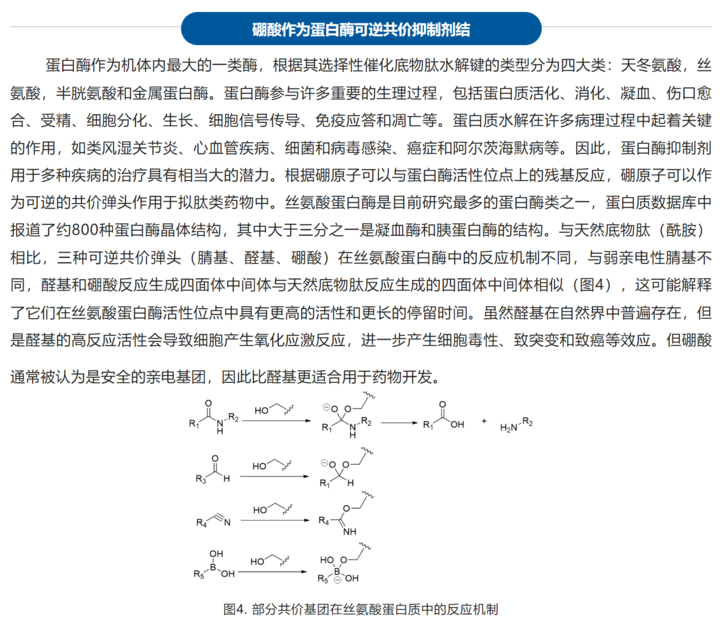
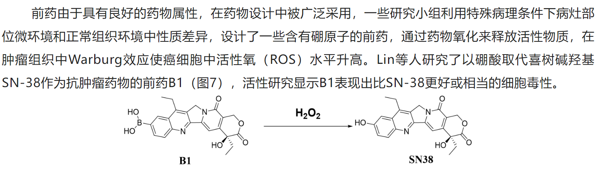

# Academic notes

maybe a new .md file in the future

# Chemistry

## Organic Chemistry

- 芳香甲酸酯，相比于脂肪族羧酸酯，更不易水解。

  Generally speaking, aromatic esters are more stable than aliphatic esters towards hydrolysis under both acidic and basic conditions.
  The rate-limiting step of hydrolysis of carboxylic esters under basic condition is the nucleophilic attack of hydroxide ion on the carbonyl carbon of the ester.

  - the aromatic ring stabilizes the carbonyl group of the ester by resonance, making it less reactive towards nucleophilic attack by water or hydroxide ions. (electronic)
  - Aromatic carboxylic esters are also more difficult to hydrolyze than aliphatic carboxylic esters because they form less stable tetrahedral intermediates during the reaction. (size)

  However, aromatic esters may have electron-withdrawing groups that increase their reactivity towards hydrolysis. Some aliphatic esters may have bulky groups that hinder their hydrolysis.
  [reference](https://chem.libretexts.org/Courses/Brevard_College/CHE_202%3A_Organic_Chemistry_II/02%3A_Carboxylic_Acids_and_Esters/2.10%3A_Reactions_of_Esters)

异头碳效应：连接在异头碳的杂原子取代基更倾向于处于直立键。可能也是二卤代烷稳定的原因

> from wiki

**脒**[[注 1\]](https://zh.wikipedia.org/zh-cn/脒#cite_note-1)（Amidine）是一类含氮[有机化合物](https://zh.wikipedia.org/wiki/有机化合物)，通式见右图，是[羧酸](https://zh.wikipedia.org/wiki/羧酸)的含氮衍生物。最简单的脒是[甲脒](https://zh.wikipedia.org/wiki/甲脒)，HC(=NH)NH2。常见的脒包括[DBN](https://zh.wikipedia.org/wiki/DBN)、[DBU](https://zh.wikipedia.org/wiki/DBU)和[三氮脒](https://zh.wikipedia.org/w/index.php?title=三氮脒&action=edit&redlink=1)等。低级的脒有毒。
脒具碱性，可以和酸形成稳定的盐，常用作[杂环化合物](https://zh.wikipedia.org/wiki/杂环化合物)的合成前体，有些脒类也是药物。脒可通过[Pinner反应](https://zh.wikipedia.org/wiki/Pinner反应)制取。

# Biochemistry

卤素基本是通过谷胱甘肽结合来代谢的

[Halogenation of drugs enhances membrane binding and permeation](https://pubmed.ncbi.nlm.nih.gov/15122640/)

自然界几乎所有天然存在的糖类化合物均是D构型，D-核糖的三个手性碳均为D构型。

[甲醛中毒的化学原理是什么？ - 知乎](https://www.zhihu.com/question/363622944/answer/963100232)

Heavy metal ions can precipitate proteins by bonding with negatively charged parts of the protein molecule, reducing the tendency of the protein to attract a layer of water molecules around it, allowing the protein molecules to interact with one another and precipitate out of solution.

The most abundant membrane lipids are the phospholipids. These have a polar head group and two hydrophobic hydrocarbon tails.
[Phosphatidylcholine (PC) and phosphatidylethanolamine (PE) are the most abundant phospholipids in all mammalian cell membranes](https://pubmed.ncbi.nlm.nih.gov/28411170/).
**[Phosphatidylcholine](https://www.bing.com/ck/a?!&&p=d0affee344b2ba32JmltdHM9MTY3OTA5NzYwMCZpZ3VpZD0yYmEyOWMwMi1lZDI3LTZlNTQtMDBmNC04ZWJlZWM2ZDZmODgmaW5zaWQ9NTQyNw&ptn=3&hsh=3&fclid=2ba29c02-ed27-6e54-00f4-8ebeec6d6f88&u=a1L3NlYXJjaD9xPVBob3NwaGF0aWR5bGNob2xpbmUmZmlsdGVycz1zaWQlM2E3N2E0ZWJjNy0zM2UyLTk1ZWItNjM3Ni1iZGFiNjA0YjIwYzAmZm9ybT1FTlRMTks&ntb=1)** and **phosphatidylethanolamine** are the two main **phospholipids** in eukaryotic cells comprising ~50 and 25% of phospholipid mass, respectively.

hypophosphorylated (comparative more hypophosphorylated, superlative most hypophosphorylated) (biochemistry) phosphorylated to a less than normal extent, or less than fully.

# Pharmacology

## bioisosteres

[SwissBioisostere - A database of molecular replacements for ligand design](http://www.swissbioisostere.ch/)

> reading material
>
> - https://mp.weixin.qq.com/s/Q-X5F3KWaNV2_JXmrmEEHQ
> - https://mp.weixin.qq.com/s/S5tX-4WJbD_1a0qMI3z4EQ
> - https://zhuanlan.zhihu.com/p/493305578
> - https://mp.weixin.qq.com/s/BDPBPu7EyK2lAfqW48HQxQ 五氟硫基

- 药物分子中的羧基可以用磺酰胺，磷酸酯，四唑，硼酸等代替。
  - 在羧基的各种生物电子等排体中，羟肟酸的酸性稍弱，离子化程度较低，能显著提高透膜能力，然而在体内容易被代谢成羧酸，可在其氮原子上引入大一点的基团来提高其代谢稳定性。
  - 

- 基团反转是常见的一种非经典电子等排类型，是同一功能基团间进行的电子等排。-COR 与 ROC-基团，都是酯，且有相似的疏水性
- 不改变环大小的等排体？
- 环内CH=CH和NH、S（缩环），O-C=O；CH=和N=
- 在药物分子设计中可以将偕二氟乙烯基看作是醛基或者酮基的生物电子等排体，应用于酶抑制剂的机理研究

[综述| 药物发现中的共价抑制剂](https://mp.weixin.qq.com/s/B0iYLWQIvlcn4N_0F2o_rw)

The inhibitory constant (Ki) is a type of [equilibrium dissociation constant (Kd)](https://pharmacologycanada.org/equilibrium-dissociation-constant-Kd) that represents the equilibrium binding [affinity](https://pharmacologycanada.org/Affinity) for a ligand that reduces the activity of its binding partner.

*K*i is associated with thermodynamic parameters in that Δ*G* = *RT*ln(*K*i), where Δ*G*, *R*, and *T* are the absolute binding free energy, the gas constant, and the absolute temperature, respectively

# Molecular Cell Biology

## General

A **non-receptor tyrosine kinase** (**nRTK**) is a [cytosolic](https://en.wikipedia.org/wiki/Cytosolic) [enzyme](https://en.wikipedia.org/wiki/Enzyme)

[An orphan receptor is a protein that has a similar structure to other identified receptors but whose endogenous ligand has not yet been identified](https://en.wikipedia.org/wiki/Orphan_receptor).

## Cancer biology

[The main difference between hyperplasia and neoplasia is that hyperplasia is an increase in the number of cells either due to physiological or pathological conditions, whereas neoplasia is unregulated cell proliferation due to genetic changes](https://pediaa.com/what-is-the-difference-between-hyperplasia-and-neoplasia/). Hyperplasia is generally benign, meaning that once the stimulus causing it is removed, the abnormal increase in cell number stops. [On the other hand, neoplasia can be malignant](https://www.healthresearchpolicy.org/hyperplastic/).

### Prostate cancer

The exact mechanisms behind why prostate cancer prefers to metastasize to the bone are not yet fully understood. However, it is known that the bone microenvironment provides a favorable environment for the growth and survival of cancer cells. The bone is rich in growth factors and other signaling molecules that can support the growth of cancer cells. Additionally, the bone is a common site for the spread of cancer cells through the bloodstream, as it is highly vascularized and has a large surface area for cancer cells to attach and grow.

> source forgot...

双膦酸盐是一类可防止骨密度降低的药物，用于治疗骨质疏松症和类似疾病。双膦酸盐类药物吸附于骨表面上的羟磷灰石结合位点，尤其是在骨质吸收活跃的骨表面。当破骨细胞开始重吸收充满双膦酸盐的骨质时，骨质吸收期间释放的双膦酸盐就会损害破骨细胞形成皱褶缘、黏附于骨表面和产生持续骨质吸收所必需的质子的能力。双膦酸盐类药物也可通过减少破骨细胞前体细胞的发育和募集以及促进破骨细胞凋亡，来降低破骨细胞的活性。

sexual hormones

bicalutamine，比卡鲁胺

恩杂鲁胺 (Enzalutamide)

RNA aptamer targeting AR (v7) DNA binding domain?

# Other Biology

rhizosphere: 根际，是指受植物根系活动影响，在物理、化学和生物学性质上不同于土体的那部分微域环境。根际一般指离根轴表面数毫米范围之内，是土壤-根系-微生物相互作用的微区域，也是不同植物种类或品种、土壤和环境条件形成的特定的微生态系统。 

# Computer science

## Coding

重写(Override)与重载(Overload)

- 重写是子类对父类的允许访问的方法的实现过程进行重新编写, 返回值和形参都不能改变。**即外壳不变，核心重写！**
- 重载(overloading) 是在一个类里面，方法名字相同，而参数不同。返回类型可以相同也可以不同。

## HPC

- **Tesla A100 is...2~3x** faster than the V100 using 32-bit precision.
- SIMD stands for **Single Instruction, Multiple Data**. It is a type of parallel processing in Flynn’s taxonomy. [SIMD describes computers with multiple processing elements that perform the same operation on multiple data points simultaneously](https://en.wikipedia.org/wiki/Single_instruction,_multiple_data)

# AI

- RLHF就是基于人类反馈（Human Feedback）对语言模型进行强化学习（Reinforcement Learning），和一般的fine-tune过程乃至prompt tuning自然也不同。
  https://zhuanlan.zhihu.com/p/591474085

# Physics

Dissipated work is a concept in thermodynamics that refers to the amount of work that is lost to heat during a process. When work is done on or by a system, some of the energy may be transferred to the system’s surroundings as heat. This heat transfer represents a loss of useful energy, as it is no longer available to do work. The amount of work that is lost in this way is called dissipated work. For example, when you rub your hands together, you are doing work to overcome the friction between your hands. Some of the energy from this work is transferred to your hands as heat, warming them up. This heat transfer represents dissipated work.

