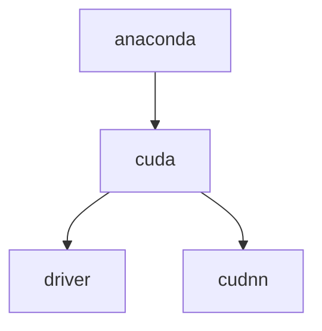

# Linux study

This is a record of my operations during 折腾ing the system, in order not to forget.

有些使用方法写在debugging那里了，也许要整理吧，但尽量描述详细，方便搜到

## basics

1. kde and gnome are two types of desktop interface. KDE looks like Windows desktop and gnome is the classic Linux desktop interface.

2. Linux是把要安装的软件分布在整个系统的各个文件夹里面， 比如所有软件的配置文件都安装在`/etc`下面， 软件需要的库文件都安装在`/lib`下面，日志文件都在`/var/log`下面，`/bin`下是常用的程序，等等。 比较复杂 哈哈。

3. rpm包主要应用在RedHat系列包括 Fedora等发行版的Linux系统上，deb包主要应用于Debian系列包括现在比较流行的Ubuntu等发行版上。
   
   transform .rpm to .deb: `sudo alien ./*.rpm`

4. It's hard to change default install directory. And I have to make a boot CD (U disk) to change the storage distribution (like when I'm installing Ubuntu, how much for root, home, swap...).

5. 下面是一些典型的段错误的原因: 由内存管理硬件试图访问一个不存在的内存地址

6. 环境变量
   
   root和user的.bashrc是不一样的！
   
   export的含义 https://askubuntu.com/questions/720678/what-does-export-path-somethingpath-mean

7. Linux操作系统执行可执行文件提示*No such file or directory*的原因可能是操作系统位数和可执行文件需要的lib库的位数不匹配

## Operations

1. the .sh files on the desktop needs "bash"

### Fundamental settings and softwares

#### system info

1. check the system
   
   ```shell
   uname -a # check system version
   cat /proc/version # check Linux, OS, gcc version
   ```

2. path:
   
   ```shell
   sudo gedit ~/.bashrc
   source ~/.bashrc
   ```

3. inspect cpu information
   
   https://lijian.ac.cn/posts/2018/09/linux-information/
   
   https://blog.51cto.com/feihan21/1174677
   
   ```shell
   cat /proc/cpuinfo
   ```
   
   mine: i7 9700k, 8 cores

4. gpu info
   
   ```shell
   cat /proc/driver/nvidia/version
   nvidia-smi
   ```
   
4. my base board
   
   https://www.asus.com/hk/Motherboards-Components/Motherboards/PRIME/PRIME-Z390-P/ 华硕PRIME Z390-P
   
6. [check shell version](https://blog.csdn.net/electrocrazy/article/details/78313962)

#### monitor resource usage

[ref](https://blog.csdn.net/liaomin416100569/article/details/76920328)

1. `top`
2. 

#### disk management

1. 删除分区用gparted

   也许 https://blog.csdn.net/xiexievv/article/details/50525783

   https://blog.csdn.net/renfeigui0/article/details/100765958 格式化

2. Linux中/var空间不足的解决办法 https://blog.csdn.net/hqzhon/article/details/49027351

   not use this partition anymore
   
3. on disk check

   > see below debugging 22.1.14

4. Linux `dmesg`（英文全称：display message）命令用于显示开机信息。

5. [解决类似umount target is busy挂载盘卸载不掉问题 - Adrian·Ding - 博客园](https://www.cnblogs.com/ding2016/p/9605526.html)

#### system settings

1. 字体缺失（WPS等）

   add into system font directory https://zhuanlan.zhihu.com/p/31848590

   ```
   sudo cp * /usr/share/fonts/wps-office
   ```

   Windows：`C:\Windows\fonts`

   查看当前支持的字体

   ```shell
   fc-list
   ```

   in `/usr/share/fonts/`. copy your font into and 

   ```shell
   sudo cp *.otf /usr/share/fonts/opentype
   sudo cp *.ttf /usr/share/fonts/truetype
   sudo apt install xfonts-utils
   mkfontscale
   mkfontdir
   sudo fc-cache -fv
   ```

   to use in matplotlib

   ```python
   import matplotlib
   matplotlib.get_cachedir()
   ```

   `rm -rf` it!

2. Linux更改桌面（等）路径

   ```
   sudo gedit ~/.config/user-dirs.dirs
   ```

   改完重启即可

3. upgrade from 18.04 to 20.04. upgraded cuda and graphics driver at the same time!

3. [Ubuntu设置文件默认打开方式](https://jingyan.baidu.com/article/915fc414b686a251394b2080.html)：右键、属性

#### input method installation

- fcitx
  
  - steps
  
    ```shell
    # use software market or commmand line:
    sudo apt install fcitx fcitx-config-gtk # configure GUI
    # 设置fcitx开机自启动
    sudo cp /usr/share/applications/fcitx.desktop /etc/xdg/autostart/
    # say goodbye to ibus
    sudo apt purge ibus
    ```
    
  - also set fcitx in "language support". reboot.
  
  - uninstall: https://jingyan.baidu.com/article/d5c4b52b95eb52da570dc511.html
  
    ```shell
    sudo apt-get remove fcitx fcitx-module* fcitx-frontend*
    sudo apt-get purge fcitx* # config
    ```
  
- 迅飞输入法

  - install https://www.yoki.moe/Intstu/24.html and https://www.52pojie.cn/thread-1243805-1-1.html
  - 先到官网下几个lib然后update就把依赖装好了
  - setting: Ctrl+space 激活/反激活输入法

  > dependence of com.iflytek.iflyime_1.0.6-7_amd64.deb can not be installed

- 搜狗 

  - install

    https://pinyin.sogou.com/linux/help.php

    ```shell
    # install and dependencies
    sudo dpkg -i sogou*.deb
    sudo apt install libqt5qml5 libqt5quick5 libqt5quickwidgets5 qml-module-qtquick2
    sudo apt install libgsettings-qt1
    ```

    add sogou. then it works!

  - 开启了细胞词库功能  https://blog.csdn.net/Teri_Tor/article/details/111461984

    > 感觉搜狗拼音输入法比谷歌拼音输入法更好，因为有最新流行词汇，可以打出表情符号等等。
    >

    dictionaries: https://pinyin.sogou.com/dict/

    follow the blog, but paths have changed! try `tree ~/.config/sogoupinyin/`

    ```shell
    sudo cp *.scel ~/.config/sogoupinyin/dict/scd
    ```

    not work. other old tutorials is outdated...

    skins: https://pinyin.sogou.com/skins

    > Windows: just click to install.
    >
    > Linux also openwith sogou, but no such program...

    设置界面自己好了。。scel file添加后在客户端勾选即可。皮肤还不行

    > still can't see conf gui, but `gedit /home/gxf/.config/sogoupinyin/dict/shell.conf`

- 2022.1.4 use google pinyin. 至少能用。。先用吧阿巴阿巴
  
  ```shell
  sudo apt-get install fcitx-googlepinyin
  whereis googlepinyin
  ```
  
  > ` /usr/lib/x86_64-linux-gnu/googlepinyin/data`  词库目录

- setting commands
  
  ```shell
  fcitx-config-gtk3 # global configuration
  im-config
  ```

- why? after "restart", config is not shown...

  solution: type `fcitx` in Terminal

- skin?

- other, see fcitx project
  
  ```shell
  sudo apt-get install fcitx-libpinyin
  ```


#### figures&media

1. cannot play video?

   https://blog.csdn.net/weixin_45361800/article/details/116844378  solved!

   ```shell
   sudo apt install ffmpeg
   ```

   no longer support Adobe flash player

   > 可能导致有命令`flash-player-properties`的:https://jingyan.baidu.com/article/3c48dd34a2952ee10be35820.html
   >
   > install flash player for firefox (not successful，没删)
   >
   > download https://www.flash.cn/download  
   >
   > install https://blog.csdn.net/weixin_33759269/article/details/92001224 or https://www.jb51.net/article/193782.htm
   >
   > ```shell
   > sudo cp libflashplayer.so /home/gxf/.mozilla/firefox/
   > sudo cp -r usr/* /usr
   > ```
   >
   > 如何显示Firefox插件(Plugins)的完整路径 https://blog.csdn.net/xuewuzhijin2012/article/details/53140899

2. no sound?

   ```shell
   sudo gedit /etc/default/grub
   # GRUB_CMDLINE_LINUX_DEFAULT="quiet splash snd_hda_intel.dmic_detect=0"
   sudo grub-mkconfig -o /boot/grub/grub.cfg
   sudo update-grub
   reboot
   ```

   https://blog.csdn.net/swordsm/article/details/108417931

   but, only when the headphone is charged can we play music........

   other:

   ```shell
   sudo apt install pavucontrol
   pavucontrol
   ```

3. wall paper壁纸

   搜索：电脑桌面壁纸 化学; microscopy photos

   some good websites

   - https://wall.alphacoders.com/
   - https://wallpapercave.com/
   - https://www.wallpaperflare.com/search?wallpaper=chemistry
   - https://www.flickr.com/photos/zeissmicro/

   > https://cdn.shopify.com/s/files/1/1064/0118/files/periodic-table-of-tech-standalone_alt.png?v=1579813258

   Lively WallpaperLively *Wallpaper* for Windows

4. process figure

   如果只需要单纯的裁剪功能, 推荐gThumb工具, 界面美观好用, 媲美某Q的聊天截图crtl+A
   打开命令行,输入

   ```shell
   sudo apt install gthumb
   ```

   下载安装完, 就能用啦, 输入

   ```shell
   gthumb
   ```

   为了以后使用方便, 可以右键屏幕左侧状态栏的gthumb图标,选择”锁定到启动器”. 以后就不用打开命令行了, 直接点状态栏的gthumb图标就行了. gthumb的具体用法不用说, 软件就那几个键, 而且都是图标, 看看就明白了.

   裁剪、调整大小、调整色彩等

   - As for add border, use `cv2.copyMakeBorder()`

   https://blog.csdn.net/qq_36560894/article/details/105416273 

   https://www.geeksforgeeks.org/python-opencv-cv2-copymakeborder-method/

5. install lightdm: https://blog.csdn.net/hgtjcxy/article/details/90645838

   display managers: https://ubuntuqa.com/article/6577.html

   ```shell
   sudo apt update
   sudo apt install lightdm
   # or
   sudo dpkg-reconfigure lightdm
   # click ok
   reboot
   ```

6. 

#### other

1. google download?

   为什么用 Chrome 下载东西速度非常慢？ - 老郭的回答 - 知乎 https://www.zhihu.com/question/20082667/answer/1177212992

   may use firefox...but now I abandoned firefox

2. 有道dictionary 

   > wrong: http://cidian.youdao.com/index-linux.html. 
   >
   > dependences: https://my.oschina.net/u/4400327/blog/3544515 
   >
   > https://www.ubuntuupdates.org/package/core/trusty/universe/updates/gstreamer0.10-plugins-ugly
   >
   > finally, for the xxx-plugin-ugly: https://my.oschina.net/u/3384982/blog/867063

   see https://blog.csdn.net/weixin_42912072/article/details/108572983, should be the newest version https://cidian.youdao.com/multi.html#linuxAll! just download all the dependencies, no need to fix xxx-plugin-ugly!

3. “软件”里有typora

   https://typora.io/windows/dev_release.html dev版本不要钱的

   主题路径：`/home/gxf/.config/Typora/themes`

   现在还是用下好的包了

4. 桌面便签

   ```shell
   sudo apt-get install xpad
   ```

5. wine applications!

   https://github.com/zq1997/deepin-wine

   - 首次使用需要添加仓库：

     ```shell
     wget -O- https://deepin-wine.i-m.dev/setup.sh | sh
     ```

   - 安装

     ```shell
     sudo apt-get install com.qq.weixin.deepin
     ```

   - 应用图标需要注销重登录后才会出现

6. 

### Operation on files and directory

#### create and delete

1. create directory: 
   
   ```shell
   mkdir your-directory
   ```

2. rm命令
   
   ```shell
   rm -d 目录名              #删除一个空目录
   rm --dir目录名              #删除一个空目录
   rm -r 目录名              #删除一个非空目录
   rm 文件名                  #删除文件
   ```
   
   - -f：在删除过程中不给任何指示，直接删除。
   - -r：将参数中列出的全部目录和子目录都递归地删除。若删除目录则必须配合选项"-r"
   - -i：与-f选项相反，交互式删除，在删除每个文件时都给出提示。

3. delete all files under a directory: 
   
   ```shell
   rm ./*
   ```

4. check the size of a folder: https://zhidao.baidu.com/question/1178566665695139419.html
   
   ```shell
   du -sh /directory
   ```

5. ls

   https://www.runoob.com/linux/linux-comm-ls.html

6. 

#### other

1. move file in terminal: https://blog.csdn.net/qq_38451119/article/details/81121906
   
   ```shell
   sudo mv filename target-dir
   ```

2. create a **soft link** (short cut). Files stored in `gxf1` are actually occupying space in `gxf`. 
   
   ```shell
   sudo ln -s /gxf/ ./gxf1
   ```
   
   > (However, I still have to specify the install directory.)

   create a **hard link**:
   
   ```shell
   sudo ln ./source ./target
   ```
   
   https://zhuanlan.zhihu.com/p/88891362
   
   my comprehension: 都是一个指针
   
   硬链接和源文件是一样的，指向相同的内容（文件、inode）；
   
   软链接指向一个东西（链接文件），这个东西（也算是指针）告诉你某处有个文件（源文件内容）。
   
   区别就是删了源文件，硬链接还能访问，软的就不行。但是两种链接都可以改名字？
   
   如果要类比，硬链接就像win备份用的那个符号链接，软链接则像快捷方式
   
   
   
   
   
4. `su root`: enter root. pw: a

5. find:
   
   ```shell
   sudo find / -name "*your-query*" # all that contains your query
   ```

6. another tool to search
   
   ```shell
   locate -h
   Usage: locate [OPTION]... [PATTERN]...
   Search for entries in a mlocate database.
   
     -A, --all              only print entries that match all patterns
     -b, --basename         match only the base name of path names
     -h, --help             print this help
     -w, --wholename        match whole path name (default)
   
   ```
   
   locate命令其实是find -name的另一种写法，但是要比后者快得多，原因在于它不搜索具体目录，而是搜索一个数据库/var/lib/locatedb，这个数据库中含有本地所有文件信息。**Linux系统自动创建这个数据库，并且每天自动更新一次**，所以使用locate命令查不到最新变动过的文件。为了避免这种情况，可以在使用locate之前，先使用updatedb命令，手动更新数据库。
   
6. create file
   
   ```shell
   touch .xxx # create
   ls -a # check
   ```

7. change file name
   
   ```shell
   sudo mv test.txt new.txt
   sudo mv ./fca58054-9480-4790-a8ab-bc37f33823a4/ ./mechanical
   ```

8. `rename` to change 

   https://blog.51cto.com/jiemian/1846951 Perl语言版本格式

   ```shell
   rename 's/a/b/' *a*
   ```

9. tree: list subdirectories

   ```shell
   sudo apt-get install tree
   ```

10. check file size

    ```shell
    man ls
    ls -l # kb
    ls -lh # proper magnitud
    ls -l --blocksize=g  # gb
    ```

10. 

#### zip and unzip

the problem rises when installing Gaussian

```shell
sudo apt-get install rar unrar
```

unzip multiple files: maybe just select all part files and right click...

https://www.cnblogs.com/xd502djj/archive/2011/03/25/1995331.html

```shell
unrar x -o- -y 'the first part file' 'target path'

unrar x -o- -y 'Gaussian 16 Rev. A.03 ES64L Linux x64.part1.rar' .
```

zip into some certain-size part files to store in baidunetdisk or qq

```shell
tar -zcvf folder.tar.gz folder1 folder2 | split -b 4000M -d -a 1 - folder.tar.gz
```

> `-c` denotes zipping and `-x` denotes unzipping


#### disk

1. 自我检测分析与报告技术smart: https://www.cnblogs.com/xqzt/p/5512075.html

#### debian series features

1. 解决依赖问题：it seems after failing to install a .deb package (due to dependent packages), the dpkg always remember this error, and even automatically install the dependent packages if you open **software updater**. or
   
   ```shell
   sudo apt-get -f install
   ```
   
   如果让我删，就手动`apt-get install`几个再用软件更新器

2. 

### desktop manager

#### K desktop specific settings (not using)

1. fonts
2. settings manager 
   - lightdm desktop manager
     - taskbar fonts
   - appearance
     - desktop icon and font
3. add "show desktop": http://www.linuxdiyf.com/view_134588.html
4. sf

#### GNOME

1. 在Ubuntu的系统中如何将应用程序添加到开始菜单中 https://blog.csdn.net/qk1992919/article/details/51034361/ https://ubuntuqa.com/article/1235.html
   
   ```
   Name=Pymol   #此软件在菜单中当语言为英语的时候的显示名称      
   Name[zh_CN]=Pymol  #此软件在菜单中当语言为中文的时候的显示名称
   Comment=pymol   #此软件在菜单中当语言为英语的时候的说明       
   Comment[zh_CN]=pymol   #此软件在菜单中当语言为中文的时候的说明
   Exec=/home/gxf/pymol/pymol     #要执行的程序的名称
   Terminal=false        #执行时是否启动终端
   X-MultipleArgs=false   #是否有多个参数
   Type=Application      #程序的类型
   Icon=/home/gxf/pymol/share/pymol/data/pymol/icons/icon2_128x128.png   #在开始菜>单中的显示图标
   ```
   
   还是用**alacarte**

   ```
   adt
   pymol
   DSV
   GaussView
   chimera
   Pycharm
   anaconda-navigator
   ```
   
2. 软件中心点开没反应？ 
   
   ```shell
   sudo apt-get update  
   sudo apt-get dist-upgrade
   sudo apt-get install --reinstall ubuntu-software
   ```
   
   也没用

3. 设置→隐私→**屏幕**锁定→设置时间

4. https://gitee.com/wszqkzqk/deepin-wine-for-ubuntu windows环境，装qq微信等

5. Ubuntu分屏 https://blog.csdn.net/SiriusExplorer/article/details/103016747

   go to https://extensions.gnome.org/extension/39/put-windows/

   setting 

   

### customs

1. to denote path, separate the sentence by / like:
   
   "/path/to/libfftw3f"

2. 

> #### other
> 
> Ubuntu20.04软件源更换 - 舟公的文章 - 知乎 https://zhuanlan.zhihu.com/p/142014944
> 
> change software source
> 
> ```
> sudo cp /etc/apt/sources.list /etc/apt/sources.list.bak # backup
> sudo vim /etc/apt/sources.list
> #添加阿里源
> deb http://mirrors.aliyun.com/ubuntu/ focal main restricted universe multiverse
> deb-src http://mirrors.aliyun.com/ubuntu/ focal main restricted universe multiverse
> deb http://mirrors.aliyun.com/ubuntu/ focal-security main restricted universe multiverse
> deb-src http://mirrors.aliyun.com/ubuntu/ focal-security main restricted universe multiverse
> deb http://mirrors.aliyun.com/ubuntu/ focal-updates main restricted universe multiverse
> deb-src http://mirrors.aliyun.com/ubuntu/ focal-updates main restricted universe multiverse
> deb http://mirrors.aliyun.com/ubuntu/ focal-proposed main restricted universe multiverse
> deb-src http://mirrors.aliyun.com/ubuntu/ focal-proposed main restricted universe multiverse
> deb http://mirrors.aliyun.com/ubuntu/ focal-backports main restricted universe multiverse
> deb-src http://mirrors.aliyun.com/ubuntu/ focal-backports main restricted universe multiverse
> #添加清华源
> deb https://mirrors.tuna.tsinghua.edu.cn/ubuntu/ focal main restricted universe multiverse
> # deb-src https://mirrors.tuna.tsinghua.edu.cn/ubuntu/ focal main restricted universe multiverse
> deb https://mirrors.tuna.tsinghua.edu.cn/ubuntu/ focal-updates main restricted universe multiverse
> # deb-src https://mirrors.tuna.tsinghua.edu.cn/ubuntu/ focal-updates main restricted universe multiverse
> deb https://mirrors.tuna.tsinghua.edu.cn/ubuntu/ focal-backports main restricted universe multiverse
> # deb-src https://mirrors.tuna.tsinghua.edu.cn/ubuntu/ focal-backports main restricted universe multiverse
> deb https://mirrors.tuna.tsinghua.edu.cn/ubuntu/ focal-security main restricted universe multiverse
> # deb-src https://mirrors.tuna.tsinghua.edu.cn/ubuntu/ focal-security main restricted universe multiverse multiverse
> ```
> 
> ```shell
> # deepin
> deb http://mirrors.aliyun.com/deepin/ bionic main restricted universe multiverse
> deb-src http://mirrors.aliyun.com/deepin/ bionic main restricted universe multiverse
> 
> deb http://mirrors.aliyun.com/deepin/ bionic-security main restricted universe multiverse
> deb-src http://mirrors.aliyun.com/deepin/ bionic-security main restricted universe multiverse
> 
> deb http://mirrors.aliyun.com/deepin/ bionic-updates main restricted universe multiverse
> deb-src http://mirrors.aliyun.com/deepin/ bionic-updates main restricted universe multiverse
> 
> deb http://mirrors.aliyun.com/deepin/ bionic-proposed main restricted universe multiverse
> deb-src http://mirrors.aliyun.com/deepin/ bionic-proposed main restricted universe multiverse
> 
> deb http://mirrors.aliyun.com/deepin/ bionic-backports main restricted universe multiverse
> deb-src http://mirrors.aliyun.com/deepin/ bionic-backports main restricted universe multiverse
> ```
> 
> E: 仓库 “http://mirrors.aliyun.com/deepin bionic Release” 没有 Release 文件。
> 
> N: 无法安全地用该源进行更新，所以默认禁用该源。
> 
> N: 参见 apt-secure(8) 手册以了解仓库创建和用户配置方面的细节。
> 
> https://packages.ubuntu.com
> https://packages.debian.org

## Specific commands

### vim

- `:w` 保存但不退出

- `:wq` 保存并退出
  
  - `:q` 退出

- `:q!` 强制退出，不保存
  
  - `:e!` 放弃所有修改，从上次保存文件开始再编辑命令历史                                                                                                                 

- `:e!` 放弃所有修改，从上次保存文件开始再编辑命令历史                                                                                                                 

- :q<Enter>               退出                                    
  
  - :help<Enter>  或  <F1>  查看在线帮助                            

- :help version8<Enter>   查看版本信息
  
  - esc: stop editing

- insert: edit

- :set fileencoding

  https://www.cnblogs.com/sharesdk/p/9208349.html


### ssh and scp


### make

`make`命令是运行的所在目录下的`Makefile`文件, 如果*Make*file 里有*check*的话, 会执行测试,也就是检查下编译出来的东西能不能用

### dpkg: installation

install with .deb

just **double click it** 不能指定目录

命令行法：直接解压到当前目录，然后配置环境变量，即可启动运行程序；

```shell
dpkg -x same.deb 
```

 当然，还有另外一个命令，安装到指定目录：

```shell
dpkg -i --instdir=/dest/dir/path some.deb # under root
```

 关于dpkg：https://blog.csdn.net/weixin_30394633/article/details/98926820

- 常用
  
  ```shell
  dpkg -i xx.deb
  dpkg --info xx.deb # 查看信息，包括软件包名，卸载时用！we should remember some of them
  dpkg -P xx.deb # 卸载
  dpkg --unpack *.deb # 解压？
  ```

- 查看安装包状态：-l
  
  ```
  期望状态=未知(u)/安装(i)/删除(r)/清除(p)/保持(h)
  | 状态=未安装(n)/已安装(i)/仅存配置(c)/仅解压缩(U)/配置失败(F)/不完全安装(H)/触发器等待(W)/触发器未决(T)
  |/ 错误?=(无)/须重装(R) (状态，错误：大写=故障)
  ```
  
  https://zhuanlan.zhihu.com/p/57472336
  
  https://www.jianshu.com/p/3bbd0cf2debe 也许能删
  
  ```shell
  dpkg -l | grep R
  ```
  
  found: real-vnc-server

- 查看应用程序安装路径
  
  ```shell
  dpkg -L sunloginclient
  ```

- dfa

debug

- 死机 when installing .deb, reboot. https://mlog.club/article/3533423

  just fsck your root

  

### apt-get

https://blog.csdn.net/liudsl/article/details/79200134

apt 和 apt-get的区别：apt = apt-get、apt-cache 和 apt-config 中最常用命令选项的集合。

- install with apt-get or apt
  
  ```shell
  sudo apt-get install xxx
  sudo apt-get remove xxx # 会删除软件包而保留软件的配置文件
  sudo apt-get purge xxx # 会同时清除软件包和软件的配置文件，彻底地刪除
  ```
  
  https://www.cnblogs.com/oddcat/articles/9706393.html

- 更新
  
  ```shell
  sudo apt update # 更新可用软件包；已安装的软件包是否有可用的更新？
  sudo apt upgrade # 更新已安装的软件包
  ```

- https://blog.csdn.net/chenyulancn/article/details/62216190 转成rpm

- https://ubuntuqa.com/article/503.html check apt log

- `sudo apt-get` is hard to assign prefix: 不能理解命令行选项与其他选项的搭配"--prefix=xxx"与其他选项的搭配

- 安装缺失的包
  
  ```shell
  sudo apt install -f
  sudo apt fix --broken # ?
  sudo apt --fix-broken install
  ```

- 更新软件源
  
  ```shell
  sudo gedit /etc/apt/sources.list
  ```

- https://blog.csdn.net/jenyzhang/article/details/72510631  
  
  [Ubuntu apt-get upgrade 时候忽略某些安装包](https://blog.csdn.net/u010544187/article/details/76512290?spm=1001.2101.3001.6661.1&utm_medium=distribute.pc_relevant_t0.none-task-blog-2%7Edefault%7ECTRLIST%7Edefault-1.no_search_link&depth_1-utm_source=distribute.pc_relevant_t0.none-task-blog-2%7Edefault%7ECTRLIST%7Edefault-1.no_search_link)
  
  ```shell
  sudo apt-mark hold package
  sudo apt-mark unhold package
  sudo dpkg --get-selections | grep hold
  ```
  
  > do not use `spt update` any more because typora cannot be connected
  > 
  > ```shell
  > sudo apt-get upgrade
  > ```

- 

### tar and unzip

- manual

  ```shell
    tar -cf archive.tar foo bar  # Create archive.tar from files foo and bar.
    tar -tvf archive.tar         # List all files in archive.tar verbosely.
    tar -xf archive.tar          # Extract all files from archive.tar.
  
   主操作模式:
  
    -A, --catenate, --concatenate   追加 tar 文件至归档
    -c, --create               创建一个新归档
    -d, --diff, --compare      找出归档和文件系统的差异
        --delete               从归档(非磁带！)中删除
    -r, --append               追加文件至归档结尾
    -t, --list                 列出归档内容
        --test-label           测试归档卷标并退出
    -u, --update               仅追加比归档中副本更新的文件
    -x, --extract, --get       从归档中解出文件
  
    -j, --bzip2                通过 bzip2 过滤归档
    -z, --gzip, --gunzip, --ungzip   通过 gzip 过滤归档
        --zstd                 通过 zstd 过滤归档
    -Z, --compress, --uncompress   通过 compress 过滤归档
    -v, --verbose              详细地列出处理的文件
  ```

  

- tbz file

  ```shell
  tar -xjvf G16-A03-AVX2.tbz
  ```

- unzip

### privilige: chown and chmod

change owner, change mode

Linux/Unix 的文件调用权限分为三级 : 文件所有者（Owner）、用户组（Group）、其它用户（Other Users）。

https://www.runoob.com/linux/linux-comm-chmod.html  great!

https://www.runoob.com/linux/linux-comm-chown.html

### svn

get part of the files in one GitHub repository

- `svn checkout url`, trunk

  Then the files are downloaded to the current directory of terminal.

  https://blog.csdn.net/ai_faker/article/details/107823359?utm_medium=distribute.pc_relevant.none-task-blog-title-2&spm=1001.2101.3001.4242

- https://blog.csdn.net/q279838089/article/details/44751039

### npm

install nodejs first.

change source: https://www.cnblogs.com/feng-hao/p/11774543.html

### other during installation

1. run .sh files:
   
   ```shell
   sh file.sh
   chmod a+x file.sh
   ```
   
   We can put our commands (like open pycharm) in a text file and save as .sh file. Put them in the desktop.

2. install with .tar.gz
   
   ```shell
   tar xvzf filename.tar.gz # /your/directory
   # enter the directory
   ./configure # --prefix=...
   make
   make install
   ```
   
   maybe
   
   ```shell
   tar xvzf filename.run.tar.gz # get a .run file
   ```

3. install with .run
   
   just **double click it**...or
   
   ```shell
   chmod +x filename.run
   sudo ./filename.run # like .exe in win
   ```

4. install flatpakref package
   
   ```shell
   sudo apt install flatpak
   sudo apt install gnome-software-plugin-flatpak # GUI
   ```
   
4. make -jn (install...)
   n代表同时编译的进程，可以加快编译速度，n由用户计算机的配置与性能决定，当前的典型值为10。所以`make -j10`

5. check version: `软件名 -version`

6. under root, no need to add `sudo`

7. wget失败：拒绝连接 https://www.jianshu.com/p/cba95f62dc35  ??

8. 

# Installation and softwares

note: some used stupid old strange paths. replace with yours (eg: your `/home`)

## memo

> 安排存储分配。关键的软件尽量装到root
>
> - [x] 翻墙
> - [x] 向日葵，vnc viewer
> - [x] 显卡驱动, cuda, cudnn
> - [x] 编程环境 (pycharm, anaconda)
> - [x] 基本工具（git, gparted这种）、常用写作（typora和主题, VScode）
> - [x] 分子模拟环境（gmx,openbabel,pymol,gaussian,ambertools,acpype, VMD,DSV）
> - [x] 配套工具（百度网盘、阅读器、qq、有道词典、WPS）
> - [x] email client
> - [x] 程序图标
> - [x] 备份系统
> - [x] 输入法、字体等
> - [ ] 其他？（texlive,,mendeley,GitHub Desktop, flash, 浏览器)
> - [ ] 修理：software?
> - [ ] 自定义桌面等，如天气，壁纸图片
>
> 小问题
>
> - [x] 输入法点不开  界面（算了）
> - [ ] 
> - [ ] 

## 重装系统

### Partition

2022.1.3重装

| 挂载点   | 大小  | 文件系统 | 分区类型 |
| ----- | --- | ---- | ---- |
| \boot | 1G  | ext4 | 逻辑   |
| \efi  | 1G  | EFI  | 主分区  |
| \swap | 16G | swap | 逻辑   |
| \     | 剩下的 | ext4 | 主分区  |

其实boot和efi半个g就够了

### Common flow

- 定好系统语言等

- 如果不改home的分区，原来磁盘上的文件不会丢失

- 安装完第一件事：确定合适驱动版本，直接在系统里下
  
  - 禁用noveu那个

- 安装QQ，方便传送经验

- 更新软件源，便于下载lightdm等依赖
  
  - 先注释掉原来的源，update

- 安装向日葵，以便远控

- 尝试是否能重启

- 更改root密码

  ```shell
  sudo passwd root
  ```

- 挂载home盘，实现自动挂载。找uuid：那个设备的路径

  ```
  vi /etc/fstab
  添加如下内容：
  uuid=xxxxxxx /h ext4 defaults 0 0
  ```

- 更改desktop的路径为英文，极端cmd下语言改成英文 [命令行更改系统语言](https://blog.csdn.net/MaryChow/article/details/68494243?spm=1001.2101.3001.6650.1&utm_medium=distribute.pc_relevant.none-task-blog-2%7Edefault%7ECTRLIST%7Edefault-1.no_search_link&depth_1-utm_source=distribute.pc_relevant.none-task-blog-2%7Edefault%7ECTRLIST%7Edefault-1.no_search_link)

  ```shell
  sudo vim /etc/default/locale
  LANG="en_US.UTF-8"
  LANGUAGE="en_US:en"
  
  LC_NUMERIC="zh_CN.UTF-8"
  LC_TIME="zh_CN.UTF-8"
  LC_MONETARY="zh_CN.UTF-8"
  LC_PAPER="zh_CN.UTF-8"
  LC_IDENTIFICATION="zh_CN.UTF-8"
  LC_NAME="zh_CN.UTF-8"
  LC_ADDRESS="zh_CN.UTF-8"
  LC_TELEPHONE="zh_CN.UTF-8"
  LC_MEASUREMENT="zh_CN.UTF-8"
  ```

- 安装vi，git, alacarte, gpart, gparted, ethtool, 等基本工具

  configure git

  ```shell
  sudo apt-get install vi git alacarte gpart gparted ethtool
  ```

- chrome浏览器，安装vpn，翻墙、校园网

  > https://www.google.cn/intl/zh-CN/chrome/
  >
  > go to https://support.google.com/a/answer/135937?hl=en to sync your account

- typora, VScode等办公

  > ```shell
  > sudo apt-get install snap
  > sudo snap install --classic code
  > sudo snap r codium
  > ```
  >
  > https://www.typora.io/releases/all

- 把win的字体拷过来一份

- 安好cuda、cudnn

- 安装下游的gmx、vmd、namd

- 

  ## fundamental softwares

  1. VScode
     
     > ```shell
     > dpkg -i --instdir=/media/kemove/fca58054-9480-4790-a8ab-bc37f33823a4/programfiles/root-like-programs code_1.52.1-1608136922_amd64.deb
     > ```

  2. realvnc
     
     ```shell
     systemctl start vncserver-x11-serviced.service
     systemctl enable vncserver-x11-serviced.service
     ```

  3. GitHub Desktop on Linuxhttps://codechina.csdn.net/mirrors/shiftkey/desktop?utm_source=csdn_github_accelerator

  4. xshell http://www.netsarang.com/download/free_license.html

  5. https://linux.wps.cn/

  6. weather  https://www.ywnz.com/linuxjc/4429.html

  7. insync, sync for google, onedrive, dropbox
     
     https://cn.go-travels.com/98643-how-to-use-google-drive-linux-4176144-1291281

  8. 

> browsers
> 
> - google chrome
>   
>   - https://www.chromedownloads.net/chrome64linux-stable/1171.html、
>   - 包名：google-chrome-stable
> 
> - firefox
> 
> - edge
> 
> - opera
> 
> - falcon (from snap)
> 
> - 360
> 
> - epiphany-browser (web)
>   
>   ```shell
>   sudo apt-get install epiphany-browser -y
>   ```
> 
> - netsurf
>   
>   https://flatpak.org/setup/Ubuntu/ then download flatpak package
> 
> - Chromium
>   
>   - 软件商店

## DL environment

    1. `nvidia smi` shows cuda version 11.1, driver is 455.45.01. We should not use an open source driver. check additional driver from 'start'.
    2. nivida.cn also shows 455.45, so do I need to install the driver? Now no.

  dependence:



### pycharm 

student (professional)

https://blog.csdn.net/qq_51468843/article/details/110561151

my email: stu, `741*******cb`

1. problem! can only run .sh file now!
2. cooooonfiiigure a command for them

### Anaconda

1. no need to copy a .sh file. You can assign a directory.

2. under `su root`

3. `conda: no command`: add path. https://blog.csdn.net/freezeplantt/article/details/80176215

4. cannot activate at the first time: run `source activate`
   
   then run `conda activate` or `conda deactivate`
   
   see https://blog.csdn.net/qq_36338754/article/details/97009338

### cuda

- .deb just follow official guide

  .run https://blog.csdn.net/weixin_38369492/article/details/107957296

  both: don't forget blacklist nouveau

- > Driver:   Not Selected
  > Toolkit:  Installed in /usr/local/cuda-11.1/
  > Samples:  Installed in /home/kemove/, but missing recommended libraries
  >
  > Please make sure that
  >
  > - PATH includes /usr/local/cuda-11.1/bin
  > - LD_LIBRARY_PATH includes /usr/local/cuda-11.1/lib64, or, add /usr/local/cuda-11.1/lib64 to /etc/ld.so.conf and run ldconfig as root
  >
  > ```shell
  > export PATH=$PATH:/usr/local/cuda/bin
  > export LD_LIBRARY_PATH=$LD_LIBRARY_PATH:/usr/local/cuda/lib64
  > ```
  >
  > **To uninstall the CUDA Toolkit, run cuda-uninstaller in /usr/local/cuda-11.1/bin**
  >
  > > ***WARNING: Incomplete installation! This installation did not install the CUDA Driver. A driver of version at least .00 is required for CUDA 11.1 functionality to work.
  > > To install the driver using this installer, run the following command, replacing <CudaInstaller> with the name of this run file:
  >
  >     sudo <CudaInstaller>.run --silent --driver
  >
  > Logfile is /var/log/cuda-installer.log
  
- to verify success: https://blog.csdn.net/weixin_38208741/article/details/70848364
  
  ```shell
  cd /usr/local/cuda/samples/1_Utilities/deviceQuery #由自己电脑目录决定
  sudo make
  sudo ./deviceQuery
  ```
  
  ```shell
  /usr/local/cuda/samples/1_Utilities/deviceQuery/deviceQuery
  # deviceQuery, CUDA Driver = CUDART, CUDA Driver Version = 11.4, CUDA Runtime Version = 11.4, NumDevs = 1
  Result = PASS
  ```
  
  or
  
  ```shell
  nvcc -V 
  ```
  
- problems
  
  - I ran ...run.1 rather than .run ???
  - don't know if this matters: https://blog.davidou.org/archives/1361

- other
  
  - if "Failed to initialize NVML: Driver/library version mismatch"
    
    https://comzyh.com/blog/archives/967/
    
    if it's due to software update, just reboot. driver and cuda toolkit is simultaneously updated...

- other ways to check gpu
  
  ```shell
  pip install gpustat
  gpustat
  ```

- multiple version of cuda: https://bluesmilery.github.io/blogs/a687003b/

### cudnn

follow offical guide

https://docs.nvidia.com/deeplearning/cudnn/install-guide/index.html

#### method 1

download [cuDNN Library for Linux (x86_64)](https://developer.nvidia.com/compute/machine-learning/cudnn/secure/8.2.4/11.4_20210831/cudnn-11.4-linux-x64-v8.2.4.15.tgz)

```shell
# 22 Jan. 1st time
sudo cp cudnn-*-archive/include/cudnn*.h /usr/local/cuda/include 
sudo cp -P cudnn-*-archive/lib/libcudnn* /usr/local/cuda/lib64 
sudo chmod a+r /usr/local/cuda/include/cudnn*.h /usr/local/cuda/lib64/libcudnn*
# 22 Feb. 2nd time
sudo cp cudnn/cuda/include/cudnn*.h /usr/local/cuda/include 
sudo cp -P cudnn/cuda/lib64/libcudnn* /usr/local/cuda/lib64 
sudo chmod a+r /usr/local/cuda/include/cudnn*.h /usr/local/cuda/lib64/libcudnn*
```

also need the code samples

#### method 2??

download:

- [cuDNN Runtime Library for Ubuntu20.04 x86_64 (Deb)](https://developer.nvidia.cn/compute/machine-learning/cudnn/secure/8.2.1.32/11.3_06072021/Ubuntu20_04-x64/libcudnn8_8.2.1.32-1+cuda11.3_amd64.deb)
- [cuDNN Developer Library for Ubuntu20.04 x86_64 (Deb)](https://developer.nvidia.cn/compute/machine-learning/cudnn/secure/8.2.1.32/11.3_06072021/Ubuntu20_04-x64/libcudnn8-dev_8.2.1.32-1+cuda11.3_amd64.deb)
- [cuDNN Code Samples and User Guide for Ubuntu20.04 x86_64 (Deb)](https://developer.nvidia.cn/compute/machine-learning/cudnn/secure/8.2.1.32/11.3_06072021/Ubuntu20_04-x64/libcudnn8-samples_8.2.1.32-1+cuda11.3_amd64.deb)

```shell
sudo dpkg -i lib*
```

not sure how to do...

#### other issues

1. to remove cudnn

   ```shell
   sudo rm -rf /usr/local/cuda/include/cudnn*.h /usr/local/cuda/lib64/libcudnn*
   ```

2.  test.c:1:10: fatal error: FreeImage.h: 没有那个文件或目录 https://blog.csdn.net/xhw205/article/details/116297555

   ```shell
   sudo apt-get install libfreeimage3 libfreeimage-dev
   ```
   
3. You may also need this

   ```shell
   sudo dpkg -i libcudnn*
   ```
   
   to check success. You'd better install in order! (libcudnn, dev, example)
   
4. check success (tar.gz)

   > [strange??? but a complete guide!!](https://blog.csdn.net/weixin_28691441/article/details/112144795) 
   >
   > ```shell
   > cat /usr/local/cuda/include/cudnn.h | grep CUDNN_MAJOR -A 2 
   > ```
   >
   > It's  old! let’s follow the official guide below
   
   ```shell
   # Copy the cuDNN samples to a writable path.
   HOME=./
   cp -r /usr/src/cudnn_samples_v8/ $HOME
   # Go to the writable path.
   cd $HOME/cudnn_samples_v8/mnistCUDNN
   # Compile the mnistCUDNN sample.
   make clean && make
   # Run the mnistCUDNN sample.
   ./mnistCUDNN
   ```
   
   If cuDNN is properly installed and running on your Linux system, you will see a message similar to the following:
   
    ```
    Test passed!
    ```

# Debugging experiences on the system

## TOC

This chapter also includes (kind of) systematic notes. Just make a memo.

- debugging the system (file, driver)
  - you are in emergency mode
  - Nvidia driver-Linux kernel mismatch
  - Press ctrl+c to cancel all filesystem check
  - wrong fs type, bad option, bad superblock on
- data recovery and backup
  - rm -rf /* (testdisk recovery)
  - Data Recovery from re-install (diskgenius, formatted disk, no mis-deleted, expand)

## 21.2.17 rm -rf /*

what if you

```shell
rm -rf /*
```

? a disaster, right? see what I did then: https://blog.csdn.net/gxf1212/article/details/113827850

## 21.11.24 you are in emergency mode....

https://www.jianshu.com/p/9c9ad9a97452 vim

https://www.runoob.com/linux/linux-comm-mount.html mount

https://stackoverflow.com/questions/13361729/found-a-swap-file-by-the-name/51326724 vim的冲突，显示的信息

https://www.cnblogs.com/machangwei-8/p/10353614.html fsck命令

> - `errors=remount-ro`
> 
> https://blog.51cto.com/u_11886307/2369145 修改fstab？
> 
> ```shell
> mount -o remount,rw /dev/nvme0n1p4 /
> mount -o remount,rw / # or this is right?
> 
> umount /dev/nvme0n1p4
> fsck -y /dev/nvme0n1p4 # is clean
> ```
> 
> https://support.huaweicloud.com/trouble-ecs/ecs_trouble_0310.html 进入紧急模式的solution steps

其实上面哪些没啥。根目录变成readonly只是为了保护，倒不用修复。GPU那个i2c的驱动问题也不用管。

mount为rw只是为了能编辑fstab。不要乱注释掉device（如/dev/sda），注释掉根目录更难启动。。

学会vim的recovery，学会fsck的修复

其实问题是

```shell
journalctl -xb | grep error 
# found that /dev/sda contains a file system with errors, check forced
umount /dev/sda
fsck -y /dev/sda
# and it's done
```

> other commands
> 
> ```shell
> mount -a # mount all devices listed in fstab
> shutdown # poweroff, halt
> ```

## 21.1.2 Nvidia driver-Linux kernel mismatch

leading that the system cannot be booted.

启动按shift，进入高级模式中的recovery mode

### backup commands

```shell
# 非显卡的，暂不用
apt-get install --reinstall ubuntu-desktop # 重装桌面
mount -o remount,rw / # 重新挂载
xstart

cat /proc/driver/nvidia/version # 查看驱动版本
dpkg -l | grep nvidia # 查看包的版本
# 不一致说明不匹配
dpkg -l | grep 470 # 查找装了哪些470的

ubuntu-drivers devices # 查看可用驱动

dpkg-reconfigure lightdm # 设置显示管理器。一片混乱？现在不管
service lightdm stop # 关闭(图形)桌面显示管理器LightDM
# 全删了
apt-get --purge remove "*nvidia*" 
apt-get autoremove
# 更新源
add-apt-repository ppa:graphics-drivers
apt-get update
# 指定版本安装
apt-get install nvidia-driver-460 nvidia-settings nvidia-prime 
apt-get install nvidia-driver-470

nvidia-smi
service lightdm start
```

problem：failed to initialize nvml driver/library version mismatch ubuntu

### 【solved】 another solution

```shell
rmmod nvidia_uvm
rmmod nvidia_drm
rmmod nvidia_modeset
rmmod nvidia
# by now, the kernel is updated successfully
# if still not match, please check again your versions
```

https://comzyh.com/blog/archives/tag/linux/

https://qastack.cn/programming/43022843/nvidia-nvml-driver-library-version-mismatch

## Press ctrl+c to cancel all filesystem check

卡住了，按啥都动不了

https://askubuntu.com/questions/1140269/ubuntu-18-04-fsckd-is-not-completing-the-filesystem-check-process-and-also-not-a

https://www.cnblogs.com/kelamoyujuzhen/p/10146898.html

> 你可以使用『 cd / 』回到根目录，就能够卸除 /media/cdrom
> 
> 整个目录树（[directory tree](https://www.cnblogs.com/kelamoyujuzhen/p/10091336.html)）最重要的地方就是根目录了，所以根目录根本就不能够被卸载。问题是，如果你的挂载参数要改变， 或者是根目录出现『只读』状态时，如何重新挂载呢？最可能的处理方式就是重新启动 (reboot)！ 不过你也可以这样做：
> 
> ```
> mount -o remount,rw,auto /
> ```

If a file system check fails, then you probably should reinstall, reformatting the partitions. If shortly after that, you experience this issue again, then expect that your hardware is failing.

```shell
# 其他
# 重装两个包
wget http://ftp.cn.debian.org/debian/pool/contrib/n/nvidia-settings/nvidia-settings_460.91.03-1_amd64.deb
wget http://ftp.cn.debian.org/debian/pool/main/n/nvidia-settings/libxnvctrl0_460.91.03-1_amd64.deb
dpkg -r nvidia-settings
dpkg -r libxnvctrl10:amd64
# dependence!
dpkg -i *.deb
dpkg -i nvidia*.deb
# define version, it's right but doesn't work
apt-get install nvidia-settings=460.91.03-1
apt-get install libxnvctrl0=460.91.03-1
wget http://ftp.cn.debian.org/debian/pool/contrib/n/nvidia-support/nvidia-installer-cleanup_20151021+9_amd64.deb
ubuntu-drivers autoinstall # 安装推荐的驱动 报错显卡驱动的依赖不能满足？
```

https://packages.debian.org/search?searchon=sourcenames&keywords=nvidia-settings

[关掉nvidia的更新](https://blog.csdn.net/weixin_33850890/article/details/92712012?spm=1001.2101.3001.6650.1&utm_medium=distribute.pc_relevant.none-task-blog-2%7Edefault%7ECTRLIST%7Edefault-1.highlightwordscore&depth_1-utm_source=distribute.pc_relevant.none-task-blog-2%7Edefault%7ECTRLIST%7Edefault-1.highlightwordscore)

A START JOB IS RUNNING FOR HOLD UNTIL BOOT FINISHES UP 

https://www.rffuste.com/2020/04/19/solution-a-start-job-is-running-for-hold-until-boot-finishes-up-ubuntu/

https://blog.csdn.net/weixin_43994864/article/details/114409694

## 2022.1.14 cannot auto-mount HDD

after re-installing the system. should not do formatting!

所以不要选那个重装系统，而要选“其他选项”。。？

```shell
fdisk /dev/sda
# 设备不包含可识别的分区表
mount -a
# mount: /home: wrong fs type, bad option, bad superblock on /dev/sda, missing codepage or helper program, or other error.
fsck -y /dev/sda
# /dev/sda：没有问题
```

同时无法通过右上角来关机，只能cmd！sudo输完密码后面还要输！

```shell
# 常用
# check all 
fdisk -l
df -h
lsblk
# check uuid
blkid /dev/sda
```

https://www.cgsecurity.org/wiki/TestDisk

```shell
sudo apt-get install testdisk
testdisk
```

> analyse，没找到分区表；然后quick search，看到
> 
> 
> 
> Enter，发现ok，直接write，重启
> 
> > https://blog.csdn.net/weixin_34418883/article/details/92753433  删了root也能修复？？

出了新问题

> ```shell
> root@gxf-workstation:/home/gxf# fsck -y /dev/sda
> fsck，来自 util-linux 2.34
> e2fsck 1.45.5 (07-Jan-2020)
> ext2fs_open2: 超级块中的幻数有错
> fsck.ext2：超级块无效， 尝试备份块
> /dev/sda 未被彻底卸载，强制进行检查。
> 第 1 步：检查inode、块和大小
> ```
> 
> 修复完了又恢复最开始的情况。。不要用testdisk了！
> 
> ```shell
> fdisk /dev/sda
> # 主 GPT 表损坏，但备份似乎正常，将使用它
> p
> # 分区 1 未起始于物理扇区边界。
> ```

> gdisk: GPT fdisk
> 
> 报错信息大致为：
> 
> 
> 
> ```
> Problem: The CRC for the main partition table is invalid. This table may be
> corrupt. Consider loading the backup partition table ('c' on the recovery &
> transformation menu). This report may be a false alarm if you've already
> corrected other problems.
> 
> Caution: Partition 1 doesn't begin on a 8-sector boundary. This may
> result in degraded performance on some modern (2009 and later) hard disks.
> ```
> 
> 操作：用备份的partiation table覆盖main pt
> 
> ```shell
> gdisk
> > p
> > w
> > q
> ```
> 
> https://blog.csdn.net/liqiua/article/details/88723679

> 结果：fdisk、gdisk都好了；分区 1 未起始于物理扇区边界；blkid：UUID没了，只剩sda1的？mount -a也找不到uuid；手动挂载也不行了。fdisk sda1:设备不包含可识别的分区表。df -h啥都没有
> 
> 又testdisk一次，没变。好像sudo好了

fsck之后，又变回去了。。。。。。。

> reading: 超级块是什么  https://www.cnblogs.com/betterquan/p/11369364.html

```shell
fdisk -l # 只有sda1且分区 1 未起始于物理扇区边界（不管）；主 GPT 表损坏，但备份似乎正常，将使用它。
df -h # 没有HDD的信息
lsblk # 正常
blkid /dev/sda # 正常
parted -l # 当然正常
fdisk /dev/sda
gdisk /dev/sda # same as before
# 用系统工具查看，发现是未分配空间？？
```

> 用备份的partiation table覆盖main pt。recovery--load backup
> 
> ```shell
> gdisk
> > r
> > c
> > Y
> ```
> 
> the same as yesterday...

尝试：每次开机自动运行脚本手动挂载/home。不可，因为可能自己就坏了，需要修复。。（放一会自己就会坏）

而且无法自动在输入流输入sudo或su的密码。。

似乎加载备份后更好？

> 用fdisk更改uuid失败，却得知了sda的uuid，此时已经变成奇怪的东西，仍然找不到

> [!NOTE]
> 
> `/etc/fstab` option, not 'default', but 'default**s**'!!

https://qastack.cn/unix/315063/mount-wrong-fs-type-bad-option-bad-superblock

```shell
fsck -vy /dev/sda
```

You should always add `y` !!!

> a lot of:
> 
> 组 #1872的可用inode计数错误（8192，实际为2021）。  
> 处理? yes  
> 
> 组 #1872的目录计数错误（0，实际为621）  
> 处理? yes

makes `mount -a` work fine, but after rebooting, fsck is needed again! `gdisk` still GPT broken

> ```shell
> fsck.ext4 -B 2048 /dev/sda # 随便试了一个，得到了如下命令：
> 
> e2fsck -b 32768 -y /dev/sda
> e2fsck 1.45.5 (07-Jan-2020)
> 超级块不具有的恢复标志，然而在日志中找到了恢复数据。
> 备份超级块中未设置恢复标志，继续处理日志。
> /dev/sda：正在修复日志
> 第 1 步：检查inode、块和大小
> 第 2 步：检查目录结构
> 第 3 步：检查目录连接性
> 第 4 步：检查引用计数
> 第 5 步：检查组概要信息
> ```
> 
> [e2fsck(8): check ext2/ext3/ext4 file system](https://linux.die.net/man/8/e2fsck)

no difference...

> type `ls` at 主目录, I can't get what in my /sda, though the GUI works well. only after rebooting terminal.

Oh! finally unsolved! re-install the system!

## 22.1.29 Data Recovery from re-install**

formatted my HDD when re-installing the system, lost all data

- stu邮箱能找回NUS的东西吧
- 同样还有部分rdrp的东西
- 百度网盘里有高斯，git上有ML代码，SDH的在群里和聊天记录？
- 其他不太重要的
  - 封面图片
  - 文档里的：package、license等
  - pycharm practice

### 问题的产生

>[!WARNING] 
>https://blog.csdn.net/qq_40907977/article/details/105900429 用移动硬盘拷数据，先umount再弹出。。

出于对电脑软硬件，特别是对温逗死的了解，知道一般格式化后的数据还是可以找回来的，只要没有被数据二次覆盖。

快速格式化：在格式化过程中重写[引导记录](https://baike.baidu.com/item/引导记录/8669373)，不检测磁盘坏簇，FAT表中除坏簇以外所有表项清零，根目录表清空，数据区不变。

> 出故障后，应尽快umount文件系统。

尝试一些方案吧

1. https://forum.ubuntu.org.cn/viewtopic.php?t=343604  

   https://www.diskgenius.cn/bbs/forum.php?mod=viewthread&tid=1623 

   Diskgenius重建分区表+重装？

   > 可以用磁盘管理器**看出460G分区中230G已用**，我想，数据就在那里，为何看不到呢！经过disgenius找回文件功能全部扫描后，仍然跟以前一样，看到了我的主用户文件夹，但里面没有任何文件

   DG的破解

   > https://www.downkuai.com/soft/147756.html

2. https://blog.csdn.net/u012589476/article/details/50433432 直接deep search？

   找不到啥。。

关于各种软件：

- Diskgenius只支持Windows的文件系统，但好像Linux的盘也能用？
- easyrecovery不保留原来文件名？
- 其他：嗨格式数据恢复大师？R-Studio数据恢复 免费？将硬盘寄给厂家？B计划数据恢复软件？。。。

### 修复过程

华硕主板u盘启动：按F8（DEL，F2）

无法U盘启动的情况：

1、电脑所属机型不支持U盘启动，条件允许的，可以换个机型试试；

2、U盘本身由于平时操作不当，如直接插拔，导致接口接触不良，此时可以换个USB接口试试；

我那个可能不是USB3.0

DG的坏道检测，看看硬盘是不是不行了

格式化后还是直接“恢复文件”

DiskGenius扫不出来。。也许可以放弃了。。

testdisk和DG扫不出来，基本可以去找专业公司了

遗留一些疑问

- 如果拔下硬盘插在别的电脑上，会不会能看见？winPE这次没找到
- diskgenius如果能恢复，之后虽然看不见文件但是能发现空间被占用了？
- 现在的DG是成功破解了，但老是闪退不知为啥。。
- 其他的不知道哪些靠谱，包括英文教程。
- 比如photorec感觉是testdisk的子程序。。好像不能扫描这种。。

### 教训

（1）**做好定期数据备份**：我还是觉得每天备份对我来讲似乎不太现实。一个月备份一次，而且一定要备份在移动硬盘上。今天开始我要把数据备份列入工作计划了！免不了笔记本会出现各种意外情况的（包括丢失、物理破坏等）！
（2）**固定化分区模式**：以便即使出现我的状况，还能有挽救的机会。
（3）数据恢复：首先格式化后千万**别写入**数据；其次分析数据**丢失原因**；再次如果是格式化等原因，尽量找回分区表（我觉得第一时间用**testdisk和diskgenius**最好）；确认数据还在（恢复分区后应该在UBUNTU系统中可以看到硬盘已用空间，如果和你记得的近似，那说明数据就在那里，等你去找她）；最后软件无法恢复的话，就试试我的办法吧：用一样的分区办法，相同的系统重新安装（切忌在分区的时候，目标数据分区不能格式化啊）。

来自方案一

（4）网上已有的经验越来越不够用了，有志气真的还是自己去论坛提问

### 其他，待整理

系统应用，磁盘：看你怎么分区的。现在都是efi+boot

按shift进入grub，f2进入bios

ubuntu进入grub菜单 https://jingyan.baidu.com/article/6dad50755e35d1a123e36ecc.html

```shell
sudo gedit /etc/default/grub

#grub_timeout_style=hidden
grub_timeout=5 # 秒数
grub_cmdline_linux_default=text

sudo update-grub
```

extundelete：恢复rm误删的文件

## 2022.3.2 系统出错并无法恢复,请尝试注销并重新登录。

https://blog.csdn.net/shen_bb/article/details/16983739

```
sudo mv /home/user/.Xauthority /home/user/.Xauthority.backup  (user为你的登录用户名) 
sudo service lightdm restart
```

## 2022.3.4 向日葵静置就卡机

> 这次安装完之后，没开始做模拟时就没出过问题。。
>
> 推测：
>
> - namd等内存的问题？？按blog做，没这问题
> - 也没有使用开源驱动啊
>
> 恢复：远程通过ssh登录tty然后重启？
>
> 已经关闭自动锁屏和息屏延时，不知道是否有效。。
>
> 把vnc停了，但也没用

问题描述

- 有时远控正用着就卡机，一段时间不操作很快会卡机
- 断开后一段时间（如过夜）后卡死

并发症状

- ssh有时能连？花生壳没下线。

- 向日葵甚至有时能看到，tty也不太能进入

- 主机似乎发出较大声音

- 重启时

  ```
  nvidia-gpu 0000:01:00.3: 12c timeout error e000000
  ucsi_ccg 0-0008 i2c_transfer failed -110
  ucsi_ccg 0-0008 ucsi_ccg_inlt failed - -110
  ```

  几秒后才开机

> 不用向日葵（线下）基本ok，说明是远控的问题
>
> 后来觉得应该是：显卡没用默认的，且常用远程控制使用了过多的图形界面程序

解决思路：

- 自动释放资源，因为向日葵可能有残留进程啥的？
- 显卡驱动设置？
- 换个软件

自己使用习惯：

- 休息时断开连接
- 吃饭睡觉前重启一波？
- 占资源行为：VScode开着巨大的log文件（还好？最好别）

## 22.3.17 主文件夹没了，用户还在

- 症状
  - 输入密码后闪一下又回到登录界面（循环登录）
  - 我的用户文件夹没了
  - gdisk: all is 'not present' 
- 可能错误问题
  - 系统配置
    - 显卡 (no prob)
    - ls -ld /tmp; /usr/lib，权限 (not this)
    - /etc/profile（没用？
  - 硬盘坏了
    - 硬盘空间不够？
    - df -h等手段
    - 即使gdisk写了分区表也不可，重装后都看不到

https://www.jianshu.com/p/c8403b417641 解决ubuntu显卡驱动和循环登录问题

https://blog.csdn.net/cqandwly/article/details/118407580

> cat ~/.xsession-errors (no!)

https://blog.csdn.net/chenjiyou363753068/article/details/90611483

https://askubuntu.com/questions/401201/could-not-chdir-to-home-directory-home-me-no-such-file-or-directory  新建一个文件夹设为home

http://www.noobyard.com/article/p-vgixdwgy-st.html 创建home后解决了？

不得已的解决：重建用户，下载备份

但是都没用。结果：重装系统、格掉硬盘

> 我的根目录无罪啊！！！

教训：

>[!WARNING]
>
> 永远不能用ToDesk的按钮重启

2022.4.9，再次这个问题

过程：重启后死机。强制，到了emergency。修复home，闪回登录界面，已经没/home/gxf了。修复home，远程卡机终端重启。修复sda，uuid没了。修复sda1，硬盘挂成功。仍没gxf，testdisk啥都没，GPT corrupt，lost and found有gromacs的碎片

> Files that appear in lost+found are typically files that were already unlinked (i.e. their name had been erased) but still opened by some process (so the data wasn't erased yet) when the system halted suddenly (kernel panic or power failure). If that's all that happened, these files were slated for deletion anyway, you don't need to care about them.

刚才应该直接gdisk /dev/sda1

解决：重写了分区表，相当于格式化吧。重新创建用户。。

## 4.9 after recreating a user, no permission 'apt' installed tools

Though I only need to re-install programs in gxf (like gmx), a sea of permission errors occur in all tools previously installed by `sudo apt`. Only with sudo can they be installed or removed. (dpkg: error: requested oper ation requires superuser priviLege)

1. Chrome的密码没了，还有每次登录要输密码

   

   解决：设置中打开passwords and keys，或cmd输入`seahorse`、返回，删掉关于Chrome的所有login的keyrings并无用？或者设一个空的密码。但是每次开Chrome仍会自动创建一个？？

   Chrome 无法自动填充密码：点击右上角头像 - 管理用户 - 移除此用户 - 之后再登录就好喽

   later gives the same problem upon startup but seahorse will not respond (how to open without cmd? pwd and keys does not work now)

   https://wiki.archlinux.org/title/GNOME/Keyring#Passwords_are_not_remembered

   deleting Ubuntu keyring works

   ```shell
   rm ~/.local/share/keyrings/*
   ```

2. onedrive client：重装没用，但留下安装folder以便卸载

3. vim

   ```
   E575: viminfo: Illegal starting char in Line:
   <context id="">
   E575: viminfo: Illegal starting char in line:
   <application id="snap - store_ ubuntu-sof tware- Local-
   file . desktop" score="0" last-seen="0" />
   E575: viminfo: Illegal starting char in line:
   <application id=" google- chr ome . desktop" score= ”152
   ”last-seen=" 1650193126" />
   ```

   solution: `rm ~/.viminfo`		 https://blog.csdn.net/sahusoft/article/details/4540931

4. 安装软件要root不是sudo。Linux打开应用需要root，因为是之前那个用户安装的。要更改程序的用户组和用户主

   https://www.runoob.com/linux/linux-comm-ls.html `ls -l` to see owners

   solution

   ```shell
   sudo chown moonlight:moonlight xxx
   ```

   or re-install the program and reboot, to solve some of them (e.g. xmgrace)

5. git cannot remember login info

   fatal: unsafe repository (xxx is owned by someone else)
   
   ```shell
   $ git push origin -u master
   warning: url has no scheme: <?xml version="1.0"?>
   fatal: credential url cannot be parsed: <?xml version="1.0"?>
   Username for 'https://gitee.com':
   ```
   
   even though I've already done the settings
   
   check `~/.git-credentials` and you will find `<?xml version="1.0"?>` and strange things
   
   solution: `rm ~/.git-credentials` and rerun `git config --global credential.helper store`. done.
   
   > https://stackoverflow.com/questions/61376694/git-ubuntu-url-has-no-scheme
   
6. 

## usual problems

1. A problem occured and the system cannot be recovered

   https://www.cnblogs.com/wu-song/p/12745956.html

   ```shell
   sudo apt-get update && apt-get upgrade
   sudo dpkg --configure -a
   ```

2. https://sudoedit.com/linux-server-wont-reboot/


# Windows notes

1. windows如何查看用户名 https://zhuanlan.zhihu.com/p/129858590

   控制面板--用户账户

2. win下扩容？

   https://www.cnblogs.com/yunweis/p/8023098.html

   动态磁盘可以跨磁盘扩容

   diskgenius可以无损扩容？

3. 


# Other---the first time I install Ubuntu

not helpful now

> 既然可以制定路径，那为啥不新建一个文件夹呢？以后还是直接在programfiles吧

## thinking

### todo

1. language!!
2. how to directly operate files in that mechanical hard disk...rather than in command line
3. anaconda
   2. cuda, cudnn
   3. gromacs, ...
4. connection
   1. Linux账户和密码，访问密码，SSH等
5. gnome desktop, and beautify kde
6. 

### extra things I did

- installed `build-essential`, which helps compile c and c++ (gcc?..) 
  
  https://blog.csdn.net/yzpbright/article/details/81515459

- installed `fcitx-libpinyin`

- failed to install `nextstrain`

### my objective

don't do too much on this machine, like writing LaTeX...

just be a helper calculator, and a platform to learn Linux. (zheteng is allowed)

(dad could use it too, but keep good organization)

## Other

### pycharm tips

- intepreter: create from existing sources. "study" can run both R and Python.


rean
